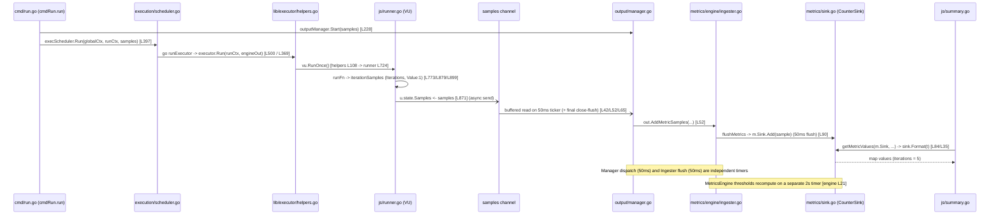

# k6 Metrics Investigation — Onboarding Q&A

_Branch: `k6_ddc3b0b1d23c` · Subject: `grafana/k6` `v0.55.0` (commit `ddc3b0b1d2`) · Toolchain: `go1.23.12`, `linux/amd64`._

This document answers three onboarding questions about how k6 tracks metrics during a load test. It is **grounded in running the code**, not in reading alone: every behavioural claim is accompanied by the exact command that produced it and the genuine, unedited output that command emitted, and every factual claim about the source carries a `file:line` citation verified against the checkout at commit `ddc3b0b1d2`.

**Evidence conventions used throughout:**

- A fenced block introduced by a `$ <command>` line contains the **complete, unedited** output of that command.
- Where a block shows only part of a longer output (one failing test out of many, or a filtered slice of a JSON stream), it is **explicitly labelled as an excerpt** and is preceded by the **exact extraction command** (`grep`/`sed`) used to produce it. The complete raw logs are retained outside the repository checkout under `/tmp/k6_investigation/`.
- Statements that could not be directly observed and are reasoned from the source are **explicitly prefixed with `(inferred)`**.
- No file in the repository was modified to produce this document; see [Methodology](#methodology) and [Caveats](#caveats-and-boundaries).

## Methodology

All observations were produced with the project's **canonical** commands and default configuration — no debug hooks, mocks, or source instrumentation were used.

**Build** (the `build` make target, [Makefile:L7-L8]):
```text
$ go build
```

The resulting binary reports this version banner (the `version` sub-command):
```text
k6 v0.55.0 (commit/ddc3b0b1d2, go1.23.12, linux/amd64)
```

**Test suite** (the `tests` make target, [Makefile:L28-L29]) — this exact invocation is the health baseline for Question 1:
```text
$ go test -race -timeout 210s ./...
```

**Single-script run** (Question 3) — the canonical `k6 run` entry point:
```text
$ ./k6 run /tmp/k6_investigation/simple_test.js
```

**Toolchain** (matches the highest version documented by the project's CI and release configuration; see [.github/workflows/test.yml] and Caveats):
```text
$ go version
go version go1.23.12 linux/amd64
```

**Read-only compliance.** The repository was not modified to gather any of this evidence. The minimal test script, the JSON output, and every captured log live **outside** the checkout, under `/tmp/k6_investigation/`, and are removed after use. The working tree was confirmed clean before and after with `git status --porcelain` (empty output = clean); the read-only confirmation for the `k6 run --out json` step is shown inline in [§3.3](#33-corroborating-the-count-with-the-json-output).

## Question 1 — Project health: how many tests pass vs. fail, and are any skipped or broken?

**Short answer.** Under the canonical `go test -race -timeout 210s ./...` invocation on `linux/amd64`, the suite **does not fully pass**: it exits non-zero, with a small, **non-deterministic** set of packages failing on timing/TLS/OCSP/network-sensitive assertions. Across repeated cold runs the totals are stable in a narrow band — **82 packages total, 28 of which contain no tests, and 46–48 passing (`ok`) with 6–8 failing (`FAIL`)**. Four packages fail in *every* cold run. One test is **skipped at runtime** in this environment (`TestTC39`); several other skips are Windows-only guards that do not fire on Linux. No test is "broken" in the sense of failing to compile — every package builds; the failures are runtime assertion/timing failures. The evidence follows.

### 1.1 Suite scope (how many tests there are)

The number of test files and directories was measured directly; each command is shown with its complete output:

Number of `*_test.go` files:
```text
$ find . -path ./vendor -prune -o -name '*_test.go' -print | wc -l
176
```

Number of distinct directories containing test files:
```text
$ find . -path ./vendor -prune -o -name '*_test.go' -print | xargs -n1 dirname | sort -u | wc -l
54
```

Number of Go packages the suite walks, and how many contain no test files:
```text
$ go list ./... | grep -vc /vendor/
82
$ go test -race -timeout 210s ./... 2>&1 | grep -c '^?[[:space:]].*\[no test files\]'
28
```

So the suite spans **82 packages** (`go list ./...`), **54** of which contain the **176** `*_test.go` files, while **28** report `[no test files]`.

### 1.2 Pass/fail counts and their stability across runs

Because Question 1 is a magnitude question, the suite was run to completion **multiple times**. Go caches passing package results, so between measured runs the cache was cleared with `go clean -testcache` to force a genuine cold re-execution. Each cold run was produced by:

```text
$ go clean -testcache
$ time go test -race -timeout 210s ./...
```

Observed results (each row is one complete cold run; `total = ok + FAIL + no-test`):

| Run | Cache | Wall time | `ok` | `FAIL` | `no test files` | total |
|-----|-------|-----------|------|--------|-----------------|-------|
| A   | cleared | 85.6s | 46 | 8 | 28 | 82 |
| B   | cleared | 83.1s | 48 | 6 | 28 | 82 |
| C   | cleared | 83.6s | 46 | 8 | 28 | 82 |
| D   | cleared | 83.1s | 46 | 8 | 28 | 82 |

The counts are **stable within a narrow band and the invariants hold in every run**: `no test files` is always **28** and the package total is always **82**; passing packages range over **{46, 47, 48}** and failing packages over **{6, 7, 8}** (`ok` and `FAIL` move together against the fixed 28 no-test packages). Four additional earlier cold runs fall in the same band, and a cache-warm run completes faster (~69s) with counts in the same band. The suite's overall exit status is **non-zero (`exit=1`)** whenever any package fails.

### 1.3 Complete per-package result listing

The following is the **complete** list of the 82 per-package status lines from cold run A (46 `ok`, 8 `FAIL`, 28 `? … no test files`). It is an **excerpt only in that the interleaved failure detail was filtered out** — the raw log is retained at `/tmp/k6_investigation/timed/full_A.log`. Extracted with the exact command shown, which selects only the three status markers `go test` prints:

Extraction command:
```text
$ grep -E '^(ok |FAIL|\?)[[:space:]]+go\.k6\.io/k6' /tmp/k6_investigation/timed/full_A.log
```

Complete 82-line output (tabs are `go test`'s own column separators):
```text
?   	go.k6.io/k6	[no test files]
ok  	go.k6.io/k6/api	1.595s
?   	go.k6.io/k6/api/v1/client	[no test files]
?   	go.k6.io/k6/cloudapi/insights/proto	[no test files]
?   	go.k6.io/k6/cloudapi/insights/proto/v1/common	[no test files]
?   	go.k6.io/k6/cloudapi/insights/proto/v1/ingester	[no test files]
?   	go.k6.io/k6/cloudapi/insights/proto/v1/k6	[no test files]
?   	go.k6.io/k6/cloudapi/insights/proto/v1/trace	[no test files]
?   	go.k6.io/k6/cmd/state	[no test files]
?   	go.k6.io/k6/cmd/tests/events	[no test files]
?   	go.k6.io/k6/errext/exitcodes	[no test files]
?   	go.k6.io/k6/execution/local	[no test files]
?   	go.k6.io/k6/ext	[no test files]
?   	go.k6.io/k6/js/modules	[no test files]
?   	go.k6.io/k6/js/modules/k6/experimental	[no test files]
?   	go.k6.io/k6/js/modules/k6/html/gen	[no test files]
?   	go.k6.io/k6/js/modulestest	[no test files]
?   	go.k6.io/k6/lib/consts	[no test files]
?   	go.k6.io/k6/lib/testutils	[no test files]
?   	go.k6.io/k6/lib/testutils/grpcservice	[no test files]
?   	go.k6.io/k6/lib/testutils/httpmultibin	[no test files]
?   	go.k6.io/k6/lib/testutils/httpmultibin/grpc_any_testing	[no test files]
?   	go.k6.io/k6/lib/testutils/httpmultibin/grpc_testing	[no test files]
?   	go.k6.io/k6/lib/testutils/httpmultibin/grpc_wrappers_testing	[no test files]
?   	go.k6.io/k6/lib/testutils/minirunner	[no test files]
?   	go.k6.io/k6/lib/testutils/mockoutput	[no test files]
?   	go.k6.io/k6/lib/testutils/mockresolver	[no test files]
?   	go.k6.io/k6/output/cloud/expv2/pbcloud	[no test files]
?   	go.k6.io/k6/ui/console	[no test files]
ok  	go.k6.io/k6/api/v1	1.734s
ok  	go.k6.io/k6/cloudapi	1.700s
ok  	go.k6.io/k6/cloudapi/insights	1.335s
ok  	go.k6.io/k6/cmd	10.318s
FAIL	go.k6.io/k6/cmd/tests	19.297s
ok  	go.k6.io/k6/errext	1.201s
ok  	go.k6.io/k6/event	1.499s
FAIL	go.k6.io/k6/execution	10.944s
FAIL	go.k6.io/k6/js	12.830s
ok  	go.k6.io/k6/js/common	1.601s
ok  	go.k6.io/k6/js/compiler	1.901s
ok  	go.k6.io/k6/js/eventloop	3.299s
ok  	go.k6.io/k6/js/modules/k6	4.692s
ok  	go.k6.io/k6/js/modules/k6/crypto	2.000s
ok  	go.k6.io/k6/js/modules/k6/crypto/x509	1.902s
ok  	go.k6.io/k6/js/modules/k6/data	11.349s
ok  	go.k6.io/k6/js/modules/k6/encoding	1.303s
ok  	go.k6.io/k6/js/modules/k6/execution	1.900s
ok  	go.k6.io/k6/js/modules/k6/experimental/csv	1.899s
ok  	go.k6.io/k6/js/modules/k6/experimental/fs	1.899s
ok  	go.k6.io/k6/js/modules/k6/experimental/streams	1.302s
FAIL	go.k6.io/k6/js/modules/k6/grpc	65.033s
ok  	go.k6.io/k6/js/modules/k6/html	3.836s
FAIL	go.k6.io/k6/js/modules/k6/http	13.466s
ok  	go.k6.io/k6/js/modules/k6/metrics	2.598s
FAIL	go.k6.io/k6/js/modules/k6/timers	10.580s
ok  	go.k6.io/k6/js/modules/k6/ws	5.900s
ok  	go.k6.io/k6/js/promises	1.500s
ok  	go.k6.io/k6/js/tc39	1.497s
FAIL	go.k6.io/k6/lib	1.703s
FAIL	go.k6.io/k6/lib/executor	31.214s
ok  	go.k6.io/k6/lib/fsext	1.301s
ok  	go.k6.io/k6/lib/netext	2.401s
ok  	go.k6.io/k6/lib/netext/grpcext	1.697s
ok  	go.k6.io/k6/lib/netext/httpext	8.966s
ok  	go.k6.io/k6/lib/strvals	1.201s
ok  	go.k6.io/k6/lib/trace	1.335s
ok  	go.k6.io/k6/lib/types	1.602s
ok  	go.k6.io/k6/loader	4.463s
ok  	go.k6.io/k6/log	1.498s
ok  	go.k6.io/k6/metrics	1.603s
ok  	go.k6.io/k6/metrics/engine	1.536s
ok  	go.k6.io/k6/output	3.299s
ok  	go.k6.io/k6/output/cloud	1.897s
ok  	go.k6.io/k6/output/cloud/expv2	2.897s
ok  	go.k6.io/k6/output/cloud/expv2/integration	6.000s
ok  	go.k6.io/k6/output/cloud/insights	1.535s
ok  	go.k6.io/k6/output/csv	1.600s
ok  	go.k6.io/k6/output/influxdb	1.698s
ok  	go.k6.io/k6/output/json	1.596s
ok  	go.k6.io/k6/ui	1.298s
ok  	go.k6.io/k6/ui/pb	1.496s
ok  	go.k6.io/k6/usage	1.200s
```

### 1.4 Which packages fail, and why

Aggregating the `FAIL` lines across **eight** independent cold runs (`go clean -testcache` before each) gives failure frequency per package. The extraction command and its complete output:

```text
$ for lg in run1 run3 run4 run5 timed/full_A timed/full_B timed/full_C timed/full_D; do \
    grep -E '^FAIL' /tmp/k6_investigation/$lg.log | awk '{print $2}'; done \
  | sed 's#go.k6.io/k6/##' | sort | uniq -c | sort -rn
      8 lib/executor
      8 js/modules/k6/http
      8 js/modules/k6/grpc
      8 execution
      7 js/eventloop
      7 js
      6 cmd/tests
      3 js/modules/k6/timers
      2 lib/netext/httpext
      1 output/cloud/expv2
      1 lib
```

This yields a clear structure:

- **Stable core — fails in _every_ cold run (8/8):** `execution`, `js/modules/k6/grpc`, `js/modules/k6/http`, `lib/executor`.
- **Frequent flaky (7/8):** `js/eventloop`, `js`.
- **Intermittent (6/8):** `cmd/tests`.
- **Rare flaky:** `js/modules/k6/timers` (3/8), `lib/netext/httpext` (2/8), `output/cloud/expv2` (1/8), `lib` (1/8).

Representative genuine failure detail for each package follows. Every block is a **labelled excerpt** of that package's failure output, preceded by the extraction command used to pull it from the retained raw log. Interpretation is outside the fences so the quoted output is verbatim.

**`js/modules/k6/grpc` (stable core, 8/8)** — extraction command:
```text
$ sed -n '/--- FAIL: TestClient_TlsParameters\/ConnectTls /,/x509/p' \
    /tmp/k6_investigation/run1.log
```
```text
    --- FAIL: TestClient_TlsParameters/ConnectTls (62.11s)
        helpers_test.go:19: 
            	Error Trace:	/tmp/blitzy/k6/blitzy-3871de35-a4eb-4690-af49-5aa518f88260_b042a1/js/modules/k6/grpc/helpers_test.go:19
            	            				/tmp/blitzy/k6/blitzy-3871de35-a4eb-4690-af49-5aa518f88260_b042a1/js/modules/k6/grpc/client_test.go:1287
            	Error:      	Received unexpected error:
            	            	GoError: context deadline exceeded: connection error: desc = "transport: authentication handshake failed: tls: failed to verify certificate: x509: certificate signed by unknown authority (possibly because of \"crypto/rsa: verification error\" while trying to verify candidate authority certificate \"Acme Co\")" at reflect.methodValueCall (native)
```
This is a TLS trust failure in a gRPC-over-TLS test: the client rejects the server's self-signed certificate (`x509: certificate signed by unknown authority … "Acme Co"`) and the connection times out. Its subtests run ~62s, making `grpc` the slowest failing package.

**`js/modules/k6/http` (stable core, 8/8)** — extraction command:
```text
$ sed -n '/--- FAIL: TestRequestAndBatchTLS\/ocsp_stapled_good/,/Test:/p' \
    /tmp/k6_investigation/run1.log
```
```text
    --- FAIL: TestRequestAndBatchTLS/ocsp_stapled_good (3.06s)
        request_test.go:2208: 
            	Error Trace:	/tmp/blitzy/k6/blitzy-3871de35-a4eb-4690-af49-5aa518f88260_b042a1/js/modules/k6/http/request_test.go:2208
            	Error:      	Received unexpected error:
            	            	Error: wrong ocsp stapled response status: unknown at <eval>:3:58(22)
            	Test:       	TestRequestAndBatchTLS/ocsp_stapled_good
```
An OCSP-stapling assertion fails (`wrong ocsp stapled response status: unknown`). This test file also contains a Windows-only `t.Skip` guard at [js/modules/k6/http/request_test.go:L2195] that does **not** fire on Linux, so the test runs (and fails) here.

**`lib/executor` (stable core, 8/8)** — extraction command:
```text
$ sed -n '/--- FAIL: TestConstantArrivalRateRunCorrectTiming\/segment_0/,/Messages:/p' \
    /tmp/k6_investigation/run1.log
```
```text
    --- FAIL: TestConstantArrivalRateRunCorrectTiming/segment_0:1/3_sequence_ (2.06s)
        constant_arrival_rate_test.go:185: 
            	Error Trace:	/tmp/blitzy/k6/blitzy-3871de35-a4eb-4690-af49-5aa518f88260_b042a1/lib/executor/constant_arrival_rate_test.go:185
            	            				/tmp/blitzy/k6/blitzy-3871de35-a4eb-4690-af49-5aa518f88260_b042a1/lib/executor/common_test.go:20
            	            				/tmp/blitzy/k6/blitzy-3871de35-a4eb-4690-af49-5aa518f88260_b042a1/lib/testutils/minirunner/minirunner.go:217
            	            				/tmp/blitzy/k6/blitzy-3871de35-a4eb-4690-af49-5aa518f88260_b042a1/lib/executor/helpers.go:108
            	            				/tmp/blitzy/k6/blitzy-3871de35-a4eb-4690-af49-5aa518f88260_b042a1/lib/executor/ramping_arrival_rate.go:546
            	            				/usr/local/go/src/runtime/asm_amd64.s:1700
            	Error:      	Max difference between 2026-07-13 17:12:32.378575298 +0000 UTC m=+0.318257289 and 2026-07-13 17:12:32.455022019 +0000 UTC m=+0.394704025 allowed is 24ms, but difference was -76.446736ms
            	Test:       	TestConstantArrivalRateRunCorrectTiming/segment_0:1/3_sequence_
            	Messages:   	3 expectedTime 120ms
```
A **timing-tolerance** assertion: the arrival-rate executor was expected to hit a scheduled time within a 24ms window but missed it by ~76ms under the `-race` detector's overhead — the characteristic shape of the suite's flakiness.

**`execution` (stable core, 8/8)** — extraction command:
```text
$ sed -n '/--- FAIL: TestExecutionInfoVUSharing/,/Test:/p' \
    /tmp/k6_investigation/run1.log
```
```text
--- FAIL: TestExecutionInfoVUSharing (4.46s)
    scheduler_ext_exec_test.go:131: 
        	Error Trace:	/tmp/blitzy/k6/blitzy-3871de35-a4eb-4690-af49-5aa518f88260_b042a1/execution/scheduler_ext_exec_test.go:131
        	Error:      	Not equal: 
        	            	expected: 0x9
        	            	actual  : 0x8
        	Test:       	TestExecutionInfoVUSharing
```
A concurrency/VU-sharing count assertion (`expected: 0x9, actual: 0x8`) — an off-by-one that surfaces under race-detector timing.

**`js/eventloop` (frequent flaky, 7/8)** — extraction command:
```text
$ sed -n '/--- FAIL: TestEventLoopAllCallbacksGetCalled/,/Test:/p' \
    /tmp/k6_investigation/run1.log
```
```text
--- FAIL: TestEventLoopAllCallbacksGetCalled (1.04s)
    eventloop_test.go:120: 
        	Error Trace:	/tmp/blitzy/k6/blitzy-3871de35-a4eb-4690-af49-5aa518f88260_b042a1/js/eventloop/eventloop_test.go:120
        	Error:      	"50ms" is not greater than "99.673773ms"
        	Test:       	TestEventLoopAllCallbacksGetCalled
```
Another timing assertion (`"50ms" is not greater than "99.673773ms"`).

**`js` (frequent flaky, 7/8)** — extraction command:
```text
$ sed -n '/--- FAIL: TestVURunInterrupt\/Source/,/Test:/p' \
    /tmp/k6_investigation/run1.log
```
```text
    --- FAIL: TestVURunInterrupt/Source (0.20s)
        runner_test.go:659: 
            	Error Trace:	/tmp/blitzy/k6/blitzy-3871de35-a4eb-4690-af49-5aa518f88260_b042a1/js/runner_test.go:659
            	Error:      	Received unexpected error:
            	            	context deadline exceeded at file:///script.js:2:3(2)
            	Test:       	TestVURunInterrupt/Source
```
The observed `js`-package failure is **`TestVURunInterrupt/Source`** ([js/runner_test.go:L659]) — a deadline-exceeded assertion. (This corrects a natural misattribution: `TestEventSystemError`, which exercises an aborting run, lives in the **`cmd/tests`** package at [cmd/tests/cmd_run_test.go:L2074] with its abort subtest at L2083, **not** in `js`; it did not fail in any run here.)

**`js/modules/k6/timers` (rare flaky, 3/8)** — extraction command:
```text
$ sed -n '/--- FAIL: TestSetIntervalOrder/,/Test:/p' \
    /tmp/k6_investigation/run1.log
```
```text
--- FAIL: TestSetIntervalOrder (3.94s)
    timers_test.go:138: 
        	Error Trace:	/tmp/blitzy/k6/blitzy-3871de35-a4eb-4690-af49-5aa518f88260_b042a1/js/modules/k6/timers/timers_test.go:138
        	Error:      	"4" is not greater than or equal to "5"
        	Test:       	TestSetIntervalOrder
```
Callback-ordering timing assertion (`"4" is not greater than or equal to "5"`); the sibling `TestSetTimeoutOrder` at [js/modules/k6/timers/timers_test.go:L104] fails the same way.

**`cmd/tests` (intermittent, 6/8)** — extraction command:
```text
$ sed -n '/--- FAIL: TestSetupTimeout/,/setupTimeout/p' \
    /tmp/k6_investigation/timed/full_A.log
```
```text
--- FAIL: TestSetupTimeout (5.89s)
    cmd_run_test.go:2366: 
        	Error Trace:	/tmp/blitzy/k6/blitzy-3871de35-a4eb-4690-af49-5aa518f88260_b042a1/cmd/tests/cmd_run_test.go:2366
        	Error:      	"5.694720664s" is not less than "5s"
        	Test:       	TestSetupTimeout
        	Messages:   	expected less time to have passed because setupTimeout 
```
A setup-timeout timing assertion (`"5.694720664s" is not less than "5s"`). Separately, the `cmd/tests` harness emits genuine benign log noise such as this client/server cipher mismatch in a TLS fixture — captured verbatim:

```text
2026/07/13 17:12:40 http: TLS handshake error from 127.0.0.1:53738: tls: no cipher suite supported by both client and server
```
_(inferred)_ The consistent theme is **environmental timing sensitivity** (the `-race` detector inflates latencies) together with **TLS/OCSP test fixtures** — not logic regressions in the metric-tracking code that this document otherwise concerns. The two rarest flakies were `output/cloud/expv2` (once: `TestFlushMaxSeriesInBatch`, [output/cloud/expv2/flush_test.go:L295]) and the top-level `lib` package (once, on timing-sensitive tests such as `TestActiveVUsCount`).

### 1.5 Skipped or broken tests

Three distinct categories must be separated, because a file excluded by a build tag is **not** "broken", and a `t.Skip` that only fires on Windows is **not** an observed skip on Linux.

**(a) Files that contain a runtime `t.Skip`/`t.Skipf`.** Exactly **four** test files call `t.Skip*` (from `grep -rnE '\bt\.Skip' --include='*_test.go'`):

- [js/tc39/tc39_test.go:L383], [js/tc39/tc39_test.go:L456], [js/tc39/tc39_test.go:L531], [js/tc39/tc39_test.go:L770], [js/tc39/tc39_test.go:L778], [js/tc39/tc39_test.go:L796], [js/tc39/tc39_test.go:L807] — the tc39 conformance harness (multiple guards; see (b) for the one that fires here).
- [js/modules/k6/http/request_test.go:L2195] — `t.Skip("this doesn't work on windows …")`, a **Windows-only** guard; does **not** fire on Linux.
- [lib/executor/constant_arrival_rate_test.go:L113] — `t.Skipf("this test is very flaky on the Windows GitHub Action runners…")`, a **Windows-only** guard; does **not** fire on Linux.
- [lib/netext/httpext/request_test.go:L376] — `t.Skipf("dial timeout doesn't get returned on windows")`, a **Windows-only** guard; does **not** fire on Linux.

So three of the four files' skips are Windows-only **potential** skip sites that never trigger in this `linux/amd64` baseline.

**(b) The skip actually observed at runtime here: `TestTC39`.** Running that one test verbosely shows the skip and its reason:

```text
$ go test -race -v ./js/tc39/ -run TestTC39
```
```text
=== RUN   TestTC39
    tc39_test.go:799: If you want to run tc39 tests, you need to run the 'checkout.sh` script in the directory to get  https://github.com/tc39/test262 at the correct last tested commit (stat TestTC39/test262: no such file or directory)
--- SKIP: TestTC39 (0.00s)
PASS
ok  	go.k6.io/k6/js/tc39	1.021s
```
The skip fires because the TC39 conformance corpus is absent. Mechanics, verified in source:

- `TestTC39` ([js/tc39/tc39_test.go:L794]) calls `runTestTC39(t, …)` at [js/tc39/tc39_test.go:L799].
- `runTestTC39` marks itself a helper via `t.Helper()` ([js/tc39/tc39_test.go:L804]); this is why the reported location is the **caller** line `tc39_test.go:799` even though the actual `t.Skipf` statement is at [js/tc39/tc39_test.go:L807].
- The guard is `if _, err := os.Stat(tc39BASE); err != nil` ([js/tc39/tc39_test.go:L806]), where `tc39BASE = "TestTC39/test262"` ([js/tc39/tc39_test.go:L39]). That directory is absent (only the `checkout.sh` bootstrap script is present), so `os.Stat` errors and the test skips — confirmed:
```text
$ ls js/tc39/ | tr '\n' ' '
README.md breaking_test_errors-experimental_enhanced.json breaking_test_errors-extended.json checkout.sh tc39_norace_test.go tc39_race_test.go tc39_test.go 
$ ls js/tc39/TestTC39/ 2>&1
ls: cannot access 'js/tc39/TestTC39/': No such file or directory
```

**Crucially, the default (non-verbose) suite run _hides_ this skip.** The same package under the canonical command prints only a passing `ok` line:
```text
$ go test -race ./js/tc39/
```
```text
ok  	go.k6.io/k6/js/tc39	1.022s
```
This is why a plain `go test ./...` summary reports no skips even though `TestTC39` skipped: `go test` surfaces `--- SKIP` lines only in verbose mode.

**(c) Files excluded at compile time by build tags (not "broken").** Five test files carry a `//go:build` constraint on their first line. Under the default `linux/amd64` `-race` invocation:

- [js/modules/k6/experimental/streams/readable_streams_test.go:L1] — `//go:build wpt` — **excluded** (requires the `wpt` tag).
- [js/tc39/tc39_norace_test.go:L1] — `//go:build !race` — **excluded** (the baseline uses `-race`).
- [js/tc39/tc39_race_test.go:L1] — `//go:build race` — **included** (because `-race` is on).
- [lib/fsext/filepath_windows_test.go:L1] — `//go:build windows` — **excluded** on Linux.
- [lib/fsext/filepath_unix_test.go:L1] — `//go:build unix` — **included** on Linux.

These excluded files are **not broken** — they simply are not part of this invocation's compile.

**(d) "Broken" tests.** No package fails to **compile**; all 82 packages build. The failures in [§1.4](#14-which-packages-fail-and-why) are **runtime assertion/timing failures**, not build breakage. In that precise sense there are no "broken" (uncompilable) tests; there is a small, flaky set of runtime failures.

### 1.6 The test-isolation harness (why some failures look unusual)

The `cmd/tests` package installs a process-wide `TestMain` harness worth knowing when reading its failures:

- `tests.Main(m)` ([cmd/tests/tests.go:L33]) is invoked from `TestMain` ([cmd/tests/tests_test.go:L11]).
- It installs a `blockingTransport` ([cmd/tests/tests.go:L13]) as `http.DefaultTransport` ([cmd/tests/tests.go:L48]); its `RoundTrip` ([cmd/tests/tests.go:L19]) `panic`s ([cmd/tests/tests.go:L23]) if a test makes a real outbound request to a non-allowlisted host — enforcing isolation.
- After `m.Run()` ([cmd/tests/tests.go:L63]) it runs a goroutine-leak check via `goleak.Find()` ([cmd/tests/tests.go:L57]).

_(inferred)_ Because of this harness, a `cmd/tests` failure can manifest as a panic (forbidden request) or a leak-check failure rather than a plain assertion; the `TLS handshake error` line in [§1.4](#14-which-packages-fail-and-why) originates from an in-process TLS fixture under this harness, not a real network call.

### 1.7 Direct answer to Question 1

- **Pass vs. fail:** Not a clean pass. Per cold run: **46–48 packages `ok`, 6–8 `FAIL`, 28 with no tests**, out of **82** total; the process exits non-zero. Four packages fail every time (`execution`, `js/modules/k6/grpc`, `js/modules/k6/http`, `lib/executor`); the rest are flaky.
- **Skipped:** One test is **observed skipping at runtime** here — `TestTC39` ([js/tc39/tc39_test.go:L807], reason: the `test262` corpus is absent). Three further `t.Skip` guards exist but are **Windows-only** and do not fire on Linux. Non-verbose `go test` hides skips.
- **Broken:** _(inferred)_ None in the compile sense — all 82 packages build. The failing packages are flaky on **timing / TLS / OCSP / concurrency** assertions under the `-race` detector, not the metric-tracking code that Questions 2–3 concern.

## Question 2 — What counts iterations and collects performance data when I kick off a load test?

Two responsibilities are involved. k6 implements **iteration counting through two distinct, complementary mechanisms**, plus a separate **performance-data collection** pipeline. Naming each by file and module:

### 2.1 Iteration counting, Mechanism A — the `iterations` counter _metric_ (summary-visible)

The number on the `iterations` line of the end-of-test summary is a **built-in Counter metric**, defined and registered in the metrics catalog:

- The metric name constant `IterationsName = "iterations"` is at [metrics/builtin.go:L8].
- `RegisterBuiltinMetrics` ([metrics/builtin.go:L78]) constructs it as a `Counter` at [metrics/builtin.go:L82]: `Iterations: registry.MustNewMetric(IterationsName, Counter)`.

It is **emitted once per completed iteration** by the JS runtime. The following is the **complete** `iterationSamples` function ([js/runner.go:L879]) — the second sample carries the `Iterations` metric ([js/runner.go:L894]) with a literal `Value: 1` ([js/runner.go:L899]):

```go
func iterationSamples(
	startTime, endTime time.Time, ctm metrics.TagsAndMeta, builtinMetrics *metrics.BuiltinMetrics,
) metrics.Samples {
	return metrics.Samples([]metrics.Sample{
		{
			TimeSeries: metrics.TimeSeries{
				Metric: builtinMetrics.IterationDuration,
				Tags:   ctm.Tags,
			},
			Time:     endTime,
			Metadata: ctm.Metadata,
			Value:    metrics.D(endTime.Sub(startTime)),
		},
		{
			TimeSeries: metrics.TimeSeries{
				Metric: builtinMetrics.Iterations,
				Tags:   ctm.Tags,
			},
			Time:     endTime,
			Metadata: ctm.Metadata,
			Value:    1,
		},
	})
}
```
These samples are pushed onto the per-VU sample channel inside `runFn` (`u.state.Samples <- …`, around [js/runner.go:L870-L871]); from there they travel to the metric sinks (traced end-to-end in [Question 3](#question-3--trace-the-data-flow-for-one-metric-from-test-start-to-output)). The `Counter` sink sums the `Value: 1`s, so five completed iterations produce `iterations = 5` in the summary — corroborated in [§3.2](#32-the-end-of-test-summary-the-observed-metric) and [§3.3](#33-corroborating-the-count-with-the-json-output).

### 2.2 Iteration counting, Mechanism B — `ExecutionState` counters (UI/information) and the separate executor-local budgets

Distinct from the metric, `lib.ExecutionState` maintains two atomic counters:

- `fullIterationsCount` ([lib/execution.go:L146]) and `interruptedIterationsCount` ([lib/execution.go:L153]).
- Mutated via `AddFullIterations` ([lib/execution.go:L292-L293]) and `AddInterruptedIterations` ([lib/execution.go:L308-L309]); read via `GetFullIterationCount` ([lib/execution.go:L284]) and `GetPartialIterationCount` ([lib/execution.go:L300]).

**These counters are explicitly for UI/information, not for scheduling.** The source documents this repeatedly with the exact comment `// IMPORTANT: for UI/information purposes only, don't use for synchronization.` on the accessor group at [lib/execution.go:L252], L259, L268, L275, L283, L291, L299, L307, and L373. They feed progress reporting and post-run information; they are **not** the mechanism that decides when a scenario's iteration budget is exhausted.

They are incremented by `getIterationRunner` in the executor helpers. The following is a **selected source excerpt** — the complete `getIterationRunner` closure ([lib/executor/helpers.go:L104-L141]); the `// TODO …` lines are **k6's own upstream comments**, reproduced verbatim (not elisions by this document):

```go
func getIterationRunner(
	executionState *lib.ExecutionState, logger *logrus.Entry,
) func(context.Context, lib.ActiveVU) bool {
	return func(ctx context.Context, vu lib.ActiveVU) bool {
		err := vu.RunOnce()

		// TODO: track (non-ramp-down) errors from script iterations as a metric,
		// and have a default threshold that will abort the script when the error
		// rate exceeds a certain percentage

		select {
		case <-ctx.Done():
			// Don't log errors or emit iterations metrics from cancelled iterations
			executionState.AddInterruptedIterations(1)
			return false
		default:
			if err != nil {
				if handleInterrupt(ctx, err) {
					executionState.AddInterruptedIterations(1)
					return false
				}

				var exception errext.Exception
				if errors.As(err, &exception) {
					// TODO don't count this as a full iteration?
					logger.WithField("source", "stacktrace").Error(exception.StackTrace())
				} else {
					logger.Error(err.Error())
				}
				// TODO: investigate context cancelled errors
			}

			// TODO: move emission of end-of-iteration metrics here?
			executionState.AddFullIterations(1)
			return true
		}
	}
}
```
**Error accounting — an important subtlety.** Reading the closure above:

- If the context is cancelled (`case <-ctx.Done()`, [lib/executor/helpers.go:L115]) the iteration is counted as **interrupted** (`AddInterruptedIterations(1)`, [lib/executor/helpers.go:L117]).
- Otherwise, if `vu.RunOnce()` returned an error **and** `handleInterrupt(ctx, err)` recognises it as an interrupt ([lib/executor/helpers.go:L121]), it is likewise counted **interrupted** ([lib/executor/helpers.go:L122]).
- **But an ordinary script error is _not_ counted as interrupted.** It is logged ([lib/executor/helpers.go:L126-L131]) and then execution **falls through** to `executionState.AddFullIterations(1)` ([lib/executor/helpers.go:L137]) — an errored (but not interrupted) iteration still increments the **full** count. The upstream comment `// TODO don't count this as a full iteration?` at [lib/executor/helpers.go:L128] flags exactly this behaviour as a known open question.

**The actual iteration _budget_ lives in executor-local state, not in these counters.** Each iteration-bounded executor keeps its own local counters and loop. Two representative examples:

- `shared_iterations` — a local `totalIters` ([lib/executor/shared_iterations.go:L185]) and `doneIters` ([lib/executor/shared_iterations.go:L186]); the gate is a local atomic `attemptedIters` ([lib/executor/shared_iterations.go:L213]) checked in the run loop (a **selected source excerpt**, [lib/executor/shared_iterations.go:L252-L260]):
```go
			}

			attemptedIterNumber := atomic.AddUint64(&attemptedIters, 1)
			if attemptedIterNumber > totalIters {
				return
			}

			runIteration(maxDurationCtx, activeVU)
			atomic.AddUint64(doneIters, 1)
```
  The line `if attemptedIterNumber > totalIters { return }` ([lib/executor/shared_iterations.go:L255]) is the real budget gate; `getIterationRunner` is wired in at [lib/executor/shared_iterations.go:L232].
- `per_vu_iterations` — a local `totalIters` ([lib/executor/per_vu_iterations.go:L153]) and a plain counted loop `for i := int64(0); i < iterations; i++` ([lib/executor/per_vu_iterations.go:L213]) that calls the iteration runner ([lib/executor/per_vu_iterations.go:L228]) and bumps its local `doneIters` ([lib/executor/per_vu_iterations.go:L229]).

All **seven** executors obtain their per-iteration runner from `getIterationRunner`: [lib/executor/constant_arrival_rate.go:L276], [lib/executor/constant_vus.go:L171], [lib/executor/externally_controlled.go:L526], [lib/executor/per_vu_iterations.go:L195], [lib/executor/ramping_arrival_rate.go:L396], [lib/executor/ramping_vus.go:L525], and [lib/executor/shared_iterations.go:L232].

**Summary of the distinction:** the summary-visible count comes from the `iterations` **Counter metric** (Mechanism A); the `ExecutionState` `full`/`interrupted` counters (Mechanism B) are **UI/information only**; and the decision of *how many iterations to run* is made by **executor-local** counters/loops — three separate things that are easy to conflate.

### 2.3 Collecting performance data — the metrics pipeline

Performance data (durations, counts, rates, gauges) is modelled and moved by the `metrics/` package, the `metrics/engine/` sub-package, and the `output/` package. In pipeline order:

**Metric types.** Four types are declared in one `iota` block — `Counter`, `Gauge`, `Trend`, `Rate` — at [metrics/metric_type.go:L9-L13].

**Sinks (accumulators).** The `Sink` interface is at [metrics/sink.go:L18]; the `NewSink` factory maps a metric type to its sink at [metrics/sink.go:L26-L35]; per-type accumulation lives in `CounterSink.Add` ([metrics/sink.go:L53]), `GaugeSink.Add` ([metrics/sink.go:L82]), `TrendSink.Add` ([metrics/sink.go:L117]), and `RateSink.Add` ([metrics/sink.go:L210]).

**Registry.** Metrics are created and de-duplicated by the `Registry` ([metrics/registry.go:L12]) via `NewMetric` ([metrics/registry.go:L43]) / `MustNewMetric` ([metrics/registry.go:L70]).

**Sample.** A measurement is a `Sample` ([metrics/sample.go:L23-L33]) carrying its `TimeSeries`, `Time`, `Value`, and optional `Metadata`. The helper used to hand a sample to a channel is `PushIfNotDone` ([metrics/sample.go:L131]). Its behaviour is **a context precheck followed by a plain (blocking) channel send** — it is _not_ a non-blocking send:

```go
// PushIfNotDone first checks if the supplied context is done and doesn't push
// the sample container if it is.
func PushIfNotDone(ctx context.Context, output chan<- SampleContainer, sample SampleContainer) bool {
	if ctx.Err() != nil {
		return false
	}
	output <- sample
	return true
}
```
It first checks `ctx.Err()` ([metrics/sample.go:L132]) and returns `false` without sending if the context is already done; otherwise it performs an ordinary blocking send `output <- sample` ([metrics/sample.go:L135]). So it is best described as **cancellation-aware / context-prechecked**, not "non-blocking".

**Metrics engine.** `MetricsEngine` ([metrics/engine/engine.go:L26]) owns threshold evaluation and the set of observed metrics. `CreateIngester` ([metrics/engine/engine.go:L56]) produces the output that feeds sinks; `StartThresholdCalculations` ([metrics/engine/engine.go:L159]) starts a background loop that recomputes thresholds on a `thresholdsRate = 2 * time.Second` cadence ([metrics/engine/engine.go:L21]). A metric first appears in the summary when the engine marks it observed (a **selected source excerpt**, [metrics/engine/engine.go:L108-L113]):
```go
func (me *MetricsEngine) markObserved(metric *metrics.Metric) {
	if !metric.Observed {
		metric.Observed = true
		me.ObservedMetrics[metric.Name] = metric
	}
}
```

**Ingester (where a value lands in its sink).** The `OutputIngester` is an `Output` whose `flushMetrics` runs on a `collectRate = 50 * time.Millisecond` cadence ([metrics/engine/ingester.go:L12]). Its critical line — the exact point a metric value enters its sink — is `m.Sink.Add(sample)` ([metrics/engine/ingester.go:L90]) (a **selected source excerpt** of `flushMetrics`; trailing `// …` comments are k6's own):
```go
		for _, sample := range samples {
			m := sample.Metric               // this should have come from the Registry, no need to look it up
			oi.metricsEngine.markObserved(m) // mark it as observed so it shows in the end-of-test summary
			m.Sink.Add(sample)               // finally, add its value to its own sink
```

**Output manager (transport to every output).** The `Output` interface (`Description`/`Start`/`AddMetricSamples`/`Stop`) is at [output/types.go:L44-L61]. The `Manager` ([output/manager.go:L15]) reads the samples channel in `Start` ([output/manager.go:L42]) and dispatches batches to each registered output via `out.AddMetricSamples(...)` ([output/manager.go:L52]). Dispatch is driven by a ticker at `sendBatchToOutputsRate = 50 * time.Millisecond` ([output/manager.go:L12]) — **plus a final flush when the samples channel closes**, so no buffered sample is lost at shutdown (a selected excerpt of the dispatch loop):
```go
		for {
			select {
			case sampleContainer, ok := <-samplesChan:
				if !ok {
					sendToOutputs(buffer)
					return
				}
				buffer = append(buffer, sampleContainer)
			case <-ticker.C:
				sendToOutputs(buffer)
				buffer = make([]metrics.SampleContainer, 0, cap(buffer))
			}
		}
```
The `sendToOutputs` closure it calls is [output/manager.go:L50-L54]:
```go
	sendToOutputs := func(sampleContainers []metrics.SampleContainer) {
		for _, out := range om.outputs {
			out.AddMetricSamples(sampleContainers)
		}
	}
```
The reusable `SampleBuffer` ([output/helpers.go:L15-L34]) and `PeriodicFlusher` ([output/helpers.go:L55-L89]) back individual outputs (including the ingester); the `PeriodicFlusher` likewise performs a final flush on stop ([output/helpers.go:L70-L71]).

**Summary (reading the sinks).** At end of test, `js/summary.go` renders the summary by reading each metric's sink: `metricValueGetter` ([js/summary.go:L26]) returns a closure that calls `sink.Format(t)` ([js/summary.go:L35]); it is invoked as `getMetricValues(m.Sink, data.TestRunDuration)` ([js/summary.go:L84]). This turns the `CounterSink` holding the summed `iterations` value into the `iterations....: 5` line.

So the modules responsible for **collecting performance data** are, by name: **`metrics/`** (types, sinks, registry, sample, built-in catalog), **`metrics/engine/`** (engine + ingester), **`output/`** (interface, manager, helpers), with **`js/runner.go`** emitting the samples and **`js/summary.go`** reading the sinks at the end.

### 2.4 External corroboration (context only)

The four metric types match Grafana's official k6 documentation, which describes Counter (sums values), Gauge (smallest/largest/latest), Rate (frequency of non-zero values), and Trend (statistical distribution such as mean and percentiles), and notes that k6 always collects a core set of built-in metrics with protocol-specific metrics added only when that protocol is used. This is corroborating context; the authority for every claim above is the cited source and the observed output.

## Question 3 — Trace the data flow for one metric, from test start to output

We trace the always-collected **`iterations`** metric end-to-end for a minimal script.

### 3.1 The minimal script and the canonical command

The script lives outside the repository (at `/tmp/k6_investigation/simple_test.js`) to honour the read-only constraint. It runs a fixed **5** iterations on **1** VU with a trivial body — no protocol calls — so the trace focuses on the built-in `iterations` metric:

```javascript
import http from 'k6/http';

export const options = {
  vus: 1,
  iterations: 5,
};

export default function () {
  // Minimal canonical iteration: no protocol calls, just a trivial body
  // so the trace focuses on the always-collected built-in `iterations` metric.
  let x = 0;
  for (let i = 0; i < 1000; i++) { x += i; }
}
```
It is run through the canonical entry point:
```text
$ ./k6 run /tmp/k6_investigation/simple_test.js
```

### 3.2 The end-of-test summary (the observed metric)

The **complete, unedited** end-of-test summary the command printed:

```text

         /\      Grafana   /‾‾/  
    /\  /  \     |\  __   /  /   
   /  \/    \    | |/ /  /   ‾‾\ 
  /          \   |   (  |  (‾)  |
 / __________ \  |_|\_\  \_____/ 

     execution: local
        script: /tmp/k6_investigation/simple_test.js
        output: -

     scenarios: (100.00%) 1 scenario, 1 max VUs, 10m30s max duration (incl. graceful stop):
              * default: 5 iterations shared among 1 VUs (maxDuration: 10m0s, gracefulStop: 30s)


     data_received........: 0 B 0 B/s
     data_sent............: 0 B 0 B/s
     iteration_duration...: avg=116.48µs min=103.37µs med=108.89µs max=157.19µs p(90)=137.98µs p(95)=147.59µs
     iterations...........: 5   7225.767666/s


running (00m00.0s), 0/1 VUs, 5 complete and 0 interrupted iterations
default ✓ [ 100% ] 1 VUs  00m00.0s/10m0s  5/5 shared iters
```
The relevant observed line is `iterations...........: 5   7225.767666/s`, and the run reports `5 complete and 0 interrupted iterations` — matching the script's configured 5.

### 3.3 Corroborating the count with the JSON output

To see the individual samples that sum to `5`, the same script is run once more with JSON output written to an **external** path (outside the checkout, so the repository is never written to):

```text
$ ./k6 run --out json=/tmp/k6_investigation/out.json /tmp/k6_investigation/simple_test.js
```

The JSON stream contains one `Metric` definition line plus one `Point` line per emitted sample. The `iterations` `Point` records are extracted with the exact command below; its **complete** output is the five points (a **labelled filtered excerpt** of the 24-line stream — the grep narrows the full stream to just the `iterations` points):

```text
$ grep '"metric":"iterations"' /tmp/k6_investigation/out.json | grep '"type":"Point"'
{"metric":"iterations","type":"Point","data":{"time":"2026-07-13T17:22:34.877075113Z","value":1,"tags":{"group":"","scenario":"default"}}}
{"metric":"iterations","type":"Point","data":{"time":"2026-07-13T17:22:34.877197154Z","value":1,"tags":{"group":"","scenario":"default"}}}
{"metric":"iterations","type":"Point","data":{"time":"2026-07-13T17:22:34.877351329Z","value":1,"tags":{"group":"","scenario":"default"}}}
{"metric":"iterations","type":"Point","data":{"time":"2026-07-13T17:22:34.877526902Z","value":1,"tags":{"group":"","scenario":"default"}}}
{"metric":"iterations","type":"Point","data":{"time":"2026-07-13T17:22:34.877642909Z","value":1,"tags":{"group":"","scenario":"default"}}}
```

The full 24-line stream is composed of **4 built-in metrics × (1 definition + 5 points)**: `data_sent`, `data_received`, `iteration_duration`, and `iterations`. The five `iterations` points each carry `value:1`, and their sum is the `5` shown in the summary.

**Read-only confirmation for this step.** The JSON was written outside the checkout and removed; the working tree stayed clean:
```text
$ rm -f /tmp/k6_investigation/out.json
$ git status --porcelain
$ # (empty output above == clean working tree; nothing was written inside the repo)
```

### 3.4 The ordered function-call chain

Each hop names the **call/transfer site** (not merely a declaration), with its `file:line`:

1. **Run wiring.** `cmdRun.run` ([cmd/run.go:L59]) creates the buffered samples channel ([cmd/run.go:L227]) and starts the output manager on it with `outputManager.Start(samples)` ([cmd/run.go:L228]).
2. **Scheduler launch.** It then calls `execScheduler.Run(globalCtx, runCtx, samples)` ([cmd/run.go:L397]).
3. **Scheduler → executor.** `Scheduler.Run` ([execution/scheduler.go:L419]) spawns each executor with `go e.runExecutor(...)` ([execution/scheduler.go:L500]), which invokes `executor.Run(runCtx, engineOut)` ([execution/scheduler.go:L369]) — `engineOut` is the samples channel handed down from step 1.
4. **Executor → VU.** The executor's per-iteration runner is the `getIterationRunner` closure ([lib/executor/helpers.go:L104]); it calls `vu.RunOnce()` ([lib/executor/helpers.go:L108]).
5. **VU iteration → samples.** `ActiveVU.RunOnce` ([js/runner.go:L724]) calls `u.runFn(ctx, true, …)` ([js/runner.go:L773]); `runFn` ([js/runner.go:L817]) builds the per-iteration samples via `iterationSamples` ([js/runner.go:L879]), which includes the `Iterations` metric ([js/runner.go:L894]) with `Value: 1` ([js/runner.go:L899]).
6. **Channel send.** `runFn` sends the samples onto the per-VU channel (`u.state.Samples <- …`, [js/runner.go:L870-L871]) — an **asynchronous hand-off**; the buffered `iterations` sample now travels independently of the VU.
7. **Manager dispatch.** The `Manager.Start` loop ([output/manager.go:L42]) reads the channel and, on its 50 ms ticker (**plus a final flush when the channel closes**, [output/manager.go:L65-L67]), calls `out.AddMetricSamples(...)` on each output ([output/manager.go:L52]).
8. **Ingester → sink.** One output is the `OutputIngester`; its `flushMetrics` (50 ms cadence, [metrics/engine/ingester.go:L12]) marks the metric observed ([metrics/engine/engine.go:L108]) and executes `m.Sink.Add(sample)` ([metrics/engine/ingester.go:L90]) — the `iterations` `CounterSink` now holds the summed value.
9. **Summary read.** At end of test, `js/summary.go` reads that sink via `getMetricValues(m.Sink, …)` ([js/summary.go:L84]) → `sink.Format(t)` ([js/summary.go:L35]), rendering `iterations....: 5`.

_(inferred)_ The two 50 ms cadences (manager dispatch and ingester flush) are independent timers, and threshold recomputation runs on its own separate `2 * time.Second` timer ([metrics/engine/engine.go:L21]); a sample therefore experiences up to a couple of ~50 ms buffering hops before landing in its sink, with final flushes guaranteeing delivery at shutdown.

### 3.5 Sequence diagram

Solid arrows (`->>`) are synchronous calls; **open-arrow (`-)`) arrows mark asynchronous hand-offs** (the channel send and the buffered channel read). The final interaction is the summary **reading** the sink (`Format`), with the sink returning values — the sink never initiates rendering.



### 3.6 Tying the trace back to the observed output

The single metric traced above is exactly the one observed: the `Value: 1` built in at [js/runner.go:L899], summed in the `CounterSink` via [metrics/engine/ingester.go:L90], and read by [js/summary.go:L84], is what appears as `iterations....: 5` in [§3.2](#32-the-end-of-test-summary-the-observed-metric) and as the five `"value":1` JSON points in [§3.3](#33-corroborating-the-count-with-the-json-output).

## Caveats and boundaries

- **Baseline.** The health figures are for the **default** `linux/amd64` invocation `go test -race -timeout 210s ./...` (the `tests` make target, [Makefile:L28-L29]). Suites gated behind non-default build tags (e.g. `wpt`) are reported as excluded-by-default in [§1.5](#15-skipped-or-broken-tests), not folded into the totals.
- **Local vs. CI are different invocations.** The CI workflow ([.github/workflows/test.yml]) defines **three separate jobs**, which should not be conflated:
  - `test-prev` ([.github/workflows/test.yml:L13]) — Go **1.22.x** ([.github/workflows/test.yml:L17]) — runs `go test … -timeout 800s ./...` ([.github/workflows/test.yml:L46]).
  - `test-tip` ([.github/workflows/test.yml:L48]) — **Go tip** ([.github/workflows/test.yml:L58-L63]) — runs `go test … -timeout 800s ./...` ([.github/workflows/test.yml:L83]).
  - `test-current-cov` ([.github/workflows/test.yml:L85]) — Go **1.23.x** ([.github/workflows/test.yml:L89]) — does **not** run a single `./...`; it loops **per package** with coverage: `go test … -timeout 800s --coverpkg="$list" -coverprofile=… $pkg` ([.github/workflows/test.yml:L118]).
  Note CI uses `-timeout 800s` whereas the local `tests` target uses `-timeout 210s`. _(inferred)_ The per-package coverage job and the more generous CI timeout make CI less prone to the timing flakiness seen locally, but the flaky tests are the same code.
- **Result caching.** `go test` caches passing package results; a cache-warm run is faster but yields counts in the same band. Cold runs (`go clean -testcache`) were used for the health figures.
- **Timing sensitivity.** _(inferred)_ The failing packages fail predominantly on wall-clock / TLS / OCSP / concurrency assertions amplified by the `-race` detector; they are largely unrelated to the metric-tracking code that Questions 2–3 describe.
- **Read-only compliance.** The only file created or modified in the repository is this document. The minimal script, the JSON output, and all logs live under `/tmp/k6_investigation/` (outside the checkout) and are removed after use; `git status --porcelain` was verified empty.

## Coverage pass (every named item addressed)

- **Q1** — pass/fail counts (46–48 ok / 6–8 FAIL / 28 no-test / 82 total, stable across cold runs); the exact `go test -race -timeout 210s ./...` command; the complete 82-line listing; the per-package failure breakdown with genuine excerpts; **skipped** (observed `TestTC39` + Windows-only guards) with `file:line`; **broken** (none in the compile sense); build-tag exclusions with `file:line`.
- **Q2** — Mechanism A (`iterations` Counter metric: [metrics/builtin.go:L82], emitted [js/runner.go:L899]); Mechanism B (`ExecutionState` UI/info counters + executor-local budgets); the performance-data pipeline naming `metrics/`, `metrics/engine/`, `output/`, `js/runner.go`, `js/summary.go`; error accounting; `PushIfNotDone` semantics; all seven executors.
- **Q3** — minimal script via `k6 run`; observed summary; JSON corroboration with extraction command; the ordered call chain with call-site `file:line`; the corrected sequence diagram; the tie-back to observed output.

## Citation index

| Area | File:line | What it anchors |
|------|-----------|-----------------|
| Build/test | Makefile:L7-L8, L28-L29 | `go build`; `go test -race -timeout 210s ./...` |
| CI | .github/workflows/test.yml:L13,L17,L46,L48,L58-L63,L83,L85,L89,L118 | three test jobs |
| Iterations metric | metrics/builtin.go:L8,L78,L82 | `IterationsName`, `RegisterBuiltinMetrics`, `Iterations` Counter |
| Emission | js/runner.go:L879,L894,L899,L870-L871 | `iterationSamples`, `Iterations`, `Value:1`, channel send |
| ExecutionState | lib/execution.go:L146,L153,L252,L284,L292-L293,L300,L308-L309 | UI/info counters + accessors |
| Iteration runner | lib/executor/helpers.go:L104,L108,L115,L117,L121-L122,L128,L137 | `getIterationRunner`, error accounting |
| Executor budgets | lib/executor/shared_iterations.go:L185-L186,L213,L232,L252-L260; per_vu_iterations.go:L153,L195,L213,L228-L229 | local budget gates |
| Metric types/sinks | metrics/metric_type.go:L9-L13; metrics/sink.go:L18,L26-L35,L53,L82,L117,L210 | types + sink Adds |
| Registry/Sample | metrics/registry.go:L12,L43,L70; metrics/sample.go:L23-L33,L131-L135 | registry, `Sample`, `PushIfNotDone` |
| Engine/Ingester | metrics/engine/engine.go:L21,L26,L56,L108-L113,L159; metrics/engine/ingester.go:L12,L90 | engine, `markObserved`, `m.Sink.Add` |
| Output pipeline | output/types.go:L44-L61; output/manager.go:L12,L15,L42,L52,L65-L67; output/helpers.go:L15-L34,L55-L89,L70-L71 | interface, manager, helpers |
| Summary | js/summary.go:L26,L35,L84 | reads sinks to render summary |
| Scheduler | execution/scheduler.go:L38,L369,L381,L419,L500 | `Run`, `runExecutor`, `executor.Run` |
| Run wiring | cmd/run.go:L59,L170,L187,L220,L227,L228,L242,L397 | channel, manager, scheduler |
| Skips/tags | js/tc39/tc39_test.go:L39,L794,L799,L804,L806,L807; js/modules/k6/http/request_test.go:L2195; lib/executor/constant_arrival_rate_test.go:L113; lib/netext/httpext/request_test.go:L376; build-tag files :L1 | observed + potential skips, build tags |
| Isolation harness | cmd/tests/tests.go:L13,L19,L23,L33,L48,L57,L63; cmd/tests/tests_test.go:L11 | `TestMain` harness |

