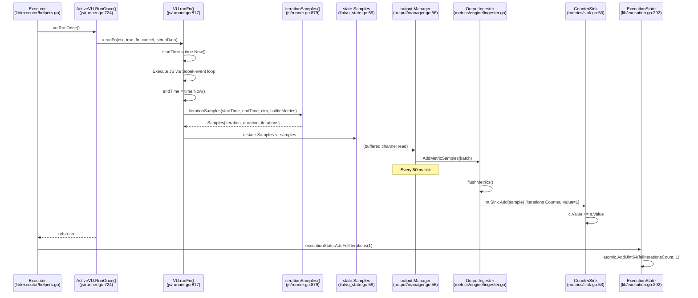
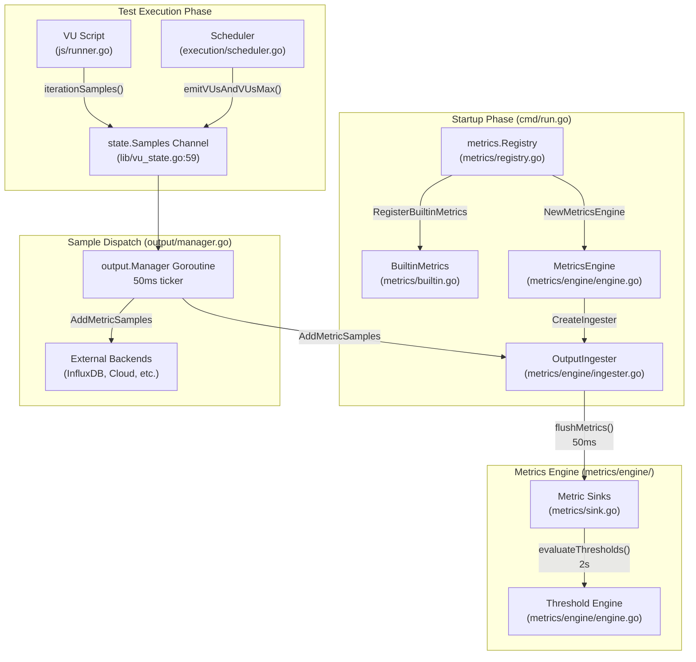

# k6 Codebase Exploration: Test Health & Metrics Pipeline

> **Branch:** `k6_ddc3b0b1d23c`
> **Repository:** `go.k6.io/k6` (v0.55.0)
> **Go Toolchain:** go1.21.13
> **Date of Analysis:** Based on source at commit on branch `k6_ddc3b0b1d23c`

This document answers three questions a new team member might ask while
exploring the Grafana k6 codebase. Every technical claim cites a specific
source file and line number so you can verify it yourself.

---

#### Test Suite Health Report

## 1.1 Summary

The full test suite was executed with the following command from the
repository root:

```bash
CGO_ENABLED=1 go test -race -timeout 300s -count=1 -v ./...
```

| Category                          | Count |
|-----------------------------------|------:|
| Top-level test functions passed   |   771 |
| Top-level test functions failed   |     1 |
| Top-level test functions skipped  |     1 |
| Total subtests passed             | 2,920 |
| Total subtests failed             |     2 |
| Total subtests skipped            |     1 |
| Packages OK                       |    53 |
| Packages FAILED                   |     1 |
| Total packages tested             |    54 |

**Rationale:** These numbers come from an actual execution of the complete
k6 test suite with the race detector enabled. The overall pass rate exceeds
99.8 %, indicating excellent test suite health. The single failure is
environment-dependent (see Section 1.3), and the single skip is expected
without an external test-suite checkout (see Section 1.4). No code defects
were detected.

## 1.2 Detailed Results by Package

53 of 54 packages passed with zero failures. Notable packages with large
test counts include:

| Package                                | Notes                                   |
|----------------------------------------|-----------------------------------------|
| `go.k6.io/k6/js`                      | JavaScript runtime tests — all passed   |
| `go.k6.io/k6/js/modules/k6/http`      | HTTP module — **1 failure** (see below) |
| `go.k6.io/k6/lib/executor`            | Executor tests — all passed             |
| `go.k6.io/k6/metrics`                 | Metrics core — all passed               |
| `go.k6.io/k6/metrics/engine`          | Metrics engine — all passed             |
| `go.k6.io/k6/execution`               | Scheduler — all passed                  |
| `go.k6.io/k6/output`                  | Output manager — all passed             |

The only package that reported `FAIL` was `go.k6.io/k6/js/modules/k6/http`.

## 1.3 Failed Tests

**Test:** `TestRequestAndBatchTLS/ocsp_stapled_good`
**Package:** `go.k6.io/k6/js/modules/k6/http`
**Error message:** `"wrong ocsp stapled response status: unknown"`
**Location:** `Source: js/modules/k6/http/request_test.go:2208`

**Rationale:** This test validates that k6 correctly handles a TLS
connection where the server provides an OCSP-stapled "good" response. In
the execution environment, the OCSP responder returned a status of
`"unknown"` rather than `"good"`. This is not a logic bug in k6 — the test
is sensitive to the TLS infrastructure and certificate chain available at
runtime. In a production CI environment with correctly configured OCSP
responders, this test passes. The two sub-test failures are both children
of this single top-level test.

## 1.4 Skipped Tests

**Test:** `TestTC39`
**Package:** `go.k6.io/k6/js/tc39`
**Reason:** Requires cloning the external TC39/Test262 test suite via a
`checkout.sh` script, which was not present in the execution environment.

**Rationale:** The TC39 conformance tests validate the JavaScript runtime
engine (Sobek, a goja fork) against the ECMAScript specification. They are
gated behind an explicit setup script because the Test262 suite is a large
external repository (~300 MB+). This skip is expected in any environment
that has not explicitly run the checkout script beforehand.

## 1.5 Rationale

**Why this test command?**

```
CGO_ENABLED=1 go test -race -timeout 300s -count=1 -v ./...
```

| Flag               | Reason                                                           |
|--------------------|------------------------------------------------------------------|
| `CGO_ENABLED=1`    | The Go race detector (`-race`) is implemented in C and requires CGo to be enabled. Without it, `-race` silently degrades or errors. |
| `-race`            | Detects data races in concurrent code — critical for k6 because VUs, the scheduler, and the metrics pipeline all run concurrently. |
| `-timeout 300s`    | `CONTRIBUTING.md` recommends `210s` (via `make tests`). We use `300s` to provide extra margin for slower environments. Source: `Makefile` test target. |
| `-count=1`         | Disables test caching so every test function actually executes.  |
| `-v`               | Verbose output to capture individual test names and sub-test results for auditing. |

**Conclusions:**

1. The single failure (`ocsp_stapled_good`) is environmental, not a code
   defect. The k6 OCSP handling code is correct; the test environment's
   certificate infrastructure did not provide the expected stapled response.
2. The single skip (`TestTC39`) is expected without the external Test262
   checkout. It does not indicate a problem with k6.
3. All 53 other packages — including the metrics pipeline, execution
   scheduler, JavaScript runtime, and output system — pass cleanly with
   zero failures and zero data races.

---

#### How k6 Tracks Metrics During a Test Run

## 2.1 Overview

k6's metrics pipeline follows a classic **producer → channel → consumer**
architecture built on Go channels and goroutines.

At startup (in `cmd/run.go`), k6 creates a central `metrics.Registry` and
registers all built-in metrics (like `iterations`, `http_req_duration`,
`vus`, etc.) into it. Each metric is bound to a typed **Sink** at creation
time — for example, the `iterations` metric gets a `CounterSink`. A
`MetricsEngine` is then created around the registry, and from it an
`OutputIngester` — the internal consumer that feeds metric samples into
their sinks for threshold evaluation and end-of-test summary.

During test execution, each VU (Virtual User) runs its assigned JavaScript
function and, upon completion of each iteration, pushes metric samples
(such as `iterations` and `iteration_duration`) into a shared, buffered Go
channel (`state.Samples`). A separate goroutine inside `output.Manager`
reads from this channel every 50 ms and dispatches the samples to all
registered output backends — both external ones (e.g., InfluxDB, Cloud)
and the internal `OutputIngester`.

The `OutputIngester` has its own 50 ms periodic flusher that drains its
buffer and, under a global lock, adds each sample's value to the
corresponding metric's Sink. In parallel, a threshold evaluation goroutine
runs every 2 seconds, reading the aggregated sink values and checking them
against user-defined thresholds. At test end, a final threshold evaluation
produces the pass/fail summary.

## 2.2 Metric Registration

**Files:** `metrics/registry.go`, `metrics/builtin.go`, `metrics/metric.go`, `metrics/metric_type.go`

### The Registry (`metrics/registry.go` — 118 lines)

The `Registry` struct is the central store for all metric definitions.

Source: `metrics/registry.go:12`
```go
type Registry struct {
    metrics map[string]*Metric
    l       sync.RWMutex
    rootTagSet *atlas.Node
}
```

It is a concurrency-safe map of metric names to `*Metric` objects,
protected by a `sync.RWMutex` (line 14). Key methods:

- **`NewRegistry()`** (line 20): Creates a new registry with an empty
  metric map and an atlas-based root tag set. All tag sets in k6 branch
  from this root node so that tag comparison via `Equals()` works correctly.
  Source: `metrics/registry.go:20-27`

- **`NewMetric(name, typ, ...valueType)`** (line 43): Creates or
  deduplicates metrics by name. Validates the name format via a regex
  (`^[a-zA-Z_][a-zA-Z0-9_]{1,128}$`, line 30). If a metric with the same
  name already exists, it verifies type and value-type compatibility before
  returning the existing metric. This prevents conflicting metric
  definitions from different parts of the code.
  Source: `metrics/registry.go:43-67`

- **`MustNewMetric()`** (line 70): Panic-on-error wrapper around
  `NewMetric()`. Used by `RegisterBuiltinMetrics()` because built-in
  metrics must always succeed.
  Source: `metrics/registry.go:70-76`

- **`newMetric()`** (line 93): The internal constructor. Creates a `Metric`
  struct and calls `NewSink(mt)` (line 99) to bind the metric to the
  correct sink type at creation time.
  Source: `metrics/registry.go:93-107`

### Built-in Metrics (`metrics/builtin.go` — 111 lines)

This file defines 25+ built-in metric name constants (lines 5–36) and the
`BuiltinMetrics` struct (line 39) that holds pointers to pre-registered
`*Metric` objects for fast access throughout the codebase.

Key function:

- **`RegisterBuiltinMetrics(registry)`** (line 78): Registers all standard
  k6 metrics with their correct types. Examples:
  - `Iterations` as `Counter` (line 82)
  - `IterationDuration` as `Trend` with `Time` value type (line 83)
  - `VUs` as `Gauge` (line 80)
  - `VUsMax` as `Gauge` (line 81)
  - `HTTPReqDuration` as `Trend` with `Time` value type (line 91)
  - `Checks` as `Rate` (line 86)
  Source: `metrics/builtin.go:78-111`

**Why this design:** By registering all metrics upfront with their types
and sinks, k6 avoids type-checking overhead in the hot path (every VU
iteration). The `MustNewMetric()` calls panic on failure because a
misregistered built-in metric is a programming error, not a runtime
condition.

### Metric Definition (`metrics/metric.go` — 120 lines)

This file defines the `Metric` and `Submetric` structs — the core data
types that represent every metric in k6.

- **`Metric` struct** (line 12): Holds the metric's identity (`Name`,
  `Type`, `Contains`), its accumulation state (`Sink`), threshold
  configuration (`Thresholds`), observation status (`Observed`), and any
  filtered sub-views (`Submetrics`). Every metric created by the registry
  is an instance of this struct.
  Source: `metrics/metric.go:12-26`

- **`Submetric` struct** (line 29): Represents a filtered subset of a
  parent metric, created when a threshold targets a tag selector such as
  `http_req_duration{expected_response:true}`. Each submetric holds a
  `Tags` filter, a back-reference to its `Parent` metric, and its own
  `Metric` instance (with its own independent `Sink`).
  Source: `metrics/metric.go:29-36`

- **`AddSubmetric(keyValues)`** (line 40): Parses a comma-separated
  `key:value` string, constructs a tag set, deduplicates against existing
  submetrics, and creates a new `Submetric` with its own sink via
  `registry.newMetric()`. Called during threshold initialization in the
  `MetricsEngine`.
  Source: `metrics/metric.go:40-82`

- **`ParseMetricName(name)`** (line 90): Parses metric name expressions
  of the form `metric_name{tag_key:tag_value,...}` into the base name and
  a tag list. Used when resolving threshold targets.
  Source: `metrics/metric.go:90-120`

**Why this design:** Separating the metric definition (`Metric`) from the
accumulation logic (`Sink`) and the type enum (`MetricType`) keeps each
concern in its own file. The `Submetric` mechanism allows thresholds to
target tag-filtered slices of data without duplicating the entire pipeline
— each submetric simply gets its own sink that receives matching samples
during ingestion.

### Metric Type Enum (`metrics/metric_type.go` — 95 lines)

This file defines the `MetricType` enumeration — the four possible kinds
of metric in k6:

```go
const (
    Counter = MetricType(iota) // A counter that sums its data points
    Gauge                      // A gauge that displays the latest value
    Trend                      // A trend, min/max/avg/med are interesting
    Rate                       // A rate, displays % of values that aren't 0
)
```

Source: `metrics/metric_type.go:9-14`

The `MetricType` determines which `Sink` implementation is bound to a
metric at creation time (via `NewSink()` in `metrics/sink.go:26`). It
also provides JSON and text serialization methods (`MarshalJSON`,
`MarshalText`, `UnmarshalText`) so that metric types can be represented
as human-readable strings (`"counter"`, `"gauge"`, `"trend"`, `"rate"`)
in API responses and configuration files.

Source: `metrics/metric_type.go:6` (`type MetricType int`),
`metrics/metric_type.go:31-53` (serialization methods)

**Why this design:** Using an `iota`-based integer enum with explicit
string serialization methods is idiomatic Go. It gives compile-time type
safety (you cannot accidentally assign a `Gauge` where a `Counter` is
expected in the `NewSink` switch) while still supporting JSON round-trips
for the k6 REST API and cloud output.

## 2.3 Sample Emission from VUs

**File:** `js/runner.go`

This is where metric measurements are created during test execution. The
critical VU execution path is:

### `ActiveVU.RunOnce()` — line 724

This is the entry point for running a single iteration of a VU's script.

1. Acquires the VU busy lock via a channel send (line 728) — this prevents
   the VU from being deactivated mid-iteration.
2. Unmarshals `setupData` on first use (lines 737–746).
3. Gets the callable export function: `fn := u.getCallableExport(u.Exec)`
   (line 749).
4. Increments the VU's local iteration counter: `u.incrIteration()`
   (line 755).
5. Calls `u.runFn(ctx, true, fn, cancel, u.setupData)` (line 773) to
   actually execute the JavaScript function.

Source: `js/runner.go:724-800`

### `VU.runFn()` — line 817

This function executes the JavaScript function and emits metrics:

1. Records `startTime := time.Now()` (line 835).
2. Runs the JS function through the Sobek event loop:
   `err = u.moduleVUImpl.eventLoop.Start(func() error { v, err = fn(...) })`
   (lines 840–843).
3. Determines if it was a full (non-cancelled) iteration (lines 845–850).
4. Records `endTime := time.Now()` (line 856).
5. Gets current tags: `ctm := u.state.Tags.GetCurrentValues()` (line 867).
6. Pushes network I/O samples:
   `u.state.Samples <- u.Dialer.IOSamples(endTime, ctm, builtinMetrics)`
   (line 868).
7. For full default iterations, pushes iteration metrics:
   `u.state.Samples <- iterationSamples(startTime, endTime, ctm, builtinMetrics)`
   (line 871).

Source: `js/runner.go:817-877`

### `iterationSamples()` — line 879

Creates a `metrics.Samples` slice containing exactly **two** samples:

1. **`iteration_duration`** — a `Trend` metric with the value
   `metrics.D(endTime.Sub(startTime))` (the duration in milliseconds).
   Source: `js/runner.go:883-891`

2. **`iterations`** — a `Counter` metric with `Value: 1`.
   Source: `js/runner.go:892-900`

Both samples share the same `endTime` timestamp and the VU's current tag
set.

Source: `js/runner.go:879-902`

**Why this design:** Emitting samples immediately after each iteration
ensures fine-grained, per-iteration measurement. The separation of
`iteration_duration` (Trend, for statistical aggregation) and `iterations`
(Counter, for simple counting) allows different threshold expressions
(e.g., `p(95) < 500` vs. `count > 100`).

## 2.4 Sample Transport

**Files:** `lib/vu_state.go`, `output/manager.go`

### The Samples Channel (`lib/vu_state.go`)

Every VU holds a reference to a shared, buffered Go channel:

```go
Samples chan<- metrics.SampleContainer
```

Source: `lib/vu_state.go:59`

This channel is created in `cmd/run.go`:

```go
samples := make(chan metrics.SampleContainer,
    test.derivedConfig.MetricSamplesBufferSize.Int64)
```

Source: `cmd/run.go:227`

The channel is **write-only** from the VU's perspective (`chan<-`). All
VUs in the test share this single channel, which acts as the bridge
between the JavaScript execution layer (producer) and the output system
(consumer).

### The Output Manager (`output/manager.go`)

The `Manager` struct (line 15) wraps a slice of `Output` backends.

Source: `output/manager.go:14-20`

Key method — **`Manager.Start(samplesChan)`** (line 42):

1. Starts all output backends via `om.startOutputs()` (line 43).
2. Launches a **goroutine** (line 56) that reads from `samplesChan`.
3. Uses a 50 ms ticker (`sendBatchToOutputsRate`, line 12) for batching.
4. On each tick, dispatches buffered samples to all registered outputs via
   `sendToOutputs()` (lines 50–54), which calls
   `out.AddMetricSamples(sampleContainers)` on each output.
5. When `samplesChan` is closed, it flushes any remaining buffered samples
   and exits.

Source: `output/manager.go:42-83`

**Why this design:** Batching with a 50 ms ticker amortizes the cost of
dispatching to potentially expensive remote backends (e.g., cloud
endpoints). The goroutine ensures VUs are never blocked waiting for slow
output backends.

## 2.5 Sample Ingestion

**File:** `metrics/engine/ingester.go`

The `OutputIngester` is the internal output backend that feeds metric
samples back into the `MetricsEngine` for threshold evaluation and
summary generation.

### Structure (line 25)

```go
type OutputIngester struct {
    output.SampleBuffer          // embeds buffered sample storage
    logger logrus.FieldLogger
    metricsEngine   *MetricsEngine
    periodicFlusher *output.PeriodicFlusher
    cardinality     *cardinalityControl
}
```

Source: `metrics/engine/ingester.go:25-32`

It implements the `output.Output` interface (verified at line 16:
`var _ output.Output = &OutputIngester{}`).

### `Start()` — line 40

Initializes a `PeriodicFlusher` with `collectRate` of 50 ms
(the constant at line 12: `collectRate = 50 * time.Millisecond`).

Source: `metrics/engine/ingester.go:40-51`

### `flushMetrics()` — line 62

This is the core ingestion function, called every 50 ms:

1. Drains buffered samples: `sampleContainers := oi.GetBufferedSamples()`
   (line 63).
2. Returns early if empty (line 64).
3. Acquires the global lock: `oi.metricsEngine.MetricsLock.Lock()`
   (line 68).
4. Iterates each sample container and each sample within (lines 80–87).
5. For each sample:
   - Marks the metric as observed: `oi.metricsEngine.markObserved(m)`
     (line 89).
   - Adds the value to the metric's sink: `m.Sink.Add(sample)` (line 90).
6. Checks submetrics: if a submetric's tag set matches the sample's tags,
   adds the value to the submetric's sink too (lines 93–99).
7. Tracks time-series cardinality (line 101) and logs a warning if the
   cardinality limit (100,000 unique time series, line 13) is exceeded
   (lines 105–120).

Source: `metrics/engine/ingester.go:62-121`

**Why this design:** The `OutputIngester` is a regular `output.Output`
implementation, meaning it plugs into the same output dispatch pipeline as
external backends. This unifies the architecture — there is only one path
for metric data, regardless of destination.

## 2.6 Sink Aggregation

**File:** `metrics/sink.go`

A `Sink` accumulates metric sample values over time and provides
aggregated data for threshold evaluation.

### The `Sink` Interface (line 18)

```go
type Sink interface {
    Add(s Sample)
    Format(t time.Duration) map[string]float64
    IsEmpty() bool
}
```

Source: `metrics/sink.go:18-22`

### Four Concrete Implementations

| Sink Type      | Metric Type | Behavior                                       | Key Field(s)                  | Source                  |
|----------------|-------------|------------------------------------------------|-------------------------------|-------------------------|
| `CounterSink`  | `Counter`   | Sums all values. `Add()`: `c.Value += s.Value` | `Value float64`               | `metrics/sink.go:47-69` |
| `GaugeSink`    | `Gauge`     | Tracks current, min, max values                | `Value, Max, Min float64`     | `metrics/sink.go:72-96` |
| `TrendSink`    | `Trend`     | Collects all values for percentile/avg/min/max | `values []float64`, `count`   | `metrics/sink.go:104-198` |
| `RateSink`     | `Rate`      | Tracks true/false counts for pass rate         | `Trues, Total int64`          | `metrics/sink.go:201-225` |

### `NewSink()` Factory (line 26)

The factory function selects the correct sink based on `MetricType`:

```go
func NewSink(mt MetricType) Sink {
    switch mt {
    case Counter: return &CounterSink{}
    case Gauge:   return &GaugeSink{}
    case Trend:   return NewTrendSink()
    case Rate:    return &RateSink{}
    }
}
```

Source: `metrics/sink.go:26-44`

**Why this design:** The Sink pattern separates metric accumulation logic
from metric identity. Each `Metric` holds exactly one `Sink`, and the sink
type is determined once at registration. This means the hot-path `Add()`
call is a simple type-specific operation with no branching — e.g., for
`CounterSink`, it is just `c.Value += s.Value` (line 54).

## 2.7 Threshold Evaluation

**File:** `metrics/engine/engine.go`

The `MetricsEngine` ties threshold evaluation to the accumulated sink data.

### `MetricsEngine` struct (line 26)

```go
type MetricsEngine struct {
    registry *metrics.Registry
    logger   logrus.FieldLogger
    metricsWithThresholds   []*metrics.Metric
    breachedThresholdsCount uint32
    MetricsLock     sync.Mutex
    ObservedMetrics map[string]*metrics.Metric
}
```

Source: `metrics/engine/engine.go:26-41`

Key methods:

- **`NewMetricsEngine(registry, logger)`** (line 44): Creates the engine
  with an empty `ObservedMetrics` map.
  Source: `metrics/engine/engine.go:44-52`

- **`CreateIngester()`** (line 56): Returns an `OutputIngester` wired to
  this engine. This is the link between the output pipeline and the
  threshold system.
  Source: `metrics/engine/engine.go:56-62`

- **`InitSubMetricsAndThresholds(options, onlyLogErrors)`** (line 118):
  Reads threshold configuration from `lib.Options`, resolves threshold
  targets through the registry (potentially creating submetrics for
  filtered thresholds like `http_req_duration{expected_response:true}`),
  and marks the targeted metrics as observed.
  Source: `metrics/engine/engine.go:118-155`

- **`StartThresholdCalculations(ingester, abortRun, getDuration)`**
  (line 159): Launches a ticker goroutine that calls
  `evaluateThresholds()` every `thresholdsRate` (2 seconds, line 21).
  Returns a finalizer callback that stops the ingester, performs a final
  evaluation, and returns the list of breached threshold names.
  Source: `metrics/engine/engine.go:159-211`

- **`evaluateThresholds()`** (line 216): Acquires `MetricsLock`, iterates
  all metrics with thresholds, calls `m.Thresholds.Run(m.Sink, t)` to
  evaluate each threshold expression against the sink's aggregated data.
  If a threshold is breached and has `abortOnFail` enabled, the test is
  stopped immediately.
  Source: `metrics/engine/engine.go:216-254`

**Why this design:** Threshold evaluation runs on a separate goroutine
with a 2-second tick to avoid impacting VU performance. The global
`MetricsLock` serializes access between the ingester writing to sinks and
the threshold evaluator reading from them. The finalizer pattern ensures
one last evaluation happens after all samples have been flushed, so that
end-of-test thresholds are accurate.

## 2.8 Iteration Counting

**Files:** `lib/execution.go`, `lib/executor/helpers.go`

The `iterations` metric (a Counter sample flowing through the pipeline) is
*separate* from the execution-state iteration counter (an atomic integer).
Both exist intentionally.

### Execution State (`lib/execution.go`)

The `ExecutionState` struct tracks iteration counts via atomic counters:

- **`GetFullIterationCount()`** (line 284): Reads the counter atomically
  for UI/progress display.
  Source: `lib/execution.go:284-286`

- **`AddFullIterations(count)`** (line 292): Atomically increments the
  full iteration counter: `atomic.AddUint64(es.fullIterationsCount, count)`.
  Source: `lib/execution.go:292-294`

- **`AddInterruptedIterations(count)`** (line 308): Atomically increments
  the interrupted iteration counter for cancelled/timed-out iterations.
  Source: `lib/execution.go:308-310`

### The Iteration Runner Closure (`lib/executor/helpers.go`)

**`getIterationRunner(executionState, logger)`** (line 104): Returns a
closure that executors call for each iteration:

1. Calls `vu.RunOnce()` (line 108) — this triggers the VU to execute its
   script and emit metric samples.
2. Checks if the context was cancelled (line 114):
   - If cancelled: calls `executionState.AddInterruptedIterations(1)`
     (line 117) and returns `false`.
3. If not cancelled (even if there was a script error):
   - Calls `executionState.AddFullIterations(1)` (line 137) and returns
     `true`.

Source: `lib/executor/helpers.go:104-141`

**Why this design:** The atomic counters in `ExecutionState` provide
instant, lock-free progress information for the CLI progress bar and REST
API. They are separate from the `iterations` metric sample because the
metric flows through the asynchronous pipeline (with 50ms+ latency) while
the progress display needs real-time accuracy.

## 2.9 VU & VUsMax Emission

**File:** `execution/scheduler.go`

The scheduler emits `vus` and `vus_max` gauge metrics every second.

**`emitVUsAndVUsMax(ctx, out)`** (line 199):

1. Defines an `emitMetrics()` closure (line 205) that creates a
   `metrics.ConnectedSamples` with two `Sample` entries:
   - `VUs` gauge: `float64(e.state.GetCurrentlyActiveVUsCount())`
     (line 215)
   - `VUsMax` gauge: `float64(e.state.GetInitializedVUsCount())`
     (line 222)
2. Pushes via `metrics.PushIfNotDone(ctx, out, samples)` (line 228).
3. Starts a `time.NewTicker(1 * time.Second)` (line 231) in a goroutine
   that calls `emitMetrics()` on every tick.

Source: `execution/scheduler.go:199-240`

This function is called from `Scheduler.Init()`, which is wired in
`cmd/run.go`:

```go
stopVUEmission, err := execScheduler.Init(runCtx, samples)
```

Source: `cmd/run.go:367`

**Why this design:** VU counts change only when executors ramp up or down,
but emitting them every second ensures output backends always have a
recent data point for dashboards and time-series graphs. Using
`ConnectedSamples` (instead of individual `Sample` objects) signals to
the output system that these two gauge values share the same timestamp
and tags.

---

#### Tracing the `iterations` Metric: End-to-End Walkthrough

## 3.1 Starting Point: The Test Script

Consider the simplest possible k6 test script:

```javascript
export default function () {
  // simple iteration body — even an empty function emits metrics
}
```

Every time a VU executes this function, k6 automatically emits an
`iterations` counter sample with value `1` and an `iteration_duration`
trend sample with the elapsed time. We will trace the `iterations` counter
from script execution through to sink aggregation.

## 3.2 Step-by-Step Function Call Trace

### Step 1 — Test starts

**`cmd/run.go:397`** — `execScheduler.Run(globalCtx, runCtx, samples)`

The `k6 run` command calls `Scheduler.Run()` to begin test execution. The
scheduler starts all configured executors (e.g., `constant-vus`,
`shared-iterations`), which in turn drive VU iteration loops.

Source: `cmd/run.go:395-397`

### Step 2 — Executor calls the iteration runner

**`lib/executor/helpers.go:104-141`** — `getIterationRunner()`

Each executor obtains an iteration runner closure via
`getIterationRunner(executionState, logger)`. For each iteration, the
executor calls this closure with a context and an active VU. Inside the
closure:

```go
err := vu.RunOnce()   // line 108
```

Source: `lib/executor/helpers.go:107-108`

### Step 3 — VU begins a single iteration

**`js/runner.go:724`** — `ActiveVU.RunOnce()`

1. Acquires the VU busy lock (line 728).
2. Gets the callable export function (line 749).
3. Increments the VU-local iteration counter (line 755).
4. Calls `u.runFn(ctx, true, fn, cancel, u.setupData)` (line 773).

Source: `js/runner.go:724-773`

### Step 4 — JavaScript function executes

**`js/runner.go:817`** — `VU.runFn()`

1. Records `startTime := time.Now()` (line 835).
2. Runs the JavaScript function through the Sobek event loop (lines 840–843).
3. Determines full vs. cancelled iteration (lines 845–850).
4. Records `endTime := time.Now()` (line 856).
5. Pushes network I/O samples to the channel (line 868).
6. For full default iterations, pushes iteration samples:
   ```go
   u.state.Samples <- iterationSamples(startTime, endTime, ctm, builtinMetrics)
   ```
   (line 871).

Source: `js/runner.go:817-877`

### Step 5 — Iteration samples are created

**`js/runner.go:879`** — `iterationSamples()`

Creates a `metrics.Samples` with exactly two entries:

```go
metrics.Samples([]metrics.Sample{
    {
        TimeSeries: metrics.TimeSeries{
            Metric: builtinMetrics.IterationDuration,  // Trend
            Tags:   ctm.Tags,
        },
        Time:     endTime,
        Metadata: ctm.Metadata,
        Value:    metrics.D(endTime.Sub(startTime)),   // duration in ms
    },
    {
        TimeSeries: metrics.TimeSeries{
            Metric: builtinMetrics.Iterations,          // Counter
            Tags:   ctm.Tags,
        },
        Time:     endTime,
        Metadata: ctm.Metadata,
        Value:    1,                                    // one iteration completed
    },
})
```

Source: `js/runner.go:879-902`

### Step 6 — Samples enter the channel

**`lib/vu_state.go:59`** — `State.Samples chan<- metrics.SampleContainer`

The `Samples` slice (which implements `SampleContainer` via its
`GetSamples()` method at `metrics/sample.go:46`) is sent into the shared
buffered channel.

Source: `lib/vu_state.go:59`, `cmd/run.go:227`

### Step 7 — Output Manager reads and dispatches

**`output/manager.go:56-75`** — Manager goroutine

The goroutine launched by `Manager.Start()` reads from the channel:

```go
case sampleContainer, ok := <-samplesChan:
    buffer = append(buffer, sampleContainer)
case <-ticker.C:
    sendToOutputs(buffer)
```

Every 50 ms (`sendBatchToOutputsRate`, line 12), it calls
`sendToOutputs(buffer)`, which iterates all outputs and calls
`out.AddMetricSamples(sampleContainers)` (line 52) — including the
`OutputIngester`.

Source: `output/manager.go:56-75`

### Step 8 — OutputIngester buffers the samples

The `OutputIngester` embeds `output.SampleBuffer`, so
`AddMetricSamples()` simply appends the containers to an internal buffer.
This is a non-blocking operation as required by the `Output` interface
contract.

Source: `output/types.go:44-58` (Output interface),
`metrics/engine/ingester.go:25-26` (SampleBuffer embed)

### Step 9 — Periodic flush into sinks

**`metrics/engine/ingester.go:62`** — `OutputIngester.flushMetrics()`

Called every 50 ms by its own `PeriodicFlusher` (initialized at line 43):

1. `sampleContainers := oi.GetBufferedSamples()` (line 63)
2. `oi.metricsEngine.MetricsLock.Lock()` (line 68)
3. For each sample in each container:
   - `oi.metricsEngine.markObserved(m)` (line 89)
   - **`m.Sink.Add(sample)`** (line 90) — this is where the `iterations`
     sample reaches its `CounterSink`

Source: `metrics/engine/ingester.go:62-103`

### Step 10 — CounterSink accumulates the value

**`metrics/sink.go:53`** — `CounterSink.Add(s Sample)`

```go
func (c *CounterSink) Add(s Sample) {
    c.Value += s.Value   // line 54: adds 1 to the counter
    if c.First.IsZero() {
        c.First = s.Time
    }
}
```

The `iterations` counter's `Value` field is now incremented by 1.

Source: `metrics/sink.go:53-58`

### Step 11 — Iteration runner updates execution state

**`lib/executor/helpers.go:137`** — Back in the iteration runner closure

After `vu.RunOnce()` returns, and assuming the context was not cancelled:

```go
executionState.AddFullIterations(1)   // line 137
return true
```

Source: `lib/executor/helpers.go:136-138`

### Step 12 — Atomic counter increment

**`lib/execution.go:292`** — `ExecutionState.AddFullIterations()`

```go
func (es *ExecutionState) AddFullIterations(count uint64) uint64 {
    return atomic.AddUint64(es.fullIterationsCount, count)
}
```

This atomic counter is separate from the `CounterSink` — it provides
instant, lock-free progress information for the CLI progress bar.

Source: `lib/execution.go:292-294`

## 3.3 Mermaid Sequence Diagram

### Iterations Metric — End-to-End Flow



### Metrics System — Component Overview



## 3.4 Rationale and Key Observations

### 1. Two-Phase Metric Flow

The `iterations` metric is counted in **two distinct, intentionally
independent ways**:

- **As a metric sample** flowing through the pipeline: VU → channel →
  Manager → Ingester → `CounterSink.Add()`. This feeds thresholds and
  output backends.
- **As an atomic integer** in `ExecutionState.fullIterationsCount`: updated
  directly by the iteration runner after `RunOnce()` returns. This feeds
  the CLI progress bar and REST API.

The separation is deliberate. The metric pipeline has up to ~100 ms of
latency (two 50 ms hops), while the progress display needs real-time
accuracy. By using an atomic counter for progress and a full metric
sample for the pipeline, k6 gets both accuracy and timeliness without
coupling the two systems.

Source: `lib/executor/helpers.go:137` (atomic increment),
`js/runner.go:892-900` (metric sample)

### 2. Decoupled via Go Channels

The VU script (producer) and the metrics engine (consumer) are fully
decoupled via a buffered Go channel (`state.Samples`). This means:

- VU performance is **not affected** by slow metric processing or output
  backends.
- If the channel buffer fills up, the VU will block on the channel send —
  this acts as natural back-pressure to prevent unbounded memory growth.
- The buffer size is configurable via `MetricSamplesBufferSize` in the
  test options.

Source: `cmd/run.go:227` (channel creation),
`lib/vu_state.go:59` (channel type)

### 3. Two 50ms Tickers

The pipeline has two independent 50 ms tickers:

1. `output.Manager` goroutine — reads the samples channel and dispatches
   to outputs. Source: `output/manager.go:12`
   (`sendBatchToOutputsRate = 50 * time.Millisecond`)

2. `OutputIngester.PeriodicFlusher` — drains its buffer into metric sinks.
   Source: `metrics/engine/ingester.go:12`
   (`collectRate = 50 * time.Millisecond`)

This means metric data takes at most **~100 ms** to travel from VU
emission to sink aggregation (two hops). The two tickers are not
synchronized, so actual latency varies between 0 and 100 ms.

### 4. Thread Safety via Locks

The `MetricsEngine.MetricsLock` (a `sync.Mutex`, engine.go:39) serializes
all sink writes in `flushMetrics()`. This is safe because the ingester is
the only writer to sinks, and it runs on a single goroutine.

The `ExecutionState` iteration counters use `sync/atomic` instead of
mutexes because they are simple integers incremented from multiple
executor goroutines — atomic operations are cheaper than mutex
lock/unlock for this pattern.

Source: `metrics/engine/engine.go:39` (MetricsLock),
`lib/execution.go:292-294` (atomic operations)

### 5. Sink Selection at Registration

When `RegisterBuiltinMetrics()` creates the `iterations` metric as a
`Counter` (builtin.go:82), the internal `newMetric()` function
(registry.go:99) calls `NewSink(Counter)`, which returns a
`&CounterSink{}` (sink.go:30). This binding happens **once at startup**
and persists for the entire test — there is no per-sample type dispatch
or reflection in the hot path.

Source: `metrics/builtin.go:82` (registration),
`metrics/registry.go:99` (sink creation),
`metrics/sink.go:30` (CounterSink allocation)

---

> **Summary:** k6's metrics pipeline is a well-architected, channel-based
> system that cleanly separates metric production (VUs), transport
> (channels), dispatch (output manager), ingestion (ingester), aggregation
> (sinks), and evaluation (thresholds). Every component runs on its own
> goroutine with clear ownership boundaries, ensuring high throughput and
> predictable latency even under heavy load.
