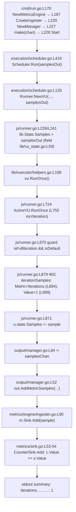

# Onboarding Q&A — grafana/k6

> **Scope:** This is a **read-only investigation**. The user asked us to *"Just exploring for now, so please don't modify anything in the repo."* Accordingly, **no source, test, build, or configuration file was changed** — this document is the only file added. Every answer below was produced by **actually building and running k6**, and every claim is paired with the command that produced it and/or an exact `file:line` citation.

## Orientation — what is k6?

k6 is Grafana's load‑testing tool. Its own README describes it as "Like unit testing, for performance" `[README.md:L16]` and "Modern load testing for developers and testers in the DevOps era." `[README.md:L17]`. It is a single Go module — `module go.k6.io/k6` `[go.mod:L1]` — declaring `go 1.21` `[go.mod:L3]` with a pinned `toolchain go1.21.13` `[go.mod:L5]`.

The exact binary under investigation, built from this checkout:

```
$ go build -mod=vendor -o /tmp/k6bin/k6 .
$ /tmp/k6bin/k6 version
k6 v0.55.0 (commit/<HEAD>, go1.23.10, linux/amd64)   # <HEAD> = git rev-parse --short=10 HEAD
$ git rev-parse --short=10 HEAD          # prints exactly the "commit/…" segment shown above
<HEAD>
```

This confirms **version `v0.55.0`** and **toolchain `go1.23.10`** — both are fixed values. The **commit segment is deliberately *not* a fixed string**: k6 stamps it from the **current `git HEAD`** at build time, so it always equals `git rev-parse --short=10 HEAD` (the block above shows this as `<HEAD>` precisely because the value is simply whatever your checkout's current `HEAD` is — the two `<HEAD>` lines above are equal by construction) and it changes with **every** commit on the branch. This is exactly why the commit differs from the source commit `ddc3b0b1d2` — so, to be precise about the mechanism: k6 does **not** hard‑code the commit. Only the *version* is a constant — `const Version = "0.55.0"` `[lib/consts/consts.go:L12]`. The *commit* is read at build time from Go's build info: `debug.ReadBuildInfo()` `[lib/consts/consts.go:L19]` → the `vcs.revision` setting `[lib/consts/consts.go:L30]`, truncated to the first 10 characters (`commitLen := 10` `[lib/consts/consts.go:L31]`) and rendered at `[lib/consts/consts.go:L52]`. Because `vcs.revision` is the current `HEAD`, the **reproducible reading of the line is: the `commit/…` segment *is* your checkout's `HEAD`** — verify it with the `git rev-parse` shown above.

**Why the built‑binary `HEAD` differs from the source commit `ddc3b0b1d2`, and why citations still pin to `ddc3b0b1d2`:** this deliverable adds documentation‑only commits on top of source commit `ddc3b0b1d2`, and those commits touch **only this file**. Using `--name-status` (whose output is stable and does **not** drift as this document itself grows), the diff reports exactly one changed path — added, marked `A` — and a `.go`‑filtered diff reports **zero** source files changed (the same holds for test, build, and config files):

```
$ git diff ddc3b0b1d23c128e34e2792fc9075f9126e32375..HEAD --name-status
A	blitzy/documentation/k6_ddc3b0b1d23c.md
$ git diff ddc3b0b1d23c128e34e2792fc9075f9126e32375..HEAD --name-only -- '*.go' | wc -l
0
```

So a build from the delivered checkout stamps **that checkout's `HEAD`** into the `commit/…` segment (confirm with `git rev-parse --short=10 HEAD`), while every `file:line` citation in this document remains pinned to, and byte‑for‑byte valid at, source commit `ddc3b0b1d2` (no cited source file changed — see the `--name-status` diff above). In short: the **version, the toolchain, and every citation reproduce exactly**, and the **commit segment reproduces as `= HEAD` by construction**. (Aside: building with *uncommitted* changes in the tree sets `vcs.modified=true` `[lib/consts/consts.go:L36]`, appending a `-dirty` suffix `[lib/consts/consts.go:L49]` — e.g. `commit/<HEAD>-dirty` — so a clean checkout is required to reproduce the un‑suffixed form.)

## Environment & reproducibility

| Item | Value (observed) |
|------|------------------|
| Go toolchain | `go version go1.23.10 linux/amd64` |
| C compiler (needed by `-race`) | `gcc (Ubuntu 15.2.0-4ubuntu4) 15.2.0` |
| Module / version | `go.k6.io/k6` `[go.mod:L1]`, k6 `v0.55.0` |
| Source commit under investigation (all `file:line` citations pinned here) | `ddc3b0b1d23c128e34e2792fc9075f9126e32375` (short `ddc3b0b1d2`) |
| Built‑binary commit (what `k6 version` prints) | `= git rev-parse --short=10 HEAD` (i.e. whatever the current `HEAD` is — written as `<HEAD>` throughout). Documentation‑only commits sit on top of `ddc3b0b1d2`; see the explanation above |
| Dependencies | **vendored** (`vendor/`), so every command uses `-mod=vendor` (offline) |
| Wall clock during the run | `Wed Jul  1 21:36:31 UTC 2026` (`date -u`) — relevant to Q1's TLS findings |

All commands below are runnable as-is from the repository root. Every `file:line` citation is pinned to **source commit `ddc3b0b1d2`**; those anchors are unaffected by the documentation‑only commits (which change no source file, as the `git diff --name-status` above shows). Building from the delivered checkout therefore reproduces the version, the toolchain, and every citation exactly, and stamps **that checkout's `HEAD`** into the `commit/…` segment (written as `<HEAD>`; confirm yours with `git rev-parse --short=10 HEAD`). Temporary artifacts (the built binary and a throwaway script) were written **outside** the repository under `/tmp` and removed afterward, so the working tree is left byte‑for‑byte unchanged.

---

## Q1 — Project health via the test suite

**Question:** Build k6 and run the full test suite; how many tests **pass vs fail**, and which are **skipped** or **broken** (fail to build/compile)?

### The commands the project itself defines

k6 defines its test invocation in two places. The `Makefile` target:

```
# Makefile:L27-L29
## tests: Executes any unit tests.
tests:
	go test -race -timeout 210s ./...
```
`[Makefile:L29]`

…and the CI workflow, which builds the argument list and runs it (effective command: `go test -p 2 -race -timeout 800s ./...`):

```
# .github/workflows/test.yml:L38-L46
export GOMAXPROCS=2                       # .github/workflows/test.yml:L38
args=("-p" "2" "-race")                   # .github/workflows/test.yml:L39
...
go test "${args[@]}" -timeout 800s ./...  # .github/workflows/test.yml:L46
```

The workflow defines **three** test jobs: `test-prev` `[.github/workflows/test.yml:L13]`, `test-tip` `[.github/workflows/test.yml:L48]`, and a coverage job `test-current-cov` `[.github/workflows/test.yml:L85]` that runs a per‑package `-coverprofile` `[.github/workflows/test.yml:L118]` and uploads to Codecov `[.github/workflows/test.yml:L122]`.

### The exact command I ran (for machine-countable results)

To aggregate exact counts I ran the CI-equivalent command with `-json` (JSON adds nothing to behavior; it just makes the `PASS`/`FAIL`/`SKIP` markers trivially countable). `-mod=vendor` is required because deps are vendored; `-race` requires gcc (present, `15.2.0`):

```
$ GOMAXPROCS=2 go test -mod=vendor -p 2 -race -timeout 800s -json ./... > /tmp/test.json 2> /tmp/test.stderr
$ echo "EXIT_CODE=$?"
EXIT_CODE=1
```

A quick single-package sanity check first confirmed the suite runs in this environment:

```
$ go test -mod=vendor ./metrics/
ok  	go.k6.io/k6/metrics	0.008s
```

The total number of packages is **82** — verbatim:

```
$ go list -mod=vendor ./... | wc -l
82
```

### Results — pass vs fail

I aggregated the standard Go markers at two granularities: **package level** (`ok` / `FAIL` / `?  [no test files]`) and **test level** (`--- PASS` / `--- FAIL` / `--- SKIP`, counting tests *and* subtests).

| Granularity | PASS | FAIL | SKIP / other |
|-------------|------|------|--------------|
| **Packages** (82 total) | **52** `ok` | **2** `FAIL` | **28** `?  [no test files]` |
| **Tests + subtests** | **4419** `--- PASS` | **6** `--- FAIL` | **1** `--- SKIP` |

**Verbatim aggregation that produced those counts** (jq is not installed in this environment, so these use only `grep`/`sort`/`uniq`; both read the exact `/tmp/test.json` captured by the `-json` command above). A **package-level** result event has an `"Elapsed"` field but no `"Test"` field; a **test-level** result event has both:

```
$ grep -v '"Test":' /tmp/test.json | grep '"Elapsed":' | grep -oE '"Action":"(pass|fail|skip)"' | sort | uniq -c
      2 "Action":"fail"
     52 "Action":"pass"
     28 "Action":"skip"
```
→ **52 `ok`, 2 `FAIL`, 28 `?  [no test files]`** (package `pass`/`fail`/`skip` = `ok`/`FAIL`/no‑test‑files; 52+2+28 = 82).

```
$ grep '"Test":' /tmp/test.json | grep '"Elapsed":' | grep -oE '"Action":"(pass|fail|skip)"' | sort | uniq -c
      6 "Action":"fail"
   4419 "Action":"pass"
      1 "Action":"skip"
```
→ **4419 `--- PASS`, 6 `--- FAIL`, 1 `--- SKIP`** (tests + subtests).

The **28** `?  [no test files]` packages are corroborated by the canonical marker itself:

```
$ grep -c '\[no test files\]' /tmp/test.json
28
```

- **Pass vs fail (packages): 52 pass, 2 fail.** The 28 `?` packages simply contain no `*_test.go` files (they are not failures).
- **Pass vs fail (tests): 4419 pass, 6 fail** (2 top‑level tests + 4 subtests), **1 skipped** at runtime.

### Broken (build/compile-failing) packages: **none**

`go test` writes compiler/build errors to **stderr**. In this run stderr was empty:

```
$ wc -c /tmp/test.stderr
0 /tmp/test.stderr
```

**Zero packages failed to build or compile** — every one of the 82 packages compiled cleanly. The 2 `FAIL` packages are genuine *test* failures, not build breaks.

### The 2 failing packages — verbatim markers

Both failing packages are in the JS module tree. Markers extracted verbatim from the runner output:

```
--- FAIL: TestRequestAndBatchTLS/ocsp_stapled_good (0.19s)
--- FAIL: TestRequestAndBatchTLS (0.00s)
FAIL
FAIL	go.k6.io/k6/js/modules/k6/http	7.995s
```

```
--- FAIL: TestClient_TlsParameters/ConnectTlsInvokeSuccess (5.04s)
--- FAIL: TestClient_TlsParameters/ConnectTlsEncryptedKey (60.01s)
--- FAIL: TestClient_TlsParameters/ConnectTls (60.01s)
--- FAIL: TestClient_TlsParameters (0.00s)
FAIL
FAIL	go.k6.io/k6/js/modules/k6/grpc	65.690s
```

So the two failing packages are **`go.k6.io/k6/js/modules/k6/http`** and **`go.k6.io/k6/js/modules/k6/grpc`**.

### Root cause of the failures — TLS test-fixture drift (grpc) and an external OCSP dependency (http), *not* certificate expiry (reported, not fixed)

Both failing packages are **TLS-related, but for two distinct and clock-independent reasons**. I traced each to its actual mechanism by re-running the failing subtests verbosely and decoding the certificates involved. **Neither failure is a certificate-expiry problem, and an earlier local clock would fix neither** — the certs in play are valid until the years **2084 and 3021** (both decoded below).

**(1) `js/modules/k6/grpc` — a Go-toolchain test-fixture mismatch (`crypto/rsa: verification error`), not expiry.**

All three failing gRPC subtests (`ConnectTls`, `ConnectTlsEncryptedKey`, `ConnectTlsInvokeSuccess`) fail with the *same* error — verbatim from a verbose re-run:

```
$ go test -mod=vendor -race -run 'TestClient_TlsParameters' ./js/modules/k6/grpc/
    --- FAIL: TestClient_TlsParameters/ConnectTlsInvokeSuccess (5.09s)
    --- FAIL: TestClient_TlsParameters/ConnectTlsEncryptedKey (60.09s)
    --- FAIL: TestClient_TlsParameters/ConnectTls (60.09s)
FAIL	go.k6.io/k6/js/modules/k6/grpc	60.123s
```

Each of those three subtests prints the identical error (shown once here, verbatim):

```
GoError: context deadline exceeded: connection error: desc = "transport: authentication handshake failed: tls: failed to verify certificate: x509: certificate signed by unknown authority (possibly because of \"crypto/rsa: verification error\" while trying to verify candidate authority certificate \"Acme Co\")" at reflect.methodValueCall (native)
```

That is an **`x509: certificate signed by unknown authority` / `crypto/rsa: verification error`** — a *key mismatch*, **not** the expiry error (which would read `x509: certificate has expired or is not yet valid`). The mechanism:

- The test server is `tb.ServerHTTP2`, an `httptest.NewUnstartedServer(cmux)` `[lib/testutils/httpmultibin/httpmultibin.go:L333]` started with `http2Srv.StartTLS()` `[lib/testutils/httpmultibin/httpmultibin.go:L338]`. Go's `httptest.StartTLS()` serves the toolchain's built-in `net/http/internal/testcert.LocalhostCert` (the Go 1.23.10 standard library does `tls.X509KeyPair(testcert.LocalhostCert, testcert.LocalhostKey)`).
- The client (the VU script) is told to trust **only** k6's hard-coded `localHostCert` as its CA — `cacerts: ["…"]` at `[js/modules/k6/grpc/client_test.go:L1217]`, where `localHostCert` is defined at `[js/modules/k6/grpc/client_test.go:L1160]`.

Decoding both certs shows they share the **same subject (`O=Acme Co`)** and both are valid **until 2084**, but they carry **different serial numbers and different public keys**:

```
$ openssl x509 -noout -subject -serial -enddate   # Go 1.23.10 net/http/internal/testcert.LocalhostCert (the server's cert)
subject=O=Acme Co
serial=10FFE677DEF41F2B1D053A6ECC339FD0
notAfter=Jan 29 16:00:00 2084 GMT
$ openssl x509 -noout -subject -serial -enddate   # k6 hard-coded localHostCert  [js/modules/k6/grpc/client_test.go:L1160]
subject=O=Acme Co
serial=49126B12904615CEED35BD5F6F9A4A17
notAfter=Jan 29 16:00:00 2084 GMT
```

Because the hard-coded CA (`49126B12…`) is a *different key* from the one that actually signed the server's cert (`10FFE677…`), the RSA signature check fails (`crypto/rsa: verification error`) and the client aborts the handshake. The server only logs the client's abort:

```
2026/07/01 23:14:21 http: TLS handshake error from 127.0.0.1:33300: remote error: tls: bad certificate
```

`remote error: tls: bad certificate` is the generic TLS alert the **client** sends when it rejects the server's cert; it is *not* an expiry signal. k6's `localHostCert` fixture was copied from an **older** Go toolchain's `testcert.LocalhostCert`; Go has since regenerated that built-in cert with a new key, so the fixture and the toolchain's current server cert no longer match. This is **Go-toolchain-version drift against a hard-coded test fixture** — completely independent of the wall clock. (The `ConnectTls`/`ConnectTlsEncryptedKey` subtests report `60.09s` because their `connect()` calls set no timeout and hit the default context deadline; `ConnectTlsInvokeSuccess` fails in `5.09s` because its script sets `timeout: '5s'`.)

The 2084 pair is only *half* of each `ConnectTls`/`ConnectTlsEncryptedKey` handshake. Their `setup` also switches the server to **mutual TLS** — `tb.ServerHTTP2.TLS.ClientAuth = tls.RequireAndVerifyClientCert` `[js/modules/k6/grpc/client_test.go:L1213, L1224]`, with the client CA pool seeded from `clientAuthCA` `[js/modules/k6/grpc/client_test.go:L1212, L1223]` — so the VU script must additionally present a **client certificate**, passed as `cert: "…"` (alongside `localHostCert` as `cacerts`) at `[js/modules/k6/grpc/client_test.go:L1217, L1228]`. That client-auth pair is a **separate** set of fixtures from the two 2084 certs above: `clientAuthCA` (`CN=My CA`) is defined at `[js/modules/k6/grpc/client_test.go:L1159]` and `clientAuth` (`CN=client`) at `[js/modules/k6/grpc/client_test.go:L1161]`. Decoding that pair shows it is valid **until 3021** — even further from any 2026 clock than the 2084 server/`localHostCert` pair:

```
$ openssl x509 -noout -subject -serial -enddate   # clientAuthCA  [js/modules/k6/grpc/client_test.go:L1159]
subject=CN=My CA
serial=840C0602E2F8357A
notAfter=May 24 12:29:36 3021 GMT
$ openssl x509 -noout -subject -serial -enddate   # clientAuth    [js/modules/k6/grpc/client_test.go:L1161]
subject=CN=client
serial=83F49E346DD7A81D
notAfter=May 24 15:12:34 3021 GMT
```

So **all four** certs involved in the failing gRPC handshake are far from expiry — the server cert and `localHostCert` to **2084**, and the `clientAuthCA`/`clientAuth` mutual-TLS pair to **3021** — which confirms the failure is a **key mismatch** (`crypto/rsa: verification error`), not a certificate-expiry problem.

**(2) `js/modules/k6/http` — a live external OCSP-stapling dependency (`ocsp status: unknown`), not expiry.**

The single failing http subtest is `ocsp_stapled_good` `[js/modules/k6/http/request_test.go:L2192]`. It makes a **request to the public internet** — `website := "https://www.wikipedia.org/"` `[js/modules/k6/http/request_test.go:L2197]` — and asserts the stapled OCSP status equals `OCSP_STATUS_GOOD` `[js/modules/k6/http/request_test.go:L2206]`. Verbatim from a verbose re-run:

```
$ go test -mod=vendor -race -run 'TestRequestAndBatchTLS/ocsp_stapled_good' ./js/modules/k6/http/
Error: wrong ocsp stapled response status: unknown at <eval>:3:58(22)
```

The network is reachable — `curl -sI https://www.wikipedia.org/` returns `HTTP/2 200` — so the request *does* reach Wikipedia; it simply no longer receives a **`good`** stapled OCSP response (it gets `unknown`). This is an **external-dependency change** (OCSP stapling has been widely deprecated), not a k6 certificate and not a clock effect.

**Why the "expired certificate" reading is wrong (correction of the earlier analysis).** The neighbouring `cert_expired` subtest passing does **not** corroborate a clock-driven expiry, because that cert is expired *by construction at any clock*: `GenerateTLSCertificate(t, "expired.localhost", time.Now().Add(-time.Hour), 0)` `[js/modules/k6/http/request_test.go:L2062]`, and `GenerateTLSCertificate` sets `notAfter := notBefore.Add(validFor)` `[js/modules/k6/http/request_test.go:L2278]` — i.e. one hour *before* `time.Now()`. It therefore passes on every clock:

```
--- PASS: TestRequestAndBatchTLS/cert_expired (0.09s)
```

The http package's other TLS certs are likewise generated dynamically from `time.Now()` (`[js/modules/k6/http/request_test.go:L2105]`, `[js/modules/k6/http/request_test.go:L2162]`) — they are **not** baked-in fixed-window certs, so no 2026 wall clock renders them expired.

**Conclusion:** both failures are **environment-sensitive, not product bugs**, but the mechanisms are (a) grpc: a hard-coded httptest cert fixture that has drifted from the current Go toolchain's cert (a key mismatch — the two mismatched certs are both valid to 2084, and the separate mutual-TLS client-auth pair to 3021, all decoded above), and (b) http: an external `www.wikipedia.org` OCSP staple that is no longer `good`. **An earlier local clock fixes neither** — the grpc case needs the fixture regenerated to match the toolchain (or the toolchain aligned to the fixture), and the http case depends on an external service. Per the read-only directive, they are **reported, not remediated**.

### Skipped tests — static (source) vs runtime (observed)

**Static view.** Grepping the whole `t.Skip` family (`t.Skip(` **and** `t.Skipf(`) across `*_test.go` (excluding `vendor/`) finds **10 skip call-sites in 4 files**:

```
$ grep -rnE "t\.Skip\(|t\.Skipf\(" --include="*_test.go" . | grep -v "/vendor/"
./js/modules/k6/http/request_test.go:2195:			t.Skip("this doesn't work on windows for some reason")
./js/tc39/tc39_test.go:383:		t.Skip("Excluded")
./js/tc39/tc39_test.go:456:				t.Skip("Test threw IgnorableTestError")
./js/tc39/tc39_test.go:531:				t.Skipf("Blocklisted feature %s", feature)
./js/tc39/tc39_test.go:770:					t.Skipf("Skip %s because %s is not supported", newName, skipWord)
./js/tc39/tc39_test.go:778:					t.Skipf("Skip %s because of path based block", newName)
./js/tc39/tc39_test.go:796:		t.Skip()
./js/tc39/tc39_test.go:807:		t.Skipf("If you want to run tc39 tests, you need to run the 'checkout.sh` script in the directory to get  https://github.com/tc39/test262 at the correct last tested commit (%v)", err)
./lib/executor/constant_arrival_rate_test.go:113:		t.Skipf("this test is very flaky on the Windows GitHub Action runners...")
./lib/netext/httpext/request_test.go:376:		t.Skipf("dial timeout doesn't get returned on windows") // or we don't match it correctly
$ grep -rnE "t\.Skip\(|t\.Skipf\(" --include="*_test.go" . | grep -v "/vendor/" | wc -l   # total skip call-sites
10
$ grep -rlE "t\.Skip\(|t\.Skipf\(" --include="*_test.go" . | grep -v "/vendor/" | wc -l   # distinct files
4
```

| File | Line(s) | Literal |
|------|---------|---------|
| `js/modules/k6/http/request_test.go` | L2195 | `t.Skip("this doesn't work on windows for some reason")` |
| `js/tc39/tc39_test.go` | L383 | `t.Skip("Excluded")` |
| `js/tc39/tc39_test.go` | L456 | `t.Skip("Test threw IgnorableTestError")` |
| `js/tc39/tc39_test.go` | L531 | `t.Skipf("Blocklisted feature %s", feature)` |
| `js/tc39/tc39_test.go` | L770 | `t.Skipf("Skip %s because %s is not supported", newName, skipWord)` |
| `js/tc39/tc39_test.go` | L778 | `t.Skipf("Skip %s because of path based block", newName)` |
| `js/tc39/tc39_test.go` | L796 | `t.Skip()` |
| `js/tc39/tc39_test.go` | L807 | `` t.Skipf("If you want to run tc39 tests, you need to run the 'checkout.sh` script in the directory to get  https://github.com/tc39/test262 at the correct last tested commit (%v)", err) `` |
| `lib/executor/constant_arrival_rate_test.go` | L113 | `t.Skipf("this test is very flaky on the Windows GitHub Action runners...")` |
| `lib/netext/httpext/request_test.go` | L376 | `t.Skipf("dial timeout doesn't get returned on windows")` |

> The `L807` cell is the **exact source literal** — note the stray back‑tick after `checkout.sh` and the double space before the URL, both verbatim from source — and the identical line appears **byte‑for‑byte in the grep output above** (`./js/tc39/tc39_test.go:807:…`); no ellipsis substitutes for the literal. (The trailing `...` inside the `L113` message is part of the developer's own skip string, not a truncation.)

**Runtime view.** On this `linux/amd64` run, **exactly one** test actually skipped — `go.k6.io/k6/js/tc39.TestTC39`:

```
    tc39_test.go:799: If you want to run tc39 tests, you need to run the 'checkout.sh` script in the directory to get  https://github.com/tc39/test262 at the correct last tested commit (stat TestTC39/test262: no such file or directory)
--- SKIP: TestTC39 (0.00s)
```

Two nuances worth calling out:

1. **Why the skip is reported at `tc39_test.go:799` even though the `t.Skipf` statement is at `L807`.** `TestTC39` `[js/tc39/tc39_test.go:L794]` calls `runTestTC39(t, lib.CompatibilityModeExtended)` at `[js/tc39/tc39_test.go:L799]`. Inside `runTestTC39` `[js/tc39/tc39_test.go:L803]`, the very first statement is `t.Helper()` `[js/tc39/tc39_test.go:L804]`, and the actual `t.Skipf(...)` fires at `[js/tc39/tc39_test.go:L807]` (because `os.Stat(tc39BASE)` errors — the `test262` corpus isn't checked out). Because `t.Helper()` marks `runTestTC39` as a helper, Go attributes the skip location to the **call site (L799)**, not the `t.Skipf` line (L807).
2. **A package whose only test skips still reports `ok`.** `js/tc39` shows `ok  	go.k6.io/k6/js/tc39	(cached)` and counts as a passing package — a `--- SKIP` is not a failure.

**Why the other 9 static skip sites did *not* fire here:** they are either **Windows‑conditional** (the `http`, `constant_arrival_rate`, and `httpext` skips only trigger on Windows, so never on `linux/amd64`) or gated by `testing.Short()` / tc39 feature‑blocklists that were not exercised (the corpus is absent, so `TestTC39` skips at the `os.Stat` guard before reaching the per‑feature blocklist skips).

### Q1 summary

| Metric | Result |
|--------|--------|
| Build (`k6 version`) | ✅ `k6 v0.55.0 (commit/<HEAD>, go1.23.10, linux/amd64)` where `<HEAD>` = `git rev-parse --short=10 HEAD`; source commit under investigation is `ddc3b0b1d2` — see *Environment & reproducibility* |
| Packages | 82 total → **52 ok**, **2 FAIL**, **28** no‑test‑files |
| Tests + subtests | **4419 PASS**, **6 FAIL**, **1 SKIP** |
| Broken (build/compile) packages | **0** (stderr was empty) |
| Failing packages | `js/modules/k6/http`, `js/modules/k6/grpc` — TLS-related but **not expiry**: grpc = Go-toolchain httptest cert-fixture drift (`crypto/rsa: verification error` key mismatch; server/`localHostCert` pair valid to 2084, separate client-auth pair `clientAuthCA`/`clientAuth` to 3021 — `client_test.go:L1159`/`L1161`); http = external `www.wikipedia.org` OCSP staple `unknown`. Environment-sensitive, not product bugs |
| Skipped at runtime | **1** (`TestTC39`, corpus absent) |

**Reproducible aggregation recap** — every number in the table above is the verbatim output of these commands run against the single `-json` capture:

```
$ GOMAXPROCS=2 go test -mod=vendor -p 2 -race -timeout 800s -json ./... > /tmp/test.json 2> /tmp/test.stderr; echo "EXIT_CODE=$?"
EXIT_CODE=1
$ wc -c /tmp/test.stderr                                   # 0 bytes => 0 build/compile-broken packages
0 /tmp/test.stderr
$ go list -mod=vendor ./... | wc -l                        # total packages
82
$ grep -v '"Test":' /tmp/test.json | grep '"Elapsed":' | grep -oE '"Action":"(pass|fail|skip)"' | sort | uniq -c   # packages: ok / FAIL / no-test
      2 "Action":"fail"
     52 "Action":"pass"
     28 "Action":"skip"
$ grep '"Test":' /tmp/test.json | grep '"Elapsed":' | grep -oE '"Action":"(pass|fail|skip)"' | sort | uniq -c       # tests+subtests: PASS / FAIL / SKIP
      6 "Action":"fail"
   4419 "Action":"pass"
      1 "Action":"skip"
```

These results are **reproducible** with the exact command above. **Caveat:** the two TLS failures are **environment-sensitive but not clock-sensitive**. grpc fails because k6's hard-coded httptest cert fixture no longer matches the Go toolchain's regenerated server cert (a `crypto/rsa: verification error` key mismatch — the two mismatched certs both valid to 2084, and the separate client-auth pair `clientAuthCA`/`clientAuth` to 3021 per `js/modules/k6/grpc/client_test.go:L1159`/`L1161`); http `ocsp_stapled_good` depends on the external `www.wikipedia.org` OCSP staple (observed status `unknown`). An earlier date would fix neither — the grpc fixture must be regenerated to match the toolchain, and the http staple is served by an external site.

---

## Q2 — How k6 tracks metrics

**Question:** Explain how k6 tracks metrics during a run, naming the specific files/modules responsible for **(a) counting iterations** and **(b) collecting performance data**.

### Architectural overview

k6's metrics subsystem is cleanly layered:

- **Data‑model core — `metrics/`**: defines what a metric *is* (`Metric`, `MetricType`, `Sample`) and how values accumulate (`Sink` implementations + a `Registry`).
- **Aggregation / threshold engine — `metrics/engine/`**: owns the set of *observed* metrics and routes each incoming sample into the right sink.
- **Delivery pipeline — `output/`**: fans samples out to every configured output (stdout summary, JSON, CSV, InfluxDB, cloud…).
- **Producers — `execution/`, `lib/executor/`, and the JS runtime `js/`**: run scenarios/iterations and emit samples onto a channel.
- **Wiring — `cmd/run.go`**: assembles engine → ingester → output manager → sample channel → scheduler at run start.

Four design patterns recur and are worth naming:

- a **registry** for metric definitions (`metrics/registry.go`, `type Registry struct` `[metrics/registry.go:L12]`);
- a **producer/consumer over a buffered channel** for sample transport (VUs write to `State.Samples` `[lib/vu_state.go:L59]`; the `output.Manager` reads it `[output/manager.go:L64]`);
- a **fan‑out** from the manager to every output (`[output/manager.go:L52]`);
- **sink accumulation**, where each metric owns a sink that folds incoming samples (`CounterSink.Add` does `c.Value += s.Value` `[metrics/sink.go:L53-L54]`).

### (a) Counting iterations

The two iteration counters are **built‑in metrics** declared and registered in **`metrics/builtin.go`**. Both are `Counter`‑typed:

- `IterationsName        = "iterations"` `[metrics/builtin.go:L8]`
- `DroppedIterationsName = "dropped_iterations"` `[metrics/builtin.go:L10]`
- Struct fields `Iterations        *Metric` `[metrics/builtin.go:L42]` and `DroppedIterations *Metric` `[metrics/builtin.go:L44]`
- `func RegisterBuiltinMetrics(registry *Registry) *BuiltinMetrics` `[metrics/builtin.go:L78]`, which creates them:
  - `Iterations:        registry.MustNewMetric(IterationsName, Counter)` `[metrics/builtin.go:L82]`
  - `DroppedIterations: registry.MustNewMetric(DroppedIterationsName, Counter)` `[metrics/builtin.go:L84]`

**Per‑iteration emission lives in `js/runner.go`.** When a *full default* iteration completes, the runner pushes an `iterations` sample of value `1`:

- The guard and the channel send: `if isFullIteration && isDefault {` `[js/runner.go:L870]` → `u.state.Samples <- iterationSamples(startTime, endTime, ctm, builtinMetrics)` `[js/runner.go:L871]`.
- The sample builder `func iterationSamples(...)` `[js/runner.go:L879]` produces the `Iterations` sample with `Metric: builtinMetrics.Iterations` `[js/runner.go:L894]` and `Value:    1,` `[js/runner.go:L899]` (quoted byte‑exactly from the source line).
- The iteration itself runs in `func (u *ActiveVU) RunOnce() error` `[js/runner.go:L724]`, which bumps a **per‑VU** counter via `u.incrIteration()` `[js/runner.go:L755]`, defined at `func (u *ActiveVU) incrIteration()` `[js/runner.go:L904]`.

**Scenario‑level scheduling lives in `lib/executor/`.** There are exactly **7 executor types** (each registered by an `init()` calling `lib.RegisterExecutorConfigType`), so — to correct a common miscount — **7, not 12** (the "12" is the number of *non‑test* `.go` files in the directory; there are 24 files total including 12 `_test.go`):

| Executor type | Type constant | Registration file |
|---------------|---------------|-------------------|
| `constant-vus` | `lib/executor/constant_vus.go:L18` | `lib/executor/constant_vus.go:L21` |
| `ramping-vus` | `lib/executor/ramping_vus.go:L19` | `lib/executor/ramping_vus.go:L22` |
| `shared-iterations` | `lib/executor/shared_iterations.go:L19` | `lib/executor/shared_iterations.go:L22` |
| `per-vu-iterations` | `lib/executor/per_vu_iterations.go:L19` | `lib/executor/per_vu_iterations.go:L22` |
| `constant-arrival-rate` | `lib/executor/constant_arrival_rate.go:L21` | `lib/executor/constant_arrival_rate.go:L24` |
| `ramping-arrival-rate` | `lib/executor/ramping_arrival_rate.go:L20` | `lib/executor/ramping_arrival_rate.go:L23` |
| `externally-controlled` | `lib/executor/externally_controlled.go:L21` | `lib/executor/externally_controlled.go:L24` |

The executors invoke each iteration through a common helper — `err := vu.RunOnce()` `[lib/executor/helpers.go:L108]` — and emit the `dropped_iterations` counter when they cannot start a scheduled iteration in time. The four emission sites (each referencing `...BuiltinMetrics.DroppedIterations`):

- `[lib/executor/constant_arrival_rate.go:L324]`
- `[lib/executor/per_vu_iterations.go:L202]`
- `[lib/executor/ramping_arrival_rate.go:L472]`
- `[lib/executor/shared_iterations.go:L222]`

**VU‑count metrics come from the scheduler.** `execution/scheduler.go` constructs each VU wired to the sample channel — `e.state.Test.Runner.NewVU(ctx, vuIDLocal, vuIDGlobal, samplesOut)` `[execution/scheduler.go:L133]` — inside `func (e *Scheduler) Run(...)` `[execution/scheduler.go:L419]`, and periodically emits `vus`/`vus_max` via `func (e *Scheduler) emitVUsAndVUsMax(...)` `[execution/scheduler.go:L199]` (started at `[execution/scheduler.go:L394]`).

### (b) Collecting performance data

**Metric types — `metrics/metric_type.go`.** There are exactly **four**:

- `Counter` — `// A counter that sums its data points` `[metrics/metric_type.go:L10]`
- `Gauge` — `// A gauge that displays the latest value` `[metrics/metric_type.go:L11]`
- `Trend` — `// A trend, min/max/avg/med are interesting` `[metrics/metric_type.go:L12]`
- `Rate` — `// A rate, displays % of values that aren't 0` `[metrics/metric_type.go:L13]`

(Grafana's public k6 documentation describes the same four types; the source above is authoritative.)

**Sinks — `metrics/sink.go`.** Each metric owns a `Sink` that folds samples. The four implementations mirror the four types:

- `type CounterSink struct` `[metrics/sink.go:L47]` with `func (c *CounterSink) Add(s Sample)` `[metrics/sink.go:L53]` doing `c.Value += s.Value` `[metrics/sink.go:L54]`;
- `type GaugeSink struct` `[metrics/sink.go:L72]`, `type TrendSink struct` `[metrics/sink.go:L104]`, `type RateSink struct` `[metrics/sink.go:L201]`.

**Registry, model, and sample units — `metrics/`.**

- `metrics/registry.go`: a concurrency‑safe `type Registry struct` `[metrics/registry.go:L12]` with `NewMetric` `[metrics/registry.go:L43]`, `MustNewMetric` `[metrics/registry.go:L70]`, `All` `[metrics/registry.go:L79]`, and `Get` `[metrics/registry.go:L111]`.
- `metrics/metric.go`: `type Metric struct` `[metrics/metric.go:L12]` and `type Submetric struct` `[metrics/metric.go:L29]`.
- `metrics/sample.go`: the units flowing through the pipeline — `type TimeSeries struct` `[metrics/sample.go:L14]`, `type Sample struct` `[metrics/sample.go:L23]`, the `type SampleContainer interface` `[metrics/sample.go:L37]`, and `type Samples []Sample` `[metrics/sample.go:L43]`.

**Aggregation engine — `metrics/engine/`.**

- `metrics/engine/engine.go`: `type MetricsEngine struct` `[metrics/engine/engine.go:L26]` owns `ObservedMetrics map[string]*metrics.Metric` `[metrics/engine/engine.go:L40]`; constructed by `func NewMetricsEngine(...)` `[metrics/engine/engine.go:L44]`; exposes `func (me *MetricsEngine) CreateIngester() *OutputIngester` `[metrics/engine/engine.go:L56]`; `markObserved` records a metric so it appears in the summary `[metrics/engine/engine.go:L108]`.
- `metrics/engine/ingester.go`: the ingester is an `Output` (`type OutputIngester struct` `[metrics/engine/ingester.go:L25]`) that routes each incoming sample into its metric's sink — `m.Sink.Add(sample)` with the inline comment `// finally, add its value to its own sink` `[metrics/engine/ingester.go:L90]` — and repeats for any matching submetrics — `sm.Metric.Sink.Add(sample)` `[metrics/engine/ingester.go:L98]`.

**Delivery pipeline — `output/`.**

- `output/manager.go`: `type Manager struct` `[output/manager.go:L15]`; `func NewManager(...)` `[output/manager.go:L23]`; `func (om *Manager) Start(samplesChan chan metrics.SampleContainer)` `[output/manager.go:L42]` runs a goroutine that reads the channel — `case sampleContainer, ok := <-samplesChan:` `[output/manager.go:L64]` — and fans batches out to every output — `out.AddMetricSamples(sampleContainers)` `[output/manager.go:L52]`.
- `output/types.go`: the `type Output interface` `[output/types.go:L44]` and `type Params struct` `[output/types.go:L20]`.
- `output/helpers.go`: reusable `type SampleBuffer struct` `[output/helpers.go:L15]` and `type PeriodicFlusher struct` `[output/helpers.go:L55]`.
- Concrete backends present in the tree: **`output/json`**, **`output/csv`**, **`output/influxdb`**, **`output/cloud`**.

**Live metrics over REST — `api/v1/`.** During a run, metrics are exposed via an HTTP control surface: `type ControlSurface struct` `[api/v1/control_surface.go:L14]` holds `MetricsEngine *engine.MetricsEngine` `[api/v1/control_surface.go:L17]` and `RunState *lib.TestRunState` `[api/v1/control_surface.go:L19]`. Routes `/v1/metrics` `[api/v1/routes.go:L23]` and `/v1/metrics/` `[api/v1/routes.go:L31]` (the second is a trailing‑slash prefix; the metric id is the remaining path segment, extracted at `[api/v1/routes.go:L37]` via `id := r.URL.Path[len("/v1/metrics/"):]`) are wired to the handlers `func handleGetMetrics(...)` `[api/v1/metric_routes.go:L9]` and `func handleGetMetric(...)` `[api/v1/metric_routes.go:L27]`; the JSON‑API serialization lives in `api/v1/metric.go` and `api/v1/metric_jsonapi.go`.

**Where the built‑in metrics get registered.** Two entry points call `RegisterBuiltinMetrics`:

- Production run/test loading: `BuiltinMetrics: metrics.RegisterBuiltinMetrics(registry)` `[cmd/test_load.go:L75]`.
- Test harness: `BuiltinMetrics: metrics.RegisterBuiltinMetrics(vu.InitEnvField.Registry)` `[js/modulestest/runtime.go:L55]`.

---

## Q3 — End‑to‑end trace of one metric

**Question:** Trace a simple test script and show the function calls that collect at least one metric, demonstrating the data flow from test start to metrics output.

We trace the built‑in **`iterations`** counter (a `Counter`) because it is guaranteed to be emitted exactly once per completed default iteration, making it trivial to verify.

### The script (temporary, created under `/tmp`, not committed)

`/tmp/k6scratch/trace.js`:

```js
import { sleep } from 'k6';
export const options = { vus: 1, iterations: 1 };
export default function () { sleep(0.01); }
```

### The command and the verbatim output

```
$ /tmp/k6bin/k6 run --vus 1 --iterations 1 /tmp/k6scratch/trace.js
```

```
         /\      Grafana   /‾‾/  
    /\  /  \     |\  __   /  /   
   /  \/    \    | |/ /  /   ‾‾\ 
  /          \   |   (  |  (‾)  |
 / __________ \  |_|\_\  \_____/ 

     execution: local
        script: /tmp/k6scratch/trace.js
        output: -

     scenarios: (100.00%) 1 scenario, 1 max VUs, 10m30s max duration (incl. graceful stop):
              * default: 1 iterations shared among 1 VUs (maxDuration: 10m0s, gracefulStop: 30s)


     data_received........: 0 B 0 B/s
     data_sent............: 0 B 0 B/s
     iteration_duration...: avg=10.12ms min=10.12ms med=10.12ms max=10.12ms p(90)=10.12ms p(95)=10.12ms
     iterations...........: 1   97.73205/s


running (00m00.0s), 0/1 VUs, 1 complete and 0 interrupted iterations
default ✓ [ 100% ] 1 VUs  00m00.0s/10m0s  1/1 shared iters
```

(The process exited with code `0`.) The key observations:

- `* default: 1 iterations shared among 1 VUs (maxDuration: 10m0s, gracefulStop: 30s)` — the default executor selected by `--iterations` is **`shared-iterations`** (`lib/executor/shared_iterations.go`).
- **`     iterations...........: 1   97.73205/s`** — the traced built‑in `iterations` `Counter`, accumulated to **exactly `1`** (the rate `97.73205/s` reflects the ~10 ms iteration and will vary run‑to‑run).
- `     iteration_duration...: avg=10.12ms ...` — the *paired* `iteration_duration` `Trend` sample built alongside `iterations` in the same `iterationSamples(...)` call (see step 14 below), corroborating the ~10 ms `sleep(0.01)`.
- `running (00m00.0s), 0/1 VUs, 1 complete and 0 interrupted iterations` and `default ✓ [ 100% ] 1 VUs  00m00.0s/10m0s  1/1 shared iters`.

### The ordered function‑call chain (from run start to output)

Every step is verified against source commit `ddc3b0b1d2` (the `file:line` anchors below; recall the built binary stamps whatever the current `HEAD` is — written as `<HEAD>` — but no cited source changed).

1. **`cmd/run.go:L170`** — `metricsEngine, err := engine.NewMetricsEngine(testRunState.Registry, logger)` builds the engine (→ `metrics/engine/engine.go:L44`).
2. **`cmd/run.go:L187`** — `metricsIngester = metricsEngine.CreateIngester()` creates the sample→sink ingester (→ `metrics/engine/engine.go:L56`).
3. **`cmd/run.go:L220`** — `outputManager := output.NewManager(outputs, logger, ...)` (→ `output/manager.go:L23`).
4. **`cmd/run.go:L227`** — `samples := make(chan metrics.SampleContainer, test.derivedConfig.MetricSamplesBufferSize.Int64)` — the **buffered sample channel**.
5. **`cmd/run.go:L228`** — `outputManager.Start(samples)` starts the consumer goroutine (→ `output/manager.go:L42`).
6. **`cmd/run.go:L367`** then **`cmd/run.go:L397`** — `execScheduler.Init(runCtx, samples)` then `execScheduler.Run(globalCtx, runCtx, samples)`.
7. *(Setup, earlier)* the built‑in `iterations` `Counter` was created via `cmd/test_load.go:L75` → `metrics/builtin.go:L82`.
8. **`execution/scheduler.go:L419`** — `func (e *Scheduler) Run(globalCtx, runCtx context.Context, samplesOut chan<- metrics.SampleContainer)` receives the channel.
9. **`execution/scheduler.go:L133`** — it constructs the VU passing that same channel: `e.state.Test.Runner.NewVU(ctx, vuIDLocal, vuIDGlobal, samplesOut)`.
10. **`js/runner.go:L226`** — `Samples: samplesOut` stores the channel on the VU, and **`js/runner.go:L241`** copies it into the VU's `lib.State`: `Samples: vu.Samples` (the field is `Samples chan<- metrics.SampleContainer` at `lib/vu_state.go:L59`).
11. **`lib/executor/helpers.go:L108`** — the shared‑iterations executor drives the iteration: `err := vu.RunOnce()`.
12. **`js/runner.go:L724`** — `func (u *ActiveVU) RunOnce() error` runs the default function; **`js/runner.go:L755`** bumps the per‑VU counter via `u.incrIteration()` (defined at `js/runner.go:L904`).
13. **`js/runner.go:L870`** — the guard `if isFullIteration && isDefault {` → **`js/runner.go:L871`** `u.state.Samples <- iterationSamples(startTime, endTime, ctm, builtinMetrics)` sends the sample onto the channel.
14. **`js/runner.go:L879`–`L902`** — `iterationSamples(...)` builds the sample with `Metric: builtinMetrics.Iterations` `[js/runner.go:L894]` and `Value:    1,` `[js/runner.go:L899]` (byte‑exact source line; and the paired `IterationDuration` sample).
15. **`output/manager.go:L64`** — the manager goroutine reads it: `case sampleContainer, ok := <-samplesChan:`.
16. **`output/manager.go:L52`** — it fans the batch out to every output: `out.AddMetricSamples(sampleContainers)` (one of those outputs is the engine ingester).
17. **`metrics/engine/ingester.go:L90`** — `m.Sink.Add(sample)` routes the value into the metric's own sink.
18. **`metrics/sink.go:L53`–`L54`** — `func (c *CounterSink) Add(s Sample) { c.Value += s.Value }` accumulates `1`, which is finally surfaced in the end‑of‑test summary as `iterations...........: 1`.



### The design in one sentence

A **producer** (the JS VU) writes a `Value:1` sample onto a **buffered channel** (`lib.State.Samples` `[lib/vu_state.go:L59]`); a **consumer** (`output.Manager` `[output/manager.go:L64]`) drains it and **fans out** `[output/manager.go:L52]` to every output; the engine's ingester routes it into the metric's **sink** `[metrics/engine/ingester.go:L90]`; and because `iterations` is a `Counter`, its `CounterSink` **sums** the values `[metrics/sink.go:L53-L54]` — yielding the `1` printed in the summary.

---

## Coverage & caveats

**Every named item, addressed:**

- **Q1** — "pass vs fail": 52 vs 2 packages; 4419 vs 6 tests. "skipped": 1 at runtime (`TestTC39`) plus the 4 files / 10 static `t.Skip`/`t.Skipf` sites. "broken": **0** packages fail to build/compile (stderr empty). Commands cited from `Makefile:L29` and `.github/workflows/test.yml:L38,L39,L46`.
- **Q2(a)** counting iterations — `metrics/builtin.go` (`iterations`, `dropped_iterations`, `RegisterBuiltinMetrics`), `js/runner.go` (`iterationSamples`, `incrIteration`, `RunOnce`), `lib/executor/*` (7 executor types + 4 `dropped_iterations` sites + `helpers.go` `vu.RunOnce()`), `execution/scheduler.go`.
- **Q2(b)** collecting performance data — the four metric types (`Counter`/`Gauge`/`Trend`/`Rate`), `metrics/sink.go` (`CounterSink.Add`), `registry.go`, `metric.go`, `sample.go`, `metrics/engine/{engine,ingester}.go`, `output/manager.go` + backends (`json`/`csv`/`influxdb`/`cloud`), and the `api/v1/` live‑metrics REST surface.
- **Q3** — simple script, command, verbatim `iterations...........: 1`, the ordered function‑call chain with `file:line`, and the data‑flow design.

**Caveats & honesty notes:**

- **Measured values vary.** Timing‑derived figures — the `iterations` rate (`97.73205/s`), `iteration_duration` (`10.12ms`), and per‑test elapsed times (e.g. `7.995s`, `65.690s`) — are from this specific run and will differ slightly on re‑runs. The *counts* (52/2/28 packages; 4419/6/1 tests) and the emitted `iterations` **value of `1`** are stable.
- **The 2 failing packages are environment-sensitive, not defects.** grpc's `ConnectTls*` fail with `x509: certificate signed by unknown authority … crypto/rsa: verification error … "Acme Co"` because k6's hard-coded httptest cert fixture (`serial 49126B12…`) no longer matches the Go 1.23.10 toolchain's server cert (`serial 10FFE677…`) — same subject `O=Acme Co`, different key, **both valid to 2084**, so not expiry; http's `ocsp_stapled_good` fails with `wrong ocsp stapled response status: unknown` from the live `www.wikipedia.org`. An earlier clock fixes neither. This is reported, **not fixed**, per the read-only directive.
- **Attribution nuance (tc39).** The `TestTC39` skip is reported at `js/tc39/tc39_test.go:L799` (the call site) rather than the `t.Skipf` at `js/tc39/tc39_test.go:L807`, because `runTestTC39` calls `t.Helper()` `[js/tc39/tc39_test.go:L804]`.
- **Source is the source of truth.** Grafana's public k6 docs corroborate the four‑type metric taxonomy and the "built‑ins are summarized at end of test" behavior, but every claim here is grounded in the k6 source at commit `ddc3b0b1d2` and in observed runtime output.
- **Repository untouched.** The only file added is this document; the built binary and the trace script lived under `/tmp` and were removed. `go.mod`/`go.sum`/`vendor/` and all `.go`, test, build, and CI files are unchanged.

