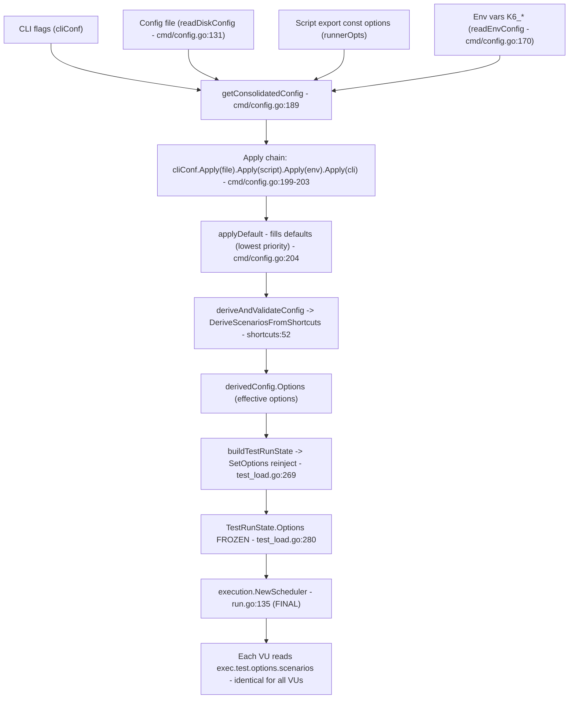

# Where do a k6 test's "real" options come from? Config consolidation, precedence, finality, and multi-VU behavior

> **Scope & provenance.** This document answers one k6 onboarding question and proves every behavioral
> claim with real, captured `k6 run` output. All findings are pinned to the exact commit under
> investigation: **HEAD `ddc3b0b1d`** (`ddc3b0b1d23c128e34e2792fc9075f9126e32375`), built canonically as
> **`k6 v0.55.0`**. Every factual claim carries a `file:line` citation into the source at this commit or
> points at observed output reproduced verbatim below. Statements made from reading rather than running
> are explicitly labeled **(inferred)**. The `commit/ddc3b0b1d2` banner is a property of the pinned checkout,
> not of this file; see **§(g) -> Build provenance** for how it is derived and reproduced from the pinned
> source commit, and why a build from the delivered (doc-committed) tree stamps a different commit prefix
> with no behavioral difference.

**The question (as asked during onboarding):** *"When a k6 test starts, where do the real options come
from? How are `export const options`, CLI flags, and (sometimes) a config file combined into the effective
options; at what point is that decision final; prove which source wins with conflicting setups; and how
does this behave with multiple VUs?"*

**Reading guide.** Sections: **(a)** direct answer + precedence table; **(b)** the consolidation engine and
its `Apply` chain; **(c)** the VUs-vs-execution-group merge asymmetry (why some settings "seem to win from a
different place"); **(d)** shortcut-to-scenario derivation; **(e)** the finality point (with a flow diagram);
**(f)** multi-VU behavior; **(g)** empirical proof (RUN A-G, four edge cases, two `-e`-vs-`K6_*` experiments,
and a non-canonical `k6 inspect` cross-check) with exact commands and complete, unedited output; **(h)**
adjacent clarifications; and a final key-insights recap.

---

## (a) Direct answer + precedence summary

**The "real" options are the consolidated-and-derived options that k6 freezes into `TestRunState.Options`
[cmd/test_load.go:280] immediately before it constructs the execution scheduler [cmd/run.go:135].** They
are produced by exactly one function, `getConsolidatedConfig` [cmd/config.go:189], which layers every
configuration source into a single `Config`, fills in defaults, and then hands the result to
`DeriveScenariosFromShortcuts` [lib/executor/execution_config_shortcuts.go:52], which converts the shortcut
fields (`vus`/`duration`/`stages`/`iterations`) into an explicit `scenarios` map. That derived map is what
the scheduler actually executes.

There are **five** configuration sources. Their **effective precedence, highest to lowest**, is:

| Rank | Source | Where it enters the merge | How it is read |
|------|--------|---------------------------|----------------|
| **1 (highest)** | **CLI flags** (`--vus`, `--duration`, `--stage`, `--config`, ...) | applied **last** in the `Apply` chain [cmd/config.go:203] | `getOptions` [cmd/options.go:81] over `optionFlagSet` [cmd/options.go:23] |
| **2** | **`K6_*` environment variables** (`K6_VUS`, `K6_DURATION`, ...) | `.Apply(envConf)` [cmd/config.go:203] | `readEnvConfig` [cmd/config.go:170] |
| **3** | **Script `export const options`** | `.Apply(Config{Options: runnerOpts})` [cmd/config.go:201] | `initRunner.GetOptions()` [cmd/test_load.go:203] -> `Runner.GetOptions` [js/runner.go:340] |
| **4** | **JSON config file** (`--config`, or the default path) | `cliConf.Apply(fileConf)` [cmd/config.go:199] | `readDiskConfig` [cmd/config.go:131] |
| **5 (lowest)** | **Built-in defaults** | `applyDefault(conf)` [cmd/config.go:204] | `applyDefault` [cmd/config.go:222] |

In one sentence: **CLI flags beat `K6_*` environment variables, which beat the script's
`export const options`, which beat the JSON config file, which beats the built-in defaults.** Each of these
relationships is proven live in section (g) (RUN B, C, D, and E).

One subtlety resolves the "VUs, duration, or scenario settings seem to win from a different place"
confusion up front: **`vus` merges as a lone, independent field, but `duration`/`iterations`/`stages`/
`scenarios` move as one group.** A higher tier that sets *any* execution field wipes *all* lower-tier
execution settings, yet a higher tier's `vus` replaces only `vus`. This asymmetry lives in
`lib.Options.Apply` [lib/options.go:361-377]; it is dissected in section (c) and proven in RUN G.


---

## (b) The consolidation engine and the `Apply` chain

All five sources are merged by one function. Its doc comment states the design in plain English, and its
body encodes precedence purely through the **order** of `Apply` calls. Quoted verbatim [cmd/config.go:180-206]:

```go
// Assemble the final consolidated configuration from all of the different sources:
// - start with the CLI-provided options to get shadowed (non-Valid) defaults in there
// - add the global file config options
// - add the Runner-provided options (they may come from Bundle too if applicable)
// - add the environment variables
// - merge the user-supplied CLI flags back in on top, to give them the greatest priority
// - set some defaults if they weren't previously specified
// TODO: add better validation, more explicit default values and improve consistency between formats
// TODO: accumulate all errors and differentiate between the layers?
func getConsolidatedConfig(gs *state.GlobalState, cliConf Config, runnerOpts lib.Options) (conf Config, err error) {
	fileConf, err := readDiskConfig(gs)
	if err != nil {
		return conf, errext.WithExitCodeIfNone(err, exitcodes.InvalidConfig)
	}
	envConf, err := readEnvConfig(gs.Env)
	if err != nil {
		return conf, errext.WithExitCodeIfNone(err, exitcodes.InvalidConfig)
	}

	conf = cliConf.Apply(fileConf)

	conf = conf.Apply(Config{Options: runnerOpts})

	conf = conf.Apply(envConf).Apply(cliConf)
	conf = applyDefault(conf)

	// TODO(imiric): Move this validation where it makes sense in the configuration
```

The mechanism is a **right-biased fold**. `Config.Apply(cfg)` is documented [cmd/config.go:70] as:

```go
}

// Apply the provided config on top of the current one, returning a new one. The provided config has priority.
func (c Config) Apply(cfg Config) Config {
```

so in `a.Apply(b)` the fields set by `b` win. Because precedence is encoded by call order, reading the four
decisive lines top to bottom tells the whole story:

1. **`conf = cliConf.Apply(fileConf)`** [cmd/config.go:199] - start from the CLI-provided baseline (to pull in
   shadowed, non-`Valid` defaults), then let the **config file** overwrite it. This is exactly why the config
   file ends up **second-lowest** overall: it is applied *first*, so every later `Apply` can overwrite it.
2. **`conf = conf.Apply(Config{Options: runnerOpts})`** [cmd/config.go:201] - let the script's
   **`export const options`** (`runnerOpts`) overwrite the file+CLI baseline.
3. **`conf = conf.Apply(envConf).Apply(cliConf)`** [cmd/config.go:203] - apply the **`K6_*` environment
   variables**, and then apply **`cliConf` a second and final time**. Because `Apply` gives its argument
   priority and `cliConf` is applied **last**, CLI flags receive **the greatest priority** - precisely what
   the doc comment promises: *"merge the user-supplied CLI flags back in on top, to give them the greatest
   priority"* [cmd/config.go:185].
4. **`conf = applyDefault(conf)`** [cmd/config.go:204] - fill any still-unset fields with **built-in
   defaults**. Applied last and only filling gaps, defaults have the **lowest** priority.

Precedence is therefore not stored as data anywhere; it is an emergent property of the call order in this
one function. This is the single most important insight in this document: **applying `cliConf` last
[cmd/config.go:203] is literally why CLI flags win, and applying `applyDefault` last [cmd/config.go:204] is
literally why defaults lose.**

`getConsolidatedConfig` is invoked **exactly once per run**, from `consolidateDeriveAndValidateConfig`
[cmd/test_load.go:203] (see section (e)). There is no second merge and no later re-ordering.

**Corroborating in-repo evidence.** The chain is not only observable at runtime (section (g)) - it is asserted
by the repository's own table-driven suite `TestConfigConsolidation` [cmd/config_consolidation_test.go:577],
including a case commented *"CLI overrides all, falling back to env"* [cmd/config_consolidation_test.go:458].
The test and the empirical runs agree.


---

## (c) The VUs-vs-execution-group merge asymmetry

This is the crux of the observation that *"VUs, duration, or scenario settings seem to win from a different
place than expected."* It is **not** a misunderstanding - it reflects a genuine, intentional asymmetry inside
the per-field merge `lib.Options.Apply` [lib/options.go:357]. Quoted verbatim [lib/options.go:357-399]:

```go
func (o Options) Apply(opts Options) Options {
	if opts.Paused.Valid {
		o.Paused = opts.Paused
	}
	if opts.VUs.Valid {
		o.VUs = opts.VUs
	}

	// Specifying duration, iterations, stages, or execution in a "higher" config tier
	// will overwrite all of the previous execution settings (if any) from any
	// "lower" config tiers
	// Still, if more than one of those options is simultaneously specified in the same
	// config tier, they will be preserved, so the validation after we've consolidated
	// all of the options can return an error.
	if opts.Duration.Valid || opts.Iterations.Valid || opts.Stages != nil || opts.Scenarios != nil {
		// TODO: emit a warning or a notice log message if overwrite lower tier config options?
		o.Duration = types.NewNullDuration(0, false)
		o.Iterations = null.NewInt(0, false)
		o.Stages = nil
		o.Scenarios = nil
	}

	if opts.Duration.Valid {
		o.Duration = opts.Duration
	}
	if opts.Iterations.Valid {
		o.Iterations = opts.Iterations
	}
	if opts.Stages != nil {
		o.Stages = []Stage{}
		for _, s := range opts.Stages {
			if s.Duration.Valid {
				o.Stages = append(o.Stages, s)
			}
		}
	}
	// o.Execution can also be populated by the duration/iterations/stages config shortcuts, but
	// that happens after the configuration from the different sources is consolidated. It can't
	// happen here, because something like `K6_ITERATIONS=10 k6 run --vus 5 script.js` wont't
	// work correctly at this level.
	if opts.Scenarios != nil {
		o.Scenarios = opts.Scenarios
	}
```

Read the two behaviors side by side:

- **`vus` is a lone, independent field.** `if opts.VUs.Valid { o.VUs = opts.VUs }` [lib/options.go:361-363]:
  a higher tier's `vus` overwrites only `vus`; if the higher tier does **not** set `vus`, the lower tier's
  `vus` survives untouched.
- **`duration`, `iterations`, `stages`, and `scenarios` move as one group.** The guard
  `if opts.Duration.Valid || opts.Iterations.Valid || opts.Stages != nil || opts.Scenarios != nil`
  [lib/options.go:371] means that if the higher tier sets **any one** of the four, k6 first **wipes all four**
  from the accumulated lower-tier config - `o.Duration = ...(false)`, `o.Iterations = ...(false)`,
  `o.Stages = nil`, `o.Scenarios = nil` [lib/options.go:371-377] - and only then re-applies the higher tier's
  execution fields [lib/options.go:379-399]. The comment [lib/options.go:365-370] states it outright:
  *"Specifying duration, iterations, stages, or execution in a 'higher' config tier will overwrite all of the
  previous execution settings (if any) from any 'lower' config tiers."*

**Consequence.** A higher tier's `duration`/`stages`/`scenarios` **obliterates** every lower-tier execution
setting, while a higher tier's `vus` **only** overrides `vus`. So a script that sets `duration` combined with
a CLI `--stage` has its `duration` wiped by the CLI (the executor flips from `constant-vus` to `ramping-vus`),
yet a `vus` set in the script **survives** into the ramping scenario as `startVUs`. That is exactly the "wins
from a different place" effect. **RUN G in section (g) is the canonical live demonstration.**

Note the comment's second sentence [lib/options.go:368-370]: if more than one execution shortcut is set
**within the same tier**, they are deliberately *preserved* (not wiped) so post-consolidation validation can
raise a clear conflict error. That is why two shortcuts on the same tier is a hard error (EDGE 1) while two
shortcuts split across tiers is not (RUN G).


---

## (d) Shortcut -> scenario derivation

Consolidation produces a `lib.Options` whose execution intent may still be expressed via the *shortcut*
fields `vus`/`duration`/`stages`/`iterations`. Immediately after consolidation, `deriveAndValidateConfig`
[cmd/config.go:248] calls `DeriveScenariosFromShortcuts` [lib/executor/execution_config_shortcuts.go:52]
(from `cmd/config.go:252`), which converts those shortcuts into an explicit `scenarios` map holding a single
scenario named `default`. The mapping (from the `switch` in that function):

| Shortcut present (first match wins) | Resulting executor | Source |
|-------------------------------------|--------------------|--------|
| `iterations` (+ `vus`) | `shared-iterations` | [lib/executor/execution_config_shortcuts.go:56-67] |
| `duration` (+ `vus`) | `constant-vus` | [lib/executor/execution_config_shortcuts.go:69-86] |
| `stages` (`vus` becomes `startVUs`) | `ramping-vus` | [lib/executor/execution_config_shortcuts.go:88-94] |
| explicit `scenarios` object | used as-is (no derivation) | [lib/executor/execution_config_shortcuts.go:96-97] |
| none of the above | default `per-vu-iterations`, **1 VU / 1 iteration** | [lib/executor/execution_config_shortcuts.go:99-119] |

The `default` branch (fallback scenario + warnings) is [lib/executor/execution_config_shortcuts.go:99-120]:

```go
	default:
		// Check if we should emit some warnings
		if opts.VUs.Valid && opts.VUs.Int64 != 1 {
			logger.Warnf(
				"the `vus=%d` option will be ignored, it only works in conjunction with `iterations`, `duration`, or `stages`",
				opts.VUs.Int64,
			)
		}
		if opts.Stages != nil && len(opts.Stages) == 0 {
			// No someone explicitly set stages to empty
			logger.Warnf("`stages` was explicitly set to an empty value, running the script with 1 iteration in 1 VU")
		}
		if opts.Scenarios != nil && len(opts.Scenarios) == 0 {
			// No shortcut, and someone explicitly set execution to empty
			logger.Warnf("`scenarios` was explicitly set to an empty value, running the script with 1 iteration in 1 VU")
		}
		// No execution parameters whatsoever were specified, so we'll create a per-VU iterations config
		// with 1 VU and 1 iteration.
		result.Scenarios = lib.ScenarioConfigs{
			lib.DefaultScenarioName: NewPerVUIterationsConfig(lib.DefaultScenarioName),
		}
	}
```

Two behaviors from this function matter to the question and are proven at runtime:

- **A `vus`-only script emits an "ignored" warning and runs 1 iteration on 1 VU.** When no execution shortcut
  is set but `vus` is (and `vus != 1`), the guard `if opts.VUs.Valid && opts.VUs.Int64 != 1`
  [lib/executor/execution_config_shortcuts.go:101] fires the warning *"the `vus=%d` option will be ignored, it
  only works in conjunction with `iterations`, `duration`, or `stages`"*
  [lib/executor/execution_config_shortcuts.go:103], and the run falls through to the default
  `per-vu-iterations` scenario (1 VU, 1 iteration). This is **RUN F**.
- **Two shortcuts in the same tier is a hard conflict.** For example `duration` together with `stages` yields
  an `ExecutionConflictError` [lib/executor/execution_config_shortcuts.go:70-73] with the message *"using
  multiple execution config shortcuts (`duration` and `stages`) simultaneously is not allowed"*, which exits
  with code `104` (`InvalidConfig` [errext/exitcodes/codes.go:36]). This is **EDGE 1**.

At runtime the scheduler reads only the derived `scenarios` map (section (e)), so `scenarios` is the
authoritative, effective form of the execution config - the shortcuts are just an input notation.


---

## (e) The finality point - exactly when the decision becomes final

Consolidation happens **once**, and the resulting options are frozen into the run state **before** the
scheduler exists:

1. **`consolidateDeriveAndValidateConfig`** [cmd/test_load.go:188] is the one place consolidation runs. It
   calls `getConsolidatedConfig(gs, cliConfig, lt.initRunner.GetOptions())` **once** [cmd/test_load.go:203]
   (the third argument, `lt.initRunner.GetOptions()`, is the script's `export const options`), then derives
   scenarios via `deriveAndValidateConfig(...)` [cmd/test_load.go:226].
2. **`buildTestRunState`** [cmd/test_load.go:265] reinjects the derived options into the runner with
   `lct.initRunner.SetOptions(configToReinject)` [cmd/test_load.go:269] (so runner and run state agree), then
   constructs the `lib.TestRunState` whose `Options` field is the **derived** options:
   `Options: lct.derivedConfig.Options, // we will always run with the derived options`
   [cmd/test_load.go:280]. That line is the freeze.
3. In the **`run`** command: `conf := test.derivedConfig` [cmd/run.go:127] ->
   `testRunState, err := test.buildTestRunState(conf.Options)` [cmd/run.go:128] ->
   `execScheduler, err := execution.NewScheduler(testRunState, controller)` [cmd/run.go:135].
4. **`NewScheduler`** [execution/scheduler.go:38] reads `options := trs.Options` [execution/scheduler.go:39]
   and builds the whole execution plan from `options.Scenarios` [execution/scheduler.go:44,
   execution/scheduler.go:51].

The freeze, quoted verbatim [cmd/test_load.go:265-283]:

```go
func (lct *loadedAndConfiguredTest) buildTestRunState(
	configToReinject lib.Options,
) (*lib.TestRunState, error) {
	// This might be the full derived or just the consodlidated options
	if err := lct.initRunner.SetOptions(configToReinject); err != nil {
		return nil, err
	}

	// it pre-loads system certificates to avoid doing it on the first TLS request.
	// This is done async to avoid blocking the rest of the loading process as it will not stop if it fails.
	go loadSystemCertPool(lct.preInitState.Logger)

	return &lib.TestRunState{
		TestPreInitState: lct.preInitState,
		Runner:           lct.initRunner,
		Options:          lct.derivedConfig.Options, // we will always run with the derived options
		RunTags:          lct.preInitState.Registry.RootTagSet().WithTagsFromMap(configToReinject.RunTags),
		GroupSummary:     lib.NewGroupSummary(lct.preInitState.Logger),
	}, nil
```

The point of no return in the `run` command [cmd/run.go:125-136]:

```go

	// Write the full consolidated *and derived* options back to the Runner.
	conf := test.derivedConfig
	testRunState, err := test.buildTestRunState(conf.Options)
	if err != nil {
		return err
	}

	// Create a local execution scheduler wrapping the runner.
	logger.Debug("Initializing the execution scheduler...")
	execScheduler, err := execution.NewScheduler(testRunState, controller)
	if err != nil {
```

And the scheduler consuming the finalized `Options.Scenarios` [execution/scheduler.go:38-52]:

```go
func NewScheduler(trs *lib.TestRunState, controller Controller) (*Scheduler, error) {
	options := trs.Options
	et, err := lib.NewExecutionTuple(options.ExecutionSegment, options.ExecutionSegmentSequence)
	if err != nil {
		return nil, err
	}
	executionPlan := options.Scenarios.GetFullExecutionRequirements(et)
	maxPlannedVUs := lib.GetMaxPlannedVUs(executionPlan)
	maxPossibleVUs := lib.GetMaxPossibleVUs(executionPlan)

	executionState := lib.NewExecutionState(trs, et, maxPlannedVUs, maxPossibleVUs)
	maxDuration, _ := lib.GetEndOffset(executionPlan) // we don't care if the end offset is final

	executorConfigs := options.Scenarios.GetSortedConfigs()
	executors := make([]lib.Executor, 0, len(executorConfigs))
```

**So the decision is final at `execution.NewScheduler` [cmd/run.go:135].** Once the scheduler is constructed
from `TestRunState.Options`, the plan is fixed: `options.Scenarios` has already been read to compute execution
requirements ([execution/scheduler.go:44]) and sorted executor configs ([execution/scheduler.go:51]). Nothing
merges options again after this point *(inferred from reading the call graph: no code path re-invokes
`getConsolidatedConfig` after the scheduler is built - consolidation is a single upstream event)*.

The end-to-end flow:




---

## (f) Multi-VU behavior - every VU sees the identical finalized options

Every VU is cloned from the runner's finalized options: the runner exposes `Runner.GetOptions`
[js/runner.go:340] and `Runner.SetOptions` [js/runner.go:435], and (as shown in section (e)) the derived
options are reinjected via `SetOptions` [cmd/test_load.go:269] before the scheduler starts. At runtime a VU
reads them through the `exec.test.options` accessor [js/modules/k6/execution/execution.go:184], which returns
`optionsAsObject(rt, vuState.Options)`.

**Key runtime nuance (verified).** `optionsAsObject` [js/modules/k6/execution/execution.go:283] marshals
`lib.Options` to JSON, rebuilds a JS object, and then **explicitly deletes the shortcut fields** before
freezing the object [js/modules/k6/execution/execution.go:305-317]:

```go
	mustSetReadOnlyProperty := func(k string, v interface{}) {
		defErr := obj.DefineDataProperty(k, rt.ToValue(v), sobek.FLAG_FALSE, sobek.FLAG_FALSE, sobek.FLAG_TRUE)
		if err != nil {
			common.Throw(rt, defErr)
		}
	}

	mustDelete("vus")
	mustDelete("iterations")
	mustDelete("duration")
	mustDelete("stages")

	consoleOutput := sobek.Null()
```

So at runtime `exec.test.options.vus`, `.iterations`, `.duration`, and `.stages` are all **`undefined`** -
the authoritative effective execution config a VU can observe is `exec.test.options.scenarios.<name>` (the
default scenario key is `"default"`). This is *why* every `PROBE` line in section (g) prints
`vus=undefined duration=undefined stages=undefined` while the real values live in the `scenario=...` JSON.

**Proof that all VUs agree.** In **RUN E** (and its stability repeat) and **RUN B**, five VUs each print the
identical `scenario` JSON - `{"executor":"constant-vus", ... ,"vus":5,"duration":"2s"}` - confirming every VU
reads one shared, finalized options object. In **RUN C** (7 VUs) and **EXPERIMENT H2** (9 VUs) the same holds.
Per-VU identity is available via `exec.vu.idInTest` -> `vuState.VUIDGlobal`
[js/modules/k6/execution/execution.go:217]; only that id differs between VUs, never the options.

**Edge:** reading `exec.test.options` in the **init context** (module top level, before any VU exists) throws
`testInfoInitContextErr` = *"getting test options in the init context is not supported"*
[js/modules/k6/execution/execution.go:164] (thrown when `vuState == nil`). This is **EDGE 3**; options exist
only per-VU at runtime.


---

## (g) Empirical proof - RUN A-G, edge cases, `-e`/`K6_*` experiments, and `k6 inspect`

### Reproducing the canonical build

The binary was built canonically and kept **outside** the repository tree. The Go toolchain is 1.23.x -
matching the CI `DEFAULT_GO_VERSION: "1.23.x"` [.github/workflows/build.yml:27] and the Docker base image
`golang:1.23-alpine3.20` [Dockerfile:1]; `go.mod` declares `go 1.21` / `toolchain go1.21.13`, and
`GOTOOLCHAIN=local` forces the installed 1.23.12 (which satisfies `go 1.21`). The build uses the vendored
`vendor/` tree (no network module fetch).

```bash
source /etc/profile.d/go.sh    # sets PATH=/usr/local/go/bin:..., GOFLAGS=-mod=vendor, GOTOOLCHAIN=local
go version                     # -> go version go1.23.12 linux/amd64
# Canonical build, exactly as the Dockerfile (CGO_ENABLED=0 ... go build -trimpath), binary OUTSIDE the repo:
CGO_ENABLED=0 go build -trimpath -o /tmp/k6bin/k6 .
```

The version banner (grounded in `const Version = "0.55.0"` [lib/consts/consts.go:12]):

**Command:**

```bash
/tmp/k6bin/k6 version
```

**Complete, unedited output:**

```
k6 v0.55.0 (commit/ddc3b0b1d2, go1.23.12, linux/amd64)
```

#### Build provenance - why the banner shows `commit/ddc3b0b1d2` (and what a build from the delivered tree shows)

The version number is the constant `const Version = "0.55.0"` [lib/consts/consts.go:12]; the `commit/...`
part is **not** hard-coded - `FullVersion()` derives it from Go's embedded build metadata. It calls
`debug.ReadBuildInfo()` [lib/consts/consts.go:19], scans the build settings for the `vcs.revision` key
[lib/consts/consts.go:30], truncates that revision to its first 10 characters [lib/consts/consts.go:31,35],
and formats the banner as `commit/<hash>` [lib/consts/consts.go:52] (appending `-dirty` when `vcs.modified`
is `"true"` [lib/consts/consts.go:36-49]). **So the banner's commit prefix is exactly the first 10 hex
characters of the git commit the binary was built from** - it is a property of the checkout, not of the
source text, and k6 recomputes it on every build.

Every experiment in this document was run against a binary built at the pinned source commit
`ddc3b0b1d23c128e34e2792fc9075f9126e32375`, whose first 10 characters are `ddc3b0b1d2` - which is why the
banner above reads `commit/ddc3b0b1d2`. That banner reproduces **exactly** from a clean checkout of the
pinned commit (this is the invariant, canonical reproduction):

**Command:**

```bash
git clone <repo-root> /tmp/k6src && cd /tmp/k6src
git checkout ddc3b0b1d23c128e34e2792fc9075f9126e32375
CGO_ENABLED=0 go build -trimpath -o /tmp/k6src_bin/k6 .
/tmp/k6src_bin/k6 version
```

**Complete, unedited output:**

```
k6 v0.55.0 (commit/ddc3b0b1d2, go1.23.12, linux/amd64)
```

**A build from the *delivered* tree stamps a different prefix - by construction, not by defect.** This
answer document is delivered *committed* into the branch, one commit **above** the pinned source commit.
Because Go stamps whichever commit is checked out, a build from the delivered tree (which contains this
file) reports that documentation commit's own 10-character prefix instead of `ddc3b0b1d2` - for example
`commit/021326f9e4` for the documentation commit observed at delivery time. That prefix is expected to
differ for every documentation-only commit, since each commit has its own hash; it is **logically
impossible** for a document to embed the hash of the very commit that adds it. The only difference between
the pinned source commit and the delivered commit is this single markdown file, so the k6 binary - and every
consolidation result proven below - is byte-for-byte identical either way:

**Command:**

```bash
git diff ddc3b0b1d23c..HEAD --name-status
```

**Complete, unedited output:**

```
A	blitzy/documentation/k6_ddc3b0b1d23c.md
```

In short: the canonical, reproducible banner is **`commit/ddc3b0b1d2`**, obtained by building at the pinned
source commit `ddc3b0b1d` as shown above; a build from the delivered (doc-committed) tree stamps that
documentation commit's own prefix instead, with **no** behavioral difference. All RUN / EDGE / EXPERIMENT
output below was captured from the canonically built binary at `ddc3b0b1d`.

### Probe scripts and config files (temporary, kept under `/tmp/k6probe`, removed afterward)

`base.js` - the workhorse: script tier sets `vus:2, duration:'3s'`; each VU prints the finalized options once:

```javascript
// base.js — script tier sets vus:2, duration:3s; prints finalized options once per VU
import exec from 'k6/execution';
import { sleep } from 'k6';
export const options = { vus: 2, duration: '3s' };
export default function () {
  if (exec.vu.iterationInInstance === 0) {
    const o = exec.test.options;
    console.log(`PROBE VU=${exec.vu.idInTest} vus=${o.vus} duration=${o.duration} stages=${JSON.stringify(o.stages)} scenario=${JSON.stringify(o.scenarios.default)}`);
  }
  sleep(0.25);
}
```

`vusonly.js` - a `vus`-only script (RUN F):

```javascript
// vusonly.js — vus-only (RUN F)
import exec from 'k6/execution';
import { sleep } from 'k6';
export const options = { vus: 5 };
export default function () {
  const o = exec.test.options;
  console.log(`PROBE VU=${exec.vu.idInTest} iter=${exec.vu.iterationInInstance} vus=${o.vus} duration=${o.duration} scenario=${JSON.stringify(o.scenarios.default)}`);
  sleep(0.1);
}
```

`min.js` - no options (used by the config-file / conflict edges):

```javascript
// min.js — no options (conflict/config-file edge tests)
import exec from 'k6/execution';
export default function () {
  if (exec.vu.iterationInInstance === 0) {
    console.log(`PROBE VU=${exec.vu.idInTest} scenario=${JSON.stringify(exec.test.options.scenarios.default)}`);
  }
}
```

`initctx.js` - reads `exec.test.options` in the **init** context (must throw - EDGE 3):

```javascript
// initctx.js — reads exec.test.options in INIT context (must throw)
import exec from 'k6/execution';
const captured = exec.test.options;
export default function () {}
```

`envprobe.js` - the `-e` vs `K6_*` demo (EXPERIMENT H):

```javascript
// envprobe.js — -e vs K6_* demo (EXPERIMENT H)
import exec from 'k6/execution';
export const options = { vus: 2, duration: '1s' };
export default function () {
  if (exec.vu.iterationInInstance === 0) {
    const s = exec.test.options.scenarios.default;
    console.log(`PROBE VU=${exec.vu.idInTest} __ENV.VUS=${__ENV.VUS} effective_executor=${s.executor} effective_vus=${s.vus} effective_duration=${s.duration}`);
  }
}
```

Config files: `cfg9.json` = `{ "vus": 9, "duration": "9s" }`; `cfg_empty.json` = `{}`; `cfg_bad.json` = a 0-byte (empty) file.

### Summary of results

| Run | Command (abbreviated) | Observed effective options | Winner |
|-----|-----------------------|----------------------------|--------|
| A | `k6 run base.js` | `constant-vus`, vus **2**, duration **3s** | script (baseline) |
| B | `k6 run --vus 5 --duration 2s base.js` | `constant-vus`, vus **5**, duration **2s** | **CLI > script** |
| C | `K6_VUS=7 K6_DURATION=1s k6 run base.js` | `constant-vus`, vus **7**, duration **1s** | **env > script** |
| D | `k6 run --config cfg9.json base.js` | `constant-vus`, vus **2**, duration **3s** | **script > config file** |
| E | `K6_VUS=7 K6_DURATION=1s k6 run --config cfg9.json --vus 5 --duration 2s base.js` | `constant-vus`, vus **5**, duration **2s** (stable x2) | **CLI > all** |
| F | `k6 run vusonly.js` | `per-vu-iterations`, **1 VU / 1 iter** (+ ignore warning) | `vus`-only ignored |
| G | `k6 run --stage 2s:3 base.js` | `ramping-vus`, **startVUs 2**, stages `[2s->3]` | CLI stage wipes script duration; script `vus` survives |

Edge/adjacent runs: EDGE 1 (same-tier `duration`+`stages` conflict, exit 104); EDGE 2a (0-byte config, parse
error, exit 104); EDGE 2b (`{}` config, default 1/1 scenario, exit 0); EDGE 3 (init-context read throws, exit
107); H1 (`-e VUS=9` does not set the option); H2 (`K6_VUS=9` does set it); and a non-canonical `k6 inspect`
cross-check.

> **Note on non-determinism.** Timestamps, per-iteration counts, and the *order* in which VUs log are
> expected to differ between runs; the **effective options** (scenario / vus / duration / stages) are what
> must - and do - match. RUN E was executed twice to confirm stability of the decisive lines.


### RUN A - baseline: what the script alone produces

Both VUs print the identical `constant-vus` scenario with `vus:2, duration:"3s"` - the script's own values.
`vus`/`duration`/`stages` read `undefined` because `optionsAsObject` deletes them
[js/modules/k6/execution/execution.go:312-315]; the real config is in `scenario`. Exit code `0`.

**Command:**

```bash
/tmp/k6bin/k6 run /tmp/k6probe/base.js
```

**Complete, unedited output:**

```

         /\      Grafana   /‾‾/  
    /\  /  \     |\  __   /  /   
   /  \/    \    | |/ /  /   ‾‾\ 
  /          \   |   (  |  (‾)  |
 / __________ \  |_|\_\  \_____/ 

     execution: local
        script: /tmp/k6probe/base.js
        output: -

     scenarios: (100.00%) 1 scenario, 2 max VUs, 33s max duration (incl. graceful stop):
              * default: 2 looping VUs for 3s (gracefulStop: 30s)

time="2026-07-08T04:18:13Z" level=info msg="PROBE VU=2 vus=undefined duration=undefined stages=undefined scenario={\"executor\":\"constant-vus\",\"startTime\":null,\"gracefulStop\":null,\"env\":null,\"exec\":null,\"tags\":null,\"vus\":2,\"duration\":\"3s\"}" source=console
time="2026-07-08T04:18:13Z" level=info msg="PROBE VU=1 vus=undefined duration=undefined stages=undefined scenario={\"executor\":\"constant-vus\",\"startTime\":null,\"gracefulStop\":null,\"env\":null,\"exec\":null,\"tags\":null,\"vus\":2,\"duration\":\"3s\"}" source=console

running (01.0s), 2/2 VUs, 6 complete and 0 interrupted iterations
default   [  33% ] 2 VUs  1.0s/3s

running (02.0s), 2/2 VUs, 14 complete and 0 interrupted iterations
default   [  67% ] 2 VUs  2.0s/3s

running (03.0s), 2/2 VUs, 22 complete and 0 interrupted iterations
default   [ 100% ] 2 VUs  3.0s/3s

     data_received........: 0 B 0 B/s
     data_sent............: 0 B 0 B/s
     iteration_duration...: avg=251ms min=250.65ms med=250.99ms max=251.63ms p(90)=251.22ms p(95)=251.55ms
     iterations...........: 24  7.965983/s
     vus..................: 2   min=2      max=2
     vus_max..............: 2   min=2      max=2


running (03.0s), 0/2 VUs, 24 complete and 0 interrupted iterations
default ✓ [ 100% ] 2 VUs  3s
```

### RUN B - script vs CLI

`--vus 5 --duration 2s` (CLI) overrode the script's `vus:2, duration:3s`; all five VUs print `vus:5,
duration:"2s"`. **CLI > script.** Exit code `0`.

**Command:**

```bash
/tmp/k6bin/k6 run --vus 5 --duration 2s /tmp/k6probe/base.js
```

**Complete, unedited output:**

```

         /\      Grafana   /‾‾/  
    /\  /  \     |\  __   /  /   
   /  \/    \    | |/ /  /   ‾‾\ 
  /          \   |   (  |  (‾)  |
 / __________ \  |_|\_\  \_____/ 

     execution: local
        script: /tmp/k6probe/base.js
        output: -

     scenarios: (100.00%) 1 scenario, 5 max VUs, 32s max duration (incl. graceful stop):
              * default: 5 looping VUs for 2s (gracefulStop: 30s)

time="2026-07-08T04:18:17Z" level=info msg="PROBE VU=2 vus=undefined duration=undefined stages=undefined scenario={\"executor\":\"constant-vus\",\"startTime\":null,\"gracefulStop\":null,\"env\":null,\"exec\":null,\"tags\":null,\"vus\":5,\"duration\":\"2s\"}" source=console
time="2026-07-08T04:18:17Z" level=info msg="PROBE VU=1 vus=undefined duration=undefined stages=undefined scenario={\"executor\":\"constant-vus\",\"startTime\":null,\"gracefulStop\":null,\"env\":null,\"exec\":null,\"tags\":null,\"vus\":5,\"duration\":\"2s\"}" source=console
time="2026-07-08T04:18:17Z" level=info msg="PROBE VU=5 vus=undefined duration=undefined stages=undefined scenario={\"executor\":\"constant-vus\",\"startTime\":null,\"gracefulStop\":null,\"env\":null,\"exec\":null,\"tags\":null,\"vus\":5,\"duration\":\"2s\"}" source=console
time="2026-07-08T04:18:17Z" level=info msg="PROBE VU=4 vus=undefined duration=undefined stages=undefined scenario={\"executor\":\"constant-vus\",\"startTime\":null,\"gracefulStop\":null,\"env\":null,\"exec\":null,\"tags\":null,\"vus\":5,\"duration\":\"2s\"}" source=console
time="2026-07-08T04:18:17Z" level=info msg="PROBE VU=3 vus=undefined duration=undefined stages=undefined scenario={\"executor\":\"constant-vus\",\"startTime\":null,\"gracefulStop\":null,\"env\":null,\"exec\":null,\"tags\":null,\"vus\":5,\"duration\":\"2s\"}" source=console

running (01.0s), 5/5 VUs, 15 complete and 0 interrupted iterations
default   [  50% ] 5 VUs  1.0s/2s

running (02.0s), 5/5 VUs, 35 complete and 0 interrupted iterations
default   [ 100% ] 5 VUs  2.0s/2s

     data_received........: 0 B 0 B/s
     data_sent............: 0 B 0 B/s
     iteration_duration...: avg=250.75ms min=250.16ms med=250.68ms max=251.55ms p(90)=251.41ms p(95)=251.47ms
     iterations...........: 40  19.935346/s
     vus..................: 5   min=5       max=5
     vus_max..............: 5   min=5       max=5


running (02.0s), 0/5 VUs, 40 complete and 0 interrupted iterations
default ✓ [ 100% ] 5 VUs  2s
```

### RUN C - script vs environment

`K6_VUS=7 K6_DURATION=1s` (env) overrode the script; all seven VUs print `vus:7, duration:"1s"`.
**env > script.** Exit code `0`.

**Command:**

```bash
K6_VUS=7 K6_DURATION=1s /tmp/k6bin/k6 run /tmp/k6probe/base.js
```

**Complete, unedited output:**

```

         /\      Grafana   /‾‾/  
    /\  /  \     |\  __   /  /   
   /  \/    \    | |/ /  /   ‾‾\ 
  /          \   |   (  |  (‾)  |
 / __________ \  |_|\_\  \_____/ 

     execution: local
        script: /tmp/k6probe/base.js
        output: -

     scenarios: (100.00%) 1 scenario, 7 max VUs, 31s max duration (incl. graceful stop):
              * default: 7 looping VUs for 1s (gracefulStop: 30s)

time="2026-07-08T04:18:19Z" level=info msg="PROBE VU=5 vus=undefined duration=undefined stages=undefined scenario={\"executor\":\"constant-vus\",\"startTime\":null,\"gracefulStop\":null,\"env\":null,\"exec\":null,\"tags\":null,\"vus\":7,\"duration\":\"1s\"}" source=console
time="2026-07-08T04:18:19Z" level=info msg="PROBE VU=6 vus=undefined duration=undefined stages=undefined scenario={\"executor\":\"constant-vus\",\"startTime\":null,\"gracefulStop\":null,\"env\":null,\"exec\":null,\"tags\":null,\"vus\":7,\"duration\":\"1s\"}" source=console
time="2026-07-08T04:18:19Z" level=info msg="PROBE VU=7 vus=undefined duration=undefined stages=undefined scenario={\"executor\":\"constant-vus\",\"startTime\":null,\"gracefulStop\":null,\"env\":null,\"exec\":null,\"tags\":null,\"vus\":7,\"duration\":\"1s\"}" source=console
time="2026-07-08T04:18:19Z" level=info msg="PROBE VU=3 vus=undefined duration=undefined stages=undefined scenario={\"executor\":\"constant-vus\",\"startTime\":null,\"gracefulStop\":null,\"env\":null,\"exec\":null,\"tags\":null,\"vus\":7,\"duration\":\"1s\"}" source=console
time="2026-07-08T04:18:19Z" level=info msg="PROBE VU=4 vus=undefined duration=undefined stages=undefined scenario={\"executor\":\"constant-vus\",\"startTime\":null,\"gracefulStop\":null,\"env\":null,\"exec\":null,\"tags\":null,\"vus\":7,\"duration\":\"1s\"}" source=console
time="2026-07-08T04:18:19Z" level=info msg="PROBE VU=2 vus=undefined duration=undefined stages=undefined scenario={\"executor\":\"constant-vus\",\"startTime\":null,\"gracefulStop\":null,\"env\":null,\"exec\":null,\"tags\":null,\"vus\":7,\"duration\":\"1s\"}" source=console
time="2026-07-08T04:18:19Z" level=info msg="PROBE VU=1 vus=undefined duration=undefined stages=undefined scenario={\"executor\":\"constant-vus\",\"startTime\":null,\"gracefulStop\":null,\"env\":null,\"exec\":null,\"tags\":null,\"vus\":7,\"duration\":\"1s\"}" source=console

running (01.0s), 7/7 VUs, 21 complete and 0 interrupted iterations
default   [ 100% ] 7 VUs  1.0s/1s

     data_received........: 0 B 0 B/s
     data_sent............: 0 B 0 B/s
     iteration_duration...: avg=251.68ms min=250.53ms med=251.03ms max=254.57ms p(90)=254.08ms p(95)=254.48ms
     iterations...........: 28  27.792636/s
     vus..................: 7   min=7       max=7
     vus_max..............: 7   min=7       max=7


running (01.0s), 0/7 VUs, 28 complete and 0 interrupted iterations
default ✓ [ 100% ] 7 VUs  1s
```

### RUN D - script vs config file

The config file said `vus:9, duration:9s`, but the effective options are `vus:2, duration:3s` from the
**script**. **script > config file** - the config file is applied *first* [cmd/config.go:199], so the later
script `Apply` [cmd/config.go:201] overrides it. Exit code `0`.

**Command:**

```bash
/tmp/k6bin/k6 run --config /tmp/k6probe/cfg9.json /tmp/k6probe/base.js
```

**Complete, unedited output:**

```

         /\      Grafana   /‾‾/  
    /\  /  \     |\  __   /  /   
   /  \/    \    | |/ /  /   ‾‾\ 
  /          \   |   (  |  (‾)  |
 / __________ \  |_|\_\  \_____/ 

     execution: local
        script: /tmp/k6probe/base.js
        output: -

     scenarios: (100.00%) 1 scenario, 2 max VUs, 33s max duration (incl. graceful stop):
              * default: 2 looping VUs for 3s (gracefulStop: 30s)

time="2026-07-08T04:18:20Z" level=info msg="PROBE VU=2 vus=undefined duration=undefined stages=undefined scenario={\"executor\":\"constant-vus\",\"startTime\":null,\"gracefulStop\":null,\"env\":null,\"exec\":null,\"tags\":null,\"vus\":2,\"duration\":\"3s\"}" source=console
time="2026-07-08T04:18:20Z" level=info msg="PROBE VU=1 vus=undefined duration=undefined stages=undefined scenario={\"executor\":\"constant-vus\",\"startTime\":null,\"gracefulStop\":null,\"env\":null,\"exec\":null,\"tags\":null,\"vus\":2,\"duration\":\"3s\"}" source=console

running (01.0s), 2/2 VUs, 6 complete and 0 interrupted iterations
default   [  33% ] 2 VUs  1.0s/3s

running (02.0s), 2/2 VUs, 14 complete and 0 interrupted iterations
default   [  67% ] 2 VUs  2.0s/3s

running (03.0s), 2/2 VUs, 22 complete and 0 interrupted iterations
default   [ 100% ] 2 VUs  3.0s/3s

     data_received........: 0 B 0 B/s
     data_sent............: 0 B 0 B/s
     iteration_duration...: avg=250.9ms min=250.15ms med=250.99ms max=251.96ms p(90)=251.2ms p(95)=251.78ms
     iterations...........: 24  7.969674/s
     vus..................: 2   min=2      max=2
     vus_max..............: 2   min=2      max=2


running (03.0s), 0/2 VUs, 24 complete and 0 interrupted iterations
default ✓ [ 100% ] 2 VUs  3s
```

### RUN E - all four tiers disagree (run twice for stability)

Config(`9`/`9s`) < env(`7`/`1s`) < script(`2`/`3s`) < CLI(`5`/`2s`). The effective options are `vus:5,
duration:"2s"`: **CLI wins over all.** This is also a **multi-VU proof** - all five VUs print the identical
`scenario` JSON. Exit code `0`.

**First execution:**

**Command:**

```bash
K6_VUS=7 K6_DURATION=1s /tmp/k6bin/k6 run --config /tmp/k6probe/cfg9.json --vus 5 --duration 2s /tmp/k6probe/base.js
```

**Complete, unedited output:**

```

         /\      Grafana   /‾‾/  
    /\  /  \     |\  __   /  /   
   /  \/    \    | |/ /  /   ‾‾\ 
  /          \   |   (  |  (‾)  |
 / __________ \  |_|\_\  \_____/ 

     execution: local
        script: /tmp/k6probe/base.js
        output: -

     scenarios: (100.00%) 1 scenario, 5 max VUs, 32s max duration (incl. graceful stop):
              * default: 5 looping VUs for 2s (gracefulStop: 30s)

time="2026-07-08T04:18:23Z" level=info msg="PROBE VU=4 vus=undefined duration=undefined stages=undefined scenario={\"executor\":\"constant-vus\",\"startTime\":null,\"gracefulStop\":null,\"env\":null,\"exec\":null,\"tags\":null,\"vus\":5,\"duration\":\"2s\"}" source=console
time="2026-07-08T04:18:23Z" level=info msg="PROBE VU=3 vus=undefined duration=undefined stages=undefined scenario={\"executor\":\"constant-vus\",\"startTime\":null,\"gracefulStop\":null,\"env\":null,\"exec\":null,\"tags\":null,\"vus\":5,\"duration\":\"2s\"}" source=console
time="2026-07-08T04:18:23Z" level=info msg="PROBE VU=2 vus=undefined duration=undefined stages=undefined scenario={\"executor\":\"constant-vus\",\"startTime\":null,\"gracefulStop\":null,\"env\":null,\"exec\":null,\"tags\":null,\"vus\":5,\"duration\":\"2s\"}" source=console
time="2026-07-08T04:18:23Z" level=info msg="PROBE VU=5 vus=undefined duration=undefined stages=undefined scenario={\"executor\":\"constant-vus\",\"startTime\":null,\"gracefulStop\":null,\"env\":null,\"exec\":null,\"tags\":null,\"vus\":5,\"duration\":\"2s\"}" source=console
time="2026-07-08T04:18:23Z" level=info msg="PROBE VU=1 vus=undefined duration=undefined stages=undefined scenario={\"executor\":\"constant-vus\",\"startTime\":null,\"gracefulStop\":null,\"env\":null,\"exec\":null,\"tags\":null,\"vus\":5,\"duration\":\"2s\"}" source=console

running (01.0s), 5/5 VUs, 15 complete and 0 interrupted iterations
default   [  50% ] 5 VUs  1.0s/2s

running (02.0s), 5/5 VUs, 35 complete and 0 interrupted iterations
default   [ 100% ] 5 VUs  2.0s/2s

     data_received........: 0 B 0 B/s
     data_sent............: 0 B 0 B/s
     iteration_duration...: avg=251.57ms min=250.38ms med=250.87ms max=254.41ms p(90)=253.94ms p(95)=254.29ms
     iterations...........: 40  19.870248/s
     vus..................: 5   min=5       max=5
     vus_max..............: 5   min=5       max=5


running (02.0s), 0/5 VUs, 40 complete and 0 interrupted iterations
default ✓ [ 100% ] 5 VUs  2s
```

**Second execution (stability confirmation) - identical decisive lines (`5 looping VUs for 2s`, `vus max=5`):**

**Command:**

```bash
K6_VUS=7 K6_DURATION=1s /tmp/k6bin/k6 run --config /tmp/k6probe/cfg9.json --vus 5 --duration 2s /tmp/k6probe/base.js
```

**Complete, unedited output:**

```

         /\      Grafana   /‾‾/  
    /\  /  \     |\  __   /  /   
   /  \/    \    | |/ /  /   ‾‾\ 
  /          \   |   (  |  (‾)  |
 / __________ \  |_|\_\  \_____/ 

     execution: local
        script: /tmp/k6probe/base.js
        output: -

     scenarios: (100.00%) 1 scenario, 5 max VUs, 32s max duration (incl. graceful stop):
              * default: 5 looping VUs for 2s (gracefulStop: 30s)

time="2026-07-08T04:18:25Z" level=info msg="PROBE VU=4 vus=undefined duration=undefined stages=undefined scenario={\"executor\":\"constant-vus\",\"startTime\":null,\"gracefulStop\":null,\"env\":null,\"exec\":null,\"tags\":null,\"vus\":5,\"duration\":\"2s\"}" source=console
time="2026-07-08T04:18:25Z" level=info msg="PROBE VU=5 vus=undefined duration=undefined stages=undefined scenario={\"executor\":\"constant-vus\",\"startTime\":null,\"gracefulStop\":null,\"env\":null,\"exec\":null,\"tags\":null,\"vus\":5,\"duration\":\"2s\"}" source=console
time="2026-07-08T04:18:25Z" level=info msg="PROBE VU=3 vus=undefined duration=undefined stages=undefined scenario={\"executor\":\"constant-vus\",\"startTime\":null,\"gracefulStop\":null,\"env\":null,\"exec\":null,\"tags\":null,\"vus\":5,\"duration\":\"2s\"}" source=console
time="2026-07-08T04:18:25Z" level=info msg="PROBE VU=1 vus=undefined duration=undefined stages=undefined scenario={\"executor\":\"constant-vus\",\"startTime\":null,\"gracefulStop\":null,\"env\":null,\"exec\":null,\"tags\":null,\"vus\":5,\"duration\":\"2s\"}" source=console
time="2026-07-08T04:18:25Z" level=info msg="PROBE VU=2 vus=undefined duration=undefined stages=undefined scenario={\"executor\":\"constant-vus\",\"startTime\":null,\"gracefulStop\":null,\"env\":null,\"exec\":null,\"tags\":null,\"vus\":5,\"duration\":\"2s\"}" source=console

running (01.0s), 5/5 VUs, 15 complete and 0 interrupted iterations
default   [  50% ] 5 VUs  1.0s/2s

running (02.0s), 5/5 VUs, 35 complete and 0 interrupted iterations
default   [ 100% ] 5 VUs  2.0s/2s

     data_received........: 0 B 0 B/s
     data_sent............: 0 B 0 B/s
     iteration_duration...: avg=251.24ms min=250.6ms med=250.96ms max=253.56ms p(90)=253.35ms p(95)=253.45ms
     iterations...........: 40  19.896288/s
     vus..................: 5   min=5       max=5
     vus_max..............: 5   min=5       max=5


running (02.0s), 0/5 VUs, 40 complete and 0 interrupted iterations
default ✓ [ 100% ] 5 VUs  2s
```

### RUN F - a `vus`-only script (the "unexpected" case)

`vus:5` alone triggers the ignore warning [lib/executor/execution_config_shortcuts.go:101-106] and the run
falls through to the default `per-vu-iterations` scenario - **1 iteration on 1 VU**
[lib/executor/execution_config_shortcuts.go:99-119]. The scenario JSON shows `executor:"per-vu-iterations"`
with `vus/iterations/maxDuration` all `null` (defaults). Exit code `0`.

**Command:**

```bash
/tmp/k6bin/k6 run /tmp/k6probe/vusonly.js
```

**Complete, unedited output:**

```

         /\      Grafana   /‾‾/  
    /\  /  \     |\  __   /  /   
   /  \/    \    | |/ /  /   ‾‾\ 
  /          \   |   (  |  (‾)  |
 / __________ \  |_|\_\  \_____/ 

time="2026-07-08T04:18:27Z" level=warning msg="the `vus=5` option will be ignored, it only works in conjunction with `iterations`, `duration`, or `stages`"
     execution: local
        script: /tmp/k6probe/vusonly.js
        output: -

     scenarios: (100.00%) 1 scenario, 1 max VUs, 10m30s max duration (incl. graceful stop):
              * default: 1 iterations for each of 1 VUs (maxDuration: 10m0s, gracefulStop: 30s)

time="2026-07-08T04:18:27Z" level=info msg="PROBE VU=1 iter=0 vus=undefined duration=undefined scenario={\"executor\":\"per-vu-iterations\",\"startTime\":null,\"gracefulStop\":null,\"env\":null,\"exec\":null,\"tags\":null,\"vus\":null,\"iterations\":null,\"maxDuration\":null}" source=console

     data_received........: 0 B 0 B/s
     data_sent............: 0 B 0 B/s
     iteration_duration...: avg=100.94ms min=100.94ms med=100.94ms max=100.94ms p(90)=100.94ms p(95)=100.94ms
     iterations...........: 1   9.888888/s


running (00m00.1s), 0/1 VUs, 1 complete and 0 interrupted iterations
default ✓ [ 100% ] 1 VUs  00m00.1s/10m0s  1/1 iters, 1 per VU
```

### RUN G - CLI `--stage` vs script `duration` (the asymmetry, live)

This is the canonical demonstration of the section (c) asymmetry [lib/options.go:361-377]. The CLI `--stage`
set `Stages`, which **wiped the script's `duration`** (the scenario changed from `constant-vus` to
`ramping-vus`), **but the script's `vus:2` survived** as `startVUs:2` because `vus` merges independently.
`vus_max` reaches `3` (the stage target). Exit code `0`.

**Command:**

```bash
/tmp/k6bin/k6 run --stage 2s:3 /tmp/k6probe/base.js
```

**Complete, unedited output:**

```

         /\      Grafana   /‾‾/  
    /\  /  \     |\  __   /  /   
   /  \/    \    | |/ /  /   ‾‾\ 
  /          \   |   (  |  (‾)  |
 / __________ \  |_|\_\  \_____/ 

     execution: local
        script: /tmp/k6probe/base.js
        output: -

     scenarios: (100.00%) 1 scenario, 3 max VUs, 32s max duration (incl. graceful stop):
              * default: Up to 3 looping VUs for 2s over 1 stages (gracefulRampDown: 30s, gracefulStop: 30s)

time="2026-07-08T04:18:27Z" level=info msg="PROBE VU=2 vus=undefined duration=undefined stages=undefined scenario={\"executor\":\"ramping-vus\",\"startTime\":null,\"gracefulStop\":null,\"env\":null,\"exec\":null,\"tags\":null,\"startVUs\":2,\"stages\":[{\"duration\":\"2s\",\"target\":3}],\"gracefulRampDown\":null}" source=console
time="2026-07-08T04:18:27Z" level=info msg="PROBE VU=3 vus=undefined duration=undefined stages=undefined scenario={\"executor\":\"ramping-vus\",\"startTime\":null,\"gracefulStop\":null,\"env\":null,\"exec\":null,\"tags\":null,\"startVUs\":2,\"stages\":[{\"duration\":\"2s\",\"target\":3}],\"gracefulRampDown\":null}" source=console

running (01.0s), 2/3 VUs, 6 complete and 0 interrupted iterations
default   [  50% ] 2/3 VUs  1.0s/2.0s

running (02.0s), 2/3 VUs, 14 complete and 0 interrupted iterations
default   [ 100% ] 2/3 VUs  2.0s/2.0s

     data_received........: 0 B 0 B/s
     data_sent............: 0 B 0 B/s
     iteration_duration...: avg=250.97ms min=250.32ms med=250.97ms max=251.91ms p(90)=251.56ms p(95)=251.91ms
     iterations...........: 16  7.966592/s
     vus..................: 2   min=2      max=2
     vus_max..............: 3   min=3      max=3


running (02.0s), 0/3 VUs, 16 complete and 0 interrupted iterations
default ✓ [ 100% ] 0/3 VUs  2s
```

### EDGE 1 - two shortcuts in the SAME tier is a hard conflict

Both shortcuts on the same tier (CLI `--duration` and `--stage`) produce a hard `ExecutionConflictError`
[lib/executor/execution_config_shortcuts.go:70-73], exit code `104` (`InvalidConfig`
[errext/exitcodes/codes.go:36]). Contrast with RUN G (cross-tier), which does **not** error because the
group-wipe [lib/options.go:371-377] removes the lower-tier shortcut first.

**Command:**

```bash
/tmp/k6bin/k6 run --duration 5s --stage 2s:3 /tmp/k6probe/min.js ; echo "EXIT=$?"
```

**Complete, unedited output:**

```

         /\      Grafana   /‾‾/  
    /\  /  \     |\  __   /  /   
   /  \/    \    | |/ /  /   ‾‾\ 
  /          \   |   (  |  (‾)  |
 / __________ \  |_|\_\  \_____/ 

time="2026-07-08T04:18:29Z" level=error msg="using multiple execution config shortcuts (`duration` and `stages`) simultaneously is not allowed"
EXIT=104
```

### EDGE 2a - an empty (0-byte) config file is invalid JSON

`readDiskConfig` [cmd/config.go:131] tries to parse the file; a 0-byte body is not valid JSON, so it fails
with `unexpected end of JSON input`, exit code `104`. An intentionally-empty config must use the body `{}`
(see EDGE 2b).

**Command:**

```bash
/tmp/k6bin/k6 run --config /tmp/k6probe/cfg_bad.json /tmp/k6probe/min.js ; echo "EXIT=$?"
```

**Complete, unedited output:**

```

         /\      Grafana   /‾‾/  
    /\  /  \     |\  __   /  /   
   /  \/    \    | |/ /  /   ‾‾\ 
  /          \   |   (  |  (‾)  |
 / __________ \  |_|\_\  \_____/ 

time="2026-07-08T04:18:29Z" level=error msg="couldn't parse the configuration from \"/tmp/k6probe/cfg_bad.json\": unexpected end of JSON input"
EXIT=104
```

### EDGE 2b - an intentionally-empty config `{}`

`{}` parses fine (exit `0`); with no options set anywhere, the default `per-vu-iterations` 1-VU/1-iteration
scenario runs.

**Command:**

```bash
/tmp/k6bin/k6 run --config /tmp/k6probe/cfg_empty.json /tmp/k6probe/min.js
```

**Complete, unedited output:**

```

         /\      Grafana   /‾‾/  
    /\  /  \     |\  __   /  /   
   /  \/    \    | |/ /  /   ‾‾\ 
  /          \   |   (  |  (‾)  |
 / __________ \  |_|\_\  \_____/ 

     execution: local
        script: /tmp/k6probe/min.js
        output: -

     scenarios: (100.00%) 1 scenario, 1 max VUs, 10m30s max duration (incl. graceful stop):
              * default: 1 iterations for each of 1 VUs (maxDuration: 10m0s, gracefulStop: 30s)

time="2026-07-08T04:18:29Z" level=info msg="PROBE VU=1 scenario={\"executor\":\"per-vu-iterations\",\"startTime\":null,\"gracefulStop\":null,\"env\":null,\"exec\":null,\"tags\":null,\"vus\":null,\"iterations\":null,\"maxDuration\":null}" source=console

     data_received........: 0 B 0 B/s
     data_sent............: 0 B 0 B/s
     iteration_duration...: avg=94.57ms min=94.57ms med=94.57ms max=94.57ms p(90)=94.57ms p(95)=94.57ms
     iterations...........: 1   10.543489/s


running (00m00.1s), 0/1 VUs, 1 complete and 0 interrupted iterations
default ✓ [ 100% ] 1 VUs  00m00.1s/10m0s  1/1 iters, 1 per VU
```

### EDGE 3 - reading `exec.test.options` in the init context throws

Reading `exec.test.options` at module top level (before any VU exists) throws `testInfoInitContextErr`
[js/modules/k6/execution/execution.go:164], exit code `107` (`ScriptException` [errext/exitcodes/codes.go:48]).
The stack points at `initctx.js:3:28` because the descriptive comment on line 1 pushes the offending
statement to line 3. Options exist only per-VU at runtime.

**Command:**

```bash
/tmp/k6bin/k6 run /tmp/k6probe/initctx.js ; echo "EXIT=$?"
```

**Complete, unedited output:**

```

         /\      Grafana   /‾‾/  
    /\  /  \     |\  __   /  /   
   /  \/    \    | |/ /  /   ‾‾\ 
  /          \   |   (  |  (‾)  |
 / __________ \  |_|\_\  \_____/ 

time="2026-07-08T04:18:30Z" level=error msg="GoError: getting test options in the init context is not supported\n\tat file:///tmp/k6probe/initctx.js:3:28(13)\n" hint="script exception"
EXIT=107
```

### EXPERIMENT H1 - `-e VUS=9` is a runtime option, NOT a config option

`-e VUS=9` set `__ENV.VUS=9` (script-visible data) but the effective VUs stayed `2` (the script's value).
**`-e`/`--env` does NOT configure options** - it is a runtime option parsed by `getRuntimeOptions`
[cmd/runtime_options.go:61], entirely separate from the `lib.Options` merge. Exit code `0`.

**Command:**

```bash
/tmp/k6bin/k6 run -e VUS=9 /tmp/k6probe/envprobe.js
```

**Complete, unedited output:**

```

         /\      Grafana   /‾‾/  
    /\  /  \     |\  __   /  /   
   /  \/    \    | |/ /  /   ‾‾\ 
  /          \   |   (  |  (‾)  |
 / __________ \  |_|\_\  \_____/ 

     execution: local
        script: /tmp/k6probe/envprobe.js
        output: -

     scenarios: (100.00%) 1 scenario, 2 max VUs, 31s max duration (incl. graceful stop):
              * default: 2 looping VUs for 1s (gracefulStop: 30s)

time="2026-07-08T04:18:30Z" level=info msg="PROBE VU=2 __ENV.VUS=9 effective_executor=constant-vus effective_vus=2 effective_duration=1s" source=console
time="2026-07-08T04:18:30Z" level=info msg="PROBE VU=1 __ENV.VUS=9 effective_executor=constant-vus effective_vus=2 effective_duration=1s" source=console

running (01.0s), 2/2 VUs, 69828 complete and 0 interrupted iterations
default   [ 100% ] 2 VUs  1.0s/1s

     data_received........: 0 B   0 B/s
     data_sent............: 0 B   0 B/s
     iteration_duration...: avg=22.83µs min=6.26µs med=12.25µs max=99.97ms p(90)=21.28µs p(95)=25.82µs
     iterations...........: 69830 69727.476971/s
     vus..................: 2     min=2          max=2
     vus_max..............: 2     min=2          max=2


running (01.0s), 0/2 VUs, 69830 complete and 0 interrupted iterations
default ✓ [ 100% ] 2 VUs  1s
```

### EXPERIMENT H2 - `K6_VUS=9` IS a config option

`K6_VUS=9` set the effective VUs to `9` (overriding the script's `2`) via `readEnvConfig`
[cmd/config.go:170], and `__ENV.VUS` is `undefined` (a `K6_*` variable is not exposed as `__ENV`). **A real
`K6_*` variable DOES configure the option.** Together, H1 and H2 resolve the most common source of the
"where do options come from" confusion. Exit code `0`.

**Command:**

```bash
K6_VUS=9 /tmp/k6bin/k6 run /tmp/k6probe/envprobe.js
```

**Complete, unedited output:**

```

         /\      Grafana   /‾‾/  
    /\  /  \     |\  __   /  /   
   /  \/    \    | |/ /  /   ‾‾\ 
  /          \   |   (  |  (‾)  |
 / __________ \  |_|\_\  \_____/ 

     execution: local
        script: /tmp/k6probe/envprobe.js
        output: -

     scenarios: (100.00%) 1 scenario, 9 max VUs, 31s max duration (incl. graceful stop):
              * default: 9 looping VUs for 1s (gracefulStop: 30s)

time="2026-07-08T04:18:31Z" level=info msg="PROBE VU=9 __ENV.VUS=undefined effective_executor=constant-vus effective_vus=9 effective_duration=1s" source=console
time="2026-07-08T04:18:31Z" level=info msg="PROBE VU=1 __ENV.VUS=undefined effective_executor=constant-vus effective_vus=9 effective_duration=1s" source=console
time="2026-07-08T04:18:31Z" level=info msg="PROBE VU=5 __ENV.VUS=undefined effective_executor=constant-vus effective_vus=9 effective_duration=1s" source=console
time="2026-07-08T04:18:31Z" level=info msg="PROBE VU=4 __ENV.VUS=undefined effective_executor=constant-vus effective_vus=9 effective_duration=1s" source=console
time="2026-07-08T04:18:31Z" level=info msg="PROBE VU=3 __ENV.VUS=undefined effective_executor=constant-vus effective_vus=9 effective_duration=1s" source=console
time="2026-07-08T04:18:31Z" level=info msg="PROBE VU=7 __ENV.VUS=undefined effective_executor=constant-vus effective_vus=9 effective_duration=1s" source=console
time="2026-07-08T04:18:31Z" level=info msg="PROBE VU=6 __ENV.VUS=undefined effective_executor=constant-vus effective_vus=9 effective_duration=1s" source=console
time="2026-07-08T04:18:31Z" level=info msg="PROBE VU=8 __ENV.VUS=undefined effective_executor=constant-vus effective_vus=9 effective_duration=1s" source=console
time="2026-07-08T04:18:31Z" level=info msg="PROBE VU=2 __ENV.VUS=undefined effective_executor=constant-vus effective_vus=9 effective_duration=1s" source=console

running (01.0s), 9/9 VUs, 74263 complete and 0 interrupted iterations
default   [ 100% ] 9 VUs  1s

     data_received........: 0 B   0 B/s
     data_sent............: 0 B   0 B/s
     iteration_duration...: avg=94.97µs min=6.33µs med=16.35µs max=65ms p(90)=35.26µs p(95)=52.94µs
     iterations...........: 74267 70049.506723/s
     vus..................: 9     min=9          max=9
     vus_max..............: 9     min=9          max=9


running (01.1s), 0/9 VUs, 74267 complete and 0 interrupted iterations
default ✓ [ 100% ] 9 VUs  1s
```

### Non-canonical cross-check - `k6 inspect`

`k6 inspect` prints the **raw script options** - `vus:2, duration:"3s"`, and crucially `scenarios: null` - with
no CLI/env/config consolidation and no scenario derivation. That is exactly why it is a **non-canonical**
cross-check: it does not show the effective options. The canonical proof of the effective options is the
`k6 run` scheduler path shown above. (Complete output; every other field is `null`.) Exit code `0`.

**Command:**

```bash
/tmp/k6bin/k6 inspect /tmp/k6probe/base.js
```

**Complete, unedited output:**

```json
{
  "paused": null,
  "vus": 2,
  "duration": "3s",
  "iterations": null,
  "stages": null,
  "scenarios": null,
  "executionSegment": null,
  "executionSegmentSequence": null,
  "noSetup": null,
  "setupTimeout": null,
  "noTeardown": null,
  "teardownTimeout": null,
  "rps": null,
  "dns": {
    "ttl": null,
    "select": null,
    "policy": null
  },
  "maxRedirects": null,
  "userAgent": null,
  "batch": null,
  "batchPerHost": null,
  "httpDebug": null,
  "insecureSkipTLSVerify": null,
  "tlsCipherSuites": null,
  "tlsVersion": null,
  "tlsAuth": null,
  "throw": null,
  "thresholds": null,
  "blacklistIPs": null,
  "blockHostnames": null,
  "hosts": null,
  "noConnectionReuse": null,
  "noVUConnectionReuse": null,
  "minIterationDuration": null,
  "ext": null,
  "summaryTrendStats": null,
  "summaryTimeUnit": null,
  "systemTags": null,
  "tags": null,
  "metricSamplesBufferSize": null,
  "noCookiesReset": null,
  "discardResponseBodies": null
}
```

---

## (h) Adjacent clarifications

- **`-e`/`--env` vs `K6_*` (the biggest confusion).** `-e`/`--env` is a **runtime option** parsed by
  `getRuntimeOptions` [cmd/runtime_options.go:61]; it only injects `__ENV` values for the script to read and
  does **not** set any `lib.Options` field. A real `K6_*` environment variable **does** set the corresponding
  option, via `readEnvConfig` [cmd/config.go:170]. Proven crisply by EXPERIMENT H1 (`-e VUS=9` -> effective
  vus stays `2`) versus H2 (`K6_VUS=9` -> effective vus becomes `9`). Runtime options are a distinct input
  class and are **not** part of the five-tier `lib.Options` merge.

- **Default config-file path.** When `--config` is not given, k6 looks at
  `os.UserConfigDir()` [cmd/state/state.go:96] -> `GetDefaultFlags(confDir)` [cmd/state/state.go:106] ->
  `filepath.Join(homeDir, "loadimpact", "k6", defaultConfigFileName)` [cmd/state/state.go:152] with
  `const defaultConfigFileName = "config.json"` [cmd/state/state.go:20] - on Linux this is
  `~/.config/loadimpact/k6/config.json`. It can be overridden by the `K6_CONFIG` environment variable
  [cmd/state/state.go:163-164]. If the default path does not exist and the user did not pass `--config`,
  `readDiskConfig` [cmd/config.go:131] returns an empty config silently (so the file tier contributes nothing).

- **`k6 inspect` is a non-canonical cross-check.** As shown above, it prints raw script options with
  `scenarios: null` - no consolidation, no derivation. Use it only as a secondary sanity check; the canonical
  effective options come from the real `k6 run` path.

- **Reconciliation note (required).** An internal Technical Specification (SS 5.2.1) lists a *four*-source
  precedence and **omits the JSON config-file tier**. This document **intentionally includes** the config-file
  tier because both the code - `conf = cliConf.Apply(fileConf)` [cmd/config.go:199] - and the official Grafana
  k6 documentation confirm it exists at the **second-lowest** precedence (just above built-in defaults). The
  five-tier model here (CLI > env > script > config file > defaults) is therefore the correct, code-grounded,
  runtime-verified precedence; the four-source list is incomplete.


---

## Key insights (recap)

1. **Precedence is not stored as data - it is encoded by the ORDER of `Apply` calls** in
   `getConsolidatedConfig` [cmd/config.go:189]. Applying `cliConf` last [cmd/config.go:203] is literally why
   CLI flags win; applying `applyDefault` last [cmd/config.go:204] is literally why defaults lose.
2. **The JSON config file has the second-lowest precedence** (above only defaults) - easy to miss because it
   is applied *first* [cmd/config.go:199] and every later tier (script, env, CLI) overrides it (RUN D).
3. **The VUs-vs-execution-group asymmetry is real and intentional** [lib/options.go:365-377]: `vus` is a lone
   field, while `duration`/`iterations`/`stages`/`scenarios` move as a group that is wiped then replaced. RUN
   G shows a CLI `--stage` wiping a script `duration` while the script's `vus` survives as `startVUs`.
4. **At runtime a VU cannot see `vus`/`duration`/`stages` on `exec.test.options`** (deleted at
   [js/modules/k6/execution/execution.go:312-315]); the finalized truth is `exec.test.options.scenarios`, and
   it is identical for every VU (RUN B/C/E, H2).
5. **`-e`/`--env` is not `K6_*`.** The former only feeds `__ENV`; only the latter configures options. H1/H2
   prove it. This is the single most common source of "where do the options come from" confusion.
6. **The decision is final at `execution.NewScheduler` [cmd/run.go:135]**, after the derived options are frozen
   into `TestRunState.Options` [cmd/test_load.go:280]. Consolidation runs exactly once, upstream of the
   scheduler.

---

*Findings pinned to HEAD `ddc3b0b1d` / `k6 v0.55.0` (go1.23.12, linux/amd64). Every command above was executed
against the canonically built `/tmp/k6bin/k6`; all output is complete and unedited.*
