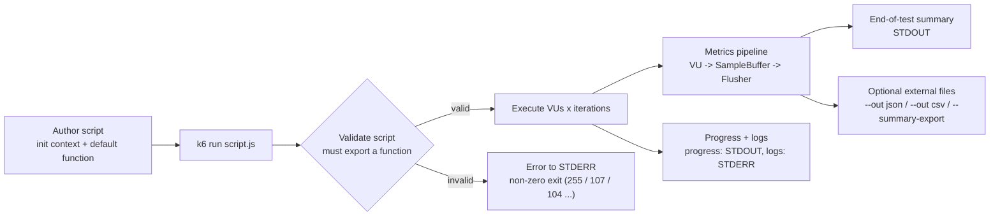

# Understanding Grafana k6 — Behavior, Reporting, and Validation (k6 v0.55.0)

This document authoritatively explains how the **Grafana k6** load-testing tool behaves —
how you author and run a script, what k6 reports back, and the metrics, units, protocols,
commands, environment variables, external files, and validation logic involved. It answers
seven discrete questions (Q1–Q7), each grounded in the tool's own source code and confirmed
by running a binary built from that source.

> **Analyzed version (pinned):** **k6 v0.55.0**, commit **`ddc3b0b1d2`**.
> Source-of-truth: `const Version = "0.55.0"` [lib/consts/consts.go:L12]. The binary built and
> run during this analysis reports `k6 v0.55.0 (commit/ddc3b0b1d2, go1.23.10, linux/amd64)`.
> All claims are scoped to this version; behavior in other releases may differ.

---

## Scope & Methodology

**Code-as-truth + empirical verification.** Every behavioral claim in this document is derived
from the k6 source code (cited inline) **and** corroborated by an empirical observation from a
real run of the built `k6 v0.55.0` binary. Where the two could appear to diverge, the source
code and the observed behavior of the built binary are the authority; the official Grafana k6
documentation was consulted only to *corroborate*, never to replace, source-derived facts.

**How to read the citations.** Claims carry an inline citation of the form
`[<path>:<locator>]`, e.g. `[metrics/builtin.go:L78-L110]`. The path is relative to the k6
repository root; the locator is a line or line-range in that file at the analyzed commit. The
k6 source tree was treated as **read-only**: it was inspected and cited, never modified.

**Numbers are illustrative.** Run-specific values — durations, byte counts, per-second rates,
and timestamps — vary from run to run and from host to host. Wherever a concrete number
appears, treat it as an **illustrative/observed** value from one run, not a fixed guarantee.
The *shape* of the output (which metrics, which units, which columns/keys) is stable and is
what the citations pin down.

**How the evidence was gathered.** The binary was built offline from the checked-in vendored
dependency tree (`GOFLAGS=-mod=vendor`) and exercised against (a) a local, non-redirecting
plain-HTTP endpoint and (b) the public HTTPS endpoint `https://test-api.k6.io/`. The
`--out json`, `--out csv`, and `--summary-export` outputs were captured, environment-variable
semantics were probed, and deliberately malformed scripts were run to observe validation and
exit codes. Any experiment script lived outside the repository and was removed afterward.

### The k6 lifecycle at a glance



---

## Q1 — How you author and run a k6 script

**Answer.** A k6 script has a **two-stage lifecycle**:

1. **Init context** — the module/top-level scope of the file. Code here runs **once per VU**
   when the script is loaded: `import` statements, file/data loading, and option declarations
   (`export const options = {...}`). The init context is *restricted* — notably, network calls
   such as `http.get(...)` are **not** allowed there (see Q7).
2. **An exported function** — most commonly the **`default`** export (named exports are used by
   scenarios). This function runs **once per iteration**, repeatedly, by each virtual user (VU).
   It is the *measured unit of work* that generates load.

You then execute the script with the **`k6 run`** command.

**Evidence.** The canonical minimal script ships in the repository as `examples/http_get.js`
[examples/http_get.js:L1-L5]:

```js
import http from 'k6/http';

export default function () {
  http.get('https://test-api.k6.io/');
};
```

Here the `import http from 'k6/http';` line (module scope) is the **init context**, and the body
of `export default function () { ... }` is the **per-iteration** VU logic.

**Lifecycle anchors (how the engine realizes the two stages).** Each virtual user gets its own
JavaScript runtime, so the init context runs **once per VU**: for every new VU the runner
instantiates a fresh bundle [js/runner.go:L124-L129], `Instantiate` builds a per-VU Sobek runtime
[js/bundle.go:L244-L257], and the script's top-level/module source is executed once in that
runtime via the event loop [js/bundle.go:L320-L347]. Thereafter the configured export is called
**once per iteration**: `ActiveVU.RunOnce()` looks up the export and invokes it exactly one time
per iteration [js/runner.go:L723-L773]. The export that gets called defaults to `default` when a
scenario does not name one — `GetExec()` falls back to `consts.DefaultFn` if no custom `exec` is
set [lib/executor/base_config.go:L107-L113] — and k6 validates up front that the named export
actually exists in the script, erroring `function '<name>' not found in exports` otherwise
[cmd/config.go:L284-L288].

k6 can also scaffold a starter script with **`k6 new`** (command `Use: "new"`,
`Short: "Create and initialize a new k6 script"`), which writes to the default file name
`script.js` and **"will not overwrite existing files"** [cmd/new.go:L15,L151-L159]. The generated
template demonstrates the same `options`-in-init + default-function pattern — it imports
`k6/http` and `{ sleep }`, declares `export const options = { vus: 10, duration: '30s', ... }`,
and defines `export default function () { http.get('https://test.k6.io'); sleep(1); }`
[cmd/new.go:L18-L75].

The `run` command itself is defined with `Use: "run"`, `Short: "Start a test"`, and
`Long: "Start a test. This also exposes a REST API to interact with it..."`
[cmd/run.go:L491-L494]; it requires **exactly one argument** — a path to a script file, or `-`
to read the script from STDIN [cmd/run.go:L498].

**Rationale (thinking).** Why two stages? The init context exists to prepare per-VU state
*cheaply and deterministically* before measurement begins, which is why it is deliberately
restricted (no network I/O — k6 rejects an `http.get()` in init; see Q7). The exported function
is the thing k6 actually times and repeats to produce load, so it must be a callable export. The
`default` export is the conventional entry point, and k6 *requires* at least one callable export
or it refuses to run — the validation rule examined in Q7 (`"no exported functions in script"`
[js/bundle.go:L238]).

**Verified output.** Running the minimal pattern exactly once produces a normal end-of-test
summary in which `http_reqs` and `iterations` are each `1` (full summary reproduced in the
Appendix). Observed, against a local non-redirecting endpoint:

```text
     http_reqs......................: 1     1185.601112/s
     iterations.....................: 1     1185.601112/s
```

---

## Q3 — Testing a single HTTP request

**Answer.** To understand baseline behavior, run the three-line `examples/http_get.js` exactly
**once** — one virtual user, one iteration:

```bash
k6 run --vus 1 --iterations 1 examples/http_get.js
```

The script is the same minimal pattern from Q1 [examples/http_get.js:L1-L5]:

```js
import http from 'k6/http';

export default function () {
  http.get('https://test-api.k6.io/');
};
```

**Evidence.** `--vus 1` requests a single VU (this is also the default — see Q5) and
`--iterations 1` caps the total iterations across all VUs at one
(`-i, --iterations int  script total iteration limit (among all VUs)`). Together they force
exactly **one** execution of the `default` function, i.e. a single `http.get(...)`. The
`k6 run` command accepts the script path as its single positional argument [cmd/run.go:L491,L498].

**Rationale (thinking).** Pinning the run to one VU and one iteration removes concurrency and
repetition noise, so the operator can read the per-request timing breakdown (the `http_req_*`
Trend family — see Q4) for a *single* request rather than an aggregate over many. It is the
cleanest way to establish a baseline before scaling up with more VUs or a longer duration.

**Verified output.** Against a **local, non-redirecting** plain-HTTP endpoint, a single GET
produced exactly one request and one iteration (`http_reqs: 1`, `iterations: 1`; full summary in
the Appendix).

> **Observed nuance — redirects count as additional requests.** k6 follows HTTP redirects by
> default (`--max-redirects int  follow at most n redirects (default 10)`). So a single
> `http.get()` to a **redirecting** URL can report **more than one** `http_reqs`. Observed: the
> public `https://test-api.k6.io/` returned `302` and k6 followed the redirect, yielding
> `http_reqs: 2`, whereas the local non-redirecting endpoint produced exactly `http_reqs: 1`.
> These counts are observed behavior for those specific endpoints.

---

## Q5 — The exact command to execute a script

**Answer.** The command is:

```bash
k6 run <script.js>
```

It is defined by `Use: "run"` [cmd/run.go:L491] and takes a single positional argument: the path
to the script, or `-` to read the script from STDIN [cmd/run.go:L498]. The load model and outputs
are controlled through flags.

**Evidence.** The principal flags below are reproduced **verbatim from `k6 run --help`** of the
built binary (names, short forms, and descriptions are exactly as printed):

| Flag | Meaning (verbatim from `--help`) |
|------|----------------------------------|
| `-u, --vus int` | number of virtual users (**default 1**) |
| `-i, --iterations int` | script total iteration limit (among all VUs) |
| `-d, --duration duration` | test duration limit |
| `-s, --stage stage` | add a stage, as `[duration]:[target]` |
| `-o, --out uri` | uri for an external metrics database (may be repeated for multiple outputs) |
| `-e, --env VAR=value` | add/override environment variable with `VAR=value` (sets `__ENV`, **not** k6 options — see Q6) |
| `-p, --paused` | start the test in a paused state |
| `--rps int` | limit requests per second |
| `--tag tag` | add a tag to be applied to all samples, as `[name]=[value]` |
| `--max-redirects int` | follow at most n redirects (default 10) |
| `--compatibility-mode string` | JavaScript compiler compatibility mode, `"extended"` or `"base"` or `"experimental_enhanced"` (default `extended`) |
| `--no-summary` | don't show the summary at the end of the test |
| `--no-thresholds` | don't run thresholds |
| `--summary-export string` | output the end-of-test summary report to JSON file |
| `--summary-time-unit string` | define the time unit used to display the trend stats. Possible units are: `s`, `ms` and `us` |

The command also ships a set of example invocations in its own help text, defined as the
`Example` field of the `run` cobra command [cmd/run.go:L471-L488]. Those examples are reproduced
**verbatim** — together with the observed nuance that two of them omit the script argument — in
**Verified output (observed)** below.

**Rationale (thinking).** `k6 run` deliberately takes a *single* script argument and exposes the
entire load model through flags rather than through the script alone, so the same script can be
driven differently in different environments. Flags override the script's exported `options`
(the precedence chain is detailed in Q6). The `-o/--out` flag is repeatable — k6 can stream to
several external outputs simultaneously (verified by passing `--out json=...` and `--out csv=...`
together in one run, which produced both files).

**Verified output (observed).** `./k6 run --help` on the built `k6 v0.55.0` binary prints the
following **Examples** block (reproduced verbatim, exactly as the binary emits it):

```text
Examples:
  # Run a single VU, once.
  k6 run script.js

  # Run a single VU, 10 times.
  k6 run -i 10 script.js

  # Run 5 VUs, splitting 10 iterations between them.
  k6 run -u 5 -i 10 script.js

  # Run 5 VUs for 10s.
  k6 run -u 5 -d 10s script.js

  # Ramp VUs from 0 to 100 over 10s, stay there for 60s, then 10s down to 0.
  k6 run -u 0 -s 10s:100 -s 60s:100 -s 10s:0

  # Send metrics to an influxdb server
  k6 run -o influxdb=http://1.2.3.4:8086/k6
```

Note that, **as printed in the help text**, the last two examples (the ramping `-s` example and
the InfluxDB `-o` example) omit the trailing script path. Because `k6 run` requires exactly one
positional argument [cmd/run.go:L498], a real invocation must add one — e.g.
`k6 run -u 0 -s 10s:100 -s 60s:100 -s 10s:0 script.js` or
`k6 run -o influxdb=http://1.2.3.4:8086/k6 script.js`. This was confirmed empirically: running
`k6 run` with no argument failed with
`accepts 1 arg(s), received 0: arg should either be "-", if reading script from stdin, or a path to a script file`.

---


## Q2 — What k6 reports back

**Answer.** When a test runs, k6 prints, in order:

1. An ASCII **"Grafana k6" banner**.
2. An **execution-description block** with three labels: `execution`, `script`, `output`.
3. A **scenarios** line summarizing the configured load.
4. A live **progress bar/line** while the test runs.
5. At completion, the **end-of-test summary** — an optional checks tree (with `✓`/`✗` marks) and
   a metrics table.

Separately, **logs** — both the script's own `console.log/info/warn/error` and k6's internal
info/warn/error messages — are written to **STDERR**.

> **Critical routing fact.** The banner, the execution block, the progress bar, **and** the
> end-of-test summary all go to **STDOUT**; only **logs** go to **STDERR**. This is verified by
> both the source and an empirical run. (A common simplification claims the summary goes to
> STDERR — it does not.)

**Evidence.**

- **Banner → STDOUT.** `Banner()` returns the five-line ASCII "Grafana k6" logo
  [lib/consts/consts.go:L55-L66]; `printBanner` writes it to `gs.Stdout` and is skipped under
  `--quiet` [cmd/ui.go:L58-L64]; it is invoked at the start of a run [cmd/run.go:L68]. The version
  string comes from `const Version = "0.55.0"` [lib/consts/consts.go:L12] and is rendered in full
  by `FullVersion()` as `v0.55.0 (commit/ddc3b0b1d2, go1.23.10, linux/amd64)`
  [lib/consts/consts.go:L16].
- **Execution block & progress bar → STDOUT.** `printExecutionDescription` builds the
  `execution` / `script` / `output` block and writes it to STDOUT
  [cmd/ui.go:L100,L108-L134,L163]; `printBar` writes the progress bar to STDOUT — in a TTY it
  rewrites the same line using the `\x1b[0K\r` escape, in a non-TTY it appends lines
  [cmd/ui.go:L70-L90].
- **Logs → STDERR.** k6's default logrus logger is constructed with `Out: stderr`
  [cmd/state/state.go:L86-L87]; the script's `console.log/info/warn/error` route through that
  logger tagged with the field `source=console` [js/console.go:L18-L19].
- **Summary plumbing.** Summary/threshold processing is gated:
  `shouldProcessMetrics = (!NoSummary || !NoThresholds)` [cmd/run.go:L177-L178]. Unless
  `--no-summary` is set, the runner's `HandleSummary(...)` produces the report, which is written
  by `handleSummaryResult(c.gs.FS, c.gs.Stdout, c.gs.Stderr, summaryResult)` [cmd/run.go:L206].
  The result is a `map[path]io.Reader` whose keys are routed by `getWriter`: `"stdout"` → STDOUT,
  `"stderr"` → STDERR, and any other key → a file opened on disk [cmd/run.go:L508-L519].
- **`handleSummary()` customization hook.** `HandleSummary` first builds a summary data object
  via `summarizeMetricsToObject` [js/runner.go:L352-L353; js/summary.go:L62]. If the script
  exports a `handleSummary` function, it is invoked with that data — and it **must** be a
  function, or k6 errors `exported identifier handleSummary must be a function`
  [js/runner.go:L379-L381]. Otherwise the default renderer runs: `generateTextSummary`, exported
  as `textSummary` [js/summary.js:L384,L413], which renders the checks tree (`✓`/`✗`
  [js/summary.js:L22-L23]) and the metrics table. A custom `handleSummary()` must return a map
  keyed by destination (`"stdout"`, a filename, etc.), consumed by `getSummaryResult`
  [js/summary.go:L141]; the `--summary-export` path is threaded in via
  `RuntimeOptions.SummaryExport` [js/runner.go:L403].

**Rationale (thinking).** Keeping logs on STDERR while the summary stays on STDOUT means the
machine-readable report can be piped/redirected cleanly without log noise contaminating it
(`k6 run script.js > summary.txt` keeps logs visible on the terminal via STDERR). The
`handleSummary()` hook exists so users can *replace or redirect* the report — emitting JSON,
HTML, or JUnit, or writing to multiple files — while the built-in default still gives a
human-friendly checks tree and metrics table out of the box.

**Verified output.** The Appendix reproduces a real single-GET end-of-test summary captured from
STDOUT (banner + execution block + scenarios + metrics table). Empirically, a script that calls
`console.log('MYVAR=' + __ENV.MYVAR)` emitted the line on **STDERR**, formatted by the logrus
text formatter as:

```text
time="2026-06-26T20:56:46Z" level=info msg="MYVAR=hello" source=console
```

while the banner and summary appeared on **STDOUT** — exactly the routing the code prescribes.

---


## Q4 — Output anatomy: metrics, units, and protocols

This section covers four things: the **metric type system**, the **value-type/unit system**, the
**built-in metrics catalog**, and how **protocols** are surfaced.

### 4a. Metric types

k6 has four metric types [metrics/metric_type.go:L9-L14]:

| Type | Behavior | JSON form |
|------|----------|-----------|
| **Counter** | sums its data points | `counter` |
| **Gauge** | keeps/displays the latest value | `gauge` |
| **Trend** | collects statistics (min/max/avg/med/percentiles) | `trend` |
| **Rate** | the percentage of values that are non-zero | `rate` |

The source comments are explicit: `Counter` "sums its data points", `Gauge` "displays the latest
value", `Trend` "min/max/avg/med are interesting", and `Rate` "displays % of values that aren't
0" [metrics/metric_type.go:L10-L13]. The lowercase JSON string forms are defined alongside
[metrics/metric_type.go:L20-L23].

### 4b. Value types / units

Each metric also has a **value type** that fixes its unit [metrics/value_type.go:L6-L10]:

| Value type | Unit | JSON `contains` form |
|------------|------|----------------------|
| **Default** | values presented as-is (e.g. a count or a percentage) | `default` |
| **Time** | durations, in **milliseconds** | `time` |
| **Data** | amounts, in **bytes** | `data` |

The source comments read: `Default` "Values are presented as-is", `Time` "Values are time
durations (milliseconds)", `Data` "Values are data amounts (bytes)" [metrics/value_type.go:L7-L9].
The time base unit is `const timeUnit = time.Millisecond`, and durations are emitted as
`float64(d) / float64(timeUnit)` — i.e. **milliseconds** [metrics/units.go:L7,L11-L13]. The
`contains` JSON forms (`default`/`time`/`data`) are defined in [metrics/metric_type.go:L25-L27].

> **Display vs. emitted value.** In the *human* end-of-test summary, time metrics are shown in
> the most appropriate unit (µs/ms/s) automatically — e.g. `508.64µs` for a fast local request,
> `16.78ms` for a public one (both observed). In the *machine* outputs (JSON / CSV /
> summary-export) the numeric value for a time metric is in **milliseconds**. The
> `--summary-time-unit` flag (`s`/`ms`/`us`) can force a single display unit in the summary.

### 4c. Built-in metrics catalog

The built-in metric **names** are declared in [metrics/builtin.go:L6-L35] and **registered** with
their type (and value type, where applicable) in `RegisterBuiltinMetrics`
[metrics/builtin.go:L78-L110]. The TYPE and UNIT columns below are taken directly from those
`MustNewMetric(...)` registration calls.

| Metric | Type | Value type / unit | Notes |
|--------|------|-------------------|-------|
| `vus` | Gauge | Default (count) | current active VUs |
| `vus_max` | Gauge | Default (count) | max VUs allocated |
| `iterations` | Counter | Default (count) | completed iterations |
| `iteration_duration` | Trend | Time (ms) | full iteration time |
| `dropped_iterations` | Counter | Default (count) | iterations that never started |
| `checks` | Rate | Default (%) | passing-check ratio |
| `group_duration` | Trend | Time (ms) | per-group time |
| `http_reqs` | Counter | Default (count) | total HTTP requests |
| `http_req_failed` | Rate | Default (%) | failed-request ratio |
| `http_req_duration` | Trend | Time (ms) | end-to-end request time |
| `http_req_blocked` | Trend | Time (ms) | time blocked before the request |
| `http_req_connecting` | Trend | Time (ms) | TCP connect time |
| `http_req_tls_handshaking` | Trend | Time (ms) | TLS handshake time |
| `http_req_sending` | Trend | Time (ms) | time spent sending data |
| `http_req_waiting` | Trend | Time (ms) | TTFB (waiting) |
| `http_req_receiving` | Trend | Time (ms) | time spent receiving data |
| `data_sent` | Counter | Data (bytes) | bytes sent |
| `data_received` | Counter | Data (bytes) | bytes received |

> **Protocol-specific built-ins.** A WebSocket family (`ws_sessions`, `ws_msgs_sent`,
> `ws_msgs_received`, `ws_ping`, `ws_session_duration`, `ws_connecting`) and a gRPC metric
> (`grpc_req_duration`, a Trend in ms) are also registered [metrics/builtin.go:L24-L31,L97-L107],
> but they are only *emitted* when those protocols are actually used; a plain HTTP test will not
> show them.

**Tying the catalog to the observed summary.** In the verified single-GET summary (Appendix):
every `http_req_*` Trend prints `avg/min/med/max/p(90)/p(95)`; `http_req_failed` (a Rate) prints
as a percentage plus a count, `0.00% 0 out of 1`; `http_reqs` and `iterations` (Counters) each
print a total plus a per-second rate, e.g. `1     1185.601112/s`; and `data_sent`/`data_received`
(Data Counters) print byte amounts plus a per-second throughput, e.g. `172 B 204 kB/s`. These
column shapes follow directly from each metric's type and value type above.

### 4d. Protocols

**Answer.** Protocols are **not** separate metrics. They are surfaced as **system tags** attached
to each sample: chiefly `proto`, `subproto`, and `tls_version`. These tag constants are declared
in [metrics/system_tag.go:L21-L31] (`TagProto`, `TagSubproto`, `TagTLSVersion`, …) and are part of
the **default** system-tag set that k6 emits without any extra configuration
[metrics/system_tag.go:L47-L49]; their lowercase string names (`proto`, `subproto`, `tls_version`,
…) are produced by the generated mapping [metrics/system_tag_gen.go:L9-L25]. The same tag names
appear as **CSV columns** and inside the JSON `tags` object (see Q7 and the Appendix).

**Evidence + verified contrast (observed).** Running the same one-line GET against two endpoints
made the protocol surface visible through these tags:

- **Local plain-HTTP endpoint** → `proto: HTTP/1.0`, **no** `tls_version` tag, and
  `http_req_tls_handshaking` of `0s` (no TLS occurred).
- **Public HTTPS `https://test-api.k6.io/`** → `proto: HTTP/2.0`, `tls_version: tls1.3`, and a
  non-zero TLS handshake time (observed `avg=18.44ms`).

These tags are populated by the protocol code itself: for HTTP, the transport sets `proto` from
the response's protocol and `tls_version` from the negotiated TLS connection state
[lib/netext/httpext/transport.go:L118-L123]; for WebSockets, the `ws` module sets `subproto` from
the negotiated `Sec-WebSocket-Protocol` response header [js/modules/k6/ws/ws.go:L287-L289]. For
example, a JSON Point row from the public run carried `"proto":"HTTP/2.0"`,
`"tls_version":"tls1.3"`, and `"status":"302"` in its `tags` (the full row is reproduced in the
Appendix, section **E**).

**Rationale (thinking).** Because the timing breakdown (the `http_req_*` Trends) and the protocol
identity live on the **same sample's tags**, an operator can see, for each request, both *how
fast* it was and *over which protocol and TLS version* it happened — without any extra
configuration. Tagging (rather than minting separate per-protocol metrics) also keeps the metric
catalog small and lets the same `http_req_duration` Trend describe HTTP/1.1, HTTP/2, and beyond.

**Verified output (observed).** A single real run ties the whole catalog together. Against the
**local** plain-HTTP endpoint, the summary rendered every `http_req_*` **Trend** as
`avg/min/med/max/p(90)/p(95)` (in µs for that fast local request), `http_req_failed` (a **Rate**)
as `0.00% 0 out of 1`, `http_reqs`/`iterations` (**Counters**) as a count plus a per-second rate,
and `data_sent`/`data_received` (**Data** Counters) as byte amounts plus throughput — every sample
tagged `proto: HTTP/1.0` with no `tls_version` (full summary: **Appendix A**; JSON `Metric`
envelope and local `Point`/CSV rows: **Appendix B–D**). Against `https://test-api.k6.io/` the same
**Time** metrics rendered in **milliseconds** (observed `http_req_duration avg=16.84ms`),
`http_req_tls_handshaking` was non-zero (observed `avg=18.44ms`), and each sample carried
`proto: HTTP/2.0` and `tls_version: tls1.3` (full JSON `Point` row: **Appendix E**). The column
shapes and units follow directly from each metric's **type** and **value type** tabulated above.

---


## Q6 — Configuration & environment variables

**Answer.** **No configuration is required** for a basic run. With no flags and no exported
`options`, k6 runs **1 VU for 1 iteration** — the `--vus` default is `1`
(`-u, --vus int  number of virtual users (default 1)`), and the run scaffolds a single
default-scenario iteration. Everything else is **optional**, supplied via exported `options`, CLI
flags, a config file, or environment variables.

There are **two distinct kinds** of environment variables, and conflating them is the most common
mistake:

1. **`-e/--env VAR=value`** — adds (or overrides) a variable in the script's **`__ENV`** object. It
   does **not** set any k6 option. The flag is parsed via `flags.GetStringArray("env")` and written
   into **`RuntimeOptions.Env`** [cmd/runtime_options.go:L120-L132]; for `k6 run` that map is first
   seeded with the real system environment — because `--include-system-env-vars` defaults to `true`
   for the run command [cmd/run.go:L441; cmd/runtime_options.go:L116-L118] — and the `-e` values are
   then layered on top. `RuntimeOptions.Env` is what populates `__ENV`: when each VU's JavaScript
   runtime is set up, k6 copies `RuntimeOptions.Env` into the `__ENV` object [js/bundle.go:L382-L386],
   and at scenario activation any scenario-specific env vars are overlaid before the iteration runs
   [js/runner.go:L653-L662]. (Separately, the `LookupEnv` closure over `gs.Env` in
   [cmd/test_load.go:L77-L80] exposes the *real* process environment for direct lookups — e.g. k6
   reads `GODEBUG` through it [js/runner.go:L256-L259] — and is **not** the `-e`/`__ENV` path.)
2. **`K6_`-prefixed variables** — *are* evaluated as k6 **configuration** (options), via
   `envconfig` struct tags on the options/runtime types.

**Evidence — the `K6_*` option family.** Core load/reporting options carry `K6_` `envconfig` tags
[lib/options.go]:

| Env var | Sets option | Source |
|---------|-------------|--------|
| `K6_VUS` | vus | [lib/options.go:L234] |
| `K6_DURATION` | duration | [lib/options.go:L235] |
| `K6_ITERATIONS` | iterations | [lib/options.go:L236] |
| `K6_STAGES` | stages | [lib/options.go:L237] |
| `K6_RPS` | rps | [lib/options.go:L256] |
| `K6_PAUSED` | paused | [lib/options.go:L230] |
| `K6_THRESHOLDS` | thresholds | [lib/options.go:L288] |
| `K6_SUMMARY_TREND_STATS` | summary trend stats | [lib/options.go:L320] |
| `K6_SUMMARY_TIME_UNIT` | summary time unit | [lib/options.go:L323] |
| `K6_SYSTEM_TAGS` | system tags | [lib/options.go:L327] |

A second family of **runtime** options is read in `getRuntimeOptions`
[cmd/runtime_options.go:L75-L117]: `K6_TYPE` [L75], `K6_COMPATIBILITY_MODE` [L79],
`K6_INCLUDE_SYSTEM_ENV_VARS` [L88], `K6_NO_THRESHOLDS` [L91], `K6_NO_SUMMARY` [L94],
`K6_SUMMARY_EXPORT` [L98], and `K6_TRACES_OUTPUT` [L110].

**Evidence — precedence.** From lowest to highest priority:
**default → config file → exported script `options` → environment variable → CLI flag.** The
general consolidation order is implemented (and documented in its own comments) in
`getConsolidatedConfig` [cmd/config.go:L180-L204]: it starts from the CLI-provided shadow defaults,
applies the global file config, then the runner/script `options`, then the environment-variable
config, and finally re-applies the user-supplied CLI flags on top to give them the highest
priority (`conf = conf.Apply(envConf).Apply(cliConf)`), before filling in defaults. For the
runtime-option subset specifically, each environment read applies only *"if not explicitly set via
the CLI flag"* [cmd/runtime_options.go:L54,L76,L80], so a CLI flag always wins over the matching
`K6_*` variable.

**Rationale (thinking).** The `-e` vs `K6_` split is deliberate: `-e/--env` carries
*script-author data* (feature flags, target hostnames, credentials for the system under test),
while `K6_*` carries *k6 engine configuration* (how many VUs, how long, which outputs). Keeping
them separate means a CI system can tune the load (via `K6_*` or flags) without touching the
script's own variables, and vice-versa. The layered precedence lets a script ship sensible
`options` defaults that CI can still override per-run without editing the file.

**Verified behavior (observed).**

```text
# (1) -e injects __ENV (not options):
$ k6 run --vus 1 --iterations 1 -e MYVAR=hello probe.js
time="..." level=info msg="MYVAR=hello" source=console      # __ENV.MYVAR === "hello"

# (2) K6_ variables ARE configuration:
$ K6_VUS=2 K6_ITERATIONS=4 k6 run script.js
scenarios: (100.00%) 1 scenario, 2 max VUs, ...
         * default: 4 iterations shared among 2 VUs (...)

# (3) Precedence — CLI flag beats the env var:
$ K6_VUS=9 k6 run --vus 1 --iterations 1 script.js
scenarios: (100.00%) 1 scenario, 1 max VUs, ...            # 1 VU, not 9

# (4) A runtime K6_ option suppresses the summary:
$ K6_NO_SUMMARY=true k6 run --vus 1 --iterations 1 script.js
# banner still prints, but the metrics table is omitted
```

---


## Q7 — External files and script validation

**Answer.** By default k6 generates **no** external files — results go to the STDOUT summary only.
External files are produced solely on request, via three flags: `--out json[=file]`,
`--out csv[=file]`, and `--summary-export=file` (detailed in **7a**). Separately, k6 enforces a
**primary validation rule** before a run: the script must export at least one callable function,
or k6 refuses to start; other validation and abort outcomes map to a small family of exit codes
(detailed in **7b**).

**Evidence.** The external-file writers live under `output/` — JSON [output/json/json.go] and CSV
[output/csv/output.go] — and the summary-export path is threaded through
`RuntimeOptions.SummaryExport` [js/runner.go:L403]. The export-at-least-one-function rule is in
`populateExports`, which returns `"no exported functions in script"` when none are callable
[js/bundle.go:L188,L238], and the validation/abort exit codes are the constants in
[errext/exitcodes/codes.go:L10-L55]. The specifics and per-claim citations follow in 7a and 7b.

### 7a. External files (all optional)

By default k6 writes **no** files — it prints the summary to STDOUT. Files are produced only when
you ask for them:

- **`--out json[=file]`** — newline-delimited JSON. The package documents itself as
  "a json file. Actually a multi line json file." [output/json/json.go:L1-L2]; records are
  flushed every 200ms (`const flushPeriod = 200 * time.Millisecond` [output/json/json.go:L21]).
  Output goes to STDOUT when no filename (or `-`) is given, else to the file; a filename ending
  in `.gz` is gzip-compressed [output/json/json.go:L54,L77-L78]. There are **two record kinds**:
  - a **Metric envelope** — `{"type":"Metric","data":{"name","type","contains","thresholds","submetrics"},"metric":NAME}` — emitted once per metric to declare its type and unit;
  - **Point** rows — `{"metric":NAME,"type":"Point","data":{"time":<RFC3339>,"value":<float>,"tags":{...}}}` — one per sample; for time metrics the `value` is in **milliseconds**.
- **`--out csv[=file]`** — CSV with a default filename of `file.csv`, a 1-second save interval, and
  `unix` time format [output/csv/config.go:L41-L43]; the filename, interval, and time format are
  also settable via `K6_CSV_FILENAME` / `K6_CSV_SAVE_INTERVAL` / `K6_CSV_TIME_FORMAT`
  [output/csv/config.go:L18-L20]. Output goes to STDOUT when empty/`-`, and a `.gz` filename is
  gzipped [output/csv/output.go:L68,L99-L100]. The header is built by `MakeHeader` as
  `["metric_name","timestamp","metric_value"]` + the resolved system tags + `"extra_tags"` +
  `"metadata"` [output/csv/output.go:L209-L212], which produced the verified **19-column** header
  in the Appendix.
- **`--summary-export=file`** — writes the end-of-test summary as a single JSON object with
  top-level keys `root_group` and `metrics`, where each metric is a stats object (a Trend becomes
  `{avg,min,med,max,p(90),p(95)}`). It is threaded through `RuntimeOptions.SummaryExport`
  [js/runner.go:L403] and can also be set with `K6_SUMMARY_EXPORT` [cmd/runtime_options.go:L98].

> `--out` is **repeatable**, so several outputs can run simultaneously, and other backends exist
> (InfluxDB, Grafana Cloud, etc.). Those are out of core scope here.

### 7b. Script validation & exit codes

**Primary validation rule.** A script must export at least one callable function. During bundling,
`populateExports` collects the exported functions and, if none are callable, returns the error
**`"no exported functions in script"`** [js/bundle.go:L188,L238]. Additionally, an exported
`setup` or `teardown` must be a function (`exported 'setup' must be a function` /
`exported 'teardown' must be a function`) [js/bundle.go:L224,L227], and a malformed exported
`options` object maps to the `InvalidConfig` (104) exit code [js/bundle.go:L215].

**Exit codes** are defined as constants [errext/exitcodes/codes.go:L10-L55]:

| Code | Constant | Meaning |
|------|----------|---------|
| 97 | `CloudTestRunFailed` | cloud test run failed |
| 98 | `CloudFailedToGetProgress` | cloud progress sync failed |
| **99** | `ThresholdsHaveFailed` | one or more thresholds failed |
| 100 | `SetupTimeout` | `setup()` timed out |
| 101 | `TeardownTimeout` | `teardown()` timed out |
| 102 | `GenericTimeout` | unspecified timeout |
| 103 | `ScriptStoppedFromRESTAPI` | stopped via the REST API |
| 104 | `InvalidConfig` | invalid configuration |
| 105 | `ExternalAbort` | aborted by a signal (SIGINT/SIGTERM) |
| 106 | `CannotStartRESTAPI` | REST API could not start |
| **107** | `ScriptException` | exception thrown during the script |
| 108 | `ScriptAborted` | aborted via `test.abort()` |
| 109 | `GoPanic` | aborted by a Go runtime panic |

**Verified validation/exit behavior (observed).**

| Scenario | Exit | Observed message |
|----------|------|------------------|
| No exported function (or empty file) | **255** | `could not load JS test '...': no exported functions in script` |
| Syntax error in the script | **107** | `GoError: ... Unexpected identifier`, `hint="script exception"` |
| `http.get()` in the **init context** | **107** | `GoError: Making http requests in the init context is not supported`, `hint="script exception"` |
| A failing threshold | **99** | `thresholds on metrics 'http_req_duration' have been crossed` |

> **Why 255 and not a 9x code for the missing-export case?** That error is raised before any
> exit-code hint is attached, so it does not carry one of the `97`–`109` constants above and
> falls through to the generic process-failure code **255**. The syntax-error and
> init-context-HTTP cases *do* carry the `ScriptException` hint and therefore exit **107**. The
> init-context-HTTP result ties directly back to Q1: network calls are disallowed in the init
> context, and attempting one is treated as a script exception.

**Rationale (thinking).** Distinct exit codes let a CI pipeline distinguish *test failures*
(99 — a threshold was crossed, i.e. the system under test missed its SLO) from *script defects*
(107/255 — the script is broken or malformed) from *operational aborts* (105 — someone sent
SIGINT). That separation is what lets a pipeline "fail the build on a crossed threshold" while
treating a `Ctrl-C` differently from a genuine performance regression.

**Verified output (observed).** All four external artifacts were produced and inspected from real
runs: a JSON **`Metric` envelope** (`{"type":"Metric",…,"contains":"time",…}`, **Appendix B**),
JSON **`Point`** rows (one per sample, time values in milliseconds — **Appendix C** local and
**Appendix E** public), the CSV **19-column header**
`metric_name,timestamp,metric_value,…,extra_tags,metadata` (**Appendix D**), and a
`--summary-export` JSON object whose top-level keys were observed to be exactly
`["metrics","root_group"]` (each Trend a `{avg,min,med,max,p(90),p(95)}` stats object). The
validation/exit behavior was re-confirmed empirically: a script with no exported function exited
**255** (`no exported functions in script`), a syntax error exited **107**, an `http.get()` in the
init context exited **107** (`Making http requests in the init context is not supported`), and a
crossed threshold exited **99** (`thresholds on metrics 'http_req_duration' have been crossed`).

---


## Conclusion

The k6 lifecycle is consistent end-to-end: you **author** a script with a one-time *init context*
plus a per-iteration *default* (or named) function [examples/http_get.js:L1-L5]; you **run** it
with `k6 run <script.js>` [cmd/run.go:L491]; k6 first **validates** the script (it must export a
callable function, or it refuses to run [js/bundle.go:L238]); it then **executes** the configured
VUs × iterations, defaulting to 1 VU and 1 iteration when nothing is specified. As it runs, k6
reports the **banner, execution block, progress, and end-of-test summary on STDOUT** while sending
**logs to STDERR** [cmd/ui.go:L58-L90; cmd/state/state.go:L86-L87], rendering each built-in metric
according to its type (Counter/Gauge/Trend/Rate [metrics/metric_type.go:L9-L14]) and unit
(Default/Time=ms/Data=bytes [metrics/value_type.go:L6-L10]), with protocols surfaced as the
`proto`/`tls_version` system tags. Configuration is entirely optional — split between
script-facing `-e/--env` variables and engine-facing `K6_*` options, with CLI flags taking
precedence [cmd/runtime_options.go:L54]. Optional external files (`--out json`, `--out csv`,
`--summary-export`) capture machine-readable results, and a small family of exit codes
[errext/exitcodes/codes.go:L10-L55] lets automation tell a crossed threshold (99) apart from a
broken script (107/255). Every statement here was taken from the **k6 v0.55.0** source (commit
`ddc3b0b1d2`) and confirmed by running the binary built from it; the numeric values shown are
illustrative observations from individual runs.

---

## Appendix — Verbatim evidence

These are **real** outputs from the built `k6 v0.55.0 (commit/ddc3b0b1d2, go1.23.10, linux/amd64)`.
Numbers (durations, byte counts, rates, timestamps) are **illustrative/observed** and vary per run.

**A) Canonical single-GET end-of-test summary** — `k6 run --vus 1 --iterations 1` against a local,
non-redirecting plain-HTTP endpoint; captured from **STDOUT**:

```text
         /\      Grafana   /‾‾/  
    /\  /  \     |\  __   /  /   
   /  \/    \    | |/ /  /   ‾‾\ 
  /          \   |   (  |  (‾)  |
 / __________ \  |_|\_\  \_____/ 

     execution: local
        script: single_get_local.js
        output: -

     scenarios: (100.00%) 1 scenario, 1 max VUs, 10m30s max duration (incl. graceful stop):
              * default: 1 iterations shared among 1 VUs (maxDuration: 10m0s, gracefulStop: 30s)


     data_received..................: 172 B 204 kB/s
     data_sent......................: 80 B  95 kB/s
     http_req_blocked...............: avg=183.03µs min=183.03µs med=183.03µs max=183.03µs p(90)=183.03µs p(95)=183.03µs
     http_req_connecting............: avg=123.61µs min=123.61µs med=123.61µs max=123.61µs p(90)=123.61µs p(95)=123.61µs
     http_req_duration..............: avg=361.49µs min=361.49µs med=361.49µs max=361.49µs p(90)=361.49µs p(95)=361.49µs
       { expected_response:true }...: avg=361.49µs min=361.49µs med=361.49µs max=361.49µs p(90)=361.49µs p(95)=361.49µs
     http_req_failed................: 0.00% 0 out of 1
     http_req_receiving.............: avg=78.46µs  min=78.46µs  med=78.46µs  max=78.46µs  p(90)=78.46µs  p(95)=78.46µs 
     http_req_sending...............: avg=66.9µs   min=66.9µs   med=66.9µs   max=66.9µs   p(90)=66.9µs   p(95)=66.9µs  
     http_req_tls_handshaking.......: avg=0s       min=0s       med=0s       max=0s       p(90)=0s       p(95)=0s      
     http_req_waiting...............: avg=216.12µs min=216.12µs med=216.12µs max=216.12µs p(90)=216.12µs p(95)=216.12µs
     http_reqs......................: 1     1185.601112/s
     iteration_duration.............: avg=759.14µs min=759.14µs med=759.14µs max=759.14µs p(90)=759.14µs p(95)=759.14µs
     iterations.....................: 1     1185.601112/s
```

> When the run is **duration-based** (e.g. `-d 2s`) rather than iteration-based, the summary
> additionally shows `vus` and `vus_max` rows (observed `vus...: 1 min=1 max=1`).

**B) One JSON `Metric` envelope** — `--out json` (declares `http_req_duration` as a `trend`
containing `time`):

```json
{"type":"Metric","data":{"name":"http_req_duration","type":"trend","contains":"time","thresholds":[],"submetrics":[{"name":"http_req_duration{expected_response:true}","suffix":"expected_response:true","tags":{"expected_response":"true"}}]},"metric":"http_req_duration"}
```

**C) One JSON `Point` row** — `--out json` (note the `proto` tag and the millisecond `value`):

```json
{"metric":"http_req_duration","type":"Point","data":{"time":"2026-06-26T20:56:07.964710646Z","value":0.379275,"tags":{"expected_response":"true","group":"","method":"GET","name":"http://127.0.0.1:8085/","proto":"HTTP/1.0","scenario":"default","status":"200","url":"http://127.0.0.1:8085/"}}}
```

**D) CSV output** — `--out csv` (the exact 19-column header followed by one data row):

```text
metric_name,timestamp,metric_value,check,error,error_code,expected_response,group,method,name,proto,scenario,service,status,subproto,tls_version,url,extra_tags,metadata
http_reqs,1782507384,1.000000,,,,true,,GET,http://127.0.0.1:8085/,HTTP/1.0,default,,200,,,http://127.0.0.1:8085/,,
```

**E) One JSON `Point` row from the public HTTPS run** — `--out json` against
`https://test-api.k6.io/` (note `proto: HTTP/2.0`, `tls_version: tls1.3`, `status: 302`, and the
millisecond `value`):

```json
{"metric":"http_req_duration","type":"Point","data":{"time":"2026-06-26T21:41:11.093682939Z","value":12.610861,"tags":{"expected_response":"true","group":"","method":"GET","name":"https://test-api.k6.io/","proto":"HTTP/2.0","scenario":"default","status":"302","tls_version":"tls1.3","url":"https://test-api.k6.io/"}}}
```

