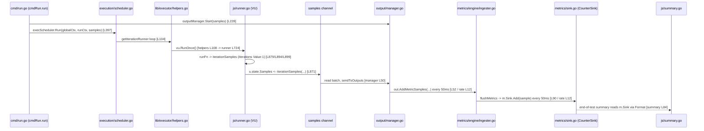

# k6 Metrics Investigation — Onboarding Q&A

This document answers three onboarding questions about how **grafana/k6** tracks metrics during a load test, grounded in the codebase's actual observed behavior. The module under investigation is the single Go module `go.k6.io/k6` (`go.mod:L1`), specifically **k6 `v0.55.0`, commit `ddc3b0b1d2`** — the exact build whose banner is reproduced below.

Every factual claim about code carries an inline `file:line` citation (all verified against source at commit `ddc3b0b1d`), and every behavioral claim sits next to the exact command that produced it and the actual, unedited observed output. Any statement that is not directly observed is explicitly prefixed **"(inferred)"**.

---

## Methodology

This investigation followed a **run-first, evidence-driven** approach: the code was built and run before any prose was written, and the answers are derived from captured runtime output rather than from reading alone.

**Canonical entry points and exact commands used** (these are the project's own developer commands, taken from the `Makefile`):

- **Build:** `go build` — the `Makefile` `build:` target (`Makefile:L7-8`).
- **Tests:** `go test -race -timeout 210s ./...` — the `Makefile` `tests:` target (`Makefile:L28-29`).
- **Run a script:** `k6 run <script.js>` (optionally `k6 run --out json=out.json <script.js>` for machine-readable corroboration).

**Observed toolchain / version banner** — command `./k6 version`:

```
k6 v0.55.0 (commit/ddc3b0b1d2, go1.23.12, linux/amd64)
```

The Go toolchain is `go1.23.12` (the project's highest documented supported version: the CI matrix includes `1.23.x` at `.github/workflows/test.yml:L89`, while `go.mod` declares `go 1.21` / `toolchain go1.21.13` at `go.mod:L3,L5`).

**Baseline for the health question:** the default Linux `go test -race ./...` invocation. Suites gated behind non-default build tags (for example `-tags=wpt`) are reported as *excluded-by-default* rather than folded silently into the pass/fail totals.

**Read-only compliance:** per the governing constraint ("Just exploring for now, so please don't modify anything in the repo"), no existing repository file was modified. The only artifact created is this document. The minimal test script and all captured logs lived **outside** the repository checkout (under `/tmp/k6_investigation/`) and were removed afterward; the working tree was left unchanged.

---

## Question 1 — Project Health

> **"can you run the tests and tell me how many pass vs fail? Are there any that are skipped or broken?"**

### 1.1 How the suite was run

The binary was built with the canonical `go build` (`Makefile:L7-8`), producing the version banner shown in the Methodology section. The test suite was then executed with the canonical local command:

```
go test -race -timeout 210s ./...
```

This is the project's `tests:` make target (`Makefile:L28-29`). It was run **to completion 7 times** — 4 truly independent full runs (runs #1, #5, #6, #7; the latter three each preceded by `go clean -testcache`) plus 3 cache-assisted runs (#2–#4).

**Test inventory (verified by live enumeration, excluding `vendor/`):** **176** `*_test.go` files across **54** test directories; `go list ./...` reports **82** total packages exercised by `./...` (82 total − 54 with tests = 28 with no test files).

### 1.2 The headline finding: the count is NOT deterministic here

The single most important, non-obvious finding is that **the pass/fail count is not deterministic in this environment.** Reporting one number would be misleading; the accurate answer is a *distribution* plus a stable-core / flaky-periphery split. Across the four independent full runs, `ok ∈ {48, 49}` and `FAIL ∈ {5, 6}`, while `? (no test files)` was **28** and the total package count was **82** on every single run.

**Stability distribution across 7 runs** (Go caches *passing* test results, so runs #2–#4 reused the cache and only re-executed still-failing packages — hence their lower FAIL counts; the truly independent full runs are #1, #5, #6, #7):

| Run | Type | ok | FAIL | ? (no test files) | Duration | FAIL packages |
|-----|------|----|----|----|----|----|
| #1 | cold full | 48 | 6 | 28 | 109s | cmd/tests, js/modules/k6/grpc, js/modules/k6/http, js/modules/k6/timers, lib/executor, output/cloud/expv2 |
| #2 | cached | 50 | 4 | 28 | 64s | grpc, http, timers, lib/executor |
| #3 | cached | 51 | 3 | 28 | 63s | grpc, http, lib/executor |
| #4 | cached | 51 | 3 | 28 | 62s | grpc, http, lib/executor |
| #5 | independent full | 49 | 5 | 28 | 73s | execution, grpc, http, timers, lib/executor |
| #6 | independent full | 48 | 6 | 28 | 72s | cmd/tests, js, grpc, http, timers, lib/executor |
| #7 | independent full | 49 | 5 | 28 | 72s | cmd/tests, js, grpc, http, lib/executor |

**The Go test cache effect (why runs #2–#4 differ):** `go test` caches the result of a package whose test binary and inputs are unchanged and that **passed**. On a re-run, only packages that previously *failed* (or changed) are actually re-executed; everything else reports its cached `ok`. That is why runs #2–#4 show progressively fewer `FAIL`s — they are not independent measurements. To obtain a genuinely independent full run, invalidate the cache first with `go clean -testcache` (done before runs #5, #6, #7).

### 1.3 Complete, unedited per-package result listing (Run #1, cold full run)

This is the representative complete output of `go test -race -timeout 210s ./...`, in the order `go test` emitted it:

```
?   	go.k6.io/k6	[no test files]
?   	go.k6.io/k6/api/v1/client	[no test files]
?   	go.k6.io/k6/cloudapi/insights/proto	[no test files]
?   	go.k6.io/k6/cloudapi/insights/proto/v1/common	[no test files]
?   	go.k6.io/k6/cloudapi/insights/proto/v1/ingester	[no test files]
?   	go.k6.io/k6/cloudapi/insights/proto/v1/k6	[no test files]
?   	go.k6.io/k6/cloudapi/insights/proto/v1/trace	[no test files]
ok  	go.k6.io/k6/api	1.024s
ok  	go.k6.io/k6/api/v1	1.256s
ok  	go.k6.io/k6/cloudapi	1.175s
ok  	go.k6.io/k6/cloudapi/insights	1.040s
?   	go.k6.io/k6/cmd/state	[no test files]
?   	go.k6.io/k6/cmd/tests/events	[no test files]
?   	go.k6.io/k6/errext/exitcodes	[no test files]
?   	go.k6.io/k6/execution/local	[no test files]
?   	go.k6.io/k6/ext	[no test files]
?   	go.k6.io/k6/js/modules	[no test files]
?   	go.k6.io/k6/js/modules/k6/experimental	[no test files]
?   	go.k6.io/k6/js/modules/k6/html/gen	[no test files]
?   	go.k6.io/k6/js/modulestest	[no test files]
?   	go.k6.io/k6/lib/consts	[no test files]
?   	go.k6.io/k6/lib/testutils	[no test files]
?   	go.k6.io/k6/lib/testutils/grpcservice	[no test files]
?   	go.k6.io/k6/lib/testutils/httpmultibin	[no test files]
?   	go.k6.io/k6/lib/testutils/httpmultibin/grpc_any_testing	[no test files]
?   	go.k6.io/k6/lib/testutils/httpmultibin/grpc_testing	[no test files]
?   	go.k6.io/k6/lib/testutils/httpmultibin/grpc_wrappers_testing	[no test files]
?   	go.k6.io/k6/lib/testutils/minirunner	[no test files]
?   	go.k6.io/k6/lib/testutils/mockoutput	[no test files]
?   	go.k6.io/k6/lib/testutils/mockresolver	[no test files]
?   	go.k6.io/k6/output/cloud/expv2/pbcloud	[no test files]
?   	go.k6.io/k6/ui/console	[no test files]
ok  	go.k6.io/k6/cmd	5.146s
FAIL	go.k6.io/k6/cmd/tests	14.353s
ok  	go.k6.io/k6/errext	1.108s
ok  	go.k6.io/k6/event	1.225s
ok  	go.k6.io/k6/execution	9.371s
ok  	go.k6.io/k6/js	12.952s
ok  	go.k6.io/k6/js/common	1.225s
ok  	go.k6.io/k6/js/compiler	1.420s
ok  	go.k6.io/k6/js/eventloop	2.806s
ok  	go.k6.io/k6/js/modules/k6	2.512s
ok  	go.k6.io/k6/js/modules/k6/crypto	1.307s
ok  	go.k6.io/k6/js/modules/k6/crypto/x509	1.506s
ok  	go.k6.io/k6/js/modules/k6/data	5.836s
ok  	go.k6.io/k6/js/modules/k6/encoding	1.319s
ok  	go.k6.io/k6/js/modules/k6/execution	1.519s
ok  	go.k6.io/k6/js/modules/k6/experimental/csv	1.326s
ok  	go.k6.io/k6/js/modules/k6/experimental/fs	1.509s
ok  	go.k6.io/k6/js/modules/k6/experimental/streams	1.206s
FAIL	go.k6.io/k6/js/modules/k6/grpc	62.449s
ok  	go.k6.io/k6/js/modules/k6/html	2.406s
FAIL	go.k6.io/k6/js/modules/k6/http	8.429s
ok  	go.k6.io/k6/js/modules/k6/metrics	1.609s
FAIL	go.k6.io/k6/js/modules/k6/timers	4.931s
ok  	go.k6.io/k6/js/modules/k6/ws	3.419s
ok  	go.k6.io/k6/js/promises	1.109s
ok  	go.k6.io/k6/js/tc39	1.219s
ok  	go.k6.io/k6/lib	1.808s
FAIL	go.k6.io/k6/lib/executor	29.207s
ok  	go.k6.io/k6/lib/fsext	1.108s
ok  	go.k6.io/k6/lib/netext	2.304s
ok  	go.k6.io/k6/lib/netext/grpcext	1.222s
ok  	go.k6.io/k6/lib/netext/httpext	4.941s
ok  	go.k6.io/k6/lib/strvals	1.107s
ok  	go.k6.io/k6/lib/trace	1.107s
ok  	go.k6.io/k6/lib/types	1.305s
ok  	go.k6.io/k6/loader	3.317s
ok  	go.k6.io/k6/log	1.220s
ok  	go.k6.io/k6/metrics	1.305s
ok  	go.k6.io/k6/metrics/engine	1.204s
ok  	go.k6.io/k6/output	2.202s
ok  	go.k6.io/k6/output/cloud	1.320s
FAIL	go.k6.io/k6/output/cloud/expv2	0.403s
ok  	go.k6.io/k6/output/cloud/expv2/integration	5.121s
ok  	go.k6.io/k6/output/cloud/insights	1.202s
ok  	go.k6.io/k6/output/csv	1.220s
ok  	go.k6.io/k6/output/influxdb	1.314s
ok  	go.k6.io/k6/output/json	1.220s
ok  	go.k6.io/k6/ui	1.018s
ok  	go.k6.io/k6/ui/pb	1.105s
ok  	go.k6.io/k6/usage	1.103s
FAIL
```

### 1.4 Which tests fail, and why (categorized with observed detail)

The failures split cleanly into a **stable-failing core** (fails in all 7 runs) and a **flaky periphery** (fails on some runs, passes on others).

**Stable-failing core (fails in ALL 7 runs):** `go.k6.io/k6/js/modules/k6/grpc`, `go.k6.io/k6/js/modules/k6/http`, `go.k6.io/k6/lib/executor`.

**Flaky / intermittent (fails on some runs, passes on others — which is precisely why there is never a fixed count):** `js/modules/k6/timers`, `cmd/tests`, `js`, `execution`, `output/cloud/expv2`. Note that `execution` and `js` actually **passed** in run #1 (`ok go.k6.io/k6/execution 9.371s`, `ok go.k6.io/k6/js 12.952s`) but failed in independent runs #5 and #6/#7 respectively — confirming flakiness rather than a hard breakage.

The unedited failure excerpts below substantiate each failing package.

`js/modules/k6/grpc` — **STABLE**; TLS certificate verification failing, each subtest hitting a ~60s deadline:

```
--- FAIL: TestClient_TlsParameters/ConnectTls (62.00s)
    helpers_test.go:19: (via client_test.go:1287)
        	Error:      	Received unexpected error:
        	GoError: context deadline exceeded: connection error: desc = "transport: authentication handshake failed: tls: failed to verify certificate: x509: certificate signed by unknown authority (possibly because of \"crypto/rsa: verification error\" while trying to verify candidate authority certificate \"Acme Co\")" at reflect.methodValueCall (native)
    (also ConnectTlsInvokeSuccess, ConnectTlsEncryptedKey — same error)
```

`js/modules/k6/http` — **STABLE** (OCSP), plus a flaky async subtest:

```
--- FAIL: TestRequestAndBatchTLS/ocsp_stapled_good (1.61s)
    request_test.go:2208: 
        	Error:      	Error: wrong ocsp stapled response status: unknown at <eval>:3:58(22)
--- FAIL: TestAsyncRequest/Concurrent (async_request_test.go:71)   (intermittent)
```

`js/modules/k6/timers` — **FLAKY**; timing/ordering assertions:

```
--- FAIL: TestSetIntervalOrder (0.40s)
    timers_test.go:138: 
        	Error:      	"4" is not greater than or equal to "5"
--- FAIL: TestSetTimeoutOrder (3.01s)
    timers_test.go:104: 
        	Error:      	Not equal: 
        	            	expected: []string{"outside setTimeout", "one", "two", "three", "four", "five", "six", "last"}
        	            	actual  : []string{"outside setTimeout", "one", "two", "three", "last", "four", "five", "six"}
```

`lib/executor` — **STABLE**; timing-tolerance assertion exceeded:

```
--- FAIL: TestConstantArrivalRateRunCorrectTiming/segment_0:1/3_sequence_ (2.00s)
    constant_arrival_rate_test.go:185: 
        	Error:      	Max difference between ... allowed is 24ms, but difference was -77.996891ms
        	(also -38.022879ms; segments 1/3:2/3 and 2/3:1 similarly)
```

`js` — **FLAKY**; timing/context:

```
--- FAIL: TestEventSystemError/abort
--- FAIL: TestVURunInterrupt/Archive
    runner_test.go:663: 
        	Error:      	"context deadline exceeded" does not contain "context canceled"
```

`execution` — **FLAKY**; VU-sharing scheduling:

```
--- FAIL: TestExecutionInfoVUSharing (3.50s)
    scheduler_ext_exec_test.go:131 / :133:  Not equal
```

`output/cloud/expv2` — **FLAKY**; batch timing: `--- FAIL: TestFlushMaxSeriesInBatch`.

`cmd/tests` — **FLAKY / environment**:

```
--- FAIL: TestBinaryNameHelpStdout (2.70s)
    cmd_run_test.go:129: 
        	Error:      	Should be empty, but was [116 105 109 101 61 34 ...]   (bytes decode to: time="..." level=info msg="2026/07/13 ... RecordRoute called")
    cmd_run_test.go:130: 
        	Error:      	Should be empty, but was [{... 2026/07/13 15:26:13 RecordRoute called ...}]
--- FAIL: TestBrowserPermissions/browser_option_set (2.90s)
    cmd_run_test.go:2308: 
        	Error:      	"Error from API server" does not contain "k6-browser-fake-cmd"
```

Reinforcing that the TLS problem is environment-wide (not a single test's bug), the run also emitted:

```
2026/07/13 15:38:42 http: TLS handshake error from 127.0.0.1:...: remote error: tls: bad certificate
```

### 1.5 Are any tests skipped or broken?

This sub-question needs a precise distinction between three different things: **runtime skips** (`t.Skip`), **compile-time exclusions** (Go build tags), and **broken** (a compiled test that fails).

**Runtime skips (`t.Skip`).** Exactly **4** test files call `t.Skip` (verified by enumeration across the repo, excluding `vendor/`):

- `js/modules/k6/http/request_test.go`
- `js/tc39/tc39_test.go`
- `lib/executor/constant_arrival_rate_test.go`
- `lib/netext/httpext/request_test.go`

These files decide *at runtime* to skip specific subtests (for example, when a precondition is not met). They are compiled and executed; some of their cases simply skip themselves.

**Compile-time build-tag exclusions — these are NOT "broken."** Several test files carry a `//go:build` constraint, so they are *not compiled at all* into the default Linux `-race` invocation. A file excluded by a build tag under `go test -race ./...` is simply not part of that invocation — it is not broken:

- `js/modules/k6/experimental/streams/readable_streams_test.go` — `//go:build wpt` → **excluded** (requires the non-default `wpt` tag).
- `js/tc39/tc39_norace_test.go` — `//go:build !race` → **excluded** because `-race` is on.
- `js/tc39/tc39_race_test.go` — `//go:build race` → **included** under `-race`.
- `lib/fsext/filepath_windows_test.go` — `//go:build windows` → **excluded** on Linux.
- `lib/fsext/filepath_unix_test.go` — `//go:build unix` → **included** on Linux.

**"Broken" in the sense of consistently failing.** Three packages fail in every run — `js/modules/k6/grpc`, `js/modules/k6/http`, and `lib/executor` — but the observed causes are environmental/timing (TLS certificate verification, OCSP staple freshness, and a sub-25 ms timing tolerance), not logic breakage in the code under test. The remaining failing packages are flaky.

### 1.6 The test-isolation harness (relevant to non-obvious failures)

The `cmd/tests` package (one of the flaky failers above) runs under a production-isolation harness that can itself surface non-obvious failures. The harness lives in `cmd/tests/tests.go` as `func Main(m *testing.M)` (`cmd/tests/tests.go:L33`). It installs a blocking HTTP transport (`type blockingTransport struct` at `cmd/tests/tests.go:L13`) whose `RoundTrip` **panics** if a test tries to reach a forbidden production host (`cmd/tests/tests.go:L19`, panic at `L23`); it wires `fallback: http.DefaultTransport` (`L40`) and installs itself with `http.DefaultTransport = bt` (`L48`). After the tests run it performs a goroutine-leak check with `goleak.Find()` (`cmd/tests/tests.go:L57`, `goleak` imported at `L10`), wrapping `exitCode = m.Run()` (`L63`).

**Precision:** the actual `func TestMain(m *testing.M)` is defined in `cmd/tests/tests_test.go:L11` and calls `Main`; `tests.go` itself contains the reusable `Main` harness, not `TestMain`. The combination of `-race` and the local per-package `-timeout 210s` (`Makefile:L28-29`) amplifies timing-sensitive tests, and the `goleak` check and blocking transport can turn an environmental hiccup into a package failure.

### 1.7 Direct answer to Question 1

Of the **82** packages exercised by `go test -race -timeout 210s ./...`, roughly **48–49 pass (`ok`)**, **5–6 fail (`FAIL`)**, and **28 contain no test files (`? … no test files`)** on any given independent full run; the pass/fail split is **not deterministic** here (see the 7-run distribution in §1.2). Three packages fail consistently — `js/modules/k6/grpc` (TLS x509 "Acme Co" certificate verification), `js/modules/k6/http` (`ocsp_stapled_good`: "wrong ocsp stapled response status: unknown"), and `lib/executor` (`TestConstantArrivalRateRunCorrectTiming`: 24 ms tolerance exceeded) — while `timers`, `cmd/tests`, `js`, `execution`, and `output/cloud/expv2` are flaky. As for "skipped or broken": **4** test files use runtime `t.Skip`, several test files are excluded at compile time by build tags (`wpt`, `!race`, `windows` on Linux) and are therefore *not broken, just not compiled into this run*, and no package is broken by a logic defect that this run demonstrates. (inferred) The consistent and flaky failures are attributable to the sandbox environment — the `-race` detector plus CPU contention stressing timing assertions, and the system clock reading `2026-07-13` plausibly affecting TLS certificate validity windows / OCSP freshness for the grpc and http packages; the observed error messages, counts, and the `2026-07-13` clock reading are the authoritative facts, and only the causal attribution is inferred.


---

## Question 2 — Metrics Architecture

> **"when I kick off a load test, what parts of the code are responsible for counting iterations and collecting performance data? Name the specific files and modules involved."**

When you kick off a load test, the metric subsystem is centered on four cooperating areas of the codebase:

- the **`metrics/`** package — the metric model (types, sinks, samples, registry, built-in catalog);
- the **`metrics/engine/`** sub-package — the engine and the output ingester that route samples into sinks;
- the **`output/`** pipeline — the `Output` interface, the `Manager` that fans samples out, and reusable buffering helpers;
- the **`js/`** runtime — where per-VU iterations run and emit metric samples.

Iteration counting, importantly, is split across **two distinct and complementary mechanisms** (do not conflate them), described next.

### 2.1 Counting iterations — Mechanism A: the summary-visible `iterations` counter metric

The `iterations` line you see in the end-of-test summary is a **built-in `Counter` metric**. It is constructed once, when the run starts, in `RegisterBuiltinMetrics` (`metrics/builtin.go:L78`, doc comment at `L77`), where the metric name constant `IterationsName = "iterations"` (`metrics/builtin.go:L8`) is registered as a `Counter`:

```go
		Iterations:        registry.MustNewMetric(IterationsName, Counter),
```

That is `metrics/builtin.go:L82`. (The sibling `IterationDuration` `Trend` metric is registered on the next line, `metrics/builtin.go:L83`.)

The metric's value is produced **once per completed iteration** inside the JS runtime. The function `iterationSamples` (`js/runner.go:L879`) builds the per-iteration samples; its `Iterations` sample block (`js/runner.go:L892-L900`) names the metric at `js/runner.go:L894` and hard-codes the value `1` at `js/runner.go:L899`:

```go
		{
			TimeSeries: metrics.TimeSeries{
				Metric: builtinMetrics.Iterations,
				Tags:   ctm.Tags,
			},
			Time:     endTime,
			Metadata: ctm.Metadata,
			Value:    1,
		},
```

This `Value: 1`-per-iteration is exactly what the observed run produced — the summary's `iterations...........: 5` line (§3.2) and the **5** JSON `iterations` Point samples, each `"value":1` (§3.3). Because the sink for a `Counter` sums its inputs (`metrics/sink.go:L53`), five samples of `1` accumulate to `5`.

### 2.2 Counting iterations — Mechanism B: the `ExecutionState` atomic counters that drive scheduling

Separately from the summary metric, the scheduler keeps its **own** internal iteration tally using atomic counters on `ExecutionState`. These are not the `iterations` metric — they are the bookkeeping the executors use to decide when the configured iteration budget is exhausted.

The counters are declared in `lib/execution.go` as `fullIterationsCount *uint64` (`lib/execution.go:L146`) and `interruptedIterationsCount *uint64` (`lib/execution.go:L153`), and they are mutated through atomic add helpers:

```go
func (es *ExecutionState) AddFullIterations(count uint64) uint64 {
	return atomic.AddUint64(es.fullIterationsCount, count)
}
```

That is `lib/execution.go:L292-L293`; the corresponding `AddInterruptedIterations` is at `lib/execution.go:L308-L309`.

These counters are incremented in exactly one place: the per-iteration closure returned by `getIterationRunner` (`lib/executor/helpers.go:L104`). After it calls `err := vu.RunOnce()` (`lib/executor/helpers.go:L108`), it increments the interrupted counter on cancellation/error (`AddInterruptedIterations(1)` at `lib/executor/helpers.go:L117` and again at `L122`) or the full counter on success (`AddFullIterations(1)` at `lib/executor/helpers.go:L137`):

```go
		select {
		case <-ctx.Done():
			// Don't log errors or emit iterations metrics from cancelled iterations
			executionState.AddInterruptedIterations(1)
			return false
		default:
			if err != nil {
				if handleInterrupt(ctx, err) {
					executionState.AddInterruptedIterations(1)
					return false
				}
```

…with the success path at the end of the same closure:

```go
			// TODO: move emission of end-of-iteration metrics here?
			executionState.AddFullIterations(1)
			return true
```

Every one of k6's **seven executors** obtains its per-iteration runner from this same `getIterationRunner`, so all of them feed Mechanism B identically:

- `lib/executor/constant_arrival_rate.go:L276`
- `lib/executor/constant_vus.go:L171`
- `lib/executor/externally_controlled.go:L526`
- `lib/executor/per_vu_iterations.go:L195`
- `lib/executor/ramping_arrival_rate.go:L396`
- `lib/executor/ramping_vus.go:L525`
- `lib/executor/shared_iterations.go:L232`

**The distinction, stated plainly:** Mechanism A (the `Iterations` `Counter` metric, `metrics/builtin.go:L82` → emitted with `Value: 1` at `js/runner.go:L899`) is what appears on the summary's `iterations` line and in the metrics outputs. Mechanism B (the `ExecutionState` atomic counters, `lib/execution.go:L146,L153`, incremented in `lib/executor/helpers.go:L137,L117`) is internal scheduling bookkeeping consumed by the executors (e.g., `shared_iterations`, `per_vu_iterations`) to know when the iteration budget is spent. They are complementary; conflating them would misrepresent the design.

### 2.3 Collecting performance data — the files and modules involved

"Collecting performance data" is realized by the metric model plus the routing/transport pipeline. Named by file and module:

**Metric types (`metrics/` package).** The four metric types are declared in one `const` block in `metrics/metric_type.go:L9-L13`: `Counter` (L10, "sums its data points"), `Gauge` (L11, "displays the latest value"), `Trend` (L12, "min/max/avg/med are interesting"), and `Rate` (L13, "% of values that aren't 0").

**Sinks — where values accumulate (`metrics/sink.go`).** The `Sink` interface (`metrics/sink.go:L18`) declares `Add(s Sample)`, `Format(t time.Duration) map[string]float64`, and `IsEmpty() bool`. The `NewSink(mt MetricType) Sink` factory (`metrics/sink.go:L26`) maps each metric type to its sink (`Counter → &CounterSink{}`, `Gauge → &GaugeSink{}`, `Trend → NewTrendSink()`, `Rate → &RateSink{}`). Each sink's `Add` implements the type's accumulation: `CounterSink.Add` sums (`metrics/sink.go:L53`), `GaugeSink.Add` keeps the latest/min/max (`metrics/sink.go:L82`), `TrendSink.Add` records the distribution (`metrics/sink.go:L117`), and `RateSink.Add` tracks the true/total ratio (`metrics/sink.go:L210`).

**The `Sample` value (`metrics/sample.go`).** A single data point is a `Sample` (`metrics/sample.go:L23-L33`) carrying `TimeSeries` (metric + tags), `Time time.Time`, `Value float64`, and optional `Metadata map[string]string`. The non-blocking channel helper `PushIfNotDone` (`metrics/sample.go:L131`) is used to push samples without blocking a cancelled run.

**The `Registry` (`metrics/registry.go`).** Metrics are created and de-duplicated through the `Registry` (`metrics/registry.go:L12`) via `NewMetric` (`metrics/registry.go:L43`) and `MustNewMetric` (`metrics/registry.go:L70`) — the latter is what `RegisterBuiltinMetrics` uses.

**The metrics engine (`metrics/engine/engine.go`).** The `MetricsEngine` (`metrics/engine/engine.go:L26`) owns the observed-metric set and threshold evaluation. It exposes `CreateIngester()` (`metrics/engine/engine.go:L56`); `markObserved(metric)` (`metrics/engine/engine.go:L108`) flags a metric as observed and records it so it shows in the end-of-test summary:

```go
func (me *MetricsEngine) markObserved(metric *metrics.Metric) {
	if !metric.Observed {
		metric.Observed = true
		me.ObservedMetrics[metric.Name] = metric
	}
}
```

Thresholds are recomputed on a cadence set by `const thresholdsRate = 2 * time.Second` (`metrics/engine/engine.go:L21`), started via `StartThresholdCalculations` (`metrics/engine/engine.go:L159`).

**The output ingester — where a value enters its sink (`metrics/engine/ingester.go`).** The `OutputIngester` (`metrics/engine/ingester.go:L25`) is itself an `Output` (compile-time assertion `var _ output.Output = &OutputIngester{}` at `metrics/engine/ingester.go:L16`). It flushes on a 50 ms cadence (`const collectRate = 50 * time.Millisecond` at `metrics/engine/ingester.go:L12`), and its `flushMetrics()` (`metrics/engine/ingester.go:L62`) loops over buffered samples and, for each one, marks the metric observed and adds the value to the metric's own sink:

```go
		for _, sample := range samples {
			m := sample.Metric               // this should have come from the Registry, no need to look it up
			oi.metricsEngine.markObserved(m) // mark it as observed so it shows in the end-of-test summary
			m.Sink.Add(sample)               // finally, add its value to its own sink
```

The line `m.Sink.Add(sample)` (`metrics/engine/ingester.go:L90`) is **the exact point a metric value enters its sink** and becomes summary-visible.

**The output pipeline (`output/`).** The `Output` interface (`output/types.go:L44-L61`) declares `Description()` (`L47`), `Start()` (`L52`), `AddMetricSamples(samples []metrics.SampleContainer)` (`L58`), and `Stop()` (`L61`). The `Manager` (`output/manager.go:L15`, constructed by `NewManager` at `output/manager.go:L23`) is started with `Start(samplesChan)` (`output/manager.go:L42`); its `sendToOutputs` closure (`output/manager.go:L50`) fans each batch out to every registered output:

```go
	sendToOutputs := func(sampleContainers []metrics.SampleContainer) {
		for _, out := range om.outputs {
			out.AddMetricSamples(sampleContainers)
		}
	}
```

That dispatch (`output/manager.go:L52`) runs on a 50 ms cadence (`const sendBatchToOutputsRate = 50 * time.Millisecond` at `output/manager.go:L12`). Outputs commonly buffer via the reusable `SampleBuffer` (`output/helpers.go:L15`, `AddMetricSamples` at `L22`) and flush via `PeriodicFlusher` (`output/helpers.go:L55`, `NewPeriodicFlusher` at `L89`) — the `OutputIngester` uses exactly this `PeriodicFlusher` with `collectRate`.

**Rendering the summary (`js/summary.go`).** The end-of-test summary is produced by reading each metric's sink. `metricValueGetter` (`js/summary.go:L26`) returns a function that reads a sink via `sink.Format(t)` (`js/summary.go:L35`, `L42`, `L46`); `summarizeMetricsToObject` (`js/summary.go:L62`) builds the getter at `js/summary.go:L77` and calls `getMetricValues(m.Sink, data.TestRunDuration)` (`js/summary.go:L84`) for each metric. In other words, the numbers you see printed at the end come straight out of the sinks that `m.Sink.Add(sample)` populated.

### 2.4 External corroboration (context only — not a substitute for code citations)

The official Grafana k6 documentation corroborates the code-derived model: it confirms the same four metric types — Counter (sums values), Gauge (tracks latest/min/max), Rate (percentage of non-zero values), and Trend (statistical distribution such as mean and percentiles) — and states that k6 always collects a core set of built-in metrics, adding protocol-specific metrics (for example `http_req_*`) only when that protocol is actually exercised. This is consistent with the observed summary in §3.2: the minimal script made no HTTP calls, so **no `http_req_*` lines appear** — only the always-collected built-ins (`data_received`, `data_sent`, `iteration_duration`, `iterations`). Per the governing rule set, this external source is context only; the authority for the claims above is the code (`file:line`) and the captured runtime output.


---

## Question 3 — Data-Flow Trace

> **"Could you trace through running a simple test script and show me the function calls involved in collecting at least one metric, so I can see how the data flows from test start to metrics output?"**

The metric traced end-to-end is the built-in **`iterations`** counter — the "at least one metric" whose collection is followed from test start all the way to the metrics output.

### 3.1 The simple script and the command

The minimal canonical script was authored **outside** the repository checkout at `/tmp/k6_investigation/simple_test.js`:

```javascript
import http from 'k6/http';

export const options = {
  vus: 1,
  iterations: 5,
};

export default function () {
  // Minimal canonical iteration: no protocol calls, just a trivial body
  // so the trace focuses on the always-collected built-in `iterations` metric.
  let x = 0;
  for (let i = 0; i < 1000; i++) { x += i; }
}
```

Command: `k6 run /tmp/k6_investigation/simple_test.js`.

### 3.2 Observed end-of-test summary

The full output starts with the k6 ASCII banner; the end-of-test block is:

```
     execution: local
        script: /tmp/k6_investigation/simple_test.js
        output: -

     scenarios: (100.00%) 1 scenario, 1 max VUs, 10m30s max duration (incl. graceful stop):
              * default: 5 iterations shared among 1 VUs (maxDuration: 10m0s, gracefulStop: 30s)


     data_received........: 0 B 0 B/s
     data_sent............: 0 B 0 B/s
     iteration_duration...: avg=127.39µs min=107.25µs med=109.06µs max=194.63µs p(90)=163.86µs p(95)=179.25µs
     iterations...........: 5   6555.468441/s


running (00m00.0s), 0/1 VUs, 5 complete and 0 interrupted iterations
default ✓ [ 100% ] 1 VUs  00m00.0s/10m0s  5/5 shared iters
```

The `iterations...........: 5` line is the accumulated value this trace produces.

### 3.3 Machine-readable corroboration (`--out json`)

Command: `k6 run --out json=out.json /tmp/k6_investigation/simple_test.js`. The JSON stream contains **exactly 5** `iterations` Point samples, each carrying `"value":1` — one per completed iteration, directly corroborating the `Iterations` sample emitted with `Value: 1` at `js/runner.go:L899`:

```
{"metric":"iterations","type":"Point","data":{"time":"2026-07-13T15:26:13.817495147Z","value":1,"tags":{"group":"","scenario":"default"}}}
{"metric":"iterations","type":"Point","data":{"time":"2026-07-13T15:26:13.817672554Z","value":1,"tags":{"group":"","scenario":"default"}}}
{"metric":"iterations","type":"Point","data":{"time":"2026-07-13T15:26:13.817792112Z","value":1,"tags":{"group":"","scenario":"default"}}}
{"metric":"iterations","type":"Point","data":{"time":"2026-07-13T15:26:13.817922491Z","value":1,"tags":{"group":"","scenario":"default"}}}
{"metric":"iterations","type":"Point","data":{"time":"2026-07-13T15:26:13.818061124Z","value":1,"tags":{"group":"","scenario":"default"}}}
```

### 3.4 The ordered function-call chain (test start → metrics output)

Each hop below is grounded in a verified `file:line`. The flow moves from the CLI wiring, through the scheduler and executor, into the VU that emits the sample, across the buffered samples channel, and finally into the ingester that adds the value to the sink the summary reads.

1. **CLI orchestration — `cmd/run.go` `cmdRun.run` (`cmd/run.go:L59`).** When you invoke `k6 run`, this method wires the run:
   - builds the metrics engine: `metricsEngine, err := engine.NewMetricsEngine(...)` (`cmd/run.go:L170`);
   - creates the ingester and registers it as an output: `metricsIngester = metricsEngine.CreateIngester()` (`cmd/run.go:L187`) then `outputs = append(outputs, metricsIngester)` (`cmd/run.go:L188`);
   - builds the output manager: `outputManager := output.NewManager(...)` (`cmd/run.go:L220`);
   - creates the **buffered samples channel**: `samples := make(chan metrics.SampleContainer, test.derivedConfig.MetricSamplesBufferSize.Int64)` (`cmd/run.go:L227`);
   - starts the outputs on that channel: `waitOutputsFlushed, stopOutputs, err := outputManager.Start(samples)` (`cmd/run.go:L228`);
   - starts threshold evaluation: `metricsEngine.StartThresholdCalculations(...)` (`cmd/run.go:L242`);
   - and finally runs the scheduler, handing it the same channel: `err = execScheduler.Run(globalCtx, runCtx, samples)` (`cmd/run.go:L397`).

2. **Scheduler — `execution/scheduler.go`.** Built by `NewScheduler` (`execution/scheduler.go:L38`) and initialized by `Init` (`execution/scheduler.go:L381`), the scheduler's `Run(globalCtx, runCtx context.Context, samplesOut chan<- metrics.SampleContainer)` (`execution/scheduler.go:L419`) propagates that samples channel down to the executors.

3. **Executor iteration loop — `lib/executor/helpers.go` `getIterationRunner` (`lib/executor/helpers.go:L104`).** Each executor drives iterations through the closure returned here, which calls `err := vu.RunOnce()` (`lib/executor/helpers.go:L108`) per iteration. For this script the active executor is `shared_iterations` (representative call site `lib/executor/shared_iterations.go:L232`); the same pattern is used by all seven executors — `constant_arrival_rate.go:L276`, `constant_vus.go:L171`, `externally_controlled.go:L526`, `per_vu_iterations.go:L195`, `ramping_arrival_rate.go:L396`, `ramping_vus.go:L525`, `shared_iterations.go:L232`.

4. **VU emits the sample — `js/runner.go`.** `vu.RunOnce()` lands in `ActiveVU.RunOnce` (`js/runner.go:L724`), which invokes `VU.runFn` (`js/runner.go:L817`). On completion `runFn` constructs the per-iteration samples via `iterationSamples(...)` (`js/runner.go:L879`) — the `Iterations` sample naming the metric at `js/runner.go:L894` with `Value: 1` at `js/runner.go:L899` — and pushes them onto the per-VU samples channel: `u.state.Samples <- iterationSamples(startTime, endTime, ctm, builtinMetrics)` (`js/runner.go:L871`).

5. **Manager fans samples out — `output/manager.go`.** The `Manager.Start` goroutine reads the samples channel and, via its `sendToOutputs` closure (`output/manager.go:L50`), dispatches each batch to every registered output: `out.AddMetricSamples(sampleContainers)` (`output/manager.go:L52`), on a 50 ms cadence (`sendBatchToOutputsRate = 50 * time.Millisecond`, `output/manager.go:L12`).

6. **Ingester adds the value to the sink — `metrics/engine/ingester.go`.** One registered output is the `OutputIngester`, which buffers incoming samples and, on its own 50 ms flush (`collectRate = 50 * time.Millisecond`, `metrics/engine/ingester.go:L12`), runs `flushMetrics()` (`metrics/engine/ingester.go:L62`). For each sample it calls `oi.metricsEngine.markObserved(m)` (`metrics/engine/ingester.go:L89`) and then **`m.Sink.Add(sample)`** (`metrics/engine/ingester.go:L90`) — the exact point the value lands in the metric's sink. For `iterations` that sink is a `CounterSink`, whose `Add` sums the samples (`metrics/sink.go:L53`), so five `Value: 1` samples accumulate to `5`.

7. **Summary reads the sink — `js/summary.go`.** The end-of-test summary is rendered by reading each metric's sink: `getMetricValues(m.Sink, data.TestRunDuration)` (`js/summary.go:L84`), using the getter built at `js/summary.go:L77` from `metricValueGetter` (`js/summary.go:L26`), which reads via `sink.Format(t)` (`js/summary.go:L35`). That is how the accumulated `5` becomes the `iterations...........: 5` line.

### 3.5 Sequence diagram



### 3.6 Connecting the trace to the observed output

The chain above is not theoretical — it is exactly what produced the captured output. The five completed iterations each ran `getIterationRunner`'s closure → `vu.RunOnce()` → `iterationSamples` (emitting one `iterations` sample with `Value: 1`, `js/runner.go:L899`). Those five samples crossed the buffered channel, were fanned out by the manager (`output/manager.go:L52`), and were added to the `CounterSink` by the ingester's `m.Sink.Add(sample)` (`metrics/engine/ingester.go:L90`), summing to `5`. That accumulated `5` is what the summary renders as `iterations...........: 5` (§3.2) and what the JSON output shows as **5** discrete `"value":1` Point samples (§3.3).


---

## Caveats

- **Baseline.** All health figures are for the default Linux `go test -race ./...` invocation. Build-tag-gated suites (`wpt`, and the `!race`/`windows` files) are excluded-by-default and are not counted in the pass/fail totals.
- **Local vs CI command.** The canonical local command is `go test -race -timeout 210s ./...` (`Makefile:L28-29`). CI runs a different invocation — `go test -p 2 -race -timeout 800s ./...` — built from `args=("-p" "2" "-race")` (`.github/workflows/test.yml:L39`) plus `-timeout 800s ./...` (`.github/workflows/test.yml:L46,L83`), across a Go matrix of `1.22.x` (`L17`) and `1.23.x` (`L89`). The longer `800s` timeout and `-p 2` parallelism make CI less prone to the timing failures seen locally.
- **Go test caching.** Passing package results are cached; re-runs only re-execute previously failing (or changed) packages. Independent full runs require `go clean -testcache` first. This is why runs #2–#4 in §1.2 are not independent samples.
- **Timing/environment sensitivity of the failures.** (inferred) The consistent `lib/executor` timing-tolerance failure and the flaky `timers`/`js`/`execution` failures are most plausibly caused by the `-race` detector combined with CPU contention in the sandbox stressing sub-25 ms timing assertions; the `grpc` (x509 "Acme Co") and `http` (OCSP) failures are most plausibly influenced by the system clock reading `2026-07-13` affecting certificate validity windows / OCSP freshness. These causal attributions are **(inferred)**; the observed error messages, package results, run durations, and the `2026-07-13` clock reading are the authoritative facts.
- **Read-only compliance.** No existing repository file was modified. The minimal script and captured logs lived outside the checkout (`/tmp/k6_investigation/`) and were removed; the working tree was left unchanged. This document is the only artifact.

## Coverage pass

A final check that every part of every question, and every file/module/mechanism it names, is addressed and grounded:

- **Q1 — Project Health.** Pass/fail/no-test counts reported as a multi-run distribution (7 runs, with durations) — §1.2; complete run #1 listing — §1.3; failure categorization with unedited detail blocks — §1.4; Go test cache explained — §1.2; skipped vs broken answered precisely — 4 `t.Skip` files and the build-tag exclusions (`wpt`, `!race`, `race`, `windows`, `unix`), explicitly noting build-tag-gated ≠ broken — §1.5; `Main`/`TestMain` isolation harness and `goleak` — §1.6.
- **Q2 — Metrics Architecture.** Both iteration-counting mechanisms addressed and explicitly distinguished — Mechanism A (`Iterations` `Counter`, `metrics/builtin.go:L82` → `js/runner.go:L899`) in §2.1 and Mechanism B (`ExecutionState` atomic counters, `lib/execution.go:L146,L153` via `lib/executor/helpers.go:L137,L117`) in §2.2; all seven executors named — §2.2; full performance-data path naming every file/module (`metrics/metric_type.go`, `metrics/sink.go`, `metrics/sample.go`, `metrics/registry.go`, `metrics/builtin.go`, `metrics/engine/engine.go`, `metrics/engine/ingester.go`, `output/types.go`, `output/manager.go`, `output/helpers.go`, `js/summary.go`) — §2.3; external corroboration marked context-only — §2.4.
- **Q3 — Data-Flow Trace.** Simple script and command — §3.1; observed summary — §3.2; JSON corroboration (5 × `value:1`) — §3.3; ordered function-call chain with a `file:line` for every hop from `cmd/run.go:L59` to `m.Sink.Add(sample)` at `metrics/engine/ingester.go:L90` and the summary read at `js/summary.go:L84` — §3.4; sequence diagram — §3.5; trace tied to observed output — §3.6. The traced "at least one metric" is the built-in `iterations` counter.

### Citation index (verified at commit `ddc3b0b1d`)

| Area | File | Key anchors |
|------|------|-------------|
| Build/test | `Makefile` | build `L7-8`; tests `L28-29` |
| Module | `go.mod` | module `L1`; go `L3`; toolchain `L5` |
| CI | `.github/workflows/test.yml` | matrix `L17`,`L89`; args `L39`; invocation `L46`,`L83` |
| Metric types | `metrics/metric_type.go` | `L9-L13` (Counter/Gauge/Trend/Rate) |
| Sinks | `metrics/sink.go` | `Sink` `L18`; `NewSink` `L26`; Adds `L53`/`L82`/`L117`/`L210` |
| Sample | `metrics/sample.go` | `Sample` `L23-L33`; `PushIfNotDone` `L131` |
| Registry | `metrics/registry.go` | `Registry` `L12`; `NewMetric` `L43`; `MustNewMetric` `L70` |
| Built-ins | `metrics/builtin.go` | name `L8`; `RegisterBuiltinMetrics` `L78`; `Iterations` `L82`; `IterationDuration` `L83` |
| Engine | `metrics/engine/engine.go` | `thresholdsRate` `L21`; `MetricsEngine` `L26`; `CreateIngester` `L56`; `markObserved` `L108`; `StartThresholdCalculations` `L159` |
| Ingester | `metrics/engine/ingester.go` | `collectRate` `L12`; assertion `L16`; `OutputIngester` `L25`; `flushMetrics` `L62`; `markObserved(m)` `L89`; **`m.Sink.Add(sample)` `L90`** |
| Output iface | `output/types.go` | `Output` `L44-L61` (`Description` `L47`, `Start` `L52`, `AddMetricSamples` `L58`, `Stop` `L61`) |
| Manager | `output/manager.go` | rate `L12`; `Manager` `L15`; `NewManager` `L23`; `Start` `L42`; dispatch `L50`/`L52` |
| Helpers | `output/helpers.go` | `SampleBuffer` `L15`/`L22`; `PeriodicFlusher` `L55`/`L89` |
| VU runtime | `js/runner.go` | `RunOnce` `L724`; `runFn` `L817`; push `L871`; `iterationSamples` `L879`; `Iterations` metric `L894`; `Value:1` `L899` |
| Summary | `js/summary.go` | `metricValueGetter` `L26`; `Format` `L35`; `summarizeMetricsToObject` `L62`; getter `L77`; `m.Sink` read `L84` |
| Exec state | `lib/execution.go` | `fullIterationsCount` `L146`; `interruptedIterationsCount` `L153`; `AddFullIterations` `L292-L293`; `AddInterruptedIterations` `L308-L309` |
| Iteration runner | `lib/executor/helpers.go` | `getIterationRunner` `L104`; `vu.RunOnce()` `L108`; `AddInterruptedIterations(1)` `L117`,`L122`; `AddFullIterations(1)` `L137` |
| Executors (7) | `lib/executor/*.go` | `constant_arrival_rate` `L276`; `constant_vus` `L171`; `externally_controlled` `L526`; `per_vu_iterations` `L195`; `ramping_arrival_rate` `L396`; `ramping_vus` `L525`; `shared_iterations` `L232` |
| Scheduler | `execution/scheduler.go` | `NewScheduler` `L38`; `Init` `L381`; `Run` `L419` |
| CLI run | `cmd/run.go` | `run` `L59`; `NewMetricsEngine` `L170`; `CreateIngester` `L187`; append `L188`; `NewManager` `L220`; samples chan `L227`; `Start` `L228`; `StartThresholdCalculations` `L242`; `execScheduler.Run` `L397` |
| Test harness | `cmd/tests/tests.go` | `blockingTransport` `L13`; `RoundTrip` `L19`; `fallback` `L40`; install `L48`; `Main` `L33`; `goleak.Find()` `L57`; `m.Run()` `L63` |
| Test entry | `cmd/tests/tests_test.go` | `TestMain` `L11` (calls `Main`) |

