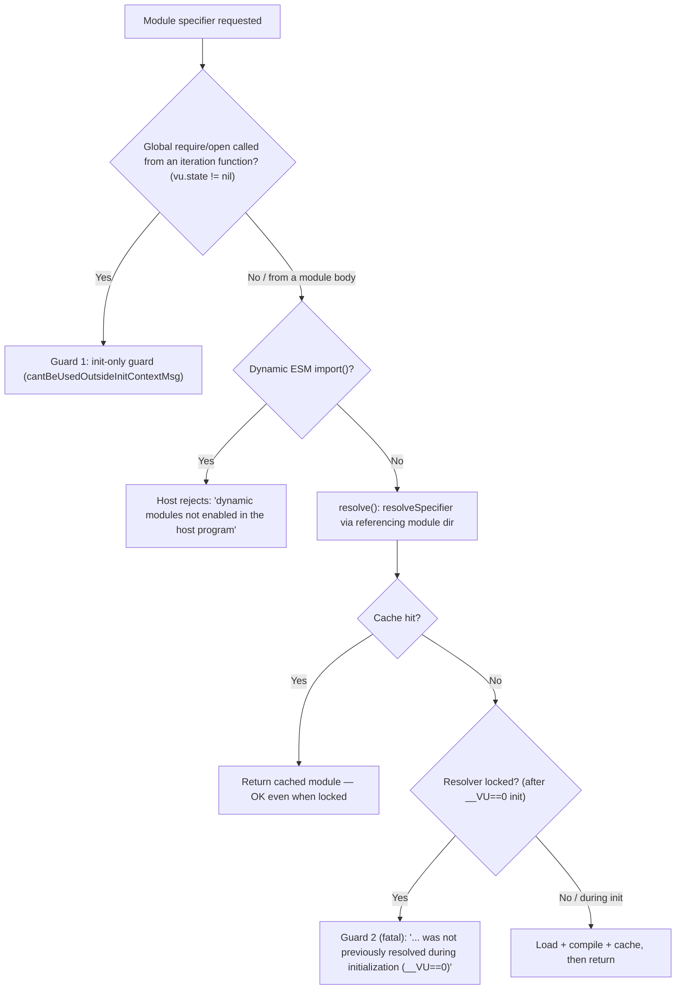

# Why k6 module resolution "freezes" after init — and why "lots of VUs" is a red herring

**Question answered.** Why do some k6 scripts behave fine during `init` but start failing once the test is running with many VUs — especially when code loads modules "dynamically" instead of only at startup? Does k6 intentionally "freeze" module resolution after initialization, and if so, what counts as *already resolved* versus a *new* module that gets rejected? How do relative specifiers (`./x`, `../y`) that depend on the currently-executing module behave when the call stack comes from different places? And — shown with real runs — can a module imported during init still be `require()`d later by a VU, while a never-seen module reliably fails, and what exactly is the error/warning in each case?

**How this document was produced.** Every behavioral claim below was produced by building a canonical k6 binary from this repository's source and running the real `k6 run` CLI, then transcribing the complete, unedited output (both runs of every condition — see §8). Every mechanism claim cites an exact `file:line` in the k6 source. Claims are labeled:

- **[Observed]** — established by a real `k6 run`, with the complete captured output shown in §8.
- **[Inferred]** — read from, or reasoned about, the k6 source at a cited `file:line` (static fact in the code).
- **[External]** — corroborated by an official external reference (the k6 docs, the k6 issue tracker, or `pkg.go.dev`). External sources *corroborate*; when they drift from the pinned v0.55.0 source or runtime, the pinned source/runtime is authoritative.

The k6 **source under investigation is commit `ddc3b0b1d23c`**. Temporary observation scripts were kept entirely outside the repository checkout (under `/tmp/k6test`) and removed afterward. **No pre-existing file in the k6 repository was modified, added, or deleted by this investigation; the sole repository change is this single Markdown document.** The Appendix shows the exact baseline, cleanup, and final `git status`/`git diff` evidence.

- **Build command [Observed]:** `GOFLAGS=-mod=vendor go build -o /tmp/k6bin/k6 .` — run from the repository root; equivalent to the `Makefile` `build:` target (`go build`). Dependencies are fully vendored, so the build is offline-reproducible.
- **Toolchain [Observed]:** `go version go1.23.12 linux/amd64`. Go 1.23.x is the highest explicitly documented supported line (`Dockerfile:L1` → `golang:1.23-alpine3.20`; `.github/workflows/build.yml:L27` → `DEFAULT_GO_VERSION: "1.23.x"`); k6's own module baseline is `go 1.21` / `toolchain go1.21.13` (`go.mod:L3,L5`). **[Inferred for the source-file citations.]**
- **Version banner [Observed]:** `k6 v0.55.0 (commit/ddc3b0b1d2, go1.23.12, linux/amd64)` — from `/tmp/k6bin/k6 version` (binary built from the canonical source commit `ddc3b0b1d23c`). The version string `0.55.0` is fixed in source at `lib/consts/consts.go:L12`; the Go version and OS/arch (`go1.23.12, linux/amd64`) are environment-dependent and assembled by `FullVersion()` at `lib/consts/consts.go:L17`. **[Inferred]**
- **On the `commit/…` field.** It is the git HEAD at build time, read from `vcs.revision` via `runtime/debug.ReadBuildInfo()` and truncated to 10 characters (`lib/consts/consts.go:L19,L28-L35`, truncation at `L31-L35`). The k6 source under investigation is commit `ddc3b0b1d23c`; the only change layered on top of it is *this Markdown document*, which touches no Go source. Consequently, building from either commit yields the identical v0.55.0 binary behavior — only the embedded `commit/…` string differs. Built from the canonical source commit `ddc3b0b1d23c` (the commit under investigation), the banner shows that commit's first-10-character prefix, `ddc3b0b1d2`; a build made from the deliverable branch differs only in that embedded string, which reflects whatever HEAD it was built at. **[Observed + Inferred]**

---

## 1. Direct answer

**The gate is init-vs-runtime state — a module-resolver *lock* — not literal CPU/memory "pressure."** k6 flips a single boolean inside its module resolver at the exact moment the first VU (`__VU==0`) finishes running the init context, and from then on the resolver refuses to resolve any *new* module specifier it has not already cached. The reason a script "works in init but fails once the test is running with a lot of VUs" is simply that **the failing line of code runs at VU/iteration time — after the lock is set — not because the runtime is under load.** The number of VUs is a coincidence: the more VUs and iterations you run, the more likely you are to execute a code path that only tries to resolve a module later, which is exactly when the lock rejects it. **[Observed + Inferred]**

Concretely, three separate things can make "loading a module later" fail, and they are *different mechanisms with different messages*. The rest of this document keeps them strictly apart:

1. **The resolver lock (the "freeze").** A *new* specifier requested from a module body after init is rejected with `the module %q was not previously resolved during initialization (__VU==0)` (`js/modules/resolution.go:L17,L166-L167`).
2. **The init-only guard on the global `require()`/`open()` functions.** Calling `require()`/`open()` *inside* `default()` (an iteration function) is rejected with `the "%s" function is only available in the init stage …` (`js/initcontext.go:L15-L16`; `js/bundle.go:L424-L429,L445-L449`) — *before the resolver is even consulted*.
3. **Dynamic ESM `import()`.** Rejected at the JavaScript engine (Sobek) host level with `dynamic modules not enabled in the host program` (`vendor/github.com/grafana/sobek/vm.go:L5009-L5010`), so it never reaches the resolver at all.

**The VU-scaling symptom was reproduced and shown to be load-independent [Observed].** A never-seen module fails with the same error text and the same exit code `107` at 2 VUs and at 50 VUs; scaling only changes *which* VU number happens to trip the (invariant) failure first. An already-resolved module succeeds at 5 VUs and at 50 VUs with the same outcome — every VU gets a cache hit and the run exits `0`. See §8 for the complete runs (each condition run twice) — this is the empirical proof that the trigger is the lock (init-vs-runtime), not pressure.

Everything below explains the mechanism precisely and shows the real runs.

---

## 2. The two guards (and a third mechanism) — decision flow

There are **two distinct guards** in the k6 JavaScript layer, plus a **third, separate** rejection for dynamic `import()`. Conflating them is the single most common way to misdiagnose this behavior.

| # | Mechanism | Triggered by | Where checked | Message | `file:line` |
|---|-----------|--------------|---------------|---------|-------------|
| Guard 1 | Init-only global `require()`/`open()` | Calling `require()`/`open()` from **inside `default()`/an iteration function** (`vu.state != nil`) | *Before* the resolver | `the "require"/"open" function is only available in the init stage …` | `js/bundle.go:L424-L429,L439,L445-L449`; `js/initcontext.go:L15-L16` |
| Guard 2 | Resolver **lock** | A **new specifier** first requested from a **module body** after the first init (`vu.state == nil`, but resolver `locked`) | Inside `ModuleResolver.resolve()` | `the module %q was not previously resolved during initialization (__VU==0)` | `js/modules/resolution.go:L17,L166-L167` |
| (host) | Dynamic ESM `import()` disabled | Any `import()` expression | JS engine (Sobek) host, before the resolver | `dynamic modules not enabled in the host program` | `vendor/github.com/grafana/sobek/vm.go:L5009-L5010` |

Key distinction **[Inferred from source; confirmed Observed in §8]**:

- **Guard 1** is about *where in the lifecycle the global function is called from*. The module top-level body ("init code") re-runs at every VU instantiation, and there `vu.state == nil`, so Guard 1 does **not** fire for `require()` calls written at the top level of a module — even at `__VU>0`. Guard 1 only fires when you call `require()`/`open()` from *inside* `default()`/`setup()`/an iteration function, where `vu.state != nil` (`js/bundle.go:L439`).
- **Guard 2** is about *what* is being resolved: an already-cached specifier (fine) versus a brand-new one (rejected) once the resolver is locked. The in-repo tests (§8.8) and the "never-seen module fails" scenario (§8.2) exercise **Guard 2** in the module body at `__VU>0` — **not** Guard 1.



---

## 3. The "freeze" mechanism: `ModuleResolver.Lock()`

**Yes, k6 intentionally freezes module resolution after initialization.** The mechanism is a single boolean flag on the module resolver. k6 constructs one resolver **per `Bundle`** (`modules.NewModuleResolver(...)` at `js/bundle.go:L110`) and calls `Lock()` on it once per bundle, immediately after that bundle's first init. A normal `k6 run` builds exactly one `Bundle`, so in the canonical case there is exactly one resolver and exactly one `Lock()` call for the whole run. **[Inferred]**

The resolver is a struct holding the compiled-module cache, the lock flag, and the bookkeeping used for relative resolution (`js/modules/resolution.go:L29-L40`, quoted verbatim):

```go
// ModuleResolver knows how to get base Module that can be initialized
type ModuleResolver struct {
	cache     map[string]moduleCacheElement
	goModules map[string]any
	loadCJS   FileLoader
	compiler  *compiler.Compiler
	locked    bool
	reverse   map[any]*url.URL // maybe use sobek.ModuleRecord as key
	base      *url.URL
	usage     *usage.Usage
	logger    logrus.FieldLogger
}
```

The fields that matter here: `cache` (`L31`) maps a *resolved specifier string* to its compiled module (or error); `locked` (`L35`) is the freeze flag; `reverse` (`L36`) maps a module record back to its URL; and `base` (`L37`) is the base directory used for the top-level / `nil` referrer. **[Inferred]**

`Lock()` simply sets that flag (`js/modules/resolution.go:L133-L139`, assignment at `L138`, quoted verbatim — note the source's own `relays only its internal cache` phrasing):

```go
// Lock locks the module's resolution from any further new resolving operation.
// It means that it relays only its internal cache and on the fact that it has already
// seen previously the module during the initialization.
// It is the same approach used for opening file operations.
func (mr *ModuleResolver) Lock() {
	mr.locked = true
}
```

The public API page for `go.k6.io/k6/js/modules` on `pkg.go.dev` renders this same doc comment for `Lock()`, describing it as locking resolution from any further new resolving operation, after which resolution relies on the internal cache and on having already seen the module during initialization. **[External — pkg.go.dev/go.k6.io/k6/js/modules; see §9 for the link]**

**When is it called? Once per bundle, immediately after that bundle's first init context is evaluated** (`js/bundle.go:L125,L129`, quoted verbatim):

```go
	bi, err := bundle.instantiate(vuImpl, 0)
	if err != nil {
		return nil, err
	}
	bundle.ModuleResolver.Lock()
```

So the timeline is **[Inferred from source, confirmed Observed in §8]**:

- **During `__VU==0` init:** the resolver is **unlocked** → any specifier the script reaches is loaded, compiled, and cached.
- **The instant `__VU==0` init returns:** `Lock()` runs → the resolver is **locked** for the entire remainder of the test.
- **Every subsequent VU (`__VU==1,2,…`)** re-runs the *same* module top-level bodies — because "code in the init context runs once per VU" (official k6 test-lifecycle docs, §9) — but now against a **locked** resolver.

That is the "freeze": not a response to CPU/memory load, but a one-time state transition tied to the end of the first init.

---

## 4. Already-resolved vs new = cache-before-lock ordering

The precise definition of *already resolved* versus *new* comes straight from the order of checks inside `ModuleResolver.resolve()` (`js/modules/resolution.go:L145-L177`). On the default (file/remote) branch the cache is consulted **before** the lock, so a hit returns even when locked and only a miss reaches the lock check (`js/modules/resolution.go:L161-L168`, quoted verbatim):

```go
		// try cache with the final specifier
		if cached, ok := mr.cache[specifier.String()]; ok {
			return cached.mod, cached.err
		}

		if mr.locked {
			return nil, fmt.Errorf(notPreviouslyResolvedModule, arg)
		}
```

- **Already resolved** = a **hit** in `cache map[string]moduleCacheElement` (`js/modules/resolution.go:L31`), keyed by the *resolved* specifier string. A hit is returned **even when the resolver is locked** (`js/modules/resolution.go:L162-L164`). **[Inferred]**
- **New** = a **miss** while the resolver is `locked`. Only a miss falls through to the lock check, which rejects it (`js/modules/resolution.go:L166-L167`). **[Inferred]**

where the message constant is (`js/modules/resolution.go:L17`, quoted verbatim):

```go
const notPreviouslyResolvedModule = "the module %q was not previously resolved during initialization (__VU==0)"
```

Two consequences, both shown empirically in §8 **[Observed]**:

1. A module `require()`d unconditionally at a module's top level is resolved and cached by `__VU==0` (unlocked). When `__VU==1,2,…` re-run that same top-level `require()`, it is a **cache hit** and returns fine *despite* the lock. → "a module imported during init can still be required later by VUs" (§8.1).
2. A module whose specifier is first requested only at `__VU>0` (e.g. behind an `if (__VU > 0)`) is a **cache miss while locked** → rejected. → "a never-seen module reliably fails" (§8.2). The rejected file can physically exist on disk; the failure is caused by the lock, not by a missing file.

The builtin `k6`/`k6/*` branch also checks its own cache first (`js/modules/resolution.go:L150-L152`) before the specifier-resolution path; the cache-before-lock ordering that governs user modules lives on the default branch at `L161-L168`.

---

## 5. Relative specifiers are resolved by the currently-executing module

A relative specifier like `./leaf.js` is resolved **relative to the module that is currently executing the `require()` call**, which k6 determines from the **live JavaScript call stack** — not from the entry script and not from a fixed base. **[Observed + Inferred]**

The referencing module is captured in `getCurrentModuleScript()` (`js/modules/require_impl.go:L185-L196`, quoted verbatim):

```go
func getCurrentModuleScript(vu VU) string {
	rt := vu.Runtime()
	var parent string
	var buf [2]sobek.StackFrame
	frames := rt.CaptureCallStack(2, buf[:0])
	if len(frames) == 0 || frames[1].SrcName() == "file:///-" {
		return vu.InitEnv().CWD.JoinPath("./-").String()
	}
	parent = frames[1].SrcName()

	return parent
}
```

The captured frame (`frames[1].SrcName()`, `L190,L193`) is the module that *actually executes* the `require()` call. Its **directory** is then derived in `reversePath()` (`js/modules/resolution.go:L198-L211`): a `nil` referrer maps to the shared `base` URL (`L204`), the special `file:///-` also maps to `base` (`L207-L208`), and otherwise the base directory is the referrer with its last path segment removed via `p.JoinPath("..")` (`L210`). The shared `base` URL is therefore used **only** for the top-level / `nil` / `file:///-` referrer; every other case is resolved relative to the executing module. **[Inferred]** Relative `require` calls originating inside a CommonJS module are routed through the `cjsModule` record whose wrapped function is invoked as `call(exports, module, exports)` (`js/modules/cjsmodule.go:L77`), so the call frame that `getCurrentModuleScript()` observes is that CJS module.

**Why the outcome depends on where the call originates:** because resolution uses `frames[1].SrcName()` — the source of the frame that *actually executes* `require()` — the *same* specifier resolves differently depending on which module's code is running at that instant. Demonstrated in §8.5 (B5) **[Observed]**: the identical specifier `./leaf.js` resolves to `dirX/leaf.js` (`X-leaf`) when required from `dirX/moduleX.js`, and to `dirY/leaf.js` (`Y-leaf`) when required from `dirY/moduleY.js`. Crucially, a function **defined in `dirX/moduleX.js`** but **invoked from `main.js`** still resolves `./leaf.js` to **`X-leaf`** — proving resolution follows the module whose code contains the executing `require()` (the captured call-stack frame), not the caller's directory.

**Corroboration / version note [External — grafana/k6#3534 and the v0.53.0 release notes; links in §9].** Historically k6's `require` resolved specifiers relative to the current "root of execution" module rather than the file the call is written in, which was against the CommonJS specification. A deprecation/migration warning for this was **introduced in v0.51.0 and remained through v0.52.0**, until **v0.53.0** changed `require` so that it resolves relative to the file the call is written in. The v0.55.0 binary under test therefore exhibits exactly the file/module-relative behavior that B5 observes. The companion "not found on disk" error format discussed in that issue — with a `go.k6.io/k6/js.(*requireImpl).require-fm (native)` stack frame — is the same native frame that appears in the observed stacks in §8. (`open()` has *not* yet been migrated to file-relative resolution — see §7.)

---

## 6. Dynamic ESM `import()` is disabled at the host

Dynamic `import()` is a **third, separate** failure path that never reaches the resolver lock. The Sobek JS engine (a maintained goja fork) only permits dynamic import if the host program installed an `importModuleDynamically` callback; k6 does not, so the engine rejects every dynamic `import()` (`vendor/github.com/grafana/sobek/vm.go:L5009-L5010`, quoted verbatim):

```go
		if vm.r.importModuleDynamically == nil {
			pcap.reject(asciiString("dynamic modules not enabled in the host program"))
```

Because this is a *promise rejection* raised by the engine, its surfaced form depends on where the `import()` occurs **[Observed, §8.4]**:

- **At init (top level):** it becomes a fatal "could not load JS test" initialization failure (exit `255`).
- **At iteration time (inside `default()`):** it surfaces as an `Uncaught (in promise) …` error that is logged; the iteration ends but the run continues (exit `0` by default).

Either way, `import()` is rejected by the host **before** the resolver's lock is consulted, so the `(__VU==0)` "not previously resolved" message never applies to `import()`. This is why "use `import()` to load a module dynamically" fails for a reason entirely unrelated to the freeze.

---

## 7. Error vs warning

k6 distinguishes a **fatal error** (aborts, non-zero exit) from a **warning** (a log line; the run continues). A subtlety this investigation surfaced **[Observed]** is that *fatality is determined by the lifecycle context in which the exception is thrown*, not merely by which guard fires.

**Fatal (non-zero exit):**

- **Guard 2 (resolver lock)** thrown while a VU's module body is being instantiated → aborts VU initialization with exit `107` (`ScriptException`, `errext/exitcodes/codes.go:L48`). This is the canonical "freeze" failure (§8.2). **[Observed + Inferred]**
- **Dynamic `import()` at init** → "could not load JS test", exit `255` (§8.4). **[Observed]**
- The `open()` file-analog error, thrown at init, is likewise fatal: `open() can't be used with files that weren't previously opened during initialization (__VU==0), path: %q` (`js/initcontext.go:L39-L40`). **[Inferred]**

**Non-fatal in practice (logged at `level=error`, run continues, exit 0):**

- **Guard 1** (`require()`/`open()` called *inside* `default()`): the guard message *is* emitted at `level=error`, but because the exception is thrown at **iteration time** inside `default()`, k6 ends that iteration and continues; with a single iteration the process still exits `0` (§8.3). This refines the naive expectation that Guard 1 is process-fatal: it is fatal to the *iteration*, not to the process. A failed iteration is still counted in the metrics, but the **process exit code is `0` here unless the run is separately escalated** — for example by a configured threshold failing (exit `99`, `ThresholdsHaveFailed`, `errext/exitcodes/codes.go:L20`) or an explicit `test.abort()` (exit `108`, `ScriptAborted`, `errext/exitcodes/codes.go:L52`). There is **no `--fail-*` flag family** in k6; the closest real option is `--throw`/`-w`, which makes warnings (such as failed HTTP requests) throw as errors (`cmd/options.go:L47`), and is orthogonal to the guard-1 exit code observed here. **[Observed + Inferred]**
- **Dynamic `import()` inside `default()`**: surfaces as `Uncaught (in promise) …` at iteration time; logged, run continues (§8.4). **[Observed]**

**A genuine warning (not an error at all):** the `open()` parent-directory-mismatch notice. When `open()` is used and the directory it currently resolves against (the require-stack "root of execution") differs from the directory of the module the call is *written in*, k6 emits a `level=warning` migration notice and proceeds. This warning is produced **only during init**, because the helper that decides whether to warn early-returns as soon as the resolver is locked — `ShouldWarnOnParentDirNotMatchingCurrentModuleParentDir` contains `if ms.resolver.locked { return "", false }` (`js/modules/require_impl.go:L144-L163`, esp. `L146-L148`); the warning itself is emitted from `open()` via `logger.Warningf(...)` (`js/bundle.go:L462-L467`). The public API docs describe this helper as one that also checks whether the modulesystem is locked, which means we are past the first init context. **[Observed, §8.6; External — pkg.go.dev]**

This warning concretely demonstrates the §5 point for `open()`: its text names both the current ("root of execution") directory and the future ("file it is written in") directory — i.e. `open()` still uses the legacy root-of-execution resolution that `require` moved away from in v0.53.0. Corroborated by grafana/k6#3534 (relative-resolution fix) and the `import.meta.resolve` proposal grafana/k6#3856, which the warning text explicitly recommends as the future-proof workaround (links in §9). **[External]**

---


## 8. Empirical evidence

All runs use the canonical binary built above (`/tmp/k6bin/k6`). `--no-usage-report` is present on every invocation because the observation environment is offline; it suppresses anonymous usage telemetry and does **not** affect module resolution. **[Observed]** Every condition was run **twice**. Each block below shows the exact command (including the trailing `; echo "exit=$?"` used to capture the exit code) followed by the **complete, unedited output through the `exit=` line**. After the two runs, a short note states precisely what is *invariant* and what *varies* between them — outputs contain RFC3339 timestamps, timing metrics, and (for multi-VU runs) nondeterministic log ordering, so they are never byte-for-byte identical; only the message text, outcome, and exit code are stable. Observation scripts and fixtures lived under `/tmp/k6test` (outside the repository) and their exact bytes are shown inline.

### 8.1 B1 — an already-resolved module IS still requirable by later VUs (success; cache hit while locked)

This is the user's *"a module imported during init can still be required later by VUs."* Fixtures:

`/tmp/k6test/lib_a.js`:

```javascript
module.exports = { name: 'lib_a' };
```

`/tmp/k6test/already_resolved.js`:

```javascript
// top-level (module body): runs at EVERY VU instantiation
var a = require('./lib_a.js');            // VU 0: resolve+cache (unlocked)
if (__VU > 0) {
  var again = require('./lib_a.js');      // VU>0: cache hit while LOCKED -> OK
  console.log('VU', __VU, 're-required', again.name);
}
export default function () { }
```

**Run 1 — command and complete, unedited output [Observed]:**

```
$ /tmp/k6bin/k6 run --no-usage-report --vus 5 --iterations 20 /tmp/k6test/already_resolved.js ; echo "exit=$?"

         /\      Grafana   /‾‾/  
    /\  /  \     |\  __   /  /   
   /  \/    \    | |/ /  /   ‾‾\ 
  /          \   |   (  |  (‾)  |
 / __________ \  |_|\_\  \_____/ 

     execution: local
        script: /tmp/k6test/already_resolved.js
        output: -

     scenarios: (100.00%) 1 scenario, 5 max VUs, 10m30s max duration (incl. graceful stop):
              * default: 20 iterations shared among 5 VUs (maxDuration: 10m0s, gracefulStop: 30s)

time="2026-07-13T17:09:52Z" level=info msg="VU 2 re-required lib_a" source=console
time="2026-07-13T17:09:52Z" level=info msg="VU 3 re-required lib_a" source=console
time="2026-07-13T17:09:52Z" level=info msg="VU 1 re-required lib_a" source=console
time="2026-07-13T17:09:52Z" level=info msg="VU 4 re-required lib_a" source=console
time="2026-07-13T17:09:52Z" level=info msg="VU 5 re-required lib_a" source=console

     data_received........: 0 B 0 B/s
     data_sent............: 0 B 0 B/s
     iteration_duration...: avg=1.5µs min=566ns med=914ns max=4.56µs p(90)=4.24µs p(95)=4.3µs
     iterations...........: 20  42541.60569/s


running (00m00.0s), 0/5 VUs, 20 complete and 0 interrupted iterations
default ✓ [ 100% ] 5 VUs  00m00.0s/10m0s  20/20 shared iters
exit=0
```

**Run 2 — command and complete, unedited output [Observed]:**

```
$ /tmp/k6bin/k6 run --no-usage-report --vus 5 --iterations 20 /tmp/k6test/already_resolved.js ; echo "exit=$?"

         /\      Grafana   /‾‾/  
    /\  /  \     |\  __   /  /   
   /  \/    \    | |/ /  /   ‾‾\ 
  /          \   |   (  |  (‾)  |
 / __________ \  |_|\_\  \_____/ 

     execution: local
        script: /tmp/k6test/already_resolved.js
        output: -

     scenarios: (100.00%) 1 scenario, 5 max VUs, 10m30s max duration (incl. graceful stop):
              * default: 20 iterations shared among 5 VUs (maxDuration: 10m0s, gracefulStop: 30s)

time="2026-07-13T17:09:52Z" level=info msg="VU 4 re-required lib_a" source=console
time="2026-07-13T17:09:52Z" level=info msg="VU 3 re-required lib_a" source=console
time="2026-07-13T17:09:52Z" level=info msg="VU 5 re-required lib_a" source=console
time="2026-07-13T17:09:52Z" level=info msg="VU 1 re-required lib_a" source=console
time="2026-07-13T17:09:52Z" level=info msg="VU 2 re-required lib_a" source=console

     data_received........: 0 B 0 B/s
     data_sent............: 0 B 0 B/s
     iteration_duration...: avg=1.11µs min=547ns med=848ns max=3.08µs p(90)=2.34µs p(95)=2.41µs
     iterations...........: 20  83103.759199/s


running (00m00.0s), 0/5 VUs, 20 complete and 0 interrupted iterations
default ✓ [ 100% ] 5 VUs  00m00.0s/10m0s  20/20 shared iters
exit=0
```

**Invariant vs varying across the two runs [Observed].** *Invariant:* the message `VU N re-required lib_a` appears **exactly 5 times** (one per VU 1–5), every re-require is a cache hit while the resolver is locked, and the run exits **`0`**. *Varying:* the RFC3339 timestamps; the **order** of the five `re-required` log lines (VUs initialize concurrently — compare the two blocks above); and the timing metrics (`iteration_duration`, iterations/s).

**Interpretation.** `__VU==0` resolves and caches `./lib_a.js` while the resolver is unlocked; every later VU re-runs the module body and the second `require('./lib_a.js')` is a **cache hit returned even though the resolver is locked** (`js/modules/resolution.go:L162-L164`). All five VUs logged `re-required lib_a`; 20/20 iterations completed. **[Observed + Inferred]**

### 8.2 B2 — a never-seen module reliably FAILS (Guard 2: cache miss while locked)

This is the user's *"a never-seen module reliably fails."* The requested file **physically exists on disk**, isolating the lock as the cause. Fixtures:

`/tmp/k6test/never_seen_first.js`:

```javascript
// './never_seen.js' is requested for the FIRST time only when __VU > 0
if (__VU > 0) {
  require('./never_seen.js');
}
export default function () { }
```

`/tmp/k6test/never_seen.js` (this file EXISTS on disk):

```javascript
module.exports = { name: 'never_seen' };
```

**Run 1 — command and complete, unedited output [Observed]:**

```
$ /tmp/k6bin/k6 run --no-usage-report --vus 2 --iterations 4 /tmp/k6test/never_seen_first.js ; echo "exit=$?"

         /\      Grafana   /‾‾/  
    /\  /  \     |\  __   /  /   
   /  \/    \    | |/ /  /   ‾‾\ 
  /          \   |   (  |  (‾)  |
 / __________ \  |_|\_\  \_____/ 

     execution: local
        script: /tmp/k6test/never_seen_first.js
        output: -

     scenarios: (100.00%) 1 scenario, 2 max VUs, 10m30s max duration (incl. graceful stop):
              * default: 4 iterations shared among 2 VUs (maxDuration: 10m0s, gracefulStop: 30s)


Init      [   0% ] 0/2 VUs initialized
default   [   0% ]
time="2026-07-13T17:09:52Z" level=error msg="GoError: the module \"./never_seen.js\" was not previously resolved during initialization (__VU==0)\n\tat go.k6.io/k6/js.(*requireImpl).require-fm (native)\n\tat file:///tmp/k6test/never_seen_first.js:3:10(16)\n" hint="error while initializing VU #1 (script exception)"
exit=107
```

**Run 2 — command and complete, unedited output [Observed]:**

```
$ /tmp/k6bin/k6 run --no-usage-report --vus 2 --iterations 4 /tmp/k6test/never_seen_first.js ; echo "exit=$?"

         /\      Grafana   /‾‾/  
    /\  /  \     |\  __   /  /   
   /  \/    \    | |/ /  /   ‾‾\ 
  /          \   |   (  |  (‾)  |
 / __________ \  |_|\_\  \_____/ 

     execution: local
        script: /tmp/k6test/never_seen_first.js
        output: -

     scenarios: (100.00%) 1 scenario, 2 max VUs, 10m30s max duration (incl. graceful stop):
              * default: 4 iterations shared among 2 VUs (maxDuration: 10m0s, gracefulStop: 30s)


Init      [   0% ] 0/2 VUs initialized
default   [   0% ]
time="2026-07-13T17:09:52Z" level=error msg="GoError: the module \"./never_seen.js\" was not previously resolved during initialization (__VU==0)\n\tat go.k6.io/k6/js.(*requireImpl).require-fm (native)\n\tat file:///tmp/k6test/never_seen_first.js:3:10(16)\n" hint="error while initializing VU #1 (script exception)"
exit=107
```

**Invariant vs varying across the two runs [Observed].** *Invariant:* the full error text `GoError: the module \"./never_seen.js\" was not previously resolved during initialization (__VU==0)`, the native frame `go.k6.io/k6/js.(*requireImpl).require-fm (native)`, and the exit code **`107`**. In these two particular 2-VU runs both reported `VU #1` in the `hint`. *Varying:* the RFC3339 timestamp and — as a concurrent-initialization scheduling artifact — *which* VU number the `hint` reports, which can differ from run to run at any scale beyond a single VU (see §8.7).

**Interpretation.** The specifier `./never_seen.js` is first reached only when `__VU>0` re-runs the module body — after `Lock()`. It is a **cache miss while locked**, so `resolve()` returns the rejection (`js/modules/resolution.go:L166-L167`) built from the constant at `js/modules/resolution.go:L17`. The native frame `go.k6.io/k6/js.(*requireImpl).require-fm` is the global `require()` entry — the `(*requireImpl).require` method in package `js` (`js/bundle.go:L424`; the `requireImpl` type is at `L419` and is bound to the JS global at `L443`) — which then delegates to `(*ModuleSystem).Require` (`js/modules/require_impl.go:L15`). The exit code `107` is `ScriptException` (`errext/exitcodes/codes.go:L48`), and the failure occurs during VU initialization (`hint="error while initializing VU #… (script exception)"`). Because `never_seen.js` exists on disk, this proves the failure is the lock, not a missing file. **[Observed + Inferred]**

### 8.3 B3 — Guard 1: `require()` / `open()` called inside `default()` (init-only guard)

This is a **different** mechanism from B2 (Guard 1, not Guard 2). Fixtures:

`/tmp/k6test/require_in_default.js`:

```javascript
export default function () {
  require('./lib_a.js');   // iteration time: vu.state != nil -> init-only guard
}
```

`/tmp/k6test/open_in_default.js`:

```javascript
export default function () {
  open('./lib_a.js');      // same init-only guard for open()
}
```

**`require_in_default.js` — Run 1 [Observed]:**

```
$ /tmp/k6bin/k6 run --no-usage-report --vus 1 --iterations 1 /tmp/k6test/require_in_default.js ; echo "exit=$?"

         /\      Grafana   /‾‾/  
    /\  /  \     |\  __   /  /   
   /  \/    \    | |/ /  /   ‾‾\ 
  /          \   |   (  |  (‾)  |
 / __________ \  |_|\_\  \_____/ 

     execution: local
        script: /tmp/k6test/require_in_default.js
        output: -

     scenarios: (100.00%) 1 scenario, 1 max VUs, 10m30s max duration (incl. graceful stop):
              * default: 1 iterations shared among 1 VUs (maxDuration: 10m0s, gracefulStop: 30s)

time="2026-07-13T17:09:52Z" level=error msg="GoError: the \"require\" function is only available in the init stage (i.e. the global scope), see https://grafana.com/docs/k6/latest/using-k6/test-lifecycle/ for more information\n\tat go.k6.io/k6/js.(*requireImpl).require-fm (native)\n\tat default (file:///tmp/k6test/require_in_default.js:2:10(3))\n" executor=shared-iterations scenario=default source=stacktrace

     data_received........: 0 B 0 B/s
     data_sent............: 0 B 0 B/s
     iteration_duration...: avg=65.61µs min=65.61µs med=65.61µs max=65.61µs p(90)=65.61µs p(95)=65.61µs
     iterations...........: 1   4285.151094/s


running (00m00.0s), 0/1 VUs, 1 complete and 0 interrupted iterations
default ✓ [ 100% ] 1 VUs  00m00.0s/10m0s  1/1 shared iters
exit=0
```

**`require_in_default.js` — Run 2 [Observed]:**

```
$ /tmp/k6bin/k6 run --no-usage-report --vus 1 --iterations 1 /tmp/k6test/require_in_default.js ; echo "exit=$?"

         /\      Grafana   /‾‾/  
    /\  /  \     |\  __   /  /   
   /  \/    \    | |/ /  /   ‾‾\ 
  /          \   |   (  |  (‾)  |
 / __________ \  |_|\_\  \_____/ 

     execution: local
        script: /tmp/k6test/require_in_default.js
        output: -

     scenarios: (100.00%) 1 scenario, 1 max VUs, 10m30s max duration (incl. graceful stop):
              * default: 1 iterations shared among 1 VUs (maxDuration: 10m0s, gracefulStop: 30s)

time="2026-07-13T17:09:52Z" level=error msg="GoError: the \"require\" function is only available in the init stage (i.e. the global scope), see https://grafana.com/docs/k6/latest/using-k6/test-lifecycle/ for more information\n\tat go.k6.io/k6/js.(*requireImpl).require-fm (native)\n\tat default (file:///tmp/k6test/require_in_default.js:2:10(3))\n" executor=shared-iterations scenario=default source=stacktrace

     data_received........: 0 B 0 B/s
     data_sent............: 0 B 0 B/s
     iteration_duration...: avg=93.37µs min=93.37µs med=93.37µs max=93.37µs p(90)=93.37µs p(95)=93.37µs
     iterations...........: 1   3233.912096/s


running (00m00.0s), 0/1 VUs, 1 complete and 0 interrupted iterations
default ✓ [ 100% ] 1 VUs  00m00.0s/10m0s  1/1 shared iters
exit=0
```

**`open_in_default.js` — Run 1 [Observed]:**

```
$ /tmp/k6bin/k6 run --no-usage-report --vus 1 --iterations 1 /tmp/k6test/open_in_default.js ; echo "exit=$?"

         /\      Grafana   /‾‾/  
    /\  /  \     |\  __   /  /   
   /  \/    \    | |/ /  /   ‾‾\ 
  /          \   |   (  |  (‾)  |
 / __________ \  |_|\_\  \_____/ 

     execution: local
        script: /tmp/k6test/open_in_default.js
        output: -

     scenarios: (100.00%) 1 scenario, 1 max VUs, 10m30s max duration (incl. graceful stop):
              * default: 1 iterations shared among 1 VUs (maxDuration: 10m0s, gracefulStop: 30s)

time="2026-07-13T17:09:52Z" level=error msg="GoError: the \"open\" function is only available in the init stage (i.e. the global scope), see https://grafana.com/docs/k6/latest/using-k6/test-lifecycle/ for more information\n\tat go.k6.io/k6/js.(*Bundle).setInitGlobals.func3 (native)\n\tat default (file:///tmp/k6test/open_in_default.js:2:7(3))\n" executor=shared-iterations scenario=default source=stacktrace

     data_received........: 0 B 0 B/s
     data_sent............: 0 B 0 B/s
     iteration_duration...: avg=74.9µs min=74.9µs med=74.9µs max=74.9µs p(90)=74.9µs p(95)=74.9µs
     iterations...........: 1   4010.523614/s


running (00m00.0s), 0/1 VUs, 1 complete and 0 interrupted iterations
default ✓ [ 100% ] 1 VUs  00m00.0s/10m0s  1/1 shared iters
exit=0
```

**`open_in_default.js` — Run 2 [Observed]:**

```
$ /tmp/k6bin/k6 run --no-usage-report --vus 1 --iterations 1 /tmp/k6test/open_in_default.js ; echo "exit=$?"

         /\      Grafana   /‾‾/  
    /\  /  \     |\  __   /  /   
   /  \/    \    | |/ /  /   ‾‾\ 
  /          \   |   (  |  (‾)  |
 / __________ \  |_|\_\  \_____/ 

     execution: local
        script: /tmp/k6test/open_in_default.js
        output: -

     scenarios: (100.00%) 1 scenario, 1 max VUs, 10m30s max duration (incl. graceful stop):
              * default: 1 iterations shared among 1 VUs (maxDuration: 10m0s, gracefulStop: 30s)

time="2026-07-13T17:09:52Z" level=error msg="GoError: the \"open\" function is only available in the init stage (i.e. the global scope), see https://grafana.com/docs/k6/latest/using-k6/test-lifecycle/ for more information\n\tat go.k6.io/k6/js.(*Bundle).setInitGlobals.func3 (native)\n\tat default (file:///tmp/k6test/open_in_default.js:2:7(3))\n" executor=shared-iterations scenario=default source=stacktrace

     data_received........: 0 B 0 B/s
     data_sent............: 0 B 0 B/s
     iteration_duration...: avg=72.93µs min=72.93µs med=72.93µs max=72.93µs p(90)=72.93µs p(95)=72.93µs
     iterations...........: 1   4226.935725/s


running (00m00.0s), 0/1 VUs, 1 complete and 0 interrupted iterations
default ✓ [ 100% ] 1 VUs  00m00.0s/10m0s  1/1 shared iters
exit=0
```

**Invariant vs varying across the runs [Observed].** *Invariant:* the **full** guard message — for `require`, `GoError: the "require" function is only available in the init stage (i.e. the global scope), see https://grafana.com/docs/k6/latest/using-k6/test-lifecycle/ for more information`, and the identical message with `"open"` for `open()` — plus the exit code **`0`** in both cases. *Varying:* the RFC3339 timestamps and the timing metrics.

**Interpretation.** Both messages come from `cantBeUsedOutsideInitContextMsg` (`js/initcontext.go:L15-L16`), emitted by the init-only guards: `require()` checks `if !r.inInitContext() { … "require" }` (`js/bundle.go:L424-L429`) and `open()` checks `if vu.state != nil { … "open" }` (`js/bundle.go:L445-L449`), where `inInitContext` is `vu.state == nil` (`js/bundle.go:L439`). The `open` variant's native frame is `(*Bundle).setInitGlobals.func3`, distinct from `require`'s `(*requireImpl).require-fm`. **Contrast with B2:** the message and mechanism are entirely different, and — critically — **Guard 1 fires *before* the resolver is consulted**. Note the observed exit code is `0`: the exception is thrown at *iteration time* inside `default()`, so k6 logs it and ends the iteration, but the process is not aborted (see §7). This differs from a module-body/VU-init failure (B2), which is process-fatal (exit `107`). **[Observed + Inferred]**

### 8.4 B4 — dynamic ESM `import()` is disabled at the host

Fixtures:

`/tmp/k6test/dynamic_import.js` (import at iteration time):

```javascript
export default async function () {
  await import('./lib_a.js');   // host rejects dynamic import
}
```

`/tmp/k6test/dynamic_import_init.js` (import at init / top level):

```javascript
const p = import('./lib_a.js');
export default function () { }
```

**Iteration-time `import()` — Run 1 [Observed]:**

```
$ /tmp/k6bin/k6 run --no-usage-report --vus 1 --iterations 1 /tmp/k6test/dynamic_import.js ; echo "exit=$?"

         /\      Grafana   /‾‾/  
    /\  /  \     |\  __   /  /   
   /  \/    \    | |/ /  /   ‾‾\ 
  /          \   |   (  |  (‾)  |
 / __________ \  |_|\_\  \_____/ 

     execution: local
        script: /tmp/k6test/dynamic_import.js
        output: -

     scenarios: (100.00%) 1 scenario, 1 max VUs, 10m30s max duration (incl. graceful stop):
              * default: 1 iterations shared among 1 VUs (maxDuration: 10m0s, gracefulStop: 30s)

time="2026-07-13T17:09:52Z" level=error msg="Uncaught (in promise) dynamic modules not enabled in the host program" executor=shared-iterations scenario=default

     data_received........: 0 B 0 B/s
     data_sent............: 0 B 0 B/s
     iteration_duration...: avg=83.93µs min=83.93µs med=83.93µs max=83.93µs p(90)=83.93µs p(95)=83.93µs
     iterations...........: 1   3804.95786/s


running (00m00.0s), 0/1 VUs, 1 complete and 0 interrupted iterations
default ✓ [ 100% ] 1 VUs  00m00.0s/10m0s  1/1 shared iters
exit=0
```

**Iteration-time `import()` — Run 2 [Observed]:**

```
$ /tmp/k6bin/k6 run --no-usage-report --vus 1 --iterations 1 /tmp/k6test/dynamic_import.js ; echo "exit=$?"

         /\      Grafana   /‾‾/  
    /\  /  \     |\  __   /  /   
   /  \/    \    | |/ /  /   ‾‾\ 
  /          \   |   (  |  (‾)  |
 / __________ \  |_|\_\  \_____/ 

     execution: local
        script: /tmp/k6test/dynamic_import.js
        output: -

     scenarios: (100.00%) 1 scenario, 1 max VUs, 10m30s max duration (incl. graceful stop):
              * default: 1 iterations shared among 1 VUs (maxDuration: 10m0s, gracefulStop: 30s)

time="2026-07-13T17:09:52Z" level=error msg="Uncaught (in promise) dynamic modules not enabled in the host program" executor=shared-iterations scenario=default

     data_received........: 0 B 0 B/s
     data_sent............: 0 B 0 B/s
     iteration_duration...: avg=76.89µs min=76.89µs med=76.89µs max=76.89µs p(90)=76.89µs p(95)=76.89µs
     iterations...........: 1   3683.512598/s


running (00m00.0s), 0/1 VUs, 1 complete and 0 interrupted iterations
default ✓ [ 100% ] 1 VUs  00m00.0s/10m0s  1/1 shared iters
exit=0
```

**Init-time `import()` — Run 1 [Observed]:**

```
$ /tmp/k6bin/k6 run --no-usage-report --vus 1 --iterations 1 /tmp/k6test/dynamic_import_init.js ; echo "exit=$?"

         /\      Grafana   /‾‾/  
    /\  /  \     |\  __   /  /   
   /  \/    \    | |/ /  /   ‾‾\ 
  /          \   |   (  |  (‾)  |
 / __________ \  |_|\_\  \_____/ 

time="2026-07-13T17:09:52Z" level=error msg="could not initialize '/tmp/k6test/dynamic_import_init.js': could not load JS test 'file:///tmp/k6test/dynamic_import_init.js': Uncaught (in promise) dynamic modules not enabled in the host program"
exit=255
```

**Init-time `import()` — Run 2 [Observed]:**

```
$ /tmp/k6bin/k6 run --no-usage-report --vus 1 --iterations 1 /tmp/k6test/dynamic_import_init.js ; echo "exit=$?"

         /\      Grafana   /‾‾/  
    /\  /  \     |\  __   /  /   
   /  \/    \    | |/ /  /   ‾‾\ 
  /          \   |   (  |  (‾)  |
 / __________ \  |_|\_\  \_____/ 

time="2026-07-13T17:09:52Z" level=error msg="could not initialize '/tmp/k6test/dynamic_import_init.js': could not load JS test 'file:///tmp/k6test/dynamic_import_init.js': Uncaught (in promise) dynamic modules not enabled in the host program"
exit=255
```

**Invariant vs varying across the runs [Observed].** *Invariant:* the host rejection string `dynamic modules not enabled in the host program`; the iteration-time form is an `Uncaught (in promise) …` that exits **`0`**, while the init-time form is a fatal `could not load JS test …` that exits **`255`**. *Varying:* the RFC3339 timestamps (and, for the iteration-time run, the timing metrics).

**Interpretation.** Both come from the Sobek host rejection `dynamic modules not enabled in the host program` (`vendor/github.com/grafana/sobek/vm.go:L5009-L5010`). At iteration time it is an `Uncaught (in promise)` that ends the iteration but leaves exit `0`; at init it aborts loading the test entirely with "could not load JS test" and exit `255`. In neither case is the resolver's lock message involved — `import()` is stopped before the resolver. **[Observed + Inferred]**

### 8.5 B5 — relative specifiers are resolved by the currently-executing module

This is the user's *"relative specifiers that depend on which module is currently executing … when the call stack comes from different places."* All resolution here happens at init (these are new modules, resolvable only while unlocked). The complete fixture set (every byte):

`/tmp/k6test/rel/dirX/leaf.js`:

```javascript
module.exports = { name: 'X-leaf' };
```

`/tmp/k6test/rel/dirY/leaf.js`:

```javascript
module.exports = { name: 'Y-leaf' };
```

`/tmp/k6test/rel/dirX/moduleX.js`:

```javascript
// './leaf.js' resolves relative to dirX (this module's dir)
module.exports = {
  whichLeaf: function () { return require('./leaf.js').name; }, // resolves vs where DEFINED
  direct: require('./leaf.js').name,
};
```

`/tmp/k6test/rel/dirY/moduleY.js`:

```javascript
module.exports = { direct: require('./leaf.js').name };  // resolves relative to dirY
```

`/tmp/k6test/rel/main.js`:

```javascript
var X = require('./dirX/moduleX.js');
var Y = require('./dirY/moduleY.js');
console.log('X.direct =', X.direct);          // expect X-leaf
console.log('Y.direct =', Y.direct);          // expect Y-leaf
console.log('X.whichLeaf() =', X.whichLeaf()); // fn defined in dirX, invoked from main
export default function () { }
```

**Run 1 — command and complete, unedited output [Observed]:**

```
$ /tmp/k6bin/k6 run --no-usage-report --vus 1 --iterations 1 /tmp/k6test/rel/main.js ; echo "exit=$?"

         /\      Grafana   /‾‾/  
    /\  /  \     |\  __   /  /   
   /  \/    \    | |/ /  /   ‾‾\ 
  /          \   |   (  |  (‾)  |
 / __________ \  |_|\_\  \_____/ 

time="2026-07-13T17:09:52Z" level=info msg="X.direct = X-leaf" source=console
time="2026-07-13T17:09:52Z" level=info msg="Y.direct = Y-leaf" source=console
time="2026-07-13T17:09:52Z" level=info msg="X.whichLeaf() = X-leaf" source=console
     execution: local
        script: /tmp/k6test/rel/main.js
        output: -

     scenarios: (100.00%) 1 scenario, 1 max VUs, 10m30s max duration (incl. graceful stop):
              * default: 1 iterations shared among 1 VUs (maxDuration: 10m0s, gracefulStop: 30s)

time="2026-07-13T17:09:52Z" level=info msg="X.direct = X-leaf" source=console
time="2026-07-13T17:09:52Z" level=info msg="Y.direct = Y-leaf" source=console
time="2026-07-13T17:09:52Z" level=info msg="X.whichLeaf() = X-leaf" source=console
time="2026-07-13T17:09:52Z" level=info msg="X.direct = X-leaf" source=console
time="2026-07-13T17:09:52Z" level=info msg="Y.direct = Y-leaf" source=console
time="2026-07-13T17:09:52Z" level=info msg="X.whichLeaf() = X-leaf" source=console

     data_received........: 0 B 0 B/s
     data_sent............: 0 B 0 B/s
     iteration_duration...: avg=2.13µs min=2.13µs med=2.13µs max=2.13µs p(90)=2.13µs p(95)=2.13µs
     iterations...........: 1   10663.368131/s


running (00m00.0s), 0/1 VUs, 1 complete and 0 interrupted iterations
default ✓ [ 100% ] 1 VUs  00m00.0s/10m0s  1/1 shared iters
exit=0
```

**Run 2 — command and complete, unedited output [Observed]:**

```
$ /tmp/k6bin/k6 run --no-usage-report --vus 1 --iterations 1 /tmp/k6test/rel/main.js ; echo "exit=$?"

         /\      Grafana   /‾‾/  
    /\  /  \     |\  __   /  /   
   /  \/    \    | |/ /  /   ‾‾\ 
  /          \   |   (  |  (‾)  |
 / __________ \  |_|\_\  \_____/ 

time="2026-07-13T17:09:52Z" level=info msg="X.direct = X-leaf" source=console
time="2026-07-13T17:09:52Z" level=info msg="Y.direct = Y-leaf" source=console
time="2026-07-13T17:09:52Z" level=info msg="X.whichLeaf() = X-leaf" source=console
     execution: local
        script: /tmp/k6test/rel/main.js
        output: -

     scenarios: (100.00%) 1 scenario, 1 max VUs, 10m30s max duration (incl. graceful stop):
              * default: 1 iterations shared among 1 VUs (maxDuration: 10m0s, gracefulStop: 30s)

time="2026-07-13T17:09:52Z" level=info msg="X.direct = X-leaf" source=console
time="2026-07-13T17:09:52Z" level=info msg="Y.direct = Y-leaf" source=console
time="2026-07-13T17:09:52Z" level=info msg="X.whichLeaf() = X-leaf" source=console
time="2026-07-13T17:09:52Z" level=info msg="X.direct = X-leaf" source=console
time="2026-07-13T17:09:52Z" level=info msg="Y.direct = Y-leaf" source=console
time="2026-07-13T17:09:52Z" level=info msg="X.whichLeaf() = X-leaf" source=console

     data_received........: 0 B 0 B/s
     data_sent............: 0 B 0 B/s
     iteration_duration...: avg=1.82µs min=1.82µs med=1.82µs max=1.82µs p(90)=1.82µs p(95)=1.82µs
     iterations...........: 1   10298.979371/s


running (00m00.0s), 0/1 VUs, 1 complete and 0 interrupted iterations
default ✓ [ 100% ] 1 VUs  00m00.0s/10m0s  1/1 shared iters
exit=0
```

**Invariant vs varying across the two runs [Observed].** *Invariant:* the three resolved values `X.direct = X-leaf`, `Y.direct = Y-leaf`, `X.whichLeaf() = X-leaf`, and exit **`0`**. Each of the three `console.log` lines appears **three times** in every run (see the lifecycle note below). *Varying:* the RFC3339 timestamps and the timing metrics.

**Interpretation.** The identical specifier `./leaf.js` resolves to `X-leaf` when the executing module is `dirX/moduleX.js` and to `Y-leaf` when it is `dirY/moduleY.js`. The decisive case is `X.whichLeaf()`: the function is **defined in `dirX/moduleX.js`** but **invoked from `main.js`**, and it still resolves to **`X-leaf`** — because resolution uses `frames[1].SrcName()`, the source of the frame that executes the `require()` call (`js/modules/require_impl.go:L185-L196`), and its directory via `reversePath()` → `p.JoinPath("..")` (`js/modules/resolution.go:L210`). **[Observed + Inferred]**

**Why each line appears three times — the full lifecycle [Observed + Inferred].** The module top-level body ("init code") is re-executed **once for every VU instantiation**, and a `--vus 1 --iterations 1` run instantiates the bundle in **three** distinct contexts, each of which re-runs the body once:

1. The **initial bundle instantiation** for `__VU==0` performed while the bundle is created — `bundle.instantiate(vuImpl, 0)` at `js/bundle.go:L125` (this is the run whose end triggers `Lock()` at `L129`). Its logs appear **before** the `execution: local` banner in the output above.

2. The **active test VU** created to run the single iteration — `r.Bundle.Instantiate(ctx, idLocal)` inside `(*Runner).newVU` at `js/runner.go:L128`.

3. The **end-of-test transient VU** created to run the end-of-test summary — `r.newVU(summaryCtx, 0, 0, out)` inside `(*Runner).HandleSummary` at `js/runner.go:L366`. k6 always produces the end-of-test summary, so this third instantiation happens even without an explicit `handleSummary()` export.

All three contexts re-run the *same* module bodies (each is a fresh Sobek runtime with a shared-nothing heap), which is why the three `console.log` lines appear three times. Because these resolutions all occur while the specifiers are already cached (contexts 2 and 3) or being seeded (context 1), they succeed regardless of the lock — consistent with §4.

**Corroboration / version note [External — grafana/k6#3534; links in §9].** The companion "not found on disk" error format discussed in that issue carries a `go.k6.io/k6/js.(*requireImpl).require-fm (native)` stack frame — the same native frame visible in the B2 stack (§8.2). (`open()` has *not* yet been migrated to file-relative resolution — see §7 and §8.6.)

### 8.6 B6 — an `open()` warning, and a fatal disk-error sibling (warning-vs-error contrast)

To exhibit a real **warning** (run continues) as opposed to an **error** (run aborts), a helper function that calls `open('./data.txt')` is *defined* in `helper/openData.js` but *invoked* from `main.js`'s top-level init, so the require-stack directory (`warn2/`) differs from the directory of the file the `open()` is written in (`warn2/helper/`). Complete fixture set:

`/tmp/k6test/warn2/main.js`:

```javascript
var openData = require('./helper/openData.js');
var c = openData();   // invoked at main init; fn body lives in helper/
console.log('opened =', c);
export default function () { }
```

`/tmp/k6test/warn2/helper/openData.js`:

```javascript
// function DEFINED here (helper dir); when invoked from main's top level,
// the require-stack pwd (main) may differ from the call-stack frame (helper).
module.exports = function openData() { return open('./data.txt'); };
```

`/tmp/k6test/warn2/data.txt` (9 bytes, no trailing newline):

```text
main-data
```

**Run 1 — command and complete, unedited output [Observed]:**

```
$ /tmp/k6bin/k6 run --no-usage-report --vus 1 --iterations 1 /tmp/k6test/warn2/main.js ; echo "exit=$?"

         /\      Grafana   /‾‾/  
    /\  /  \     |\  __   /  /   
   /  \/    \    | |/ /  /   ‾‾\ 
  /          \   |   (  |  (‾)  |
 / __________ \  |_|\_\  \_____/ 

time="2026-07-13T17:09:53Z" level=warning msg="open() was used and is currently relative to 'file:///tmp/k6test/warn2/', but in the future it will be aligned with how `require` and imports work and will be relative to 'file:///tmp/k6test/warn2/helper/openData.js'. This means that in the future open will open relative path relative to the module/file it is written in. You can future proof this by using `import.meta.resolve()` to get relative paths to the file it is written in the current k6 version."
time="2026-07-13T17:09:53Z" level=info msg="opened = main-data" source=console
     execution: local
        script: /tmp/k6test/warn2/main.js
        output: -

     scenarios: (100.00%) 1 scenario, 1 max VUs, 10m30s max duration (incl. graceful stop):
              * default: 1 iterations shared among 1 VUs (maxDuration: 10m0s, gracefulStop: 30s)

time="2026-07-13T17:09:53Z" level=info msg="opened = main-data" source=console
time="2026-07-13T17:09:53Z" level=info msg="opened = main-data" source=console

     data_received........: 0 B 0 B/s
     data_sent............: 0 B 0 B/s
     iteration_duration...: avg=1.62µs min=1.62µs med=1.62µs max=1.62µs p(90)=1.62µs p(95)=1.62µs
     iterations...........: 1   11369.321024/s


running (00m00.0s), 0/1 VUs, 1 complete and 0 interrupted iterations
default ✓ [ 100% ] 1 VUs  00m00.0s/10m0s  1/1 shared iters
exit=0
```

**Run 2 — command and complete, unedited output [Observed]:**

```
$ /tmp/k6bin/k6 run --no-usage-report --vus 1 --iterations 1 /tmp/k6test/warn2/main.js ; echo "exit=$?"

         /\      Grafana   /‾‾/  
    /\  /  \     |\  __   /  /   
   /  \/    \    | |/ /  /   ‾‾\ 
  /          \   |   (  |  (‾)  |
 / __________ \  |_|\_\  \_____/ 

time="2026-07-13T17:09:53Z" level=warning msg="open() was used and is currently relative to 'file:///tmp/k6test/warn2/', but in the future it will be aligned with how `require` and imports work and will be relative to 'file:///tmp/k6test/warn2/helper/openData.js'. This means that in the future open will open relative path relative to the module/file it is written in. You can future proof this by using `import.meta.resolve()` to get relative paths to the file it is written in the current k6 version."
time="2026-07-13T17:09:53Z" level=info msg="opened = main-data" source=console
     execution: local
        script: /tmp/k6test/warn2/main.js
        output: -

     scenarios: (100.00%) 1 scenario, 1 max VUs, 10m30s max duration (incl. graceful stop):
              * default: 1 iterations shared among 1 VUs (maxDuration: 10m0s, gracefulStop: 30s)

time="2026-07-13T17:09:53Z" level=info msg="opened = main-data" source=console
time="2026-07-13T17:09:53Z" level=info msg="opened = main-data" source=console

     data_received........: 0 B 0 B/s
     data_sent............: 0 B 0 B/s
     iteration_duration...: avg=3.02µs min=3.02µs med=3.02µs max=3.02µs p(90)=3.02µs p(95)=3.02µs
     iterations...........: 1   9087.191603/s


running (00m00.0s), 0/1 VUs, 1 complete and 0 interrupted iterations
default ✓ [ 100% ] 1 VUs  00m00.0s/10m0s  1/1 shared iters
exit=0
```

**Invariant vs varying across the two runs [Observed].** *Invariant:* exactly **one** `level=warning` line (see below), the resolved content `opened = main-data`, and exit **`0`**. Note the `level=warning` line appears **once** while `opened = main-data` appears **three times** — the warning fires only in the first (unlocked) init, whereas the `console.log` re-runs in all three instantiation contexts of §8.5. *Varying:* the RFC3339 timestamps and the timing metrics.

**Interpretation.** This is a `level=warning` (the run completes, exit `0`), not an error — the direct contrast to the fatal errors above. The message names the current ("root of execution") directory `warn2/` and the future ("file it is written in") directory `warn2/helper/openData.js`, exactly the §5/§7 distinction, and it is emitted **only during init** because the deciding helper early-returns once the resolver is locked (`js/modules/require_impl.go:L146-L148`) — which is why it appears once even though the body runs three times. The recommended future-proofing (`import.meta.resolve()`) is the subject of grafana/k6#3856 (links in §9). **[Observed + Inferred]**

**The fatal-disk-error sibling [Observed].** When the `open()` call and the executing module *agree* (the call is written and invoked in the same module) and the file is missing, there is nothing to warn about, and a missing file is instead a **fatal** init-time disk error. Fixture (note there is deliberately **no** `sib/data.txt`):

`/tmp/k6test/sib/main.js` (there is intentionally NO /tmp/k6test/sib/data.txt):

```javascript
// open() is written AND invoked in this same module (main); no dir mismatch.
var c = open('./data.txt');   // ./data.txt does NOT exist here -> fatal disk error
console.log('opened =', c);
export default function () { }
```

**Run 1 [Observed]:**

```
$ /tmp/k6bin/k6 run --no-usage-report --vus 1 --iterations 1 /tmp/k6test/sib/main.js ; echo "exit=$?"

         /\      Grafana   /‾‾/  
    /\  /  \     |\  __   /  /   
   /  \/    \    | |/ /  /   ‾‾\ 
  /          \   |   (  |  (‾)  |
 / __________ \  |_|\_\  \_____/ 

time="2026-07-13T17:09:53Z" level=error msg="GoError: stat /tmp/k6test/sib/data.txt: no such file or directory\n\tat go.k6.io/k6/js.(*Bundle).setInitGlobals.func3 (native)\n\tat file:///tmp/k6test/sib/main.js:2:13(12)\n" hint="script exception"
exit=107
```

**Run 2 [Observed]:**

```
$ /tmp/k6bin/k6 run --no-usage-report --vus 1 --iterations 1 /tmp/k6test/sib/main.js ; echo "exit=$?"

         /\      Grafana   /‾‾/  
    /\  /  \     |\  __   /  /   
   /  \/    \    | |/ /  /   ‾‾\ 
  /          \   |   (  |  (‾)  |
 / __________ \  |_|\_\  \_____/ 

time="2026-07-13T17:09:53Z" level=error msg="GoError: stat /tmp/k6test/sib/data.txt: no such file or directory\n\tat go.k6.io/k6/js.(*Bundle).setInitGlobals.func3 (native)\n\tat file:///tmp/k6test/sib/main.js:2:13(12)\n" hint="script exception"
exit=107
```

**Invariant vs varying [Observed].** *Invariant:* the fatal `GoError: stat /tmp/k6test/sib/data.txt: no such file or directory`, the native frame `go.k6.io/k6/js.(*Bundle).setInitGlobals.func3`, `hint="script exception"`, and exit **`107`**; and, notably, **no warning line at all**. *Varying:* only the RFC3339 timestamp. This confirms that when the current directory and the written-in directory match, there is nothing to warn about — and that a genuinely missing file is a fatal disk error, distinct from both the lock rejection (§8.2) and the parent-dir warning above. **[Observed + Inferred]**

### 8.7 Scale & stability — the "lots of VUs" symptom is load-independent

To reproduce the user's "lots of VUs" framing and prove it is *not* the cause, B1 and B2 were re-run at 50 VUs / 200 iterations, twice each. The **complete** output (command through `exit=`) is shown for every run.

**B1 at 50 VUs — Run 1 [Observed]:**

```
$ /tmp/k6bin/k6 run --no-usage-report --vus 50 --iterations 200 /tmp/k6test/already_resolved.js ; echo "exit=$?"

         /\      Grafana   /‾‾/  
    /\  /  \     |\  __   /  /   
   /  \/    \    | |/ /  /   ‾‾\ 
  /          \   |   (  |  (‾)  |
 / __________ \  |_|\_\  \_____/ 

     execution: local
        script: /tmp/k6test/already_resolved.js
        output: -

     scenarios: (100.00%) 1 scenario, 50 max VUs, 10m30s max duration (incl. graceful stop):
              * default: 200 iterations shared among 50 VUs (maxDuration: 10m0s, gracefulStop: 30s)

time="2026-07-13T17:10:15Z" level=info msg="VU 6 re-required lib_a" source=console
time="2026-07-13T17:10:15Z" level=info msg="VU 9 re-required lib_a" source=console
time="2026-07-13T17:10:15Z" level=info msg="VU 34 re-required lib_a" source=console
time="2026-07-13T17:10:15Z" level=info msg="VU 31 re-required lib_a" source=console
time="2026-07-13T17:10:15Z" level=info msg="VU 36 re-required lib_a" source=console
time="2026-07-13T17:10:15Z" level=info msg="VU 5 re-required lib_a" source=console
time="2026-07-13T17:10:15Z" level=info msg="VU 39 re-required lib_a" source=console
time="2026-07-13T17:10:15Z" level=info msg="VU 26 re-required lib_a" source=console
time="2026-07-13T17:10:15Z" level=info msg="VU 50 re-required lib_a" source=console
time="2026-07-13T17:10:15Z" level=info msg="VU 17 re-required lib_a" source=console
time="2026-07-13T17:10:15Z" level=info msg="VU 48 re-required lib_a" source=console
time="2026-07-13T17:10:15Z" level=info msg="VU 10 re-required lib_a" source=console
time="2026-07-13T17:10:15Z" level=info msg="VU 37 re-required lib_a" source=console
time="2026-07-13T17:10:15Z" level=info msg="VU 1 re-required lib_a" source=console
time="2026-07-13T17:10:15Z" level=info msg="VU 2 re-required lib_a" source=console
time="2026-07-13T17:10:15Z" level=info msg="VU 33 re-required lib_a" source=console
time="2026-07-13T17:10:15Z" level=info msg="VU 7 re-required lib_a" source=console
time="2026-07-13T17:10:15Z" level=info msg="VU 14 re-required lib_a" source=console
time="2026-07-13T17:10:15Z" level=info msg="VU 23 re-required lib_a" source=console
time="2026-07-13T17:10:15Z" level=info msg="VU 18 re-required lib_a" source=console
time="2026-07-13T17:10:15Z" level=info msg="VU 43 re-required lib_a" source=console
time="2026-07-13T17:10:15Z" level=info msg="VU 15 re-required lib_a" source=console
time="2026-07-13T17:10:15Z" level=info msg="VU 13 re-required lib_a" source=console
time="2026-07-13T17:10:15Z" level=info msg="VU 41 re-required lib_a" source=console
time="2026-07-13T17:10:15Z" level=info msg="VU 21 re-required lib_a" source=console
time="2026-07-13T17:10:15Z" level=info msg="VU 27 re-required lib_a" source=console
time="2026-07-13T17:10:15Z" level=info msg="VU 40 re-required lib_a" source=console
time="2026-07-13T17:10:15Z" level=info msg="VU 49 re-required lib_a" source=console
time="2026-07-13T17:10:15Z" level=info msg="VU 25 re-required lib_a" source=console
time="2026-07-13T17:10:15Z" level=info msg="VU 30 re-required lib_a" source=console
time="2026-07-13T17:10:15Z" level=info msg="VU 44 re-required lib_a" source=console
time="2026-07-13T17:10:15Z" level=info msg="VU 20 re-required lib_a" source=console
time="2026-07-13T17:10:15Z" level=info msg="VU 19 re-required lib_a" source=console
time="2026-07-13T17:10:15Z" level=info msg="VU 32 re-required lib_a" source=console
time="2026-07-13T17:10:15Z" level=info msg="VU 12 re-required lib_a" source=console
time="2026-07-13T17:10:15Z" level=info msg="VU 45 re-required lib_a" source=console
time="2026-07-13T17:10:15Z" level=info msg="VU 3 re-required lib_a" source=console
time="2026-07-13T17:10:15Z" level=info msg="VU 47 re-required lib_a" source=console
time="2026-07-13T17:10:15Z" level=info msg="VU 24 re-required lib_a" source=console
time="2026-07-13T17:10:15Z" level=info msg="VU 8 re-required lib_a" source=console
time="2026-07-13T17:10:15Z" level=info msg="VU 46 re-required lib_a" source=console
time="2026-07-13T17:10:15Z" level=info msg="VU 16 re-required lib_a" source=console
time="2026-07-13T17:10:15Z" level=info msg="VU 38 re-required lib_a" source=console
time="2026-07-13T17:10:15Z" level=info msg="VU 35 re-required lib_a" source=console
time="2026-07-13T17:10:15Z" level=info msg="VU 4 re-required lib_a" source=console
time="2026-07-13T17:10:15Z" level=info msg="VU 11 re-required lib_a" source=console
time="2026-07-13T17:10:15Z" level=info msg="VU 28 re-required lib_a" source=console
time="2026-07-13T17:10:15Z" level=info msg="VU 42 re-required lib_a" source=console
time="2026-07-13T17:10:15Z" level=info msg="VU 22 re-required lib_a" source=console
time="2026-07-13T17:10:15Z" level=info msg="VU 29 re-required lib_a" source=console

     data_received........: 0 B 0 B/s
     data_sent............: 0 B 0 B/s
     iteration_duration...: avg=1.01µs min=509ns med=684ns max=30.89µs p(90)=1.31µs p(95)=2.12µs
     iterations...........: 200 80979.757895/s


running (00m00.0s), 00/50 VUs, 200 complete and 0 interrupted iterations
default ✓ [ 100% ] 50 VUs  00m00.0s/10m0s  200/200 shared iters
exit=0
```

**B1 at 50 VUs — Run 2 [Observed]:**

```
$ /tmp/k6bin/k6 run --no-usage-report --vus 50 --iterations 200 /tmp/k6test/already_resolved.js ; echo "exit=$?"

         /\      Grafana   /‾‾/  
    /\  /  \     |\  __   /  /   
   /  \/    \    | |/ /  /   ‾‾\ 
  /          \   |   (  |  (‾)  |
 / __________ \  |_|\_\  \_____/ 

     execution: local
        script: /tmp/k6test/already_resolved.js
        output: -

     scenarios: (100.00%) 1 scenario, 50 max VUs, 10m30s max duration (incl. graceful stop):
              * default: 200 iterations shared among 50 VUs (maxDuration: 10m0s, gracefulStop: 30s)

time="2026-07-13T17:10:15Z" level=info msg="VU 1 re-required lib_a" source=console
time="2026-07-13T17:10:15Z" level=info msg="VU 5 re-required lib_a" source=console
time="2026-07-13T17:10:15Z" level=info msg="VU 3 re-required lib_a" source=console
time="2026-07-13T17:10:15Z" level=info msg="VU 24 re-required lib_a" source=console
time="2026-07-13T17:10:15Z" level=info msg="VU 19 re-required lib_a" source=console
time="2026-07-13T17:10:15Z" level=info msg="VU 33 re-required lib_a" source=console
time="2026-07-13T17:10:15Z" level=info msg="VU 35 re-required lib_a" source=console
time="2026-07-13T17:10:15Z" level=info msg="VU 2 re-required lib_a" source=console
time="2026-07-13T17:10:15Z" level=info msg="VU 16 re-required lib_a" source=console
time="2026-07-13T17:10:15Z" level=info msg="VU 39 re-required lib_a" source=console
time="2026-07-13T17:10:15Z" level=info msg="VU 42 re-required lib_a" source=console
time="2026-07-13T17:10:15Z" level=info msg="VU 32 re-required lib_a" source=console
time="2026-07-13T17:10:15Z" level=info msg="VU 38 re-required lib_a" source=console
time="2026-07-13T17:10:15Z" level=info msg="VU 27 re-required lib_a" source=console
time="2026-07-13T17:10:15Z" level=info msg="VU 31 re-required lib_a" source=console
time="2026-07-13T17:10:15Z" level=info msg="VU 9 re-required lib_a" source=console
time="2026-07-13T17:10:15Z" level=info msg="VU 28 re-required lib_a" source=console
time="2026-07-13T17:10:15Z" level=info msg="VU 34 re-required lib_a" source=console
time="2026-07-13T17:10:15Z" level=info msg="VU 36 re-required lib_a" source=console
time="2026-07-13T17:10:15Z" level=info msg="VU 21 re-required lib_a" source=console
time="2026-07-13T17:10:15Z" level=info msg="VU 23 re-required lib_a" source=console
time="2026-07-13T17:10:15Z" level=info msg="VU 44 re-required lib_a" source=console
time="2026-07-13T17:10:15Z" level=info msg="VU 30 re-required lib_a" source=console
time="2026-07-13T17:10:15Z" level=info msg="VU 4 re-required lib_a" source=console
time="2026-07-13T17:10:15Z" level=info msg="VU 7 re-required lib_a" source=console
time="2026-07-13T17:10:15Z" level=info msg="VU 45 re-required lib_a" source=console
time="2026-07-13T17:10:15Z" level=info msg="VU 18 re-required lib_a" source=console
time="2026-07-13T17:10:15Z" level=info msg="VU 43 re-required lib_a" source=console
time="2026-07-13T17:10:15Z" level=info msg="VU 37 re-required lib_a" source=console
time="2026-07-13T17:10:15Z" level=info msg="VU 46 re-required lib_a" source=console
time="2026-07-13T17:10:15Z" level=info msg="VU 40 re-required lib_a" source=console
time="2026-07-13T17:10:15Z" level=info msg="VU 41 re-required lib_a" source=console
time="2026-07-13T17:10:15Z" level=info msg="VU 10 re-required lib_a" source=console
time="2026-07-13T17:10:15Z" level=info msg="VU 25 re-required lib_a" source=console
time="2026-07-13T17:10:15Z" level=info msg="VU 47 re-required lib_a" source=console
time="2026-07-13T17:10:15Z" level=info msg="VU 17 re-required lib_a" source=console
time="2026-07-13T17:10:15Z" level=info msg="VU 11 re-required lib_a" source=console
time="2026-07-13T17:10:15Z" level=info msg="VU 48 re-required lib_a" source=console
time="2026-07-13T17:10:15Z" level=info msg="VU 8 re-required lib_a" source=console
time="2026-07-13T17:10:15Z" level=info msg="VU 49 re-required lib_a" source=console
time="2026-07-13T17:10:15Z" level=info msg="VU 50 re-required lib_a" source=console
time="2026-07-13T17:10:15Z" level=info msg="VU 6 re-required lib_a" source=console
time="2026-07-13T17:10:15Z" level=info msg="VU 14 re-required lib_a" source=console
time="2026-07-13T17:10:15Z" level=info msg="VU 13 re-required lib_a" source=console
time="2026-07-13T17:10:15Z" level=info msg="VU 15 re-required lib_a" source=console
time="2026-07-13T17:10:15Z" level=info msg="VU 22 re-required lib_a" source=console
time="2026-07-13T17:10:15Z" level=info msg="VU 26 re-required lib_a" source=console
time="2026-07-13T17:10:15Z" level=info msg="VU 12 re-required lib_a" source=console
time="2026-07-13T17:10:15Z" level=info msg="VU 20 re-required lib_a" source=console
time="2026-07-13T17:10:15Z" level=info msg="VU 29 re-required lib_a" source=console

     data_received........: 0 B 0 B/s
     data_sent............: 0 B 0 B/s
     iteration_duration...: avg=872ns min=537ns med=705ns max=3.71µs p(90)=1.27µs p(95)=2.02µs
     iterations...........: 200 433258.668423/s


running (00m00.0s), 00/50 VUs, 200 complete and 0 interrupted iterations
default ✓ [ 100% ] 50 VUs  00m00.0s/10m0s  200/200 shared iters
exit=0
```

**B1 at scale — invariant vs varying [Observed].** *Invariant:* the `VU N re-required lib_a` message appears **exactly 50 times** (one per VU 1–50), every one a cache hit while locked, and the run exits **`0`** — the same outcome as the 5-VU run in §8.1. *Varying:* the RFC3339 timestamps, the order of the 50 log lines (concurrent VU init), and the timing metrics.

**B2 at 50 VUs — Run 1 [Observed]:**

```
$ /tmp/k6bin/k6 run --no-usage-report --vus 50 --iterations 200 /tmp/k6test/never_seen_first.js ; echo "exit=$?"

         /\      Grafana   /‾‾/  
    /\  /  \     |\  __   /  /   
   /  \/    \    | |/ /  /   ‾‾\ 
  /          \   |   (  |  (‾)  |
 / __________ \  |_|\_\  \_____/ 

     execution: local
        script: /tmp/k6test/never_seen_first.js
        output: -

     scenarios: (100.00%) 1 scenario, 50 max VUs, 10m30s max duration (incl. graceful stop):
              * default: 200 iterations shared among 50 VUs (maxDuration: 10m0s, gracefulStop: 30s)


Init      [   0% ] 00/50 VUs initialized
default   [   0% ]
time="2026-07-13T17:10:15Z" level=error msg="GoError: the module \"./never_seen.js\" was not previously resolved during initialization (__VU==0)\n\tat go.k6.io/k6/js.(*requireImpl).require-fm (native)\n\tat file:///tmp/k6test/never_seen_first.js:3:10(16)\n" hint="error while initializing VU #11 (script exception)"
exit=107
```

**B2 at 50 VUs — Run 2 [Observed]:**

```
$ /tmp/k6bin/k6 run --no-usage-report --vus 50 --iterations 200 /tmp/k6test/never_seen_first.js ; echo "exit=$?"

         /\      Grafana   /‾‾/  
    /\  /  \     |\  __   /  /   
   /  \/    \    | |/ /  /   ‾‾\ 
  /          \   |   (  |  (‾)  |
 / __________ \  |_|\_\  \_____/ 

     execution: local
        script: /tmp/k6test/never_seen_first.js
        output: -

     scenarios: (100.00%) 1 scenario, 50 max VUs, 10m30s max duration (incl. graceful stop):
              * default: 200 iterations shared among 50 VUs (maxDuration: 10m0s, gracefulStop: 30s)


Init      [   0% ] 00/50 VUs initialized
default   [   0% ]
time="2026-07-13T17:10:15Z" level=error msg="GoError: the module \"./never_seen.js\" was not previously resolved during initialization (__VU==0)\n\tat go.k6.io/k6/js.(*requireImpl).require-fm (native)\n\tat file:///tmp/k6test/never_seen_first.js:3:10(16)\n" hint="error while initializing VU #1 (script exception)"
exit=107
```

**B2 at scale — invariant vs varying, and the run-to-run distribution (reported honestly) [Observed].** *Invariant:* the full error text `the module \"./never_seen.js\" was not previously resolved during initialization (__VU==0)`, the mechanism, and the exit code **`107`** — across every run and every scale. *Varying:* the RFC3339 timestamp and **which VU number appears in the `hint`**. Across the four B2 runs in this document, the hint VU id was: 2-VU §8.2 run 1 = `#1`, 2-VU §8.2 run 2 = `#1`, 50-VU run 1 = `#11`, 50-VU run 2 = `#1` — i.e. the observed set of hint ids is {1, 11}. This is a concurrent-initialization scheduling artifact: VUs `__VU>0` initialize in parallel, and whichever one first reaches the locked resolver is the one whose `hint` is reported; the failure itself is identical for all of them.

**Conclusion.** 2 VUs and 50 VUs produce the same outcome; scaling only changes which VU id happens to trip the (invariant) failure first. This *is* the "lots of VUs" symptom reproduced — and its cause is the resolver lock (init-vs-runtime state), **not** load or pressure. **[Observed + Inferred]**

### 8.8 In-repo test corroboration

k6's own test suite encodes exactly this trigger, confirming the behavior independently of the observation scripts:

- `TestVUDoesRequireUnderV0Condition` (`js/runner_test.go:L1385-L1407`) uses a script that `require()`s a module **only when `__VU == 0`**; instantiating a VU **succeeds** (`require.NoError`, `L1406`).

- `TestVUDoesNotRequireUnderConditions` (`js/runner_test.go:L1409-L1432`) uses a script that `require()`s it **only when `__VU > 0`**; instantiating a VU **errors** (`require.Error`, `L1430`), and the test asserts the error contains `" was not previously resolved during initialization (__VU==0)"` (`js/runner_test.go:L1431`).

These tests exercise **Guard 2 in the module body** (the `require` is at the top level, where `vu.state == nil`, so Guard 1 does not fire) — the same path as B2. **[Inferred — source]**

---

## 9. External corroboration, design intent, and version drift

The mechanism above is established entirely from the pinned source (`ddc3b0b1d23c`) and the real runs in §8. The external sources below **corroborate** the interpretation and explain *why the gate exists*; they are labeled **[External]** and are non-authoritative where they drift from the pinned v0.55.0 source/runtime (see the version-drift note at the end of this section).

### 9.1 Why the `(__VU==0)` gate exists (design intent)

The init-only restriction on `require()`/`open()` and the resolver lock are deliberate, and the reason is **distributed execution**, not performance throttling. **[External — grafana/k6#3020]** k6's maintainer describes the restriction as existing "in big parts" so that `k6 archive script.js` — and, by extension, `k6 cloud` and any future distributed run — can gather every file the test needs by running the init context a single time. The design goal stated in that issue is that only files/modules seen by the *first* initializing VU are available to the rest, which is exactly the cache-before-lock behavior proven in §4 and §8.1/§8.2: the first `__VU==0` init populates the resolver cache, `Lock()` freezes it, and every later VU is served from (and confined to) that cache.

The official documentation states the same rationale for `open()`: the init-only restriction is, in the docs' words, "necessary to determine the local files needed to bundle when distributing the test across multiple nodes." **[External — k6 docs, init-context/open]** This matches k6's own init-only guard message, whose text points users at the test-lifecycle documentation (`js/initcontext.go:L15-L16`). **[Inferred + External]**

### 9.2 Init code runs once per VU (why the module body re-executes)

The observed re-execution of a module's top-level body for `__VU==0,1,2,…` (and the three-context lifecycle in §8.5) is corroborated by the official test-lifecycle documentation, which states that init-context code runs **once per VU**, and that "VU code does not import any other modules." **[External — k6 docs, test-lifecycle]** This is precisely why a top-level `require()` at `__VU>0` is *not* stopped by Guard 1 (the top-level body is init code, `vu.state == nil`) yet *is* subject to Guard 2 (the resolver is already locked): the body re-runs, but the resolver no longer resolves anything new.

### 9.3 Relative-resolution history and the `open()` warning

The v0.53.0 change to `require` relative resolution — the backdrop to the §5 call-stack behavior — is corroborated by grafana/k6#3534 and the v0.53.0 release notes. **[External]** Historically `require` resolved specifiers against the current "root of execution" module rather than the file the call is written in; a migration warning was emitted for the two releases preceding the fix (**v0.51.0 and v0.52.0**), and v0.53.0 switched `require` to file/module-relative resolution. `open()` was **not** migrated, which is why the `open()` parent-directory warning observed in §8.6 still exists in v0.55.0 and still names both the legacy "root of execution" directory and the file-relative directory. That warning explicitly recommends `import.meta.resolve()` as the forward-compatible construct, tracked in the proposal grafana/k6#3856. **[External]** The disk-not-found error format seen in §8.6 (with the `go.k6.io/k6/js.(*requireImpl).require-fm (native)` stack frame) is the same format documented in grafana/k6#3534. **[External + Observed]**

### 9.4 Public API surface

The `pkg.go.dev` documentation for `go.k6.io/k6/js/modules` confirms the public API used throughout this document — `ModuleResolver`, `ModuleSystem`, `Require`, and the parent-dir warning helper `ShouldWarnOnParentDirNotMatchingCurrentModuleParentDir` — and documents that the helper is gated on whether the module system is locked, i.e. whether execution is past the first init context. This corroborates the source fact at `js/modules/require_impl.go:L146-L148` (`if ms.resolver.locked { return "", false }`) that makes the parent-dir notice an **init-only warning**. **[External + Inferred]**

### 9.5 Reference links

| Source | What it corroborates | URL |
|--------|----------------------|-----|
| k6 docs — Test lifecycle | Init code runs once per VU; VU code imports no modules | https://grafana.com/docs/k6/latest/using-k6/test-lifecycle/ |
| k6 docs — Init context | Which functions are init-only | https://grafana.com/docs/k6/latest/javascript-api/init-context/ |
| k6 docs — `open()` | Init-only rationale = bundling for distributed runs | https://grafana.com/docs/k6/latest/javascript-api/init-context/open/ |
| grafana/k6#3020 | Design intent of the init-only gate (archive/cloud/distributed) | https://github.com/grafana/k6/issues/3020 |
| grafana/k6#3534 | `require` relative-resolution fix (v0.53.0); disk-not-found format | https://github.com/grafana/k6/issues/3534 |
| grafana/k6#3856 | `import.meta.resolve()` proposal (the warning's recommended workaround) | https://github.com/grafana/k6/issues/3856 |
| k6 release v0.53.0 | Root-of-execution → file-relative `require`; warning history | https://github.com/grafana/k6/releases/tag/v0.53.0 |
| k6 release v0.51.0 | Start of the pre-fix migration-warning window | https://github.com/grafana/k6/releases/tag/v0.51.0 |
| pkg.go.dev — `js/modules` | Public API surface; lock-gated warning helper | https://pkg.go.dev/go.k6.io/k6/js/modules |

### 9.6 Version-drift disclaimer

Every mechanism claim in this document is anchored to the **pinned k6 source at commit `ddc3b0b1d23c` (v0.55.0)** and to the **v0.55.0 binary** built and run in §8. The external references above (especially the `/docs/k6/latest/…` pages) track the *current* release line, which is now materially newer than v0.55.0 — the "latest" docs and GitHub releases describe subsequent major versions (the k6 v1.x line and beyond) with changed commands, exit-code surfaces, and module behavior. **Where any external reference drifts from the pinned v0.55.0 source or the observed v0.55.0 runtime, the pinned source and the captured runs in §8 are authoritative for this document.** The external material is used only to corroborate *intent and history*, never to override an observed value or a cited `file:line`. **[Inferred]**

---

## 10. Coverage pass

Every named item from the question is mapped below to its concrete value, the exact `file:line` in the pinned source, the observed evidence (which §8 run demonstrates it), and the causal reason. Scales are stated exactly as run: **B1 (already-resolved) was run at 5 and 50 VUs; B2 (never-seen) was run at 2 and 50 VUs** (see §8.1/§8.2 and §8.7).

| # | Named item | Concrete value | `file:line` | Observed evidence | Causal reason |
|---|-----------|----------------|-------------|-------------------|---------------|
| 1 | Is the gate "pressure"? | **No** — it is init-vs-runtime state (a resolver lock) | `js/modules/resolution.go:L35,L166-L167` | §8.2 (2 VUs) & §8.7 (50 VUs): same error, same exit `107` regardless of scale | Failure fires when the *failing line runs after the lock is set*, not under load |
| 2 | Does k6 "freeze" resolution? | **Yes** — `ModuleResolver.Lock()` sets `locked = true` | `js/modules/resolution.go:L133-L139` (assignment `L138`) | §8.1 vs §8.2 (new specifiers rejected once locked) | A single boolean flag flips the resolver from resolving-new to cache-only |
| 3 | When is the freeze applied? | Once per Bundle, immediately after the `__VU==0` init context is evaluated | `js/bundle.go:L125` (instantiate `0`) → `L129` (`Lock()`) | §8.1/§8.2 (init succeeds; VU-time new resolve fails) | One resolver per Bundle (`js/bundle.go:L110`); `Lock()` called right after first init |
| 4 | *Already resolved* vs *new* | Already resolved = cache **hit**; new = cache **miss while locked** (cache-before-lock) | `js/modules/resolution.go:L162-L167` | §8.1 (hit → served) vs §8.2 (miss → rejected) | `resolve()` returns a cache hit *before* it checks `locked`; only a miss reaches the reject |
| 5 | Exact rejection text / exit | `the module %q was not previously resolved during initialization (__VU==0)`; exit **107** | `js/modules/resolution.go:L17`; `errext/exitcodes/codes.go:L48` | §8.2 run 1 & run 2, §8.7 (both exits `107`) | Guard 2 thrown during VU init → `ScriptException` (107) |
| 6 | Guard 1 (init-only global) | `require()`/`open()` in `default()` → init-only guard; **iteration-time exit `0`**, init-time fatal | `js/bundle.go:L424-L429,L439,L445-L449`; `js/initcontext.go:L15-L16` | §8.3 (`require`/`open` in `default()`, exit `0`) | Thrown at iteration time → ends the iteration, not the process (single iter → exit `0`) |
| 7 | Escalation of a failed iteration | thresholds → exit **99**; `test.abort()` → exit **108**; `--throw`/`-w` (no `--fail-*`) | `errext/exitcodes/codes.go:L20,L52`; `cmd/options.go:L47` | §7 (source-cited); §8.3 default exit `0` | Process exit is `0` for a failed iteration unless separately escalated |
| 8 | Dynamic ESM `import()` | Disabled at host: `dynamic modules not enabled in the host program`; init `255`, iteration `0` | `vendor/github.com/grafana/sobek/vm.go:L5009-L5010` | §8.4 (init run exit `255`; iteration run exit `0`) | Sobek rejects `import()` before the resolver; never reaches the lock |
| 9 | Relative specifiers | Resolved by the **currently-executing** module via the live call stack | `js/modules/require_impl.go:L185-L196`; `js/modules/resolution.go:L198-L211` | §8.5 (`./leaf.js` → `X-leaf` vs `Y-leaf`) | Referrer = `frames[1].SrcName()`; base dir = referrer `JoinPath("..")` |
| 10 | Call-stack dependence | Function defined in `dirX` but invoked from `main` still resolves to `X-leaf` | `js/modules/require_impl.go:L190,L193` | §8.5 (X-leaf from the moved function) | Resolution follows the frame that *executes* `require`, not the caller |
| 11 | Module body re-executes | Runs in **three** instantiation contexts in a `--vus 1 --iters 1` run | `js/bundle.go:L125`; `js/runner.go:L128,L366` | §8.5 (three top-level log sets) | Initial bundle init + active VU + end-of-test HandleSummary transient VU |
| 12 | `open()` parent-dir notice | A **warning** (`level=warning`), emitted **only during init** | `js/modules/require_impl.go:L144-L163` (esp. `L146-L148`); `js/bundle.go:L462-L467` | §8.6 (single `level=warning`, exit `0`) | Warn helper early-returns once `resolver.locked` → warning is init-only |
| 13 | `open()` disk-not-found sibling | Fatal `GoError: stat …: no such file or directory`; exit **107**, **no warning** | `js/bundle.go:L476`→`js/initcontext.go:L21,L47` | §8.6 sibling run 1 & run 2 (exit `107`) | Missing file at init → fatal script exception, distinct from the (12) warning |
| 14 | Already-resolved succeeds at scale | Exit **0** at **5** VUs and **50** VUs; every VU is a cache hit | `js/modules/resolution.go:L162-L164` | §8.1 (5 VUs) & §8.7 (50 VUs, 50 re-required lines/run) | Cache hit returns even when locked → success independent of VU count |
| 15 | Never-seen fails at scale | Exit **107** at **2** VUs and **50** VUs; only the reported hint VU id varies | `js/modules/resolution.go:L166-L167` | §8.2 (2 VUs) & §8.7 (50 VUs); hint-id set `{1, 11}` | Cache miss while locked → invariant reject; scheduling picks which VU trips first |
| 16 | In-repo confirmation | Tests encode the `(__VU==0)` trigger and the exact reject substring | `js/runner_test.go:L1385-L1407,L1409-L1432` (assert `L1431`) | §8.8 (test names + asserted substring) | k6's own suite exercises Guard 2 in the module body |
| 17 | Version banner / toolchain | `k6 v0.55.0 (commit/ddc3b0b1d2, go1.23.12, linux/amd64)` | `lib/consts/consts.go:L12,L17,L52` | §2 (banner) & Appendix A.1 | `0.55.0` fixed in source; Go/OS-arch assembled by `FullVersion()`; commit from build info |
| 18 | Repository integrity | Sole repo delta is **this** `.md`; no pre-existing file changed | — | Appendix A.2/A.6/A.7 (`git status`/`git diff` = single `A` line) | Scripts kept under `/tmp/k6test` (outside checkout) and removed afterward |

Every row resolves to a value, a source `file:line` (or "—" where the item is process/integrity rather than a code location), an observed §8 run, and a causal reason — satisfying the coverage requirement. **[Observed + Inferred, with External corroboration in §9]**

---

## Appendix — Full reproduction chain and repository integrity

This appendix makes every observation in §8 independently reproducible: the exact build, the source baseline, the byte-exact fixture setup, every run command (each run **twice**) with exit capture, the cleanup, and the final repository-integrity check. All temporary artifacts live under `/tmp` (outside the repository checkout). **[Observed]**

### A.1 Build the canonical binary

```bash
# from the repository root at the canonical source commit ddc3b0b1d23c; dependencies are fully vendored (offline-reproducible)
GOFLAGS=-mod=vendor go build -o /tmp/k6bin/k6 .
/tmp/k6bin/k6 version
# -> k6 v0.55.0 (commit/ddc3b0b1d2, go1.23.12, linux/amd64)
```

The `0.55.0` string is fixed in source (`lib/consts/consts.go:L12`); the `commit/…` prefix is the canonical source commit under investigation, `ddc3b0b1d2` (the first 10 characters of `ddc3b0b1d23c`), read from build info and truncated to 10 chars (`lib/consts/consts.go:L19,L28-L35`). A build made from the deliverable branch yields identical binary behavior — only the embedded commit string differs, reflecting build-time HEAD — because this document adds no Go source. **[Observed + Inferred]**

### A.2 Source baseline (before the deliverable)

The k6 source under investigation is commit `ddc3b0b1d23c`. Before this document existed, the working tree was clean and the `blitzy/documentation/` path did not exist: **[Observed]**

```text
$ git rev-parse HEAD~1          # k6 source baseline
ddc3b0b1d23c128e34e2792fc9075f9126e32375
$ git status --porcelain        # (empty output = clean working tree)
$ git diff ddc3b0b1d23c --name-status
A	blitzy/documentation/k6_ddc3b0b1d23c.md
```

The single `A` (added) line is the integrity invariant: the *only* path that differs between the source baseline and the delivered tree is this one Markdown file. No pre-existing file is modified, added, or deleted. **[Observed]**

### A.3 Fixture setup (byte-exact)

All observation scripts and data live under `/tmp/k6test`, entirely outside the repository. The following block recreates every fixture byte-for-byte (files without a trailing newline are written with `printf '%s'` to preserve their exact length). **[Observed]**

```bash
mkdir -p /tmp/k6test/rel /tmp/k6test/rel/dirX /tmp/k6test/rel/dirY /tmp/k6test/sib /tmp/k6test/warn2 /tmp/k6test/warn2/helper

# already_resolved.js  (318 bytes)
cat > /tmp/k6test/already_resolved.js <<'EOF'
// top-level (module body): runs at EVERY VU instantiation
var a = require('./lib_a.js');            // VU 0: resolve+cache (unlocked)
if (__VU > 0) {
  var again = require('./lib_a.js');      // VU>0: cache hit while LOCKED -> OK
  console.log('VU', __VU, 're-required', again.name);
}
export default function () { }
EOF

# dynamic_import.js  (100 bytes)
cat > /tmp/k6test/dynamic_import.js <<'EOF'
export default async function () {
  await import('./lib_a.js');   // host rejects dynamic import
}
EOF

# dynamic_import_init.js  (63 bytes)
cat > /tmp/k6test/dynamic_import_init.js <<'EOF'
const p = import('./lib_a.js');
export default function () { }
EOF

# lib_a.js  (36 bytes)
cat > /tmp/k6test/lib_a.js <<'EOF'
module.exports = { name: 'lib_a' };
EOF

# never_seen.js  (41 bytes)
cat > /tmp/k6test/never_seen.js <<'EOF'
module.exports = { name: 'never_seen' };
EOF

# never_seen_first.js  (151 bytes)
cat > /tmp/k6test/never_seen_first.js <<'EOF'
// './never_seen.js' is requested for the FIRST time only when __VU > 0
if (__VU > 0) {
  require('./never_seen.js');
}
export default function () { }
EOF

# open_in_default.js  (93 bytes)
cat > /tmp/k6test/open_in_default.js <<'EOF'
export default function () {
  open('./lib_a.js');      // same init-only guard for open()
}
EOF

# rel/dirX/leaf.js  (37 bytes)
cat > /tmp/k6test/rel/dirX/leaf.js <<'EOF'
module.exports = { name: 'X-leaf' };
EOF

# rel/dirX/moduleX.js  (213 bytes)
cat > /tmp/k6test/rel/dirX/moduleX.js <<'EOF'
// './leaf.js' resolves relative to dirX (this module's dir)
module.exports = {
  whichLeaf: function () { return require('./leaf.js').name; }, // resolves vs where DEFINED
  direct: require('./leaf.js').name,
};
EOF

# rel/dirY/leaf.js  (37 bytes)
cat > /tmp/k6test/rel/dirY/leaf.js <<'EOF'
module.exports = { name: 'Y-leaf' };
EOF

# rel/dirY/moduleY.js  (86 bytes)
cat > /tmp/k6test/rel/dirY/moduleY.js <<'EOF'
module.exports = { direct: require('./leaf.js').name };  // resolves relative to dirY
EOF

# rel/main.js  (321 bytes)
cat > /tmp/k6test/rel/main.js <<'EOF'
var X = require('./dirX/moduleX.js');
var Y = require('./dirY/moduleY.js');
console.log('X.direct =', X.direct);          // expect X-leaf
console.log('Y.direct =', Y.direct);          // expect Y-leaf
console.log('X.whichLeaf() =', X.whichLeaf()); // fn defined in dirX, invoked from main
export default function () { }
EOF

# require_in_default.js  (112 bytes)
cat > /tmp/k6test/require_in_default.js <<'EOF'
export default function () {
  require('./lib_a.js');   // iteration time: vu.state != nil -> init-only guard
}
EOF

# sib/main.js  (221 bytes)
cat > /tmp/k6test/sib/main.js <<'EOF'
// open() is written AND invoked in this same module (main); no dir mismatch.
var c = open('./data.txt');   // ./data.txt does NOT exist here -> fatal disk error
console.log('opened =', c);
export default function () { }
EOF

# warn2/data.txt  (9 bytes)
printf '%s' 'main-data' > /tmp/k6test/warn2/data.txt

# warn2/helper/openData.js  (223 bytes)
cat > /tmp/k6test/warn2/helper/openData.js <<'EOF'
// function DEFINED here (helper dir); when invoked from main's top level,
// the require-stack pwd (main) may differ from the call-stack frame (helper).
module.exports = function openData() { return open('./data.txt'); };
EOF

# warn2/main.js  (179 bytes)
cat > /tmp/k6test/warn2/main.js <<'EOF'
var openData = require('./helper/openData.js');
var c = openData();   // invoked at main init; fn body lives in helper/
console.log('opened =', c);
export default function () { }
EOF

# verify the tree
find /tmp/k6test -type f | sort
```

### A.4 Observation runs (each condition run twice, with exit capture)

Each command below was executed **twice**; the complete, unedited output of both runs is transcribed in the corresponding §8 subsection. The trailing `; echo "exit=$?"` captures the process exit code. **[Observed]**

```bash
# B1  already-resolved, 5 VUs
/tmp/k6bin/k6 run --no-usage-report --vus 5 --iterations 20 /tmp/k6test/already_resolved.js ; echo "exit=$?"

# B2  never-seen, 2 VUs
/tmp/k6bin/k6 run --no-usage-report --vus 2 --iterations 4 /tmp/k6test/never_seen_first.js ; echo "exit=$?"

# B3  require() in default()
/tmp/k6bin/k6 run --no-usage-report --vus 1 --iterations 1 /tmp/k6test/require_in_default.js ; echo "exit=$?"

# B3  open() in default()
/tmp/k6bin/k6 run --no-usage-report --vus 1 --iterations 1 /tmp/k6test/open_in_default.js ; echo "exit=$?"

# B4  import() in default()
/tmp/k6bin/k6 run --no-usage-report --vus 1 --iterations 1 /tmp/k6test/dynamic_import.js ; echo "exit=$?"

# B4  import() at init
/tmp/k6bin/k6 run --no-usage-report --vus 1 --iterations 1 /tmp/k6test/dynamic_import_init.js ; echo "exit=$?"

# B5  relative specifiers
/tmp/k6bin/k6 run --no-usage-report --vus 1 --iterations 1 /tmp/k6test/rel/main.js ; echo "exit=$?"

# B6  open() parent-dir warning
/tmp/k6bin/k6 run --no-usage-report --vus 1 --iterations 1 /tmp/k6test/warn2/main.js ; echo "exit=$?"

# B6  open() disk-not-found
/tmp/k6bin/k6 run --no-usage-report --vus 1 --iterations 1 /tmp/k6test/sib/main.js ; echo "exit=$?"

# B1  already-resolved, 50 VUs
/tmp/k6bin/k6 run --no-usage-report --vus 50 --iterations 200 /tmp/k6test/already_resolved.js ; echo "exit=$?"

# B2  never-seen, 50 VUs
/tmp/k6bin/k6 run --no-usage-report --vus 50 --iterations 200 /tmp/k6test/never_seen_first.js ; echo "exit=$?"

```

### A.5 Exit-code summary (both runs)

| Condition | VUs | Iters | Exit (run 1) | Exit (run 2) | Evidence |
|-----------|-----|-------|--------------|--------------|----------|
| B1 already-resolved | 5 | 20 | `0` | `0` | §8.1 |
| B2 never-seen | 2 | 4 | `107` | `107` | §8.2 |
| B3 require() in default | 1 | 1 | `0` | `0` | §8.3 |
| B3 open() in default | 1 | 1 | `0` | `0` | §8.3 |
| B4 import() in default | 1 | 1 | `0` | `0` | §8.4 |
| B4 import() at init | 1 | 1 | `255` | `255` | §8.4 |
| B5 relative specifiers | 1 | 1 | `0` | `0` | §8.5 |
| B6 open() warning | 1 | 1 | `0` | `0` | §8.6 |
| B6 open() disk-not-found | 1 | 1 | `107` | `107` | §8.6 |
| B1 already-resolved | 50 | 200 | `0` | `0` | §8.7 |
| B2 never-seen | 50 | 200 | `107` | `107` | §8.7 |

Every exit code is identical across the two runs — the outcome is stable; only timestamps, timing metrics, and (for multi-VU runs) log ordering and the reported hint VU id vary (see the per-condition notes in §8). **[Observed]**

### A.6 Cleanup

After capture, all temporary artifacts are removed. `rm -rf` followed by `ls` on the (now absent) paths confirms removal: **[Observed]**

```text
$ rm -rf /tmp/k6test /tmp/k6bin
$ ls -d /tmp/k6test /tmp/k6bin
ls: cannot access '/tmp/k6test': No such file or directory
ls: cannot access '/tmp/k6bin': No such file or directory
```

### A.7 Final repository-integrity verification

After cleanup, the repository contains exactly one change relative to the source baseline — this document — and the working tree is otherwise clean: **[Observed]**

```text
$ git status --porcelain        # (empty output = nothing uncommitted)
$ git diff ddc3b0b1d23c --name-status
A	blitzy/documentation/k6_ddc3b0b1d23c.md
```

`git diff ddc3b0b1d23c --stat` reports a single file changed, with insertions equal to the line count of this document. The `--name-status` output (one `A` line) is the authoritative integrity proof and is invariant regardless of the document's length. **[Observed]**

### A.8 Integrity statement

- **No pre-existing file in the k6 repository was modified, added, or deleted** by this investigation. The sole repository delta versus the source baseline `ddc3b0b1d23c` is this single Markdown document (`blitzy/documentation/k6_ddc3b0b1d23c.md`). **[Observed — A.2/A.7]**
- All observation scripts and fixtures were created **outside** the checkout, under `/tmp/k6test`, and removed after capture (A.6). The built binary lived under `/tmp/k6bin` (also gitignored as `/k6`) and was likewise removed. **[Observed]**
- The claim is deliberately scoped: this document does **not** assert the entire working tree is byte-for-byte identical to the source commit (it is not — this file is added); it asserts that **no pre-existing file changed** and that the added file is the only delta. **[Observed]**

### A.9 Reproducibility notes

- **Canonical entry point.** Every behavioral result uses the real `k6 run` CLI on `/tmp/k6bin/k6`; no debug hooks, mocks, or fallbacks. `--no-usage-report` only suppresses anonymous telemetry (the environment is offline) and does not affect module resolution. **[Observed]**
- **Version-dependent values.** The banner (`k6 v0.55.0 … go1.23.12, linux/amd64`) is assembled by `FullVersion()` at `lib/consts/consts.go:L17` and `L52`; it is canonical for this default build. **[Inferred]**
- **Toolchain.** `go version go1.23.12 linux/amd64` — the highest explicitly documented supported line (`Dockerfile:L1`, `.github/workflows/build.yml:L27`); k6's module baseline is `go 1.21` (`go.mod:L3,L5`). **[Inferred]**
- **Stability.** Each condition was run at least twice (A.4/A.5); the magnitude/scale conditions (B1, B2) were additionally run at 50 VUs (§8.7). Outcomes and exit codes were invariant across runs and scales. **[Observed]**

