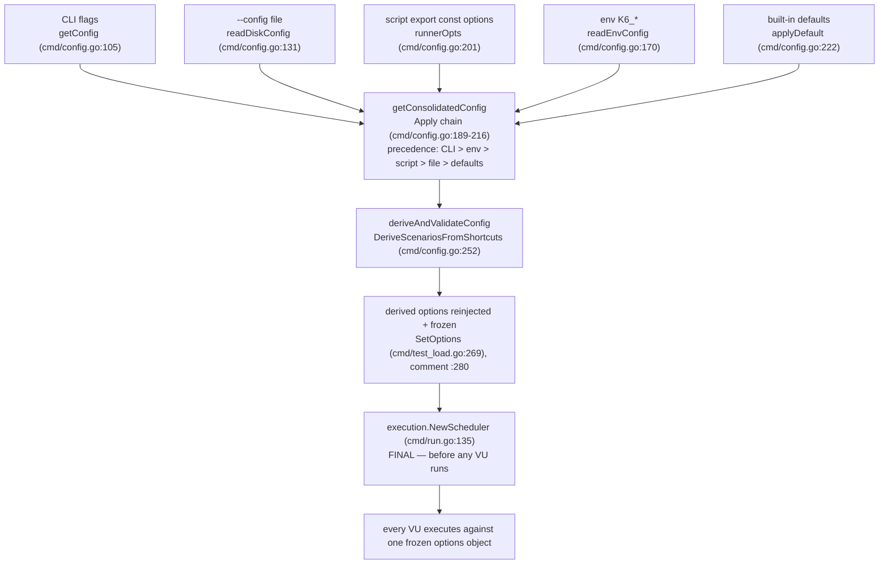

# How k6 decides the "real" options: consolidation, precedence, and the freeze point

You are new to `grafana/k6`. You put an `export const options` object in your test script, you sometimes also pass command-line flags, and occasionally you add a `--config` file — and you have noticed that **"VUs, duration, or scenario settings win from an unexpected place."** This document answers, from the source code and from real runs of a canonically-built `k6`, exactly **how k6 consolidates every option source into the single effective set the scheduler uses**, **at which instant that decision becomes final**, and **why one setting can appear to come from a different place than another**. Every factual claim below is backed either by a `file:line` citation into the source at commit `ddc3b0b1d2`, or by the complete, unedited output of a real `k6 run`.

> **How the evidence was produced (run-first).** `k6` was built from source in its default configuration and executed through its real `k6 run` entry point; the seven runs in Section 5 are the actual, unedited program output (no debug hooks, no bypasses). The exact build and invocation commands are in Section 7. Software under test: `k6 v0.55.0 (commit/ddc3b0b1d2, go1.23.12, linux/amd64)`.

## 1. Direct answer (read this first)

**Precedence — highest wins:**

> **CLI flags  >  environment `K6_*`  >  script `export const options`  >  `--config` file  >  built-in defaults**

Whatever the highest-priority source sets for a given option is the value the test runs with; anything a source leaves unset falls through to the next source down.

**When the decision becomes final (the freeze point).** The sources are merged by `getConsolidatedConfig` (`cmd/config.go:189-216`); then the execution shortcuts (`vus`/`duration`/`stages`/`iterations`) are *derived* into a concrete scenario (`deriveAndValidateConfig` → `DeriveScenariosFromShortcuts`); then the derived options are *reinjected and frozen* onto the run state with the code's own comment `// we will always run with the derived options` (`cmd/test_load.go:280`). The `k6 run` command reads that frozen config (`cmd/run.go:127`) and constructs the execution scheduler with `execution.NewScheduler(...)` (`cmd/run.go:135`). **That scheduler construction — which happens before any VU starts iterating — is the point at which the options are final for the run.** (Mechanism traced in Section 3.)

**Why a value can seem to come from "an unexpected place."** Two facts combine:

1. The `--config` file sits **below** the script in precedence, so a value in `export const options` overrides the same value in a `--config` file (see Run 4). Many people expect a config *file* to beat the script; it does not.
2. Inside `Options.Apply` there is a **mutual-exclusion rule** (`lib/options.go:365-377`): when a higher tier sets **any one** of `duration`/`iterations`/`stages`/`scenarios`, k6 **clears all four** of them from the lower tiers — they move as a single group. But `vus` is applied **independently** (`lib/options.go:361-363`). So your effective `vus` can be inherited from one tier while your duration/stages/scenario definition comes from another — exactly the "wins from an unexpected place" surprise. Section 4 explains this mechanically.

The table below summarizes the seven runs that prove the ordering; their full, unedited output is in Section 5.

| Run | Conflict | Command | Observed banner | Winner |
|-----|----------|---------|-----------------|--------|
| 1 | Baseline (script only) | `./k6 run script.js` | `3 max VUs … 3 looping VUs for 3s` | Script |
| 2 | CLI vs script | `./k6 run --vus 7 --duration 2s script.js` | `7 max VUs … 7 looping VUs for 2s` | CLI |
| 3 | Env vs script | `K6_VUS=5 K6_DURATION=4s ./k6 run script.js` | `5 max VUs … 5 looping VUs for 4s` | Env |
| 4 | Config file vs script | `./k6 run --config cfg.json script.js` | `3 max VUs … 3 looping VUs for 3s` | Script |
| 5 | Config file vs defaults | `./k6 run --config cfg.json noopts.js` | `2 max VUs … 2 looping VUs for 9s` | Config file |
| 6 | Full stack (all four) | `K6_VUS=5 K6_DURATION=4s ./k6 run --config cfg.json --vus 7 --duration 2s script.js` | `7 max VUs … 7 looping VUs for 2s` | CLI (top) |
| 7 | Multiple VUs | `./k6 run --vus 3 --duration 2s multivu.js` (script `vus:1`) | `3 max VUs … 3 looping VUs for 2s`; every VU logs `executor=constant-vus vus=3 duration=2s` | CLI (concurrency) |

**Observed precedence chain:** `CLI (7 / 2s) > env K6_* (5 / 4s) > script (3 / 3s) > --config file (2 / 9s) > built-in defaults`.

## 2. How the options are consolidated: `getConsolidatedConfig` and the `Apply` chain

The single effective configuration is assembled by **`getConsolidatedConfig`** in `cmd/config.go` (`cmd/config.go:189-216`). It composes several `Config` values with **`Config.Apply`** (`cmd/config.go:71-92`), whose override semantics are: **the argument overrides the receiver only where the argument's field is set** (`Valid`). This is built on the nullable types from `gopkg.in/guregu/null.v3` — a field overrides a lower tier only when its `.Valid` flag is `true`; an unset field is transparent and lets the lower tier show through.

**Because `Apply` is one-directional, the *order* of the `Apply` calls is what encodes precedence.** Here is the doc-comment header and the merge chain (the four ordered assignments), verbatim:

```go
// Assemble the final consolidated configuration from all of the different sources:
// - start with the CLI-provided options to get shadowed (non-Valid) defaults in there
// - add the global file config options
// - add the Runner-provided options (they may come from Bundle too if applicable)
// - add the environment variables
// - merge the user-supplied CLI flags back in on top, to give them the greatest priority
// - set some defaults if they weren't previously specified
// TODO: add better validation, more explicit default values and improve consistency between formats
// TODO: accumulate all errors and differentiate between the layers?
func getConsolidatedConfig(gs *state.GlobalState, cliConf Config, runnerOpts lib.Options) (conf Config, err error) {
	fileConf, err := readDiskConfig(gs)
	if err != nil {
		return conf, errext.WithExitCodeIfNone(err, exitcodes.InvalidConfig)
	}
	envConf, err := readEnvConfig(gs.Env)
	if err != nil {
		return conf, errext.WithExitCodeIfNone(err, exitcodes.InvalidConfig)
	}

	conf = cliConf.Apply(fileConf)

	conf = conf.Apply(Config{Options: runnerOpts})

	conf = conf.Apply(envConf).Apply(cliConf)
	conf = applyDefault(conf)
```

Read the four assignments in order (lines 199, 201, 203, 204):

1. `conf = cliConf.Apply(fileConf)` (`cmd/config.go:199`) — start from the CLI skeleton (so non-`Valid` CLI placeholders are present), then let the **`--config` file** override.
2. `conf = conf.Apply(Config{Options: runnerOpts})` (`cmd/config.go:201`) — let the **script's `export const options`** (passed in as `runnerOpts`) override the file.
3. `conf = conf.Apply(envConf).Apply(cliConf)` (`cmd/config.go:203`) — let the **`K6_*` environment** override, and then **merge the CLI flags back in on top**. The CLI is applied **last**, so it has the greatest priority.
4. `conf = applyDefault(conf)` (`cmd/config.go:204`) — fill in built-in **defaults** only for fields that are still unset.

The function's own doc-comment says the same thing in the code's words: *"merge the user-supplied CLI flags back in on top, to give them the greatest priority"* (`cmd/config.go:185`). The result is the precedence **CLI > env > script > `--config` file > defaults**.

**The sources that feed the chain:**

| Source | Loader | Location |
|--------|--------|----------|
| CLI flags (pflags) | `getConfig` | `cmd/config.go:105-125` |
| `--config` file (JSON) | `readDiskConfig` | `cmd/config.go:131-152` |
| script `export const options` | passed in as `runnerOpts` | consumed at `cmd/config.go:201` |
| `K6_*` environment | `readEnvConfig` | `cmd/config.go:170-178` |
| built-in defaults | `applyDefault` | `cmd/config.go:222-246` |

**How the `--config` file is located.** The persistent `--config/-c` flag is registered on the root command — `flags.StringVarP(&gs.Flags.ConfigFilePath, "config", "c", ...)` (`cmd/root.go:173`). When you do not pass `-c`, the default path is `os.UserConfigDir()/loadimpact/k6/config.json` — `filepath.Join(homeDir, "loadimpact", "k6", defaultConfigFileName)` (`cmd/state/state.go:152`, with `defaultConfigFileName = "config.json"` at `cmd/state/state.go:20`), and the path can be overridden by the `K6_CONFIG` environment variable (`cmd/state/state.go:163-164`). Running with a clean `HOME` that contains no such file is the canonical "normal user with no prior config" state used for the runs (Section 7).

**End-to-end flow** (consolidate → derive → freeze → schedule):



## 3. When the decision is final: derive, reinject, freeze, schedule

Consolidation produces the merged `Config`, but two more steps happen before the run is locked in.

**(a) Derive the shortcuts into a concrete scenario.** `deriveAndValidateConfig` (`cmd/config.go:248-257`) calls `executor.DeriveScenariosFromShortcuts` (call at `cmd/config.go:252`; implementation `lib/executor/execution_config_shortcuts.go:52-120`), which turns the `vus`/`duration`/`stages`/`iterations` shortcuts into an explicit `scenarios.default` entry with a concrete executor:

```go
func deriveAndValidateConfig(
	conf Config, isExecutable func(string) bool, logger logrus.FieldLogger,
) (result Config, err error) {
	result = conf
	result.Options, err = executor.DeriveScenariosFromShortcuts(conf.Options, logger)
	if err == nil {
		err = validateConfig(result, isExecutable)
	}
	return result, errext.WithExitCodeIfNone(err, exitcodes.InvalidConfig)
}
```

**(b) Store the derived config, reinject it into the runner, and freeze it onto the run state.** In `cmd/test_load.go` the consolidated config is produced at `cmd/test_load.go:203` and the derived config at `cmd/test_load.go:226`. `buildTestRunState` then reinjects the options into the runner via `SetOptions` (`cmd/test_load.go:269`) and writes the **derived** options onto the `TestRunState`:

```go
func (lct *loadedAndConfiguredTest) buildTestRunState(
	configToReinject lib.Options,
) (*lib.TestRunState, error) {
	// This might be the full derived or just the consodlidated options
	if err := lct.initRunner.SetOptions(configToReinject); err != nil {
		return nil, err
	}

	// it pre-loads system certificates to avoid doing it on the first TLS request.
	// This is done async to avoid blocking the rest of the loading process as it will not stop if it fails.
	go loadSystemCertPool(lct.preInitState.Logger)

	return &lib.TestRunState{
		TestPreInitState: lct.preInitState,
		Runner:           lct.initRunner,
		Options:          lct.derivedConfig.Options, // we will always run with the derived options
		RunTags:          lct.preInitState.Registry.RootTagSet().WithTagsFromMap(configToReinject.RunTags),
		GroupSummary:     lib.NewGroupSummary(lct.preInitState.Logger),
	}, nil
```

Note line 280: `Options: lct.derivedConfig.Options, // we will always run with the derived options`.

**(c) `k6 run` reads the frozen config and builds the scheduler.**

```go
	conf := test.derivedConfig
	testRunState, err := test.buildTestRunState(conf.Options)
	if err != nil {
		return err
	}

	// Create a local execution scheduler wrapping the runner.
	logger.Debug("Initializing the execution scheduler...")
	execScheduler, err := execution.NewScheduler(testRunState, controller)
```

**Conclusion.** `execution.NewScheduler(testRunState, controller)` (`cmd/run.go:135`) — which runs **before any VU begins iterating** — is the instant at which the effective options are final for the run. Everything after this point (spawning VUs, iterating) reads that one frozen options object; nothing re-consolidates it. Section 5, Run 7 demonstrates this at runtime: every VU observes the identical frozen options.

## 4. The "unexpected place" symptom, explained mechanically

The surprise lives inside **`Options.Apply`** (`lib/options.go:357-437`), where two adjacent pieces behave asymmetrically.

**`vus` is applied on its own** (`lib/options.go:361-363`): if the higher tier sets `vus`, it overrides; otherwise the lower tier's `vus` survives untouched. **But `duration`/`iterations`/`stages`/`scenarios` move as one mutually-exclusive group** — when the higher tier sets **any one** of them, the guard clears **all four** inherited from lower tiers (`lib/options.go:365-377`):

```go
func (o Options) Apply(opts Options) Options {
	if opts.Paused.Valid {
		o.Paused = opts.Paused
	}
	if opts.VUs.Valid {
		o.VUs = opts.VUs
	}

	// Specifying duration, iterations, stages, or execution in a "higher" config tier
	// will overwrite all of the previous execution settings (if any) from any
	// "lower" config tiers
	// Still, if more than one of those options is simultaneously specified in the same
	// config tier, they will be preserved, so the validation after we've consolidated
	// all of the options can return an error.
	if opts.Duration.Valid || opts.Iterations.Valid || opts.Stages != nil || opts.Scenarios != nil {
		// TODO: emit a warning or a notice log message if overwrite lower tier config options?
		o.Duration = types.NewNullDuration(0, false)
		o.Iterations = null.NewInt(0, false)
		o.Stages = nil
		o.Scenarios = nil
	}
```

So if a higher tier specifies only `duration`, it wipes any `stages`/`iterations`/`scenarios` (and the `duration`) a lower tier had — they are one execution-definition group, and mixing halves from two tiers is not allowed. Meanwhile `vus`, being independent, can still be inherited from a *different* tier. **That asymmetry is precisely why "VUs, duration, or scenario settings win from an unexpected place":** your effective `vus` and your effective duration/stages/scenario can legitimately originate from two different sources.

**Two more asymmetries worth knowing:**

- **`scenarios` cannot be set from the environment or a CLI shortcut.** It is tagged `ignored:"true"` (`lib/options.go:245`) so the `envconfig` decoder skips it; only the `--config` file or the script's JSON can set `scenarios`. The execution-shortcut environment variables that *do* work are `K6_VUS`/`K6_DURATION`/`K6_ITERATIONS`/`K6_STAGES` (`lib/options.go:234-237`):

```go
	VUs        null.Int           `json:"vus" envconfig:"K6_VUS"`
	Duration   types.NullDuration `json:"duration" envconfig:"K6_DURATION"`
	Iterations null.Int           `json:"iterations" envconfig:"K6_ITERATIONS"`
	Stages     []Stage            `json:"stages" envconfig:"K6_STAGES"`

	// TODO: remove the `ignored:"true"` from the field tags, it's there so that
	// the envconfig library will ignore those fields.
	//
	// We should support specifying execution segments via environment
	// variables, but we currently can't, because envconfig has this nasty bug
	// (among others): https://github.com/kelseyhightower/envconfig/issues/113
	Scenarios                ScenarioConfigs           `json:"scenarios" ignored:"true"`
```

- **A bare `vus` with no `duration`/`iterations`/`stages` is ignored for execution shaping**, with an explicit warning (`lib/executor/execution_config_shortcuts.go:101-105`):

```go
	default:
		// Check if we should emit some warnings
		if opts.VUs.Valid && opts.VUs.Int64 != 1 {
			logger.Warnf(
				"the `vus=%d` option will be ignored, it only works in conjunction with `iterations`, `duration`, or `stages`",
				opts.VUs.Int64,
			)
```

**Tie-back to Run 4** (`./k6 run --config cfg.json script.js`, config `{vus:2,duration:"9s"}`, script `{vus:3,duration:"3s"}`): the script is a *higher* tier than the config file, and the script sets `duration`, which triggers the group-clear of the config file's `duration`. The script's `vus:3` also overrides the file's `vus:2`. Net effect: the script's **`3 VUs / 3s` wins** over the config's `2 VUs / 9s` — observed in Section 5, Run 4.

## 5. Empirical proof: seven real runs

**The proof surface.** k6 prints the effective execution plan at startup via `printExecutionDescription` (`cmd/ui.go:99-165`). The `scenarios:` banner is produced by this format string (`cmd/ui.go:149-150`):

```go
	fmt.Fprintf(buf, "     scenarios: %s\n", valueColor.Sprintf(
		"(%.2f%%) %s, %d max VUs, %s max duration (incl. graceful stop):",
```

so the banner reads `scenarios: (100.00%) 1 scenario, N max VUs, Xs max duration (incl. graceful stop):` followed by `* default: N looping VUs for Ys (gracefulStop: 30s)`. Here **`N`** is the effective VU count, **`Ys`** the effective duration, and **`Xs = Ys + 30s`** (the default 30s graceful-stop is added on top — observed below as 3s→33s, 2s→32s, 4s→34s, 9s→39s). This banner *is* the observable consolidated decision. (Do **not** pass `--quiet`: it routes this banner to debug output instead of stdout — `if gs.Flags.Quiet { gs.Logger.Debug(buf.String()) }`, `cmd/ui.go:160-164`. The runs below do not use `--quiet`; piped / non-TTY output is already color-free.)

The fixtures are listed in Section 7. Each run shows its **exact command** and its **complete, unedited output**.

### Run 1 — baseline, script only  →  **script wins**

Command: `./k6 run script.js`

```text

         /\      Grafana   /‾‾/  
    /\  /  \     |\  __   /  /   
   /  \/    \    | |/ /  /   ‾‾\ 
  /          \   |   (  |  (‾)  |
 / __________ \  |_|\_\  \_____/ 

     execution: local
        script: script.js
        output: -

     scenarios: (100.00%) 1 scenario, 3 max VUs, 33s max duration (incl. graceful stop):
              * default: 3 looping VUs for 3s (gracefulStop: 30s)


running (01.0s), 3/3 VUs, 0 complete and 0 interrupted iterations
default   [  33% ] 3 VUs  1.0s/3s

running (02.0s), 3/3 VUs, 3 complete and 0 interrupted iterations
default   [  67% ] 3 VUs  2.0s/3s

running (03.0s), 3/3 VUs, 6 complete and 0 interrupted iterations
default   [ 100% ] 3 VUs  3.0s/3s

     data_received........: 0 B 0 B/s
     data_sent............: 0 B 0 B/s
     iteration_duration...: avg=1s min=1s med=1s max=1s p(90)=1s p(95)=1s
     iterations...........: 9   2.998253/s
     vus..................: 3   min=3      max=3
     vus_max..............: 3   min=3      max=3


running (03.0s), 0/3 VUs, 9 complete and 0 interrupted iterations
default ✓ [ 100% ] 3 VUs  3s
```

The script's `export const options = { vus: 3, duration: '3s' }` is the only source, so the banner shows `3 looping VUs for 3s`.

### Run 2 — CLI flags vs script  →  **CLI wins**

Command: `./k6 run --vus 7 --duration 2s script.js`

```text

         /\      Grafana   /‾‾/  
    /\  /  \     |\  __   /  /   
   /  \/    \    | |/ /  /   ‾‾\ 
  /          \   |   (  |  (‾)  |
 / __________ \  |_|\_\  \_____/ 

     execution: local
        script: script.js
        output: -

     scenarios: (100.00%) 1 scenario, 7 max VUs, 32s max duration (incl. graceful stop):
              * default: 7 looping VUs for 2s (gracefulStop: 30s)


running (01.0s), 7/7 VUs, 0 complete and 0 interrupted iterations
default   [  50% ] 7 VUs  1.0s/2s

running (02.0s), 0/7 VUs, 14 complete and 0 interrupted iterations
default ✓ [ 100% ] 7 VUs  2s

     data_received........: 0 B 0 B/s
     data_sent............: 0 B 0 B/s
     iteration_duration...: avg=1s min=1s med=1s max=1s p(90)=1s p(95)=1s
     iterations...........: 14  6.994878/s
     vus..................: 7   min=7      max=7
     vus_max..............: 7   min=7      max=7


running (02.0s), 0/7 VUs, 14 complete and 0 interrupted iterations
default ✓ [ 100% ] 7 VUs  2s
```

The CLI `--vus 7 --duration 2s` overrides the script's `3 / 3s` → `7 looping VUs for 2s`. Proves **CLI > script**.

### Run 3 — environment vs script  →  **env wins**

Command: `K6_VUS=5 K6_DURATION=4s ./k6 run script.js`

```text

         /\      Grafana   /‾‾/  
    /\  /  \     |\  __   /  /   
   /  \/    \    | |/ /  /   ‾‾\ 
  /          \   |   (  |  (‾)  |
 / __________ \  |_|\_\  \_____/ 

     execution: local
        script: script.js
        output: -

     scenarios: (100.00%) 1 scenario, 5 max VUs, 34s max duration (incl. graceful stop):
              * default: 5 looping VUs for 4s (gracefulStop: 30s)


running (01.0s), 5/5 VUs, 0 complete and 0 interrupted iterations
default   [  25% ] 5 VUs  1.0s/4s

running (02.0s), 5/5 VUs, 5 complete and 0 interrupted iterations
default   [  50% ] 5 VUs  2.0s/4s

running (03.0s), 5/5 VUs, 10 complete and 0 interrupted iterations
default   [  75% ] 5 VUs  3.0s/4s

running (04.0s), 5/5 VUs, 15 complete and 0 interrupted iterations
default   [ 100% ] 5 VUs  4.0s/4s

     data_received........: 0 B 0 B/s
     data_sent............: 0 B 0 B/s
     iteration_duration...: avg=1s min=1s med=1s max=1s p(90)=1s p(95)=1s
     iterations...........: 20  4.995795/s
     vus..................: 5   min=5      max=5
     vus_max..............: 5   min=5      max=5


running (04.0s), 0/5 VUs, 20 complete and 0 interrupted iterations
default ✓ [ 100% ] 5 VUs  4s
```

The real process environment `K6_VUS=5 K6_DURATION=4s` overrides the script's `3 / 3s` → `5 looping VUs for 4s`. Proves **env > script**.

### Run 4 — config file vs script  →  **script wins**

Command: `./k6 run --config cfg.json script.js`

```text

         /\      Grafana   /‾‾/  
    /\  /  \     |\  __   /  /   
   /  \/    \    | |/ /  /   ‾‾\ 
  /          \   |   (  |  (‾)  |
 / __________ \  |_|\_\  \_____/ 

     execution: local
        script: script.js
        output: -

     scenarios: (100.00%) 1 scenario, 3 max VUs, 33s max duration (incl. graceful stop):
              * default: 3 looping VUs for 3s (gracefulStop: 30s)


running (01.0s), 3/3 VUs, 0 complete and 0 interrupted iterations
default   [  33% ] 3 VUs  1.0s/3s

running (02.0s), 3/3 VUs, 3 complete and 0 interrupted iterations
default   [  67% ] 3 VUs  2.0s/3s

running (03.0s), 3/3 VUs, 6 complete and 0 interrupted iterations
default   [ 100% ] 3 VUs  3.0s/3s

     data_received........: 0 B 0 B/s
     data_sent............: 0 B 0 B/s
     iteration_duration...: avg=1s min=1s med=1s max=1s p(90)=1s p(95)=1s
     iterations...........: 9   2.998235/s
     vus..................: 3   min=3      max=3
     vus_max..............: 3   min=3      max=3


running (03.0s), 0/3 VUs, 9 complete and 0 interrupted iterations
default ✓ [ 100% ] 3 VUs  3s
```

Config `{vus:2,duration:"9s"}` vs script `{vus:3,duration:"3s"}` → the **script** wins with `3 looping VUs for 3s`. The `--config` file is *below* the script in precedence — this is the key surprise (see Section 4).

### Run 5 — config file vs defaults  →  **config file wins**

Command: `./k6 run --config cfg.json noopts.js`

```text

         /\      Grafana   /‾‾/  
    /\  /  \     |\  __   /  /   
   /  \/    \    | |/ /  /   ‾‾\ 
  /          \   |   (  |  (‾)  |
 / __________ \  |_|\_\  \_____/ 

     execution: local
        script: noopts.js
        output: -

     scenarios: (100.00%) 1 scenario, 2 max VUs, 39s max duration (incl. graceful stop):
              * default: 2 looping VUs for 9s (gracefulStop: 30s)


running (01.0s), 2/2 VUs, 2 complete and 0 interrupted iterations
default   [  11% ] 2 VUs  1.0s/9s

running (02.0s), 2/2 VUs, 2 complete and 0 interrupted iterations
default   [  22% ] 2 VUs  2.0s/9s

running (03.0s), 2/2 VUs, 4 complete and 0 interrupted iterations
default   [  33% ] 2 VUs  3.0s/9s

running (04.0s), 2/2 VUs, 6 complete and 0 interrupted iterations
default   [  44% ] 2 VUs  4.0s/9s

running (05.0s), 2/2 VUs, 8 complete and 0 interrupted iterations
default   [  56% ] 2 VUs  5.0s/9s

running (06.0s), 2/2 VUs, 10 complete and 0 interrupted iterations
default   [  67% ] 2 VUs  6.0s/9s

running (07.0s), 2/2 VUs, 12 complete and 0 interrupted iterations
default   [  78% ] 2 VUs  7.0s/9s

running (08.0s), 2/2 VUs, 14 complete and 0 interrupted iterations
default   [  89% ] 2 VUs  8.0s/9s

running (09.0s), 2/2 VUs, 16 complete and 0 interrupted iterations
default   [ 100% ] 2 VUs  9s

     data_received........: 0 B 0 B/s
     data_sent............: 0 B 0 B/s
     iteration_duration...: avg=1s min=1s med=1s max=1s p(90)=1s p(95)=1s
     iterations...........: 18  1.998962/s
     vus..................: 2   min=2      max=2
     vus_max..............: 2   min=2      max=2


running (09.0s), 0/2 VUs, 18 complete and 0 interrupted iterations
default ✓ [ 100% ] 2 VUs  9s
```

With a script that exports no options, the `--config` file `{vus:2,duration:"9s"}` overrides the built-in defaults → `2 looping VUs for 9s`. Proves **`--config` file > defaults**.

### Run 6 — full stack — all four sources at once  →  **CLI wins (top of precedence)**

Command: `K6_VUS=5 K6_DURATION=4s ./k6 run --config cfg.json --vus 7 --duration 2s script.js`

```text

         /\      Grafana   /‾‾/  
    /\  /  \     |\  __   /  /   
   /  \/    \    | |/ /  /   ‾‾\ 
  /          \   |   (  |  (‾)  |
 / __________ \  |_|\_\  \_____/ 

     execution: local
        script: script.js
        output: -

     scenarios: (100.00%) 1 scenario, 7 max VUs, 32s max duration (incl. graceful stop):
              * default: 7 looping VUs for 2s (gracefulStop: 30s)


running (01.0s), 7/7 VUs, 0 complete and 0 interrupted iterations
default   [  50% ] 7 VUs  1.0s/2s

running (02.0s), 7/7 VUs, 7 complete and 0 interrupted iterations
default   [ 100% ] 7 VUs  2s

     data_received........: 0 B 0 B/s
     data_sent............: 0 B 0 B/s
     iteration_duration...: avg=1s min=1s med=1s max=1s p(90)=1s p(95)=1s
     iterations...........: 14  6.995063/s
     vus..................: 7   min=7      max=7
     vus_max..............: 7   min=7      max=7


running (02.0s), 0/7 VUs, 14 complete and 0 interrupted iterations
default ✓ [ 100% ] 7 VUs  2s
```

All four sources set VUs and duration simultaneously; the CLI `--vus 7 --duration 2s` beats env (`5/4s`), script (`3/3s`), and config file (`2/9s`) at once → `7 looping VUs for 2s`.

### Run 7 — multiple VUs  →  **CLI governs concurrency**

Command: `./k6 run --vus 3 --duration 2s multivu.js`

```text

         /\      Grafana   /‾‾/  
    /\  /  \     |\  __   /  /   
   /  \/    \    | |/ /  /   ‾‾\ 
  /          \   |   (  |  (‾)  |
 / __________ \  |_|\_\  \_____/ 

     execution: local
        script: multivu.js
        output: -

     scenarios: (100.00%) 1 scenario, 3 max VUs, 32s max duration (incl. graceful stop):
              * default: 3 looping VUs for 2s (gracefulStop: 30s)

time="2026-07-13T16:47:19Z" level=info msg="VU#1 executor=constant-vus vus=3 duration=2s" source=console
time="2026-07-13T16:47:19Z" level=info msg="VU#2 executor=constant-vus vus=3 duration=2s" source=console
time="2026-07-13T16:47:19Z" level=info msg="VU#3 executor=constant-vus vus=3 duration=2s" source=console

running (01.0s), 3/3 VUs, 0 complete and 0 interrupted iterations
default   [  50% ] 3 VUs  1.0s/2s

running (02.0s), 3/3 VUs, 3 complete and 0 interrupted iterations
default   [ 100% ] 3 VUs  2.0s/2s

     data_received........: 0 B 0 B/s
     data_sent............: 0 B 0 B/s
     iteration_duration...: avg=1s min=1s med=1s max=1s p(90)=1s p(95)=1s
     iterations...........: 6   2.997106/s
     vus..................: 3   min=3      max=3
     vus_max..............: 3   min=3      max=3


running (02.0s), 0/3 VUs, 6 complete and 0 interrupted iterations
default ✓ [ 100% ] 3 VUs  2s
```

The script exports `vus: 1`, but the CLI passes `--vus 3 --duration 2s`. The banner shows `3 max VUs … 3 looping VUs for 2s`, and each VU logs the runtime-effective executor read from `exec.test.options.scenarios.default`. This proves three things:

- **(a) Concurrency follows the consolidated VU count.** Three VUs run (`VU#1`, `VU#2`, `VU#3`) — the CLI's `3`, not the script's `vus: 1`.
- **(b) Every VU sees one identical, frozen options object.** All three log `executor=constant-vus vus=3 duration=2s`; the script's `vus: 1` is nowhere at runtime. This is the freeze point of Section 3 observed live.
- **(c) The `constant-vus` executor was derived from the `duration` shortcut.** `DeriveScenariosFromShortcuts` maps a `duration`-based shortcut to `constant-vus` (`lib/executor/execution_config_shortcuts.go:69` → `:86`; the executor type string `constantVUsType = "constant-vus"` is at `lib/executor/constant_vus.go:18`).

*(The three per-VU log lines may appear in any order between runs — that is normal concurrency — but the values `executor=constant-vus vus=3 duration=2s` are identical every time.)*

**Observed precedence chain (from the seven runs):** `CLI (7 / 2s) > env K6_* (5 / 4s) > script export const options (3 / 3s) > --config file (2 / 9s) > built-in defaults`. This is exactly the order encoded by the `Apply` chain (Section 2).

**Stability.** Each run was executed at least twice. The `scenarios:` banner and the per-VU `executor=constant-vus vus=3 duration=2s` values were identical across repetitions; only wall-clock timestamps, the per-VU print order (concurrency), and negligible `iterations/s` jitter in the summary block varied — none of which affects the consolidated decision.

## 6. Coverage of every named item

| Named item | Where proven (runs) | Code reference(s) |
|------------|---------------------|-------------------|
| script `export const options` | Runs 1, 4 | `cmd/config.go:201` (`conf.Apply(Config{Options: runnerOpts})`) |
| CLI flags | Runs 2, 6 | `cmd/config.go:203` (CLI applied last); flag registration `cmd/root.go:173` |
| `--config` file | Runs 4, 5 | `cmd/config.go:199`; `readDiskConfig` `cmd/config.go:131-152`; `cmd/root.go:173` |
| `K6_*` environment variables | Runs 3, 6 | `readEnvConfig` `cmd/config.go:170-178`; env tags `lib/options.go:234-237` |
| VUs | Runs 1–7 (banner "N max VUs" / "N looping VUs") | applied independently `lib/options.go:361-363` |
| duration | Runs 1–6 (banner "for Ys") | mutual-exclusion group `lib/options.go:365-377` |
| scenario settings | Run 7 (`executor=constant-vus`) | `DeriveScenariosFromShortcuts` `lib/executor/execution_config_shortcuts.go:52-120`; `scenarios` `ignored:"true"` `lib/options.go:245` |
| multiple-VU behavior | Run 7 (per-VU identical logs) | one frozen options object; `cmd/run.go:135` |
| finalization / freeze point | (mechanism, Section 3) | `cmd/test_load.go:280`; `cmd/run.go:127`; `cmd/run.go:135` |

## 7. Build/run reproducibility and corroboration

**Canonical build (default configuration, vendored dependencies, offline).** From the repository root, with Go 1.23.12 (`GOTOOLCHAIN=local`; `go.mod` declares `go 1.21`, and the toolchain used is the highest documented supported 1.23.x — CI `DEFAULT_GO_VERSION` / `golang:1.23` base). Dependencies are vendored, so the build runs offline (`GOPROXY=off`, automatic vendor mode):

```bash
# from the repository root
go build -mod=vendor -o /var/tmp/k6lab/k6 .
```

Version banner (exact):

```text
k6 v0.55.0 (commit/ddc3b0b1d2, go1.23.12, linux/amd64)
```

The seven runs were invoked as `./k6 run ...` through the real entry point (no debug hooks, no bypass, no non-default build tags), with a clean `HOME` so that no pre-existing `os.UserConfigDir()/loadimpact/k6/config.json` could interfere with the no-config runs.

**Fixtures** (created in a scratch directory *outside* the repository):

`script.js`

```javascript
import { sleep } from 'k6';
export const options = { vus: 3, duration: '3s' };
export default function () {
  sleep(1);
}
```

`noopts.js`

```javascript
import { sleep } from 'k6';
export default function () {
  sleep(1);
}
```

`multivu.js`

```javascript
import exec from 'k6/execution';
import { sleep } from 'k6';
export const options = { vus: 1 };
export default function () {
  if (exec.vu.iterationInScenario === 0) {
    const d = exec.test.options.scenarios.default;
    console.log(`VU#${exec.vu.idInTest} executor=${d.executor} vus=${d.vus} duration=${d.duration}`);
  }
  sleep(1);
}
```

`cfg.json`

```json
{"vus":2,"duration":"9s"}
```

**In-repo corroboration.** k6 ships unit tests that assert this precedence directly: `cmd/config_consolidation_test.go` (597 lines) contains cases such as `// Check if CLI shortcuts generate correct execution values` (`cmd/config_consolidation_test.go:165`) and `// CLI overrides all, falling back to env` (`cmd/config_consolidation_test.go:458`) — confirming the observed order from inside the codebase. The `--config/-c` flag (`cmd/root.go:173`) and the default config path plus `K6_CONFIG` override (`cmd/state/state.go:152`, `:163-164`) are the plumbing that makes the `--config` tier reachable.

**Official documentation corroboration.** Grafana's k6 documentation ("How to use options → order of precedence") states the same order from lowest to highest: default value → `--config` file → script value → environment variable → CLI flag (CLI highest). One documented nuance keeps the two "environment" mechanisms distinct: the `-e/--env` flag only injects variables into the script's `__ENV` object and does **not** set options, whereas a real process environment variable such as `K6_VUS`/`K6_DURATION`/`K6_ITERATIONS` *does* set the option — it is the latter that this document exercises in Runs 3 and 6.

---

**Repository left unchanged.** This document is the only file added to the repository. All build outputs, script fixtures, the config file, and the captured logs lived in a scratch directory *outside* the repository and were removed after the investigation; `git status --short` shows only this new document.
